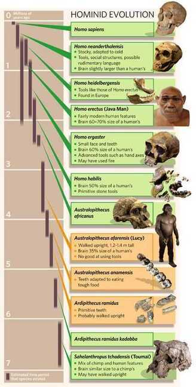

# Human History / Anthropology

[Human Origins 101 | National Geographic - YouTube](https://www.youtube.com/watch?v=ehV-MmuvVMU&ab_channel=NationalGeographic)

- We divided from fungi 650 million years ago
- 6 million years ago relationship with apes ended
- 2.8 million years ago genus of Homo emerged
- 2 million years ago fire discovered
  - Fire started cooking; which turned food more nutritious; which helped develop our brains
- 300,000 years ago, species lived in small hunters gatherers society; and spoke to each other
- Homo sapiens sapiens 200,000 years ago (6 species of Homo was around that time)
  - Homo erectus survived for 2 million years
  - Last of other species disappeared around 10,000 years ago
  - Modern human have some neaderthal's DNA, so there was some mixing
- 70,000 years ago only humans got some abstract thinking capabilities to survive in today's generation
- 50,000 years ago there was explosion in innovation; tools and weapons became more sophisticated and culture became more complex; communication improved and inturn cooperation improved in large groups
- Humans started fishing somewhere between [40,000](https://bn9wksbn.r.us-east-1.awstrack.me/L0/https:%2F%2Fwww.alimentarium.org%2Fen%2Fknowledge%2Fhistory-fishing/1/010001816547a836-a6b3f3e8-4853-461c-ace6-ca9f2ad8ddf1-000000/3rZTTMmSVYfh1xf6V8Y1ZcL1Bis=274) and 10000 years BCE.
- 12,000 years ago agriculture started in multiple locations; because of this specialization started
- 500 years ago scientific revolution happened; industrial revolution

## Earth History

<http://timelineofearth.com>

[To Scale: TIME - YouTube](https://www.youtube.com/watch?v=nOVvEbH2GC0)
