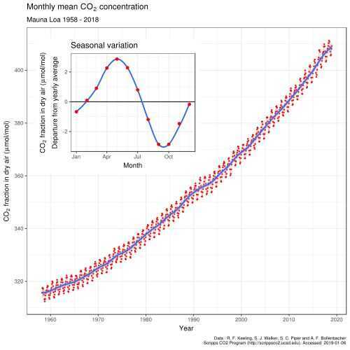

# Others

## Blinkist - The future is history

Totalitarian rule in Russia

## Blinkist - Move Fast and Break Things by Jonathan Taplin

- Libertarianism
- Monopoly can cause terrible damage as by East India Trading Company (Great Bengal Famine and wrote legislation that control nation's trade routes)

## Blinkist - Other Minds

Evolution of octopus

Life 3.2 billion years ago, but animals 1.1 billion years ago

## Keeling Curve

TheKeeling Curveis a graph of the accumulation of [carbon dioxide in the Earth's atmosphere](https://en.wikipedia.org/wiki/Carbon_dioxide_in_Earth%27s_atmosphere) based on continuous measurements taken at the [Mauna Loa Observatory](https://en.wikipedia.org/wiki/Mauna_Loa_Observatory) on the island of [Hawaii](https://en.wikipedia.org/wiki/Hawaii) from 1958 to the present day. The curve is named for the scientist [Charles David Keeling](https://en.wikipedia.org/wiki/Charles_David_Keeling), who started the monitoring program and supervised it until his death in 2005.

Keeling's measurements showed the first significant evidence of rapidly increasing [carbon dioxide](https://en.wikipedia.org/wiki/Carbon_dioxide)(CO

2) levels in the atmosphere.According to Dr [Naomi Oreskes](https://en.wikipedia.org/wiki/Naomi_Oreskes), Professor of History of Science at [Harvard University](https://en.wikipedia.org/wiki/Harvard_University), the Keeling curve is one of the most important scientific works of the [20th century](https://en.wikipedia.org/wiki/20th_century). Many scientists credit the Keeling curve with first bringing the world's attention to the current increase of [CO](https://en.wikipedia.org/wiki/Carbon_dioxide) in the atmosphere.

## Links

- [Who we are and how we got here](../../book-summaries/who-we-are-and-how-we-got-here)
- [The tangled tree](../../book-summaries/the-tangled-tree)
- [Power, Sex, Suicide](../../book-summaries/power-sex-suicide)
