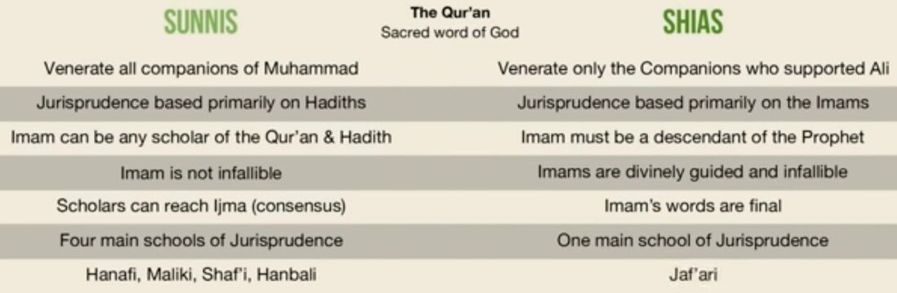
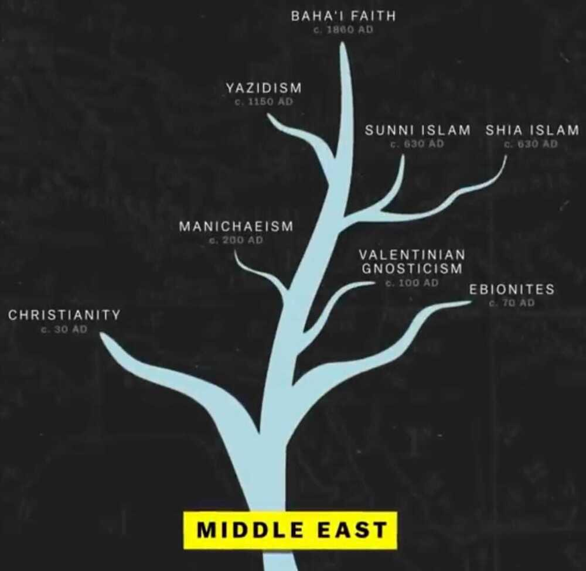
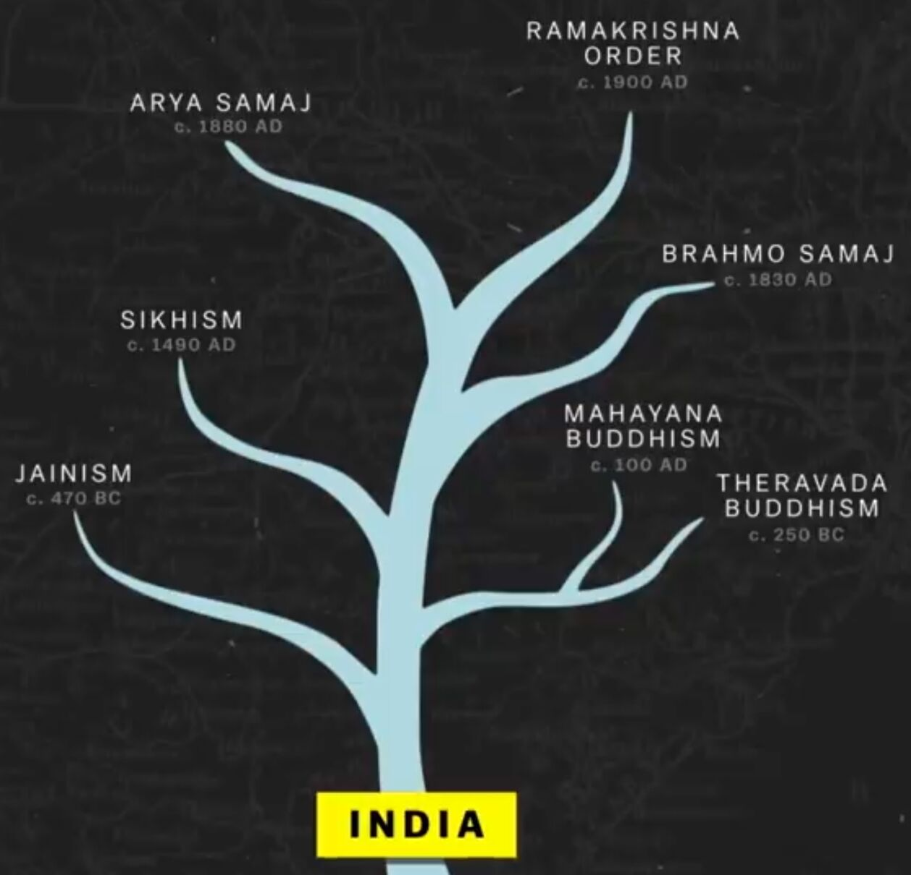

# Religion

[What has religion done for this world? - Quora](https://www.quora.com/What-has-religion-done-for-this-world)

Book - What has religion done for mankind?

## Theological Differences

## Islam

[Branches of Islam & Family Tree of Shia Imams](https://www.youtube.com/watch?v=e5YynfMfJXA)

- 85% sunni
- 15% shias (majority - Iran / Iraq)

[Here's the truth behind the veil](https://timesofindia.indiatimes.com/heres-the-truth-behind-the-veil/articleshow/5516871.cms)

[What is the history of burqas when Muslim women first used it, and why? - Quora](https://www.quora.com/What-is-the-history-of-burqas-when-Muslim-women-first-used-it-and-why)

- People, male and female, should be able to wear whatever they like whenever they like, with the exception of when security requires that a persons face be visible for the safety of the general population.

## New Religious Movement (NRM)

https://en.wikipedia.org/wiki/New_religious_movement

## Torah

The Torah is the compilation of the first five books of the Hebrew Bible, namely the books of Genesis, Exodus, Leviticus, Numbers and Deuteronomy. The Torah is also known as the Pentateuch or the Five Books of Moses. In Rabbinical Jewish tradition it is also known as the Written Torah. If meant for liturgic purposes, it takes the form of a Torah scroll. If in bound book form, it is called Chumash, and is usually printed with the rabbinic commentaries (perushim).

[Torah - Wikipedia](https://en.wikipedia.org/wiki/Torah)

## Links

[World Religions Explained (Full Series) - YouTube](https://www.youtube.com/watch?v=nxhSOcyPCVo&ab_channel=UsefulCharts)

[Is Atheism a Religion?: Crash Course Religions #13 - YouTube](https://www.youtube.com/watch?v=CZXFZAxX3UA)

- Non theism
