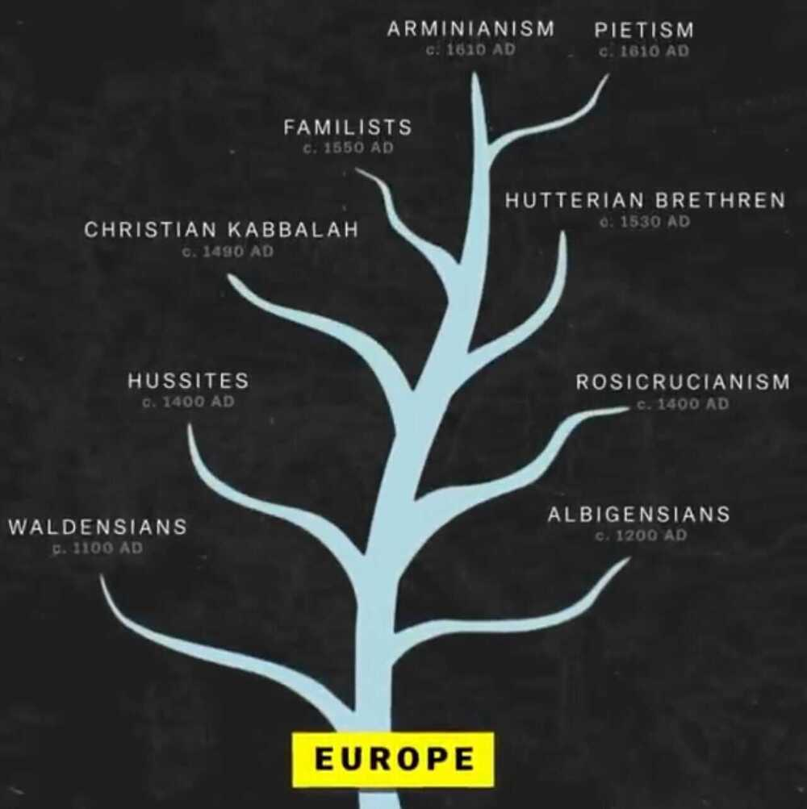

# Religion

[What has religion done for this world? - Quora](https://www.quora.com/What-has-religion-done-for-this-world)

Book - What has religion done for mankind?

[Branches of Islam & Family Tree of Shia Imams](https://www.youtube.com/watch?v=e5YynfMfJXA)

- 85% sunni
- 15% shias (majority - Iran / Iraq)

## Theological Differences

## New Religious Movement (NRM)

https://en.wikipedia.org/wiki/New_religious_movement

## Links

[World Religions Explained (Full Series) - YouTube](https://www.youtube.com/watch?v=nxhSOcyPCVo&ab_channel=UsefulCharts)
