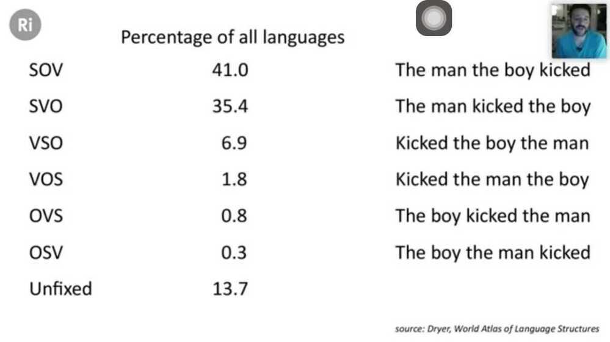
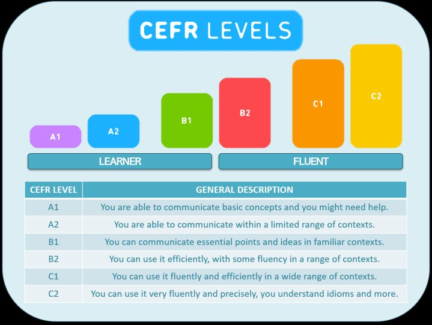

# General

## Subject Object Verbs

## CEFR

The Common European Framework of Reference for Languages: Learning, Teaching, Assessment, abbreviated in [English](https://en.wikipedia.org/wiki/English_language) as CEFR or CEF or CEFRL, is a guideline used to describe achievements of learners of foreign languages across [Europe](https://en.wikipedia.org/wiki/Europe) and, increasingly, in other countries. It was put together by the [Council of Europe](https://en.wikipedia.org/wiki/Council_of_Europe) as the main part of the project "Language Learning for European Citizenship" between 1989 and 1996. Its main aim is to provide a method of learning, teaching and assessing which applies to all [languages in Europe](https://en.wikipedia.org/wiki/Languages_of_Europe). In November 2001, a European Union Council Resolution recommended using the CEFR to set up systems of validation of language ability. The six reference levels (A1, A2, B1, B2, C1, C2) are becoming widely accepted as the European standard for grading an individual's [language proficiency](https://en.wikipedia.org/wiki/Language_proficiency).

https://en.wikipedia.org/wiki/Common_European_Framework_of_Reference_for_Languages

## Bibliography

Bibliography, as a discipline, is traditionally the academic study of [books](https://en.wikipedia.org/wiki/Book) as physical, cultural objects; in this sense, it is also known as bibliology(from Greek-λογία, [*-logia*](https://en.wikipedia.org/wiki/-logy)). Carter and Barker (2010) describe bibliography as a two fold scholarly discipline - the organized listing of books (enumerative bibliography) and the systematic description of books as objects (descriptive bibliography)

A bibliography is a list of all of the sources you have used (whether referenced or not) in the process of researching your work.

## Annotated Bibliography

In an annotated bibliography, the bibliographic information is followed by a brief description of the content, quality, and usefulness of the source.

https://en.wikipedia.org/wiki/Bibliography

## Tautology

The saying of the same thing twice over in different words, generally considered to be a fault of style

## Continuation

## ; - Semicolon

It is the continuation of meaning. It basically indicates that we're gonna say the same thing again, or say something that's connected to previous idea. It's not a contrast, it's a continuation

## Participle

In linguistics, a participle is a nonfinite verb form that has some of the characteristics and functions of both verbs and adjectives. More narrowly, participle has been defined as "a word derived from a verb and used as an adjective, as in a laughing face".

[Participle - Wikipedia](https://en.wikipedia.org/wiki/Participle)

## Games

https://languageguesser.com
