# Languages Others

[What Is Wrong With Hindi? - YouTube](https://www.youtube.com/watch?v=U4Bb7RNjN8w)

It is tradition for Sherpa to name their children after the day of the week on which they were born.

Tibetan

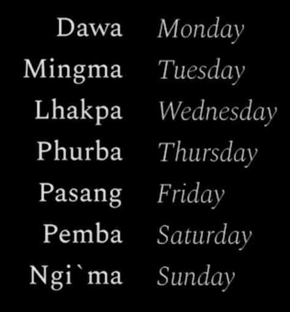

## French

- La femme termine sa lettre (The woman finishes her letter)
- Ca casse (It breaks)
- On va chez vous ou chez moi (Are we going to your place or mine)
- Vous me plaisez (I like you)
- Je m'appelle Deepak (I am called deepak)
- Bonjour (Hello)
- Salut (Hello/Goodbye)

## Chinese

- **Mandarin**
- Cantonese

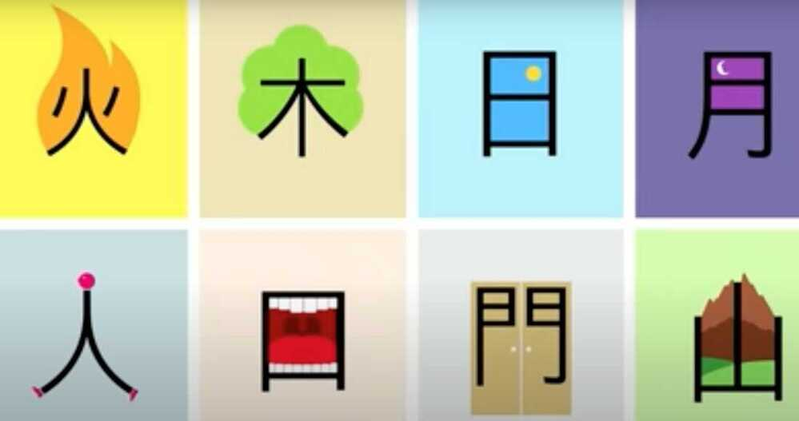

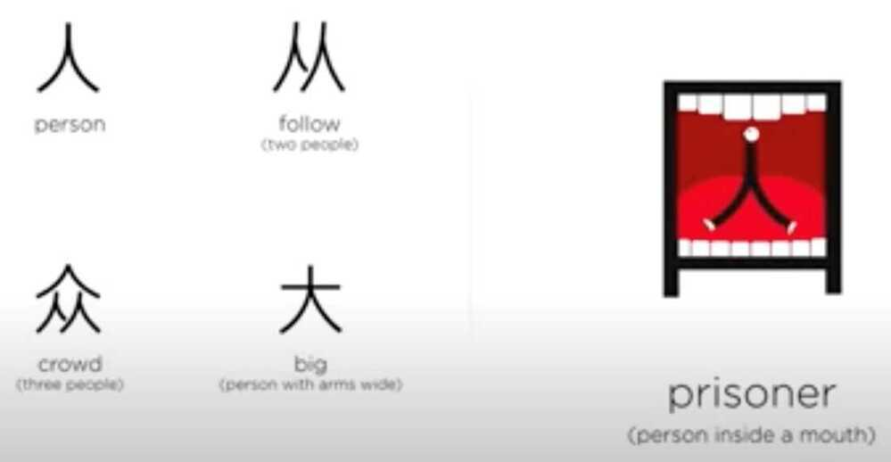

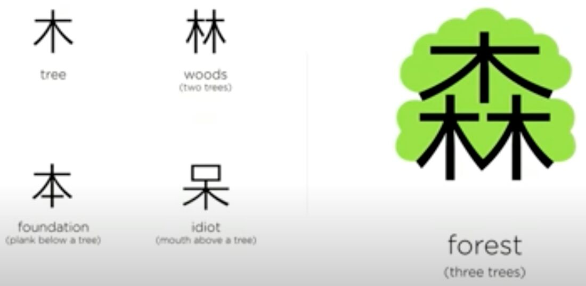

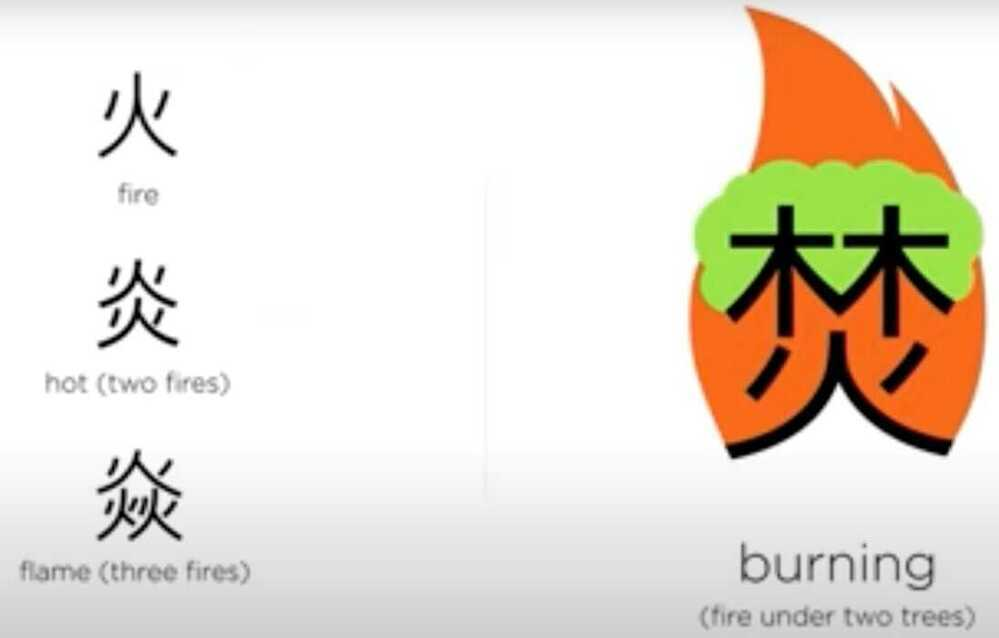

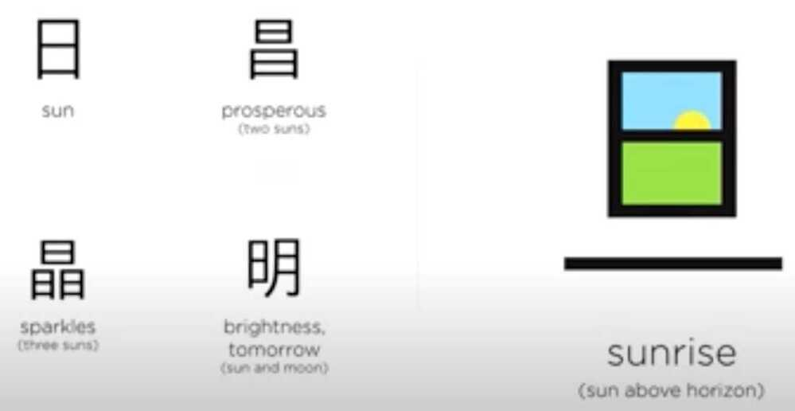

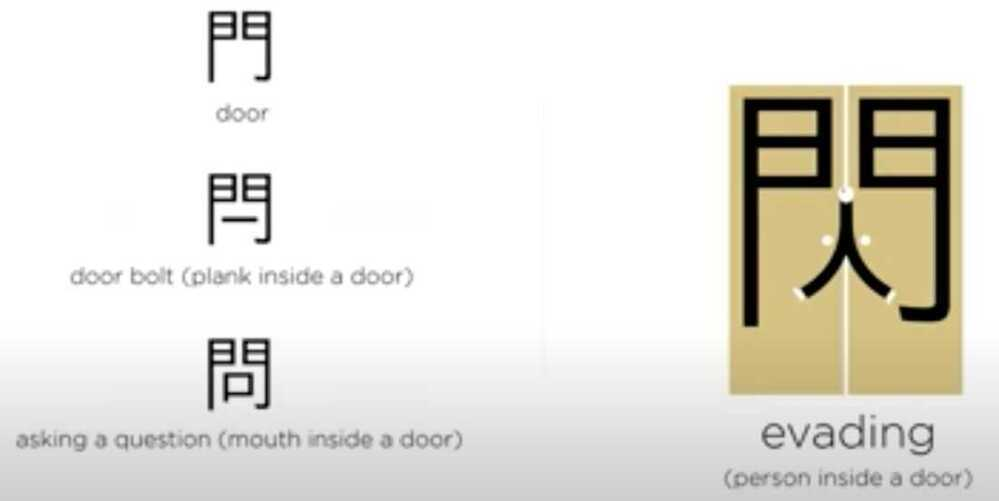

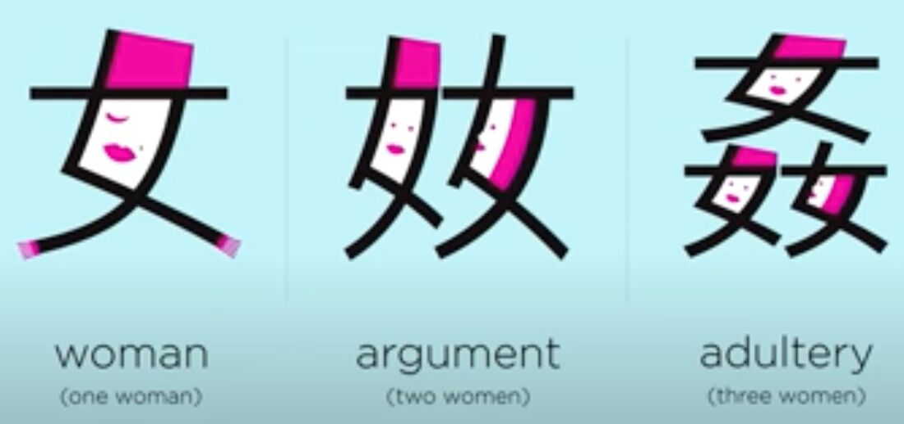

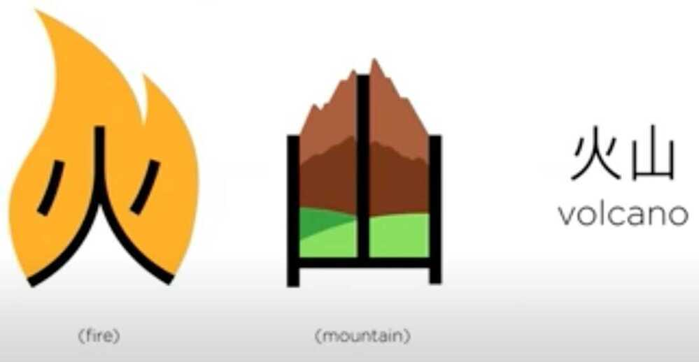

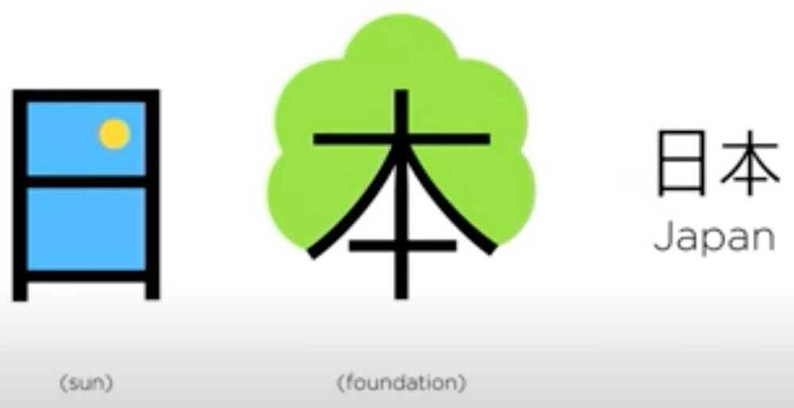

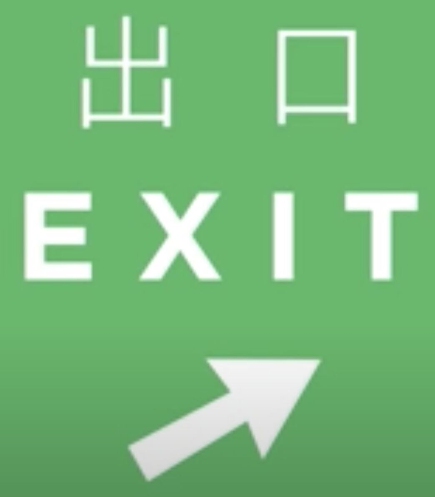

https://www.youtube.com/watch?v=T5FNvW19GbA

[Learn to read Chinese ... with ease! | ShaoLan](https://www.youtube.com/watch?v=troxvPRmZm8&ab_channel=TED)

## Dutch

[Small Talk in Dutch \| Easy Dutch 22 - YouTube](https://www.youtube.com/watch?v=Fe_pfQFBkWA&ab_channel=EasyDutch)

## Others

### NATO phonetic alphabet

| **A**lfa    | **N**ovember |
| ----------- | ------------ |
| **B**ravo   | **O**scar    |
| **C**harlie | **P**apa     |
| **D**elta   | **Q**uebec   |
| **E**cho    | **R**omeo    |
| **F**oxtrot | **S**ierra   |
| **G**olf    | **T**ango    |
| **H**otel   | **U**niform  |
| **I**ndia   | **V**ictor   |
| **J**uliett | **W**hiskey  |
| **K**ilo    | **X**ray     |
| **L**ima    | **Y**ankee   |
| **M**ike    | **Z**ulu     |

[NATO phonetic alphabet - Wikipedia](https://en.wikipedia.org/wiki/NATO_phonetic_alphabet)

### Māori

_Ngā mihi_ is a common Māori phrase meaning **"thanks," "acknowledgments," or "greetings"**. Frequently used in New Zealand, it serves as a polite sign-off for emails, letters, or speeches, expressing appreciation or warm regards. It is a versatile phrase, often shortened from _ngā mihi nui_ (many thanks) or extended to _ngā mihi o te rā_ (greetings of the day).

- Ngā mihi nui: Many thanks/Warm regards.
- Ngā mihi o te rā: Greetings of the day.
- Kia ora: A more casual thanks or hello.
- Tēnā koe: Formal greeting (to one person).
