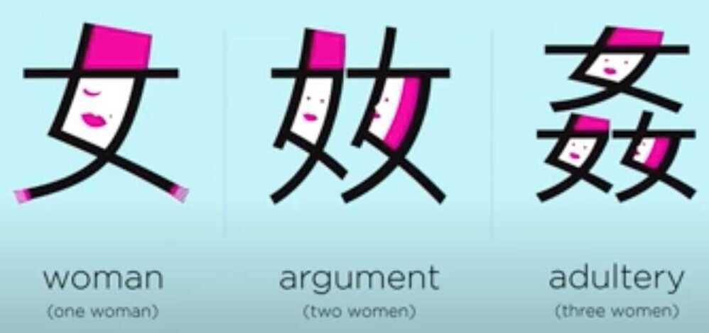
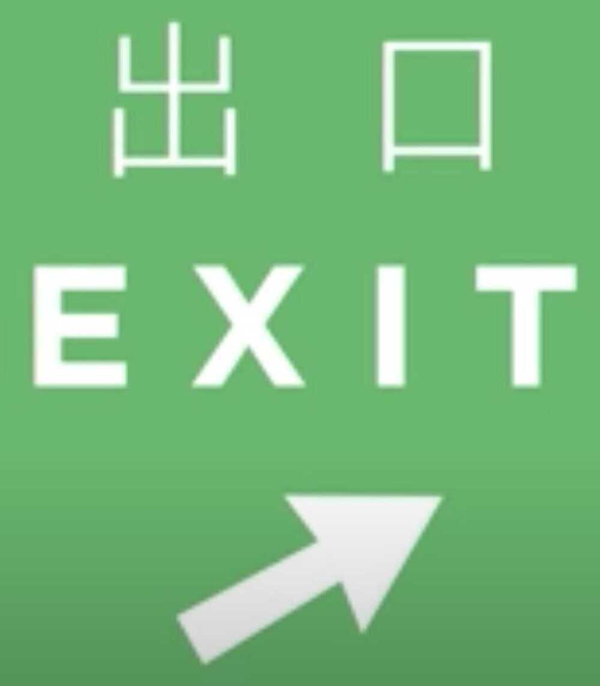

# Languages Others

[What Is Wrong With Hindi? - YouTube](https://www.youtube.com/watch?v=U4Bb7RNjN8w)

It is tradition for Sherpa to name their children after the day of the week on which they were born.

Tibetan

## French

La femme termine sa lettre

(The woman finishes her letter)

Ca casse

(It breaks)

On va chez vous ou chez moi

(Are we going to your place or mine)

Vous me plaisez

(I like you)

Je m'appelle Deepak (I am called deepak)

Bonjour (Hello)

Salut (Hello/Goodbye)

## Chinese

- **Mandarin**
- Cantonese

<https://www.youtube.com/watch?v=T5FNvW19GbA>

[Learn to read Chinese ... with ease! | ShaoLan](https://www.youtube.com/watch?v=troxvPRmZm8&ab_channel=TED)
