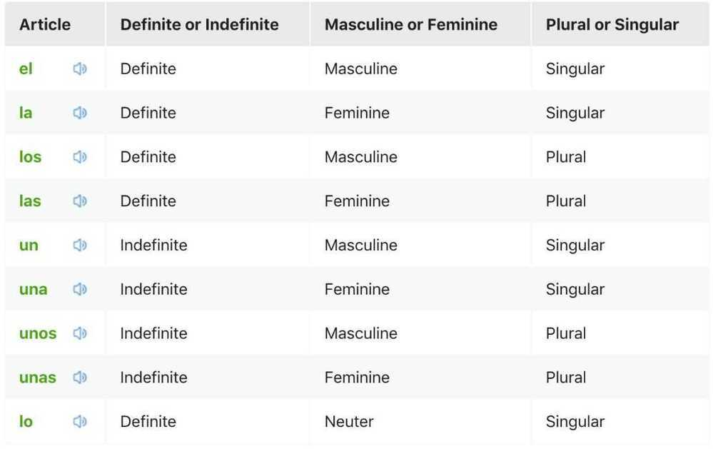
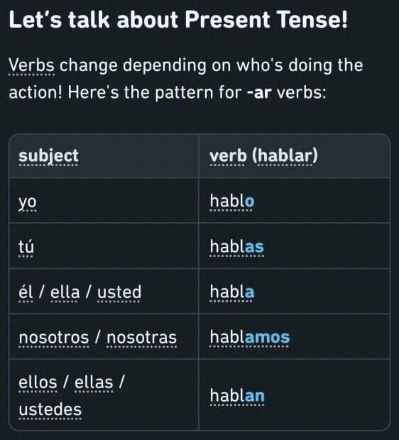

# Spanish

## Duolingo Spanish Podcast

## Intro

Una (feminine) / Un (masculine) - A / An

Unas (feminine) / unos (masculine) - some / few

la (feminine) / el (masculine) - the

El - He

Ella - She

Tú - You / Your

Usted - you

Mi - My

En - In / At / On

Yo - I

estoy - I am

es - is - (from the verb ser) when referring to something more permanent, like a physical or personality characteristic.

esta - is / it is - (from the verb estar) when referring to something more temporary, like an emotion, location, or condition.

eres - are / You are

este - this

ese - that

a - to

y - and

o - or

no - not

Donde? - where

cuando - when

Qué - What

Quién - Whom/Who

para - for

tiene - has

tengo - have

Tú tienes / tienes - Do you have

Aqui - Here

con - with

sin - without

de - with/on/about/from

Demasiado - too

más - more

Muy - very / really

mucho - a lot / much

hablas/hablo - speak

vivo - live

vivir - to live

quiero - want

necesito - need

intelligente - intelligent

elegante - elegant

grande - big

bonito - pretty

Perfecto - Perfect

barato - cheap

caro - expensive

diferente - different

cómoda - comfortable

favorita - favorite

interesante - interesting

facil - easy

dificil - difficult

importante - important

comprendo - understand

cansado - tired

mal - unwell

ocupada/ocupado - busy

feliz - happy

azuda - help

usas - do you use

usa - use / is using

usar - to use

partido - game

cumpleaños - birthday

fiesta - party

concierto - concert

divertido - funny

la película - the movie

baile - dance

trabaja / trabajas- work / works

Sherlock es interesante - Sherlock is interesting

Yo comprendo - I understand

Yo no comprendo espanol - I don't understand spanish

Deepak, cuando estas ocupado - Deepak when are you busy

El espanol es divertido - Spanish is fun

La fiesta de cumpleanos es divertida - The birthday party is fun

Es divertida la fiesta? - Is the party fun

Es mi pelicula favorita - It is my favorite movie

El baile es el viernes - The dance is on Friday

Tu no trabajas hoy - You don't work today

No, Deepak no trabaja el sabado - No, Deepak won't work on Saturday

## Schedule

semana - week

dia - day

hoy - today

mañana - tomorrow

lunes - Monday

martes - Tuesday

miércoles - Wednesday

jueves - Thursday

viernes - Friday

sábado - Saturday

domingo - Sunday

Lo siento, es lunes - I am sorry it's monday

El partido de futbol es manana - Is the soccer game tomorrow?

Si, manana es martes - Yes tomorrow is Tuesday

Feliz viernes - Happy friday

Que dia es mananas - What day is tomorrow

Hoy es mi cumpleaños - Today is my birthday

manana es sabado - Tomorrow is saturday

Una semana interesante - An interesting week

Un fin de semana - A weekend

Disfruta el viernes - Enjoy your Friday

## Numbers

uno - 1 / one

dos - 2

tres - 3

## Colors

verde - green

azul - blue

gris - gray

marrón - brown

rojo - red

## Phrases

Buenos dias - Good Morning

Buenas noches - Good night

Buenas tardes - Good afternoon/evening

Gracias, Sherlock - Thanks, Sherlock

Mucho gusto - Nice to meet you

hasta mañana - see you tomorrow

hasta luego - see you later

Hola - Hello

Adios - Bye

Bien - Ok

De nada - You're welcome

Lo siento - I am sorry

Perdon - Pardon / sorry

Si, gracias - Yes, thank you

Por favor, no - Please no

Disculpe - Excuse me

esta bien - It's okay

Estas feliz? - Are you happy?

Lo siento, estoy mal - I am sorry, i am unwell

Me llamo Deepak - My name is Deepak

Es mi nombre - It is my name

De dónde eres? - Where are you from

Como tu llamas - What is your name?

Te llamas Deepak? - Is your name Deepak?

Buenos dias, cómo te llamas - Good morning what is your name?

Senorita, cómo se llama usted? - Miss what is your name?

Disculpe señor, está usted ocupado? - Excuse me sir, are you busy

Deepak está muy ocupada - Deepak is too busy

Si, estoy muy ocupado - Yes, I am very busy

Bien y tú? - Fine and you?

No, no estoy bien - No I am not fine

Juan no está cansado - Juan is not tired

Estás cansada, Julia? - Are you tired, Julia?

Julia, cómo estás? - Julia, how are you?

Señora Sanchez, comó está usted? - Mrs. Sanchez How are you?

Cómo estas? - How are you?

Como te va - How's it going?

Cómo está Julia? - How is Julia?

Él no está cansado - He is not tired

Estoy bien, y tú? - I'm fine, and you?

Él está cansado - He is tired.

El señor Albert es de Estados Unidos - Mr. Albert is from the United States

## Flirting

Por qué no vamos a un sitio más tranquilo? - Why don't we go somewhere more quiet?

Eres modelo? - Are you a model?

Quieres bailar conmigo? - Do you want to dance with me?

Quieres salir conmigo? Do you want to go out with me?

Me das tu número - Can i get your phone number?

Me gustas mucho - I like you a lot

En tu casa o en la mia? - Your place or mine

Vienes aqui a menudo? - Do you come here often

Cuando Dios invento la belleza se inspiro en ti - When god invented beauty he was inspired by you

Helo, preciosa. - Hello, beautiful

Puedo ofrecerte una copa? - Can I offer you a drink?

Tienes una sonrisa muy bonita - You have a very beautiful smile

Te pareces a mi siguiente novia - You look like my next girlfriend

Quieres ser mi novio? - Do you want to be my boyfriend?

Ya nos conocemos? - Have we already met?

## Food

La mujer bebe agua - the woman drinks water

Yo como manzanas - I eat apples

Él come manzanas - He eats apples

Tú comes manzanas? - Do you eat apples

Yo bebo agua - I drink water

Tú bebes agua? - Do you drink water

Yo bebo, tú bebes, él bebe - I drink, you drink, he drinks

Yo como, tú comes, él come - I eat, you eat, he eats

Yo necesito agua - I need water

Un sándwich de carne - A meat sandwich

Un sándwich de queso - A cheese sandwich

Una hamburguesa de pescado - A fish burger

Un jugo de naranja, por favor - An orange juice please

Un vaso de agua, por favor - A glass of water please

Un café con azúcar - A coffee with sugar

Un café sin azúcar - A coffee without sugar

Sin leche, por favor - Without milk, please

Una ensalada de tomate - A tomato salad

Con o sin leche? - With or without milk?

Yo quiero una ensalada - I want a salad

Él quiere una banana - He wants a banana

Ella quiere una banana? - Does she want a banana?

Quieres leche? - Do you want milk

Yo quiero leche - I want milk

Quieres más agua? - Do you want more water?

Si, yo quiero mas leche - Yes I want more milk

El nino necesitas mas leche - The boy needs more milk

## Clothes

Una tienda de ropa - A clothes store

Yo necesito una chaqueta - I need a jacket

Yo quiero una chaqueta - I want a jacket

Yo quiero una camisa verde - I want a green shirt

Una chaqueta azul - A blue jacket

Yo quiero comprar una camisa - I want to buy a shirt

Un sombrero gris - A gray hat

Una camiseta verde - A green T-shirt

Yo quiero este vestido - I want this dress

Un vertido caro - An expensive dress

## School

Me maestro de espanol - My spanish teacher

Yo quiero estudiar espanol - I want to study spanish

Yo necesito escribir en espanol - I need to write in Spanish

Una pregunta dificil - A difficult question

Tu lees en la computadora? - Do you read on the computer?

Yo no estudio medicina - I don't study medicine

Ella es estudiante - She is a student

Yo estudio aqui - I study here

Yo estudio espanol - I study spanish

Yo quiero estudiar - I want to study

Yo estudio mucho - I study a lot

Yo estudio aqui - I study here

Yo tengo un examen importante - I have an important exam

Yo no soy estudiante - I am not a student

Yo no escribo mucho - I don't write a lot

Tu escribes en espanol? - Do you write in Spanish?

Yo leo con mi maestro - I read with my teacher

No, you no necesito un boligrafo - No I don't need a pen

Tú no quieres estudiar español - Don't you want to study Spanish

El senor Deepak estudia espanol - Mr. Perez studies Spanish

Yo trabajo en una fabrica - I work in a factory

El partido de béisbol no es el lunes - The game of baseball is not on Monday

Que dia es el partido de futbol? - What day is the soccer game?

Cuando es tu partido de futbol? - When is your soccer game?

El beisbol es muy divertido - Baseball is really fun

## Traveling

Tu hablas ingles - Do you speak english

Si, yo hablo espanol - Yes, i speak spanish

Yo necesito mi maleta - I need my suitcase

Yo tengo un pasaporte - I have a passport

Mi pasaporte está en el hotel - My passport is in the hotel

Tu autobús está aqui - Your bus is here

Un boleto a Madrid - A ticket to madrid

Dónde está tu pasaporte? - Where is your passport?

En la calle - In the street

El hotel está cerrado - The hotel is closed

Dónde está el supermercado? - Where is the supermarket

En el hospital - In the hospital

El restaurante está cerrado - The restaurant is closed

Yo necessito un mesa - I need a table

Para tres personas - For three people

Yo necesito la cuenta - I need the check

Yo quiero pagar - I want to pay

Yo quiero pagar la cuenta - I want to pay the check

Yo no vivo en Francia - I do not live in France

El museo está cerrado - The museum is closed

Necesitas dinero, Deepak? - Do you need money, Deepak

Señora, necesita usted un taxi? - Ma'am, do you need a taxi?

Usas el carro, Juan - Do you use a car, Juan?

Usted tiene una cartera? - Do you have a wallet

Si, yo soy de Francia - Yes, I am from France

John es americano - John is American

Tú eres de Estados Unidos? - Are you from the United States

Yo vivo en Australia - I live in Australia

Soy de cuba - I am from cuba

Ella es cubana? - Is she cuban

## Family

Yo soy un hombre - I am a man

Yo soy una mujer - I am a woman

Tú eres una niña - You are a girl

Ella es una niña - She is a girl

Tú eres un hombre - You are a man

Ella es una mujer - She is a woman

Ella es intelligente - She is intelligent

Él es elegante - He is elegant

Ella tiene una casa - She has a house

Él tiene un carro - He has a car

Mi madre es inteligente - My mother is intelligent

Mi casa es grande - My house is big

Mi apartamento es grande - My apartment is big

Mi carro es bonito - My car is pretty

Yo tengo una abuela - I have a grandmother

Yo tengo una hija - I have a daughter

Tu tienes un perro? - Do you have a dog

Yo vivo en un apaetmento - I live in an apartment

Un esposo y una esposa - A husband and a wife

Un hermano y una hermana - A brother and a sister

Él y ella - He and she

