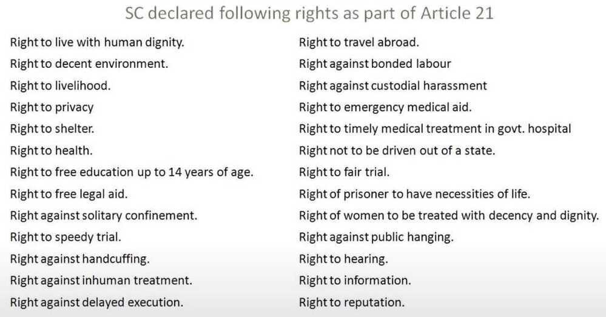
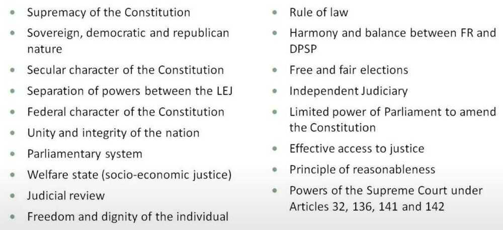

# Constitution of India

## Original

- Articles - 395
- Parts - 22
- Schedules - 8

## Current

- Articles - 448
- Parts - 25
- Schedules - 12

25 Parts

U Can Fly Directly From US ~~to~~ UP ~~to~~ Meet Child ~~of~~ Shyam ~~and~~ Ram; Fruits Taste Sweet To Eat So Only Eat Maggie As Tasty Snack

Constitution of India contains 395 articles in 22 parts. Additional [articles and parts](https://www.clearias.com/indian-constitution-parts-articles/) are inserted later through various amendments. There are also 12 [schedules in the Indian Constitution](https://www.clearias.com/schedules-indian-constitution/).

## [PREAMBLE](https://www.clearias.com/preamble-of-indian-constitution/)

WE, THE PEOPLE OF INDIA, having solemnly resolved to constitute India into a SOVEREIGN, SOCIALIST, SECULAR, DEMOCRATIC, REPUBLIC and to secure to all its citizens:

JUSTICE, social, economic and political;

LIBERTY of thought, expression, belief, faith and worship;

EQUALITY of status and of opportunity; and to promote among them all

FRATERNITY assuring the dignity of the individual and the unity and integrity of the nation;

IN OUR CONSTITUENT ASSEMBLY this twenty-sixth day of November 1949, do HEREBY ADOPT, ENACT AND GIVE TO OURSELVES THIS CONSTITUTION.

[What is SOVEREIGN DEMOCRATIC REPUBLIC? | Preamble of Indian Constitution | Indian Polity UPSC 2023](https://www.youtube.com/watch?v=_BH3yv8sFsg)

[Preamble of Indian Constitution | What is Preamble? | Indian Polity for UPSC CSE 2023 - YouTube](https://www.youtube.com/watch?v=8ePMJe_4XFg)

## [PART I:THE UNION AND ITS TERRITORY](https://www.clearias.com/union-and-its-territory/)

1 Name and territory of the Union.

2 Admission or establishment of new States.

2A Repealed

3 Formation of new States and alteration of areas, boundaries or names of existing States.

4 Laws made under articles 2 and 3 to provide for the amendment of the First and the Fourth Schedules and supplemental, incidental and consequential matters.

## [PART II:CITIZENSHIP](https://www.clearias.com/citizenship/)

5 Citizenship at the commencement of the Constitution.

6 Rights of citizenship of certain persons who have migrated to India from Pakistan.

7 Rights of citizenship of certain migrants to Pakistan.

8 Rights of citizenship of certain persons of Indian origin residing outside India.

9 Persons voluntarily acquiring citizenship of a foreign State not to be citizens.

10 Continuance of the rights of citizenship.

11 Parliament to regulate the right of citizenship by law.

## [PART III :FUNDAMENTAL RIGHTS](https://www.clearias.com/fundamental-rights/)

## General

12 Definition.

13 Laws inconsistent with or in derogation of the fundamental rights.

## Right to Equality

- 14 Equality before law.
- 15 Prohibition of discrimination on grounds of religion, race, caste, sex or place of birth.
- 16 Equality of opportunity in matters of public employment.
- 17 Abolition of Untouchability.
- 18 Abolition of titles.

[Right to Equality: Fundamental Rights in the Indian Constitution | Indian Polity for UPSC 2022-2023 - YouTube](https://www.youtube.com/watch?v=xI0rEKEDY28&ab_channel=BYJU%27SIAS)

## Right to Freedom

19 Protection of certain rights regarding freedom of speech, etc.

- Article 19(1)(a) According to Article 19(1)(a): All citizens shall have the right to freedom of speech and expression. This implies that all citizens have the right to express their views and opinions freely. This includes not only words of mouth, but also a speech by way of writings, pictures, movies, banners, etc.

20 Protection in respect of conviction for offences.

21 Protection of life and personal liberty.

21A Right to education

22 Protection against arrest and detention in certain cases.

## Right against Exploitation

23 Prohibition of traffic in human beings and forced labour.

24 Prohibition of employment of children in factories, etc.

## Right to Freedom of Religion

25 Freedom of conscience and free profession, practice and propagation of religion.

26 Freedom to manage religious affairs.

27 Freedom as to payment of taxes for promotion of any particular religion.

28 Freedom as to attendance at religious instruction or religious worship in certain educational institutions.

## Cultural and Educational Rights

29 Protection of interests of minorities.

30 Right of minorities to establish and administer educational institutions.

31 Repealed

## Saving of Certain Laws

31A Saving of Laws providing for the acquisition of estates, etc.

31B Validation of certain Acts and Regulations.

31C Saving of laws giving effect to certain directive principles.

31D Repealed

## Right to Constitutional Remedies

32 Remedies for enforcement of rights conferred by this Part.

32A Repealed

33 Power of Parliament to modify the rights conferred by this Part in their application to Forces, etc.

34 Restriction on rights conferred by this Part while martial law is in force in any area.

35 Legislation to give effect to the provisions of this Part.

[Trick to Remember Full Fundamental Rights | Indian Constitution](https://youtu.be/7jG6G-kIzD4)

## [PART IV: DIRECTIVE PRINCIPLES OF STATE POLICY](https://www.clearias.com/directive-principles-of-our-state-policy/)

36 Definition.

37 Application of the principles contained in this Part.

38 State to secure a social order for the promotion of the welfare of the people.

39 Certain principles of policy to be followed by the State.

39A Equal justice and free legal aid.

40 The organisation of village panchayats.

41 Right to work, to education and to public assistance in certain cases.

42 Provision for just and humane conditions of work and maternity relief.

43 Living wage, etc., for workers.

43A Participation of workers in the management of industries.

43B Promotion of co-operative societies.

44 Uniform civil code for the citizens.

45 Provision for free and compulsory education for children.

46 Promotion of educational and economic interests of Scheduled Castes, Scheduled Tribes and other weaker sections.

47 Duty of the State to raise the level of nutrition and the standard of living and to improve public health.

48 The organisation of agriculture and animal husbandry.

48A Protection and improvement of environment and safeguarding of forests and wildlife.

49 Protection of monuments and places and objects of national importance.

50 Separation of judiciary from the executive.

51 Promotion of international peace and security.

## [PART IVA: FUNDAMENTAL DUTIES](https://www.clearias.com/fundamental-duties/)

51A Fundamental duties.

## PART V:THE UNION

## CHAPTER I: THE EXECUTIVE

## The President and Vice-President

52 [The President of India](https://www.clearias.com/president-of-india/).

53 The executive power of the Union.

54 Election of President.

55 Manner of election of President.

56 Term of office of President.

57 Eligibility for re-election.

58 Qualifications for election as President.

59 Conditions of the President's office.

60 Oath or affirmation by the President.

61 Procedure for impeachment of the President.

62 Time of holding the election to fill the vacancy in the office of President and the term of office of person elected to fill the casual vacancy.

63 [The Vice-President of India](https://www.clearias.com/vice-president-of-india/).

64 The Vice-President to be ex officio Chairman of the Council of States.

65 The Vice-President to act as President or to discharge his functions during casual vacancies in the office, or during the absence, of President.

66 Election of Vice-President.

67 Term of office of Vice-President.

68 Time of holding the election to fill the vacancy in the office of Vice-President and the term of office of person elected to fill the casual vacancy.

69 Oath or affirmation by the Vice-President.

70 Discharge of President's functions in other contingencies.

71 Matters relating to, or connected with, the election of a President or Vice-President.

72 Power of President to grant pardons, etc., and to suspend, remit or commute sentences in certain cases.

73 The extent of executive power of the Union.

[**Council of Ministers**](https://www.clearias.com/com-prime-minister-attorney-general/)

74 Council of Ministers to aid and advise the President.

75 Other provisions as to Ministers.

## The Attorney-General for India

76 Attorney-General for India.

## Conduct of Government Business

77 Conduct of business of the Government of India.

78 Duties of Prime Minister as respects the furnishing of information to the President, etc.

## CHAPTER II: PARLIAMENT

[**General**](https://www.clearias.com/parliament/)

79 Constitution of Parliament.

80 Composition of the Council of States.

81 Composition of the House of the People.

82 Readjustment after each census.

83 Duration of Houses of Parliament.

84 Qualification for membership of Parliament.

85 Sessions of Parliament, prorogation and dissolution.

86 Right of President to address and send messages to Houses.

87 Special address by the President.

88 Rights of Ministers and Attorney-General as respects Houses.

[**Officers of Parliament**](https://www.clearias.com/officers-conduct-of-business-disqualification-mps/)

89 The Chairman and Deputy Chairman of the Council of States.

90 Vacation and resignation of, and removal from, the office of Deputy Chairman.

91 Power of the Deputy Chairman or other person to perform the duties of the office of, or to act as, Chairman.

92 The Chairman or the Deputy Chairman not to preside while a resolution for his removal from office is under consideration.

93 The Speaker and Deputy Speaker of the House of the People .

94 Vacation and resignation of, and removal from, the offices of Speaker and Deputy Speaker.

95 Power of the Deputy Speaker or other person to perform the duties of the office of, or to act as, Speaker.

96 The Speaker or the Deputy Speaker not to preside while a resolution for his removal from office is under consideration.

97 Salaries and allowances of the Chairman and Deputy Chairman and the Speaker and Deputy Speaker.

98 Secretariat of Parliament.

## Conduct of Business

99 Oath or affirmation by members.

100 Voting in Houses, power of Houses to act notwithstanding vacancies and quorum.

## Disqualifications of Members

101 Vacation of seats.

102 Disqualifications for membership.

103 Decision on questions as to disqualifications of members.

104 Penalty for sitting and voting before making oath or affirmation under article99 or when not qualified or when disqualified.

## Powers, Privileges and Immunities of Parliament and its Members

105 Powers, privileges, etc., of the Houses of Parliament and of the members and committees thereof.

106 Salaries and allowances of members.

[**Legislative Procedure**](https://www.clearias.com/bills-procedures-parliament/)

107 Provisions as to introduction and passing of Bills.

108 Joint sitting of both Houses in certain cases.

109 Special procedure in respect of Money Bills.

110 Definition of "Money Bills".

111 Assent to Bills.

## Procedure in Financial Matters

112 Annual financial statement.

113 Procedure in Parliament with respect to estimates.

114 Appropriation Bills.

115 Supplementary, additional or excess grants.

116 Votes on account, votes of credit and exceptional grants.

117 Special provisions as to financial Bills.

Procedure Generally

118 Rules of procedure.

119 Regulation by law of procedure in Parliament in relation to financial business.

120 Language to be used in Parliament.

121 Restriction on discussion in Parliament.

122 Courts not to inquire into proceedings of Parliament.

## CHAPTER III: LEGISLATIVE POWERS OF THE PRESIDENT

123 [Power of President to promulgate Ordinances during recess of Parliament](https://www.clearias.com/ordinance-making-power-president/).

[**CHAPTER IV: THE UNION JUDICIARY**](https://www.clearias.com/union-judiciary-supreme-court/)

124 Establishment and constitution of Supreme Court.

124A National Judicial Appointments Commission.(Declared unconstitutional by the Supreme Court, however not repealed by the Parliament)

124B Functions of Commission.

124C Power of Parliament to make law.

125 Salaries, etc., of Judges.

126 Appointment of acting Chief Justice.

127 Appointment of ad hoc judges.

128 Attendance of retired Judges at sittings of the Supreme Court.

129 Supreme Court to be a court of record.

130 Seat of Supreme Court.

131 Original jurisdiction of the Supreme Court.

131A Repealed

132 Appellate jurisdiction of Supreme Court in appeals from High Courts in certain cases.

133 Appellate jurisdiction of Supreme Court in appeals from High Courts in regard to Civil matters.

134 Appellate jurisdiction of Supreme Court in regard to criminal matters.

134A Certificate for appeal to the Supreme Court.

135 Jurisdiction and powers of the Federal Court under existing law to be exercisable by the Supreme Court.

136 Special leave to appeal by the Supreme Court.

137 Review of judgments or orders by the Supreme Court.

138 Enlargement of the jurisdiction of the Supreme Court.

139 Conferment on the Supreme Court of powers to issue certain writs.

139A Transfer of certain cases.

140 Ancillary powers of Supreme Court.

141 Law declared by Supreme Court to be binding on all courts.

142 Enforcement of decrees and orders of Supreme Court and orders as to discovery, etc.

143 Power of President to consult Supreme Court.

144 Civil and judicial authorities to act in aid of the Supreme Court.

144A Repealed

145 Rules of Court, etc.

146 Officers and servants and the expenses of the Supreme Court.

147 Interpretation.

[**CHAPTER V: COMPTROLLER AND AUDITOR-GENERAL OF INDIA**](https://www.clearias.com/comptroller-and-auditor-general-of-india-cag/)

148 Comptroller and Auditor-General of India.

149 Duties and powers of the Comptroller and Auditor-General.

150 Form of accounts of the Union and of the States.

151 Audit reports.

## PART VI:THE STATES

## CHAPTER I: GENERAL

152 Definition.

## CHAPTER II: THE EXECUTIVE

[The Governor](https://www.clearias.com/governor-of-states/)

153 Governors of States.

154 Executive power of State.

155 Appointment of Governor.

156 Term of office of Governor.

157 Qualifications for appointment as Governor.

158 Conditions of Governor's office

159 Oath or affirmation by the Governor.

160 Discharge of the functions of the Governor in certain contingencies.

161 Power of Governor to grant pardons, etc., and to suspend, remit or commute sentences in certain cases.

162 Extent of executive power of State.

## Council of Ministers

163 Council of Ministers to aid and advise Governor.

164 Other provisions as to Ministers.

## The Advocate-General for the State

165 Advocate-General for the State.

## Conduct of Government Business

166 Conduct of business of the Government of a State.

167 Duties of Chief Minister as respects the furnishing of information to Governor, etc.

## CHAPTER III: THE STATE LEGISLATURE

[General](https://www.clearias.com/state-legislature/)

168 Constitution of Legislatures in States.

169 Abolition or creation of Legislative Councils in States.

170 Composition of the Legislative Assemblies.

171 Composition of the Legislative Councils.

172 Duration of State Legislatures.

173 Qualification for membership of the State Legislature.

174 Sessions of the State Legislature, prorogation and dissolution.

175 Right of Governor to address and send messages to the House or Houses.

176 Special address by the Governor.

177 Rights of Ministers and Advocate-General as respects the Houses.

[Officers of the State Legislature](https://www.clearias.com/officers-of-the-state-legislature/)

178 The Speaker and Deputy Speaker of the Legislative Assembly.

179 Vacation and resignation of, and removal from, the offices of Speaker and Deputy Speaker.

180 Power of the Deputy Speaker or other person to perform the duties of the office of, or to act as, Speaker.

181 The Speaker or the Deputy Speaker not to preside while a resolution for his removal from office is under consideration.

182 The Chairman and Deputy Chairman of the Legislative Council.

183 Vacation and resignation of, and removal from, the offices of Chairman and Deputy Chairman.

184 Power of the Deputy Chairman or other person to perform the duties of the office of, or to act as, Chairman.

185 The Chairman or the Deputy Chairman not to preside while a resolution for his removal from office is under consideration.

186 Salaries and allowances of the Speaker and Deputy Speaker and the Chairman and Deputy Chairman.

187 Secretariat of State Legislature.

## Conduct of Business

188 Oath or affirmation by members.

189 Voting in Houses, power of Houses to act notwithstanding vacancies and quorum.

Disqualifications of Members

190 Vacation of seats.

191 Disqualifications for membership.

192 Decision on questions as to disqualifications of members.

193 Penalty for sitting and voting before making oath or affirmation under article 188 or when not qualified or when disqualified.

Powers, privileges and immunities of State Legislatures and their Members

194 Powers, privileges, etc., of the Houses of Legislatures and of the members and committees thereof.

195 Salaries and allowances of members.

## Legislative Procedure

196 Provisions as to introduction and passing of Bills.

197 Restriction on powers of Legislative Council as to Bills other than Money Bills.

198 Special procedure in respect of Money Bills.

199 Definition of "Money Bills".

200 Assent to Bills.

201 Bills reserved for consideration.

## Procedure in Financial Matters

202 Annual financial statement.

203 Procedure in Legislature with respect to estimates.

204 Appropriation Bills.

205 Supplementary, additional or excess grants.

206 Votes on account, votes of credit and exceptional grants.

207 Special provisions as to financial Bills.

## Procedure Generally

208 Rules of procedure.

209 Regulation by law of procedure in the Legislature of the State in relation to financial business.

210 Language to be used in the Legislature.

211 Restriction on discussion in the Legislature.

212 Courts not to inquire into proceedings of the Legislature.

## CHAPTER IV : LEGISLATIVE POWER OF THE GOVERNOR

213 Power of Governor to promulgate Ordinances during recess of Legislature.

## CHAPTER V: THE HIGH COURTS IN THE STATES

214 High Courts for States.

215 High Courts to be courts of record.

216 Constitution of High Courts.

217 Appointment and conditions of the office of a Judge of a High Court.

218 Application of certain provisions relating to Supreme Court to High Courts.

219 Oath or affirmation by Judges of High Courts.

220 Restriction on practice after being a permanent Judge.

221 Salaries, etc., of Judges.

222 Transfer of a Judge from one High Court to another.

223 Appointment of acting Chief Justice.

224 Appointment of additional and acting Judges.

224A Appointment of retired Judges at sittings of High Courts.

225 Jurisdiction of existing High Courts.

226 Power of High Courts to issue certain writs.

226A [Repealed..]

227 Power of superintendence over all courts by the High Court.

228 Transfer of certain cases to High Court.

228A Repealed

229 Officers and servants and the expenses of High Courts.

230 Extension of jurisdiction of High Courts to Union territories.

231 Establishment of a common High Court for two or more States.

## CHAPTER VI : SUBORDINATE COURTS

233 Appointment of district judges.

233A Validation of appointments of, and judgments, etc., delivered by, certain district judges.

234 Recruitment of persons other than district judges to the judicial service.

235 Control over subordinate courts.

236 Interpretation.

237 Application of the provisions of this Chapter to certain class or classes of magistrates.

## PART VII: THE STATES IN PART B OF THE FIRST SCHEDULE

238 Repealed

## PART VIII: THE UNION TERRITORIES

239 Administration of Union territories.

239A Creation of local Legislatures or Council of Ministers or both for certain Union territories.

239AA Special provisions with respect to Delhi.

239AB Provision in case of failure of constitutional machinery.

239B Power of the administrator to promulgate Ordinances during recess of Legislature.

240 Power of President to make regulations for certain Union territories.

241 High Courts for Union territories.

242 Repealed

## PART IX: THE PANCHAYATS

243 Definitions.

243A Gram Sabha.

243B Constitution of Panchayats.

243C Composition of Panchayats.

243D Reservation of seats.

243E Duration of Panchayats, etc.

243F Disqualifications for membership.

243G Powers, authority and responsibilities of Panchayats.

243H Powers to impose taxes by, and Funds of, the Panchayats.

243-I Constitution of Finance Commission to review financial position.

243J Audit of accounts of Panchayats.

243K Elections to the Panchayats.

243L Application to Union territories.

243M Part not to apply to certain areas.

243N Continuance of existing laws and Panchayats.

243-O Bar to interference by courts in electoral matters.

## PART IXA: THE MUNICIPALITIES

243P Definitions.

243Q Constitution of Municipalities.

243R Composition of Municipalities.

243S Constitution and composition of Wards Committees, etc.

243T Reservation of seats.

243U Duration of Municipalities, etc.

243V Disqualifications for membership.

243W Powers, authority and responsibilities of Municipalities, etc.

243X. Power to impose taxes by, and Funds of, the Municipalities.

243 Finance Commission.

243Z Audit of accounts of Municipalities.

243ZA Elections to the Municipalities.

243ZB Application to Union territories.

243ZC Part not to apply to certain areas.

243ZD Committee for district planning.

243ZE Committee for Metropolitan planning.

243ZF Continuance of existing laws and Municipalities.

243ZGBar to interference by Courts in electoral matters.

## PART IXB: THE CO-OPERATIVE SOCIETIES

243ZH Definitions

243ZI Incorporation of co-operative societies

243ZJ Number and term of members of the board and its office bearers.

243 ZK Election of members of board.

243ZL Supersession and suspension of the board and interim management.

243ZM Audit of accounts of co-operative societies.

243ZN Convening of general body meetings.

243ZO Right of a member to get information,

243ZP Returns.

243ZQ Offences and penalties.

243ZR Application to multi-state co-operative societies.

243ZS Application to Union Territories.

243ZT Continuance of existing laws.

## PART X: THE SCHEDULED AND TRIBAL AREAS

244 Administration of Scheduled Areas and Tribal Areas.

244A Formation of an autonomous State comprising certain tribal areas in Assam and creation of local Legislature or Council of Ministers or both therefor.

## PART XI: RELATIONS BETWEEN THE UNION AND THE STATES

## CHAPTER I: LEGISLATIVE RELATIONS

## Distribution of Legislative Powers

245 Extent of laws made by Parliament and by the Legislatures of States.

246 Subject-matter of laws made by Parliament and by the Legislatures of States.

246A Special provision with respect to goods and services tax.

247 Power of Parliament to provide for the establishment of certain additional courts.

248 Residuary powers of legislation.

249 Power of Parliament to legislate with respect to a matter in the State List in the national interest.

250 Power of Parliament to legislate with respect to any matter in the State List if a Proclamation of Emergency is in operation.

251 Inconsistency between laws made by Parliament under articles 249 and 250 and laws made by the Legislatures of States.

252 Power of Parliament to legislate for two or more States by consent and adoption of such legislation by any other State.

253 Legislation for giving effect to international agreements.

254 Inconsistency between laws made by Parliament and laws made by the Legislatures of States.

255 Requirements as to recommendations and previous sanctions to be regarded as matters of procedure only.

## CHAPTER II : ADMINISTRATIVE RELATIONS

## General

256 Obligation of States and the Union.

257 Control of the Union over States in certain cases.

257A Repealed

258 Power of the Union to confer powers, etc., on States in certain cases.

258A Power of the States to entrust functions to the Union.

259 Repealed

260 Jurisdiction of the Union in relation to territories outside India.

261 Public acts, records and judicial proceedings.

## Disputes relating to Waters

262 Adjudication of disputes relating to waters of inter-State rivers or river valleys.

Co-ordination between States

263 Provisions with respect to an inter-State Council.

## PART XII: FINANCE, PROPERTY, CONTRACTS AND SUITS

## CHAPTER I: FINANCE

## General

264 Interpretation.

265 Taxes not to be imposed save by authority of law.

266 Consolidated Funds and public accounts of India and of the States.

267 Contingency Fund.

Distribution of Revenues between the Union and the States

268 Duties levied by the Union but collected and appropriated by the State.

268A Repealed

269 Taxes levied and collected by the Union but assigned to the States.

269A Levy and collection of goods and services tax in the course of inter-state trade or commerce.

270 Taxes levied and distributed between the Union and the States.

271 Surcharge on certain duties and taxes for purposes of the Union.

272 Repealed

273 Grants in lieu of export duty on jute and jute products.

274 Prior recommendation of President required to Bills affecting taxation in which States are interested.

275 Grants from the Union to certain States.

276 Taxes on professions, trades, callings and employments.

277 Savings.

278 Repealed

279 Calculation of "net proceeds", etc.

279A Goods and Services Tax Council.

280 Finance Commission.

281 Recommendations of the Finance Commission.

## Miscellaneous financial provisions

282 Expenditure defrayable by the Union or a State out of its revenues.

283 Custody, etc., of Consolidated Funds, Contingency Funds and moneys credited to the public accounts.

284 Custody of suitors' deposits and other moneys received by public servants and courts.

285 Exemption of property of the Union from State taxation.

286 Restrictions as to imposition of tax on the sale or purchase of goods.

287 Exemption from taxes on electricity.

288 Exemption from taxation by States in respect of water or electricity in certain cases.

289 Exemption of property and income of a State from Union taxation.

290 Adjustment in respect of certain expenses and pensions.

290A Annual payment to certain Devaswom Funds.

291 Repealed

## CHAPTER II: BORROWING

292 Borrowing by the Government of India.

293 Borrowing by States.

## CHAPTER III: PROPERTY, CONTRACTS, RIGHTS, LIABILITIES, OBLIGATIONS AND SUITS

294 Succession to property, assets, rights, liabilities and obligations in certain cases.

295 Succession to property, assets, rights, liabilities and obligations in other cases.

296 Property accruing by escheat or laps or as bona vacantia.

297 Things of value within territorial waters or continental shelf and resources of the exclusive economic zone to vest in the Union.

298 Power to carry on trade, etc.

299 Contracts.

300 Suits and proceedings.

## CHAPTER IV: RIGHT TO PROPERTY

300A Persons not to be deprived of property save by authority of law.

## PART XIII: TRADE, COMMERCE AND INTERCOURSE WITHIN THE TERRITORY OF INDIA

301 Freedom of trade, commerce and intercourse.

302 Power of Parliament to impose restrictions on trade, commerce and intercourse.

303 Restrictions on the legislative powers of the Union and of the States with regard to trade and commerce.

304 Restrictions on trade, commerce and intercourse among States.

305 Saving of existing laws and laws providing for State monopolies.

306 Repealed

307 Appointment of authority for carrying out the purposes of articles 301 to 304.

## PART XIV: SERVICES UNDER THE UNION AND THE STATES

## CHAPTER I: SERVICES

308 Interpretation.

309 Recruitment and conditions of service of persons serving the Union or a State.

310 Tenure of office of persons serving the Union or a State.

311 Dismissal, removal or reduction in rank of persons employed in civil capacities under the Union or a State.

312 All-India services.

312A Power of Parliament to vary or revoke conditions of service of officers of certain services.

313 Transitional provisions.

314 [Repeated.]

## CHAPTER II: PUBLIC SERVICE COMMISSIONS

315 Public Service Commissions for the Union and for the States.

316 Appointment and term of office of members.

317 Removal and suspension of a member of a Public Service Commission.

318 Power to make regulations as to conditions of service of members and staff of the Commission.

319 Prohibition as to the holding of offices by members of Commission on ceasing to be such members.

320 Functions of Public Service Commissions.

321 Power to extend functions of Public Service Commissions.

322 Expenses of Public Service Commissions.

323 Reports of Public Service Commissions.

## PART XIVA:TRIBUNALS

323A Administrative tribunals.

323B Tribunals for other matters.

## PART XV:ELECTIONS

324 Superintendence, direction and control of elections to be vested in an Election Commission.

325 No person to be ineligible for inclusion in, or to claim to be included in a special, electoral roll on grounds of religion, race, caste or sex.

326 Elections to the House of the People and to the Legislative Assemblies of States to be on the basis of adult suffrage.

327 Power of Parliament to make provision with respect to elections to Legislatures.

328 Power of Legislature of a State to make provision with respect to elections to such Legislature.

329 Bar to interference by courts in electoral matters.

329A Repealed

## PART XVI:SPECIAL PROVISIONS RELATING TO CERTAIN CLASSES

330 Reservation of seats for Scheduled Castes and Scheduled Tribes in the House of the People.

331 Representation of the Anglo-Indian community in the House of the People.

332 Reservation of seats for Scheduled Castes and Scheduled Tribes in the Legislative Assemblies of the States.

333 Representation of the Anglo-Indian community in the Legislative Assemblies of the States.

334 Reservation of seats and special representation to cease after sixty years.

335 Claims of Scheduled Castes and Scheduled Tribes to services and posts.

336 Special provision for Anglo-Indian community in certain services.

337 Special provision with respect to educational grants for the benefit of the Anglo-Indian Community.

338 National Commission for Scheduled Castes.

338A National Commission for Scheduled Tribes.

338A National Commission for Backward Classes.

339 Control of the Union over the Administration of Scheduled Areas and the welfare of Scheduled Tribes.

340 Appointment of a Commission to investigate the conditions of backward classes.

341 Scheduled Castes.

342 Scheduled Tribes.

342A Socially and educationally backward classes.

## PART XVII:OFFICIAL LANGUAGE

## CHAPTER I: LANGUAGE OF THE UNION

343 Official language of the Union.

344 Commission and Committee of Parliament on official language.

## CHAPTER II: REGIONAL LANGUAGES

345 Official language or languages of a State.

346 Official language for communication between one State and another or between a State and the Union.

347 Special provision relating to language spoken by a section of the population of a State.

## CHAPTER III: LANGUAGE OF THE SUPREME COURT, HIGH COURTS, ETC

348 Language to be used in the Supreme Court and in the High Courts and for Acts, Bills, etc.

349 Special procedure for enactment of certain laws relating to language.

## CHAPTER IV: SPECIAL DIRECTIVES

350 Language to be used in representations for redress of grievances.

350A Facilities for instruction in mother-tongue at the primary stage.

350B Special Officer for linguistic minorities.

351 Directive for development of the Hindi language.

## PART XVIII:EMERGENCY PROVISIONS

352 Proclamation of Emergency.

353 Effect of Proclamation of Emergency.

354 Application of provisions relating to distribution of revenues while a Proclamation of Emergency is in operation.

355 Duty of the Union to protect States against external aggression and internal disturbance.

356 Provisions in case of failure of constitutional machinery in States.

357 Exercise of legislative powers under Proclamation issued under article 356.

358 Suspension of provisions of article 19 during emergencies.

359 Suspension of the enforcement of the rights conferred by Part III during emergencies.

359A Repealed

360 Provisions as to financial emergency.

## PART XIX:MISCELLANEOUS

361 Protection of President and Governors and Rajprakukhs.

361A Protection of publication of proceedings of Parliament and State Legislatures.

361B Disqualification for appointment on remunerative political post.

362 Repealed

363 Bar to interference by courts in disputes arising out of certain treaties, agreements, etc.

363A Recognition granted to Rulers of Indian States to cease and privy purses to be abolished.

364 Special provisions as to major ports and aerodromes.

365 Effect of failure to comply with, or to give effect to, directions given by the Union.

366 Definitions.

367 Interpretation.

## PART XX:AMENDMENT OF THE CONSTITUTION

368 Power of Parliament to amend the Constitution and procedure therefor.

## PART XXI:TEMPORARY, TRANSITIONAL ANDSPECIAL PROVISIONS

369 Temporary power to Parliament to make laws with respect to certain matters in the State List as if they were matters in the Concurrent List.

370 Temporary provisions with respect to the State of Jammu and Kashmir.

371 Special provision with respect to the States of Maharashtra and Gujarat.

371A Special provision with respect to the State of Nagaland.

371B Special provision with respect to the State of Assam.

371C Special provision with respect to the State of Manipur.

371D Special provisions with respect to the State of Andhra Pradesh.

371E Establishment of Central University in Andhra Pradesh.

371F Special provisions with respect to the State of Sikkim.

371G Special provision with respect to the State of Mizoram.

371H Special provision with respect to the State of Arunachal Pradesh.

371-I Special provision with respect to the State of Goa.

371J Special provision with respect to the State of Karnataka.

372 Continuance in force of existing laws and their adaptation.

372A Power of the President to adapt laws.

373 Power of President to make order in respect of persons under preventive detention in certain cases.

374 Provisions as to Judges of the Federal Court and proceedings pending in the Federal Court or before His Majesty in Council.

375 Courts, authorities and officers to continue to function subject to the provisions of the Constitution.

376 Provisions as to Judges of High Courts.

377 Provisions as to Comptroller and Auditor-General of India.

378 Provisions as to Public Service Commissions.

378A Special provision as to the duration of Andhra Pradesh Legislative Assembly.

379-391 Repealed

392 Power of the President to remove difficulties.

## PART XXII:SHORT TITLE, COMMENCEMENT, AUTHORITATIVE TEXTIN HINDI AND REPEALS

393 Short title.

394 Commencement.

394A Authoritative text in the Hindi language.

395 Repeals.

https://www.clearias.com/constitution-of-india

https://en.wikipedia.org/wiki/Constitution_of_India

## Basic Structure of the Constitution

## Links

[Sources of Indian Constitution | Important Constitutional Developments During Company Rule | UPSC](https://www.youtube.com/watch?v=9yaf5TFp-DE)

[Citizenship - Article 5 to 11 of Indian Constitution | Citizenship in India |Indian Polity UPSC 2023 - YouTube](https://www.youtube.com/watch?v=XoowXMw0z1c)
