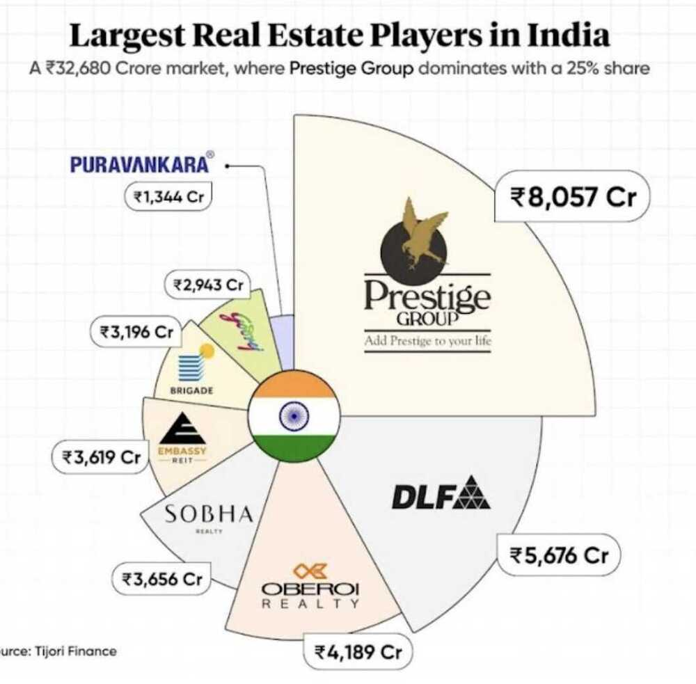

- [buying-checklist](knowledge/new-home-place/buying-checklist.md)
- [property-documents-legal-and-loans](knowledge/new-home-place/property-documents-legal-and-loans.md)
- [home-building-and-architecture](knowledge/new-home-place/home-building-and-architecture.md)

## Real Estate / Realty Market

- [Texas Real Estate Listings \| Ekdahl Real Estate](https://ekdahlrealestate.net/)
    - $3.6M - 371.75 Acres
    - $1.7M - 368 Acres
    - $555K - 56 Acres
    - $397K - 30 Acres
- [8 misconceptions about Delhi NCR properties - Reasons why you should invest in Real Estate.](https://www.linkedin.com/pulse/8-misconceptions-delhi-ncr-properties-reasons-why-you-chaudhary/)
- [Is Investing in Delhi Property Worth It? Uncovering the Pros and Cons](https://www.omaxe.com/blog/investing-in-delhi-property-pros-cons/)
- [Why Should You Buy Home If Rent Is Much Less Than Home Emi - YouTube](https://www.youtube.com/watch?v=tb_k4rqcWA8)
- [Buying A Flat? Things That Your Real Estate Agent Won't Tell You - YouTube](https://www.youtube.com/watch?v=aDwNj4NPxi0)
- [Things NO ONE Tells You About Owning a Flat in Mumbai - YouTube](https://www.youtube.com/watch?v=wMzUe71eKLM)
- [My Villa in GOA | Should you buy property in Goa? | Goa REAL ESTATE Market - YouTube](https://www.youtube.com/watch?v=0xmbMoXTk7o)
- [Best रियल एस्टेट investment? -- दुकान, घर, प्लॉट या कृषि भूमि? - YouTube](https://www.youtube.com/watch?v=1r67W4-rk_k)
- [SaudaGhar - YouTube](https://www.youtube.com/@SaudaGhar)
- [Bangalore VS Dehradun: Living on 50 Lakh+ - YouTube](https://www.youtube.com/watch?v=ADlmQRzA258&ab_channel=WintWealth)
- [Are QIPs driving India's realty sector?](https://finshots.in/markets/what-are-qips-and-are-they-driving-indias-realty-sector-qualified-institutional-placements/)
- [The Truth Behind Godrej Projects: Hype Vs Reality](https://youtu.be/4na0kpL1SJ0)
- [Gurgaon's Property Bubble is set to Burst](https://youtu.be/T219SUv3jyI)
- [Dark Truth of Gurgaon Real Estate Ft. Vishal Bhargava | IBP EP35](https://youtu.be/i_Y-yBW7kCU)
- [Can you still afford to buy a house in India? – Dezerv](https://www.dezerv.in/blog/can-you-still-afford-to-buy-a-house-in-india/)

## Real Estate Investment & Analysis

- [Plot or Flat - E² Rule Explained](https://youtu.be/S5v9edeqtIM)
- [Be Cash Ready! Distress Deals Flooding Noida Real Estate | Unfiltered Truth](https://youtu.be/nSyyCXZpXw4)
- [Good Resale Deals| Multiple Projects| Low Rise| High Rise|Under 2.50 Cr](https://youtu.be/0M-aAc_x7yg)
- [Lakhs Kharch Karke Bhi Aapka Ghar Sasta Kyun Dikhta Hai](https://youtu.be/-vILyNGR2po)
- [RBI Rules on Home Loans You Must Know!](https://youtu.be/qC1u_i1HQoo)
- [50 Secret Loan Terms ... Shhh 🤫](https://youtu.be/cE0n-fI5t-4)
- [How I ACTUALLY Spend My 1.05 Crore Salary in Bangalore](https://youtu.be/xtCGdheYWvk)

## Noida Property Market

- [The Shocking Truth About Noida Real Estate 2025 – Don't Make These Mistakes! @propertyduniya - YouTube](https://www.youtube.com/watch?v=qykwBt1kQsk)
- [Inside an Ultra Luxury 17,000 sq ft Villa in Hyderabad (House Tour).](https://youtu.be/kHmNT9sRT1M)
- [Premium Luxury Apartments in Mohali between 1 to 2 Cr | Medallion & Marb...](https://youtu.be/LSdCC3NvZHs)
- [FOMO Market Exposed | New Launches Gurgaon](https://youtu.be/1VJ1YZPCqms)
- [Yamuna authority latest plot scheme | ये कागज रखें तैयार | Yeida plot la...](https://youtu.be/LkRT4rodmLE)
- [Yamuna Expressway Authority New Plot Scheme 2024](https://youtu.be/pJlpSysDuEY)
- [Yamuna Authority Plots: YEIDA Plot Scheme 2024 - Plots Near Jewar Airport](https://youtu.be/Y0Ome-gh7IA)
- [Yeida Flats 2024 Realty:देखिये क्या हकीकत यमुना अथॉरिटी के सेक्टर 22D के...](https://youtu.be/E_t80utc8Ow)
- [Plot v/s Apartment v/s Commercial | What Is Better?](https://youtu.be/s_4Nns496Zg)
- [Addressing Short Term Real Estate Investors](https://youtu.be/zaHI01OlAi4)
- [All Top Upcoming Projects | Real Estate | Noida | Ghaziabad](https://youtu.be/dAFvSRxwEhU)
- [Noida Sec 150 Overview | Discover The Darker side and Future Opportunities | Whitehat Realty - YouTube](https://www.youtube.com/watch?v=K8o5Ky5VMV8&ab_channel=WhitehatRealty)
- [This YouTuber Moved From Noida To A Duplex In Delhi \| The Tenant - YouTube](https://www.youtube.com/watch?v=bBBDI82liqQ&ab_channel=moneycontrol)
- [Monsoon Report Card: Noida Passes, Gurugram Fails. 5 Major Reasons Why \| Explainers News - News18](https://www.news18.com/amp/explainers/monsoon-report-card-noida-passes-gurugram-fails-5-major-reasons-why-ws-l-9544394.html)
- ['If you own a flat in Noida, sell it and run': Finfluencer on UP govt's plans to scrap ground coverage limits - BusinessToday](https://www.businesstoday.in/amp/personal-finance/real-estate/story/if-you-own-a-flat-in-noida-sell-it-and-run-finfluencer-on-up-govts-plans-to-scrap-ground-coverage-limits-494074-2025-09-15)
- [Be Cash Ready! Distress Deals Flooding Noida Real Estate \| Unfiltered Truth - YouTube](https://www.youtube.com/watch?v=nSyyCXZpXw4)
- Always check if the land is freehold or leasehold since it can become 79 years and doesn't reset

### 2025-01-18 - Locations - Buy

**Requirement -** We are looking for a residential plot, in a 1 hour travelling distance from sector 18. The budget is 2-3 cr. It should be from a reputed developer in a gated already built-up society, where people are already living. Loan should be available for due diligence. Not looking for a farm house. Something like chhattarpur farms, or ansal villas. It can be either be new or resell.

- 144, advent building
- 151 sector
- 146 sector
- Noida Brokers
    - +91 95829 72918 - AK Sharma (Good)
    - +917988462871 - Nikhil Gupta
    - +91 99110 76869 - Prateek Jain
    - 092894 84015- aman - green beauty farms
    - 099731 36791 - sector 156
    - +917052225080 - property square yard noida
    - Noida resale, land brokers - +916397655281, +919818377721
    - Farm house - 99731 36791 - Mahesh Noida
- [ATS Pristine - Google Maps](https://www.google.com/maps/place/ATS+Pristine,+Pushta+Rd,+Sector+150,+Noida,+Uttar+Pradesh+201310/data=!4m2!3m1!1s0x390cc1933f72bb5f:0x35523950c45896a7?utm_source=mstt_1&entry=gps&coh=192189&g_ep=CAESBjI1LjIuNBgAIJ6dCipsLDk0MjQyNTE3LDk0MjIzMjk5LDk0MjE2NDEzLDk0MjEyNDk2LDk0MjA3Mzk0LDk0MjA3NTA2LDk0MjA4NTA2LDk0MjE3NTIzLDk0MjE4NjUzLDk0MjI5ODM5LDQ3MDg0MzkzLDk0MjEzMjAwQgJJTg%3D%3D)
- +91 70115 43356 - Ace estate Surendra tiwari, moneytree,
- ATS sector 22 D, yamuna expressway
- 95829 72918 - Duplex bungalow rwa sector 135
- [HD-207, Duplex Villa Sector-135, Noida - Google Maps](https://www.google.com/maps/place/HD-207,+Duplex+Villa+Sector-135,+Noida/@28.4987734,77.3968481,17z/data=!3m1!4b1!4m6!3m5!1s0x390ce9acb76d6c2f:0xccb67a92fb9d54c3!8m2!3d28.4987734!4d77.3968481!16s%2Fg%2F11j7j7m70r?entry=ttu&g_ep=EgoyMDI1MDExNS4wIKXMDSoASAFQAw%3D%3D)
- +919973136791 farm house lake view - Residential plot - [Rise Resorts Residency Villa - Google Maps](https://www.google.com/maps/place/Rise+Resorts+Residency+Villa/@28.5800944,77.4317573,17z/data=!3m1!4b1!4m6!3m5!1s0x390cef0301f8bfb7:0xabc2d83d549b4e46!8m2!3d28.5800944!4d77.4317573!16s%2Fg%2F11k547hlpn?entry=ttu&g_ep=EgoyMDI1MDExNS4wIKXMDSoASAFQAw%3D%3D)
- Lotus Panache

### 2025-01-17 - Rent

- +919990086104 sector 26, 3rd floor, 45000, 3 bhk, 2 bathroom
- 078275 71239 sector 26 rent broker
- +918077095384 sector 26 (17 jan)
- Manoj broker - sector 26 - +91 98181 09460 (17 jan)

### Rates

1.25 - 1140 sq ft, 6th
1390 sq ft - 20%, - 3 bhk - 1.35 lower, 3rd, 3.30

1850 - 2.05 cr -

1640 - 3 bhk, 1.65, mid floor (7 floor, 18 floor - phase 1)
18
2400 - 3+1
3075 - 3+1 and 4 - 3.50 cr

2bhk

10 years

Mahugan, - sector 78 - 2+study - 1250, 11th floor, 1.5 (7-8)
Mahugan modern - 1550 - 2cr
1250 - 1.59
Hyde park - 2bhk - 1010, 3bhk - 1320 - 1.55 (6-8)

Ravi - amrapali -

## Links

- [Texas Real Estate Listings \| Ekdahl Real Estate](https://ekdahlrealestate.net/)
- [If I Had 1 Acre… This Is the Farm I Would Build](https://youtu.be/BnMQDlc-ujA)
- ["Pakka Makaan = RCC" — India's Most Expensive Construction Myth, Broken ...](https://youtu.be/Bcck4yVUjGA)
- [Nobody understands the point of hybrid cars](https://youtu.be/KnUFH5GX_fI)
- [My Rooftop Solar Experience!](https://youtu.be/0D5AZcwK3I8)
    - SolarSquare
- [Can you really afford a house in India?](https://youtu.be/q2rdW4DqUMo)
- [the hidden psychology of beautiful homes](https://youtu.be/ngp3oxDqngc)
- [This Kerala Home is Built Around a Mango Tree (House Tour)](https://youtu.be/OdpmOmPa6xY)
- [Experience Soothing Nature in THIS 1,400 sq. ft. Tamil Nadu House (House...](https://youtu.be/6XjfuFAq-5U)
- [₹3 Cr में Golf Facing Luxury Apartment 🔥](https://youtu.be/Ytfg830WLz0)
