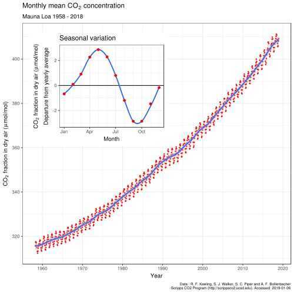

# Climate Change

## Earth / Environment / Global warming

- [the-uninhabitable-earth](book-summaries/the-uninhabitable-earth.md)
- Earth overshoot day - 27 July
- [10 years to transform the future of humanity -- or destabilize the planet | Johan Rockström - YouTube](https://www.youtube.com/watch?v=8Sl28fkrozE&ab_channel=TED)
- [International Relations this Week by Prof Pushpesh Pant 36 | For UPSC/IAS - YouTube](https://www.youtube.com/watch?v=qEC4vfo9cn4)
- [This CAN'T be true... Minute Earth](https://www.youtube.com/watch?v=1uTlC_nRb00)
	- Packaging might be more environment friendly than non packaged food
	- Floating offshore wind farms can make living closer to shore better, since water problem can be solved by desalination
- [Why sharks matter - with David Shiffman - YouTube](https://www.youtube.com/watch?v=RYXQs1g8dw0&ab_channel=TheRoyalInstitution)
- [El Niño 2023 could be a monster! - YouTube](https://www.youtube.com/watch?v=rwdxffEzQ9I)
- [The Broken Economics of the Oceans - YouTube](https://www.youtube.com/watch?v=73ygHs4Kwcs)
- [Finshots Recap - The best stories on climate change](https://finshots.in/archive/recap-2022-climate-change/)
- [What the Fossil Fuel Industry Doesn't Want You To Know | Al Gore | TED - YouTube](https://www.youtube.com/watch?v=xgZC6da4mco)
- [Has Earth Already Crossed MAJOR Tipping Points? | Full Episode | Weathered: Earth’s Extremes - YouTube](https://www.youtube.com/watch?v=YEH9nX5sudk)
- [What Will Our World Look Like at 4 Degrees? - YouTube](https://www.youtube.com/watch?v=dFqR7gj32kc)
- Conservation
- Contributing money
- Games are the most important thing to change climate change (to keep people away from spending on physical things and keep them from travelling)
- [Coolant - Home](https://coolant.co/)
- solar reflective paints
	- [Could This Be India’s Solution to the Heatwave Crisis? - YouTube](https://www.youtube.com/watch?v=DK_ROxTT91E)
	- [Best Cool Roof Paints \| Waterproofing Treatment On Terrace \| LuminX Cool Roof Paint \| Excel CoolCoat - YouTube](https://www.youtube.com/watch?v=zD3bMRopkP4)
	- [LuminX Cool Roof Coating Is BETTER Than Traditional Methods For Terrace Waterproofing - YouTube](https://www.youtube.com/watch?v=SMU02R2rkBk)
	- [How to Apply LuminX Cool Roof Coating \| Step-by-Step Guide - YouTube](https://www.youtube.com/watch?v=0UH3uJjovfg)

## Environmental Sciences

[Carbon Cycle, Nitrogen Cycle, Phosphorus and Sulphur Cycle - PMF IAS](https://www.pmfias.com/carbon-nitrogen-phosphorus-sulphur-cycle)

## AQI  / Air Quality / Air Pollution

- [Why India's Air is So Deadly (And Getting Worse!) \| Dhruv Rathee - YouTube](https://www.youtube.com/watch?v=Fzs5fEbT4ic)
- [The smog cloud affecting south Asia is now so big it can be seen from space.](http://youtube.com/post/Ugkx8EBGDYt_0gxEtEeKv2WO4Of7X4P4JZQJ)
- [How This Couple Defeated Toxic Air Pollution To Breathe 'Mountain Air' While Staying In Delhi - YouTube](https://www.youtube.com/watch?v=3l8G2ZViF9A&ab_channel=Mint)
- [Delhi's Air Quality Readings Top 1,700 as Residents Choke  | Vantage With Palki Sharma - YouTube](https://www.youtube.com/watch?v=C_cHsNWjBKE)
- [आज भी AQI 500 है, कहां भाग कर जाएं लोग, दूसरे शहर भी बेहाल - YouTube](https://www.youtube.com/watch?v=PdQ2M5DCPts)
- [क्या होगा इस हवा का? | Air Pollution in North India - YouTube](https://www.youtube.com/watch?v=tDAavaJN47E)
- [What’s Choking Indian Cities To Death? \| Reality of Diwali & Pollution In India \| Akash Banerjee - YouTube](https://www.youtube.com/watch?v=18VWC6Q-zcs)
- [Your Family is at Risk: Harmful Gases from Kitchen, Walls & Car \| BreatheEasy \| FO426 Raj Shamani - YouTube](https://www.youtube.com/watch?v=RKxuKMhaMnI)
- [Cleanest air quality 2025: World's top 10 cities with best air quality index](https://www.wionews.com/photos/top-10-cities-cleanest-air-quality-index-2025-1761305737698/1761305737699)
- [Control indoor AQI without air purifier – Dyson expert’s 5 simple habits to de-smog your home - Technology News \| The Financial Express](https://www.financialexpress.com/life/technology-control-indoor-aqi-without-air-purifier-dyson-experts-5-simple-habits-to-de-smog-your-home-4025154/)

## Keeling Curve

The Keeling Curve is a graph of the accumulation of [carbon dioxide in the Earth's atmosphere](https://en.wikipedia.org/wiki/Carbon_dioxide_in_Earth%27s_atmosphere) based on continuous measurements taken at the [Mauna Loa Observatory](https://en.wikipedia.org/wiki/Mauna_Loa_Observatory) on the island of [Hawaii](https://en.wikipedia.org/wiki/Hawaii) from 1958 to the present day. The curve is named for the scientist [Charles David Keeling](https://en.wikipedia.org/wiki/Charles_David_Keeling), who started the monitoring program and supervised it until his death in 2005.

Keeling's measurements showed the first significant evidence of rapidly increasing [carbon dioxide](https://en.wikipedia.org/wiki/Carbon_dioxide)(CO2) levels in the atmosphere. According to Dr [Naomi Oreskes](https://en.wikipedia.org/wiki/Naomi_Oreskes), Professor of History of Science at [Harvard University](https://en.wikipedia.org/wiki/Harvard_University), the Keeling curve is one of the most important scientific works of the [20th century](https://en.wikipedia.org/wiki/20th_century). Many scientists credit the Keeling curve with first bringing the world's attention to the current increase of [CO](https://en.wikipedia.org/wiki/Carbon_dioxide) in the atmosphere.

## Animal Cruelty / Veganism / Non-Veg / Vegetarian / Vegan

- **Turn vegan (saves water, saves greenhouse gases, saves money)**
- Saying no to overconsumption
- There is no humane way of using animals
- The greatness of a nation and its moral progress can be judged by the way its animals are treated -- Mohandas Karamchand Gandhi
- You have just dined, and however scrupulously the slaughterhouse is concealed in the graceful distance of miles, there is complicity. --Ralph Waldo Emerson
- Media
	- Racing Extinction
	- Cowspiracy
	- Seaspiracy (2021)
	- Food, Inc. (2008)
	- The Cove (2009)
	- Earthlings - [Earthlings Documentary](https://www.youtube.com/watch?v=8gqwpfEcBjI)
	- [Dominion (2018) - full documentary [Official]](https://www.youtube.com/watch?v=LQRAfJyEsko) - https://www.dominionmovement.com
	- [The Dark Truth About Dairy Farming in India \| What Farmers Aren’t Told - YouTube](https://www.youtube.com/watch?v=ipjMIKdYgIU)
		- Absence of suffering is bigger than presence of life
		- Live to reduce suffering; live while causing minimum suffering
		- [About us](https://peepalfarm.org/)
		- [faq vegan](https://peepalfarm.org/faq-vegan)
	- [The Photograph of a Dead Chicken — Ian Knauer](https://www.ianknauer.com/blog/the-photograph-of-a-dead-chicken)
	- [Born To Die (The Life of A Broiler Chicken) » Tamara Kenneally Photography](https://www.tamarakenneallyphotography.com/born-to-die-the-life-of-a-broiler-chicken/)
	- [We Went Inside the Milk Industry of India, With Hidden Cameras 😳 - YouTube](https://www.youtube.com/watch?v=vB2SvXYs4zM)
	- [Why the World’s Fittest People Have Stopped Drinking Milk (5 Shocking Reasons) 😳 - YouTube](https://www.youtube.com/watch?v=TqR6uaWvmm0)
- [We Made Paneer, Cheese & Dahi Without a Drop of Cow Milk! - YouTube](https://www.youtube.com/watch?v=ec4rCrUgHi4)
- Agar agar is a natural, gelatinous substance derived from red algae (seaweed), widely used as a plant-based, vegan alternative to gelatin. It is odorless, tasteless, and colorless, sold as flakes, powder, or bars. It sets firmly at room temperature, remains stable up to 85° C, and is used for jellies, puddings, and thickeners.

## Links

- [The Uninhabitable Earth](book-summaries/the-uninhabitable-earth.md)
- [The Fourth Big Force: Climate Change](https://www.linkedin.com/pulse/fourth-big-force-climate-change-ray-dalio-vmt5e/)
- [What's happening to our water?](https://finshots.in/archive/whats-happening-to-our-water-atmospheric-water-generators-awg/)
- [When Will Extreme Heat Become Unlivable?](https://youtu.be/7hBMbQ9de1g)
