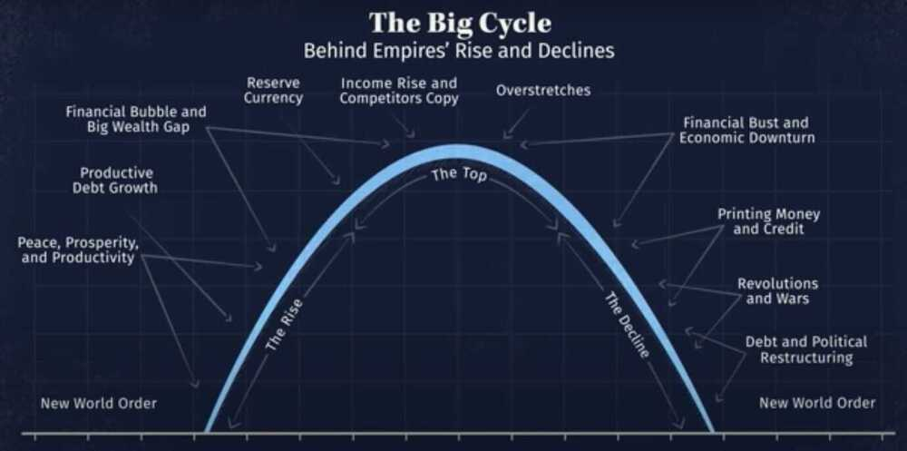

# International Relations IR

In international relations there are no permanent friends or enemies only permanent interests

We can choose our friends but not our neighbours

War is a strange game, only way to win it, is to not play it

It's all about what narratives you believe in

Wolf warrior diplomacy / strategy

[Principles for Dealing with the Changing World Order by Ray Dalio](https://www.youtube.com/watch?v=xguam0TKMw8)

- 15 August 1971 - US would no longer exchange dollars held by foreign governments for gold
- 2 main principles to fix the declining power
    - Earn more than we spend
    - Treat each other well

https://economicprinciples.org

[Why Leaders Lie: The Truth About Lying in International Politics with John Mearsheimer](https://www.youtube.com/watch?v=VPe5f5dcrGE)

- Selfish lies (lies told to benefit himself/herself)
- Strategic lies (lies to benefit the country / someone else)

Nobel lies (strategic lies can turn into nobel lies)

- Consealment
- Spinning

- 5 types of international lies

    1. Inter-state lies (country lies to other countries)
    2. Fear mongering (lies to own country people)
    3. Strategic cover up
    4. Nationalist Myth making (portray himself as good and others as bad)
    5. Liberal lies

Trust is most important

[John J Mearsheimer: The Great Delusion](https://youtu.be/nZVIaXFN2lU)

## Links

[Why India chose Egypt President El Sisi as Chief Guest for Republic Day | India Egypt Relations](https://www.youtube.com/watch?v=Cr2htefB7yk)

[Why Russia's Biggest Threat is Actually China - YouTube](https://www.youtube.com/watch?v=Iibs7buNwxQ)

Book - Red Roulette by Desmond Shum

[Why we fight - YouTube](https://www.youtube.com/watch?v=1zBZ-aGqldA&ab_channel=CharlesHoskinson)

[Ray Dalio on US Dominance, China Economy, Inflation, Future of Bridgewater - YouTube](https://www.youtube.com/watch?v=Y3LufB6DK4k)
[Russia and China are TRAPPING America! - YouTube](https://www.youtube.com/watch?v=IU_91PJMZvg)
