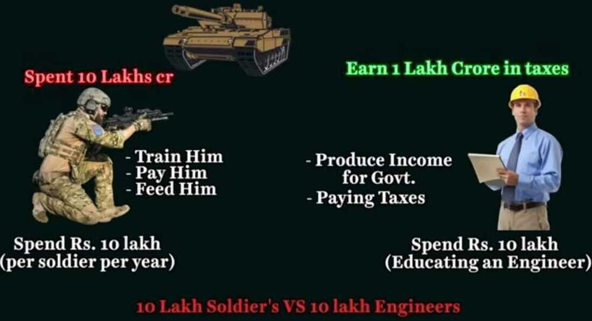

# Others

## Free Speech

<https://www.youtube.com/watch?v=OYHhPmmNUEs>

**brinkmanship** - the art or practice of pursuing a dangerous policy to the limits of safety before stopping, especially in politics.

Skepticism

Subjectivity

There is my truth, there is your truth and then there is the truth

Shadow ban - less impressions

[Ranks and Hierarchy of Indian Armed Forces | Explained | Army-Navy-Airforce - YouTube](https://www.youtube.com/watch?v=IOwOH69KDd8)

### Media / News

["While We Watched" Documentary Spotlights Journalist Ravish Kumar's Fight for Truth in Modi's India - YouTube](https://www.youtube.com/watch?v=TZRuxFnkVm8)

## IAS Knowledge Series

[Knowledge Series | Master Playlist | Important Static Topics For UPSC Prelims & Mains 2022-2023 - YouTube](https://www.youtube.com/playlist?list=PLkJ-kjtioPGrQ_jYd2rnFyvc4BUSEA8vL)
