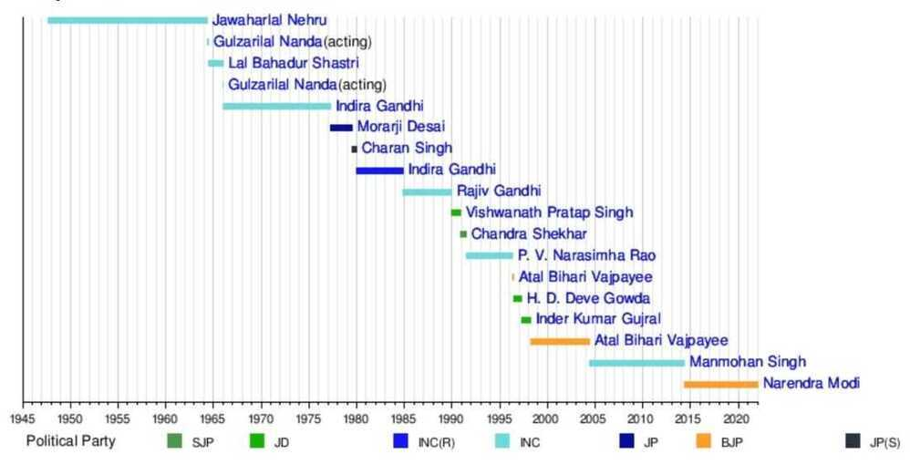
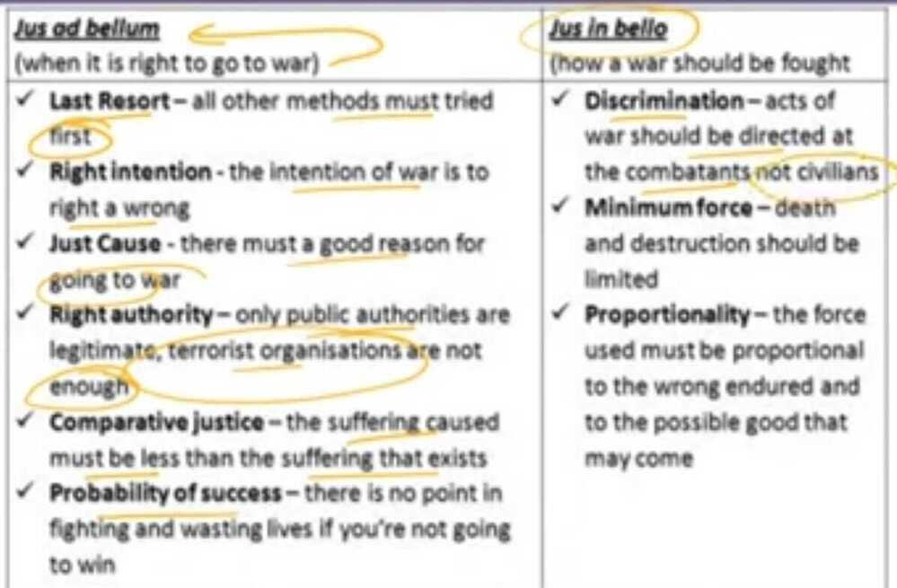
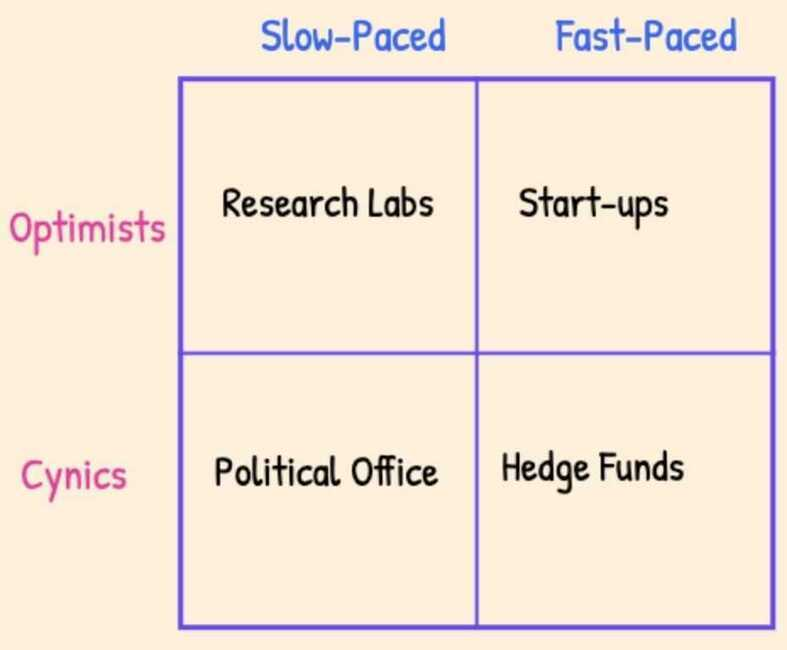

# Politics

Lennon will always remain a freedom seeker, a liberal globalizer who dreamed of a world with no country, with nothing to kill or die for, and no religion too. Impossible? Maybe , but dreams need to go beyond the mere possible.

Only the dead can be forgiven

Free speech is a privilege that must only be given to only set of filtered people.

Too big to fail and too big to jail

## Quotes

If you want the truth to stand clear before you, never be for or against. The struggle between **for** and **against** is the mind's worst disease -- Sent-ts'an, c. 700 C.E.

The problem with election is one of them is going to win.

The best argument against democracy is a five-minute conversation with the average voter. -- Winston Churchill

## Reforms India

- Anti-defection law
- Electoral Bonds should be banned

## Schools of Thoughts

- Idealism
- Realism (Neorealism)
- Just war theory
- Dharma in foreign policy

## Marxism

**Marxism** is a [left-wing](https://en.m.wikipedia.org/wiki/Left-wing_politics "Left-wing politics") to [far-left](https://en.m.wikipedia.org/wiki/Far-left_politics "Far-left politics") method of [socioeconomic](https://en.m.wikipedia.org/wiki/Socioeconomic "Socioeconomic") analysis that uses a [materialist](https://en.m.wikipedia.org/wiki/Materialism "Materialism") interpretation of historical development, better known as [historical materialism](https://en.m.wikipedia.org/wiki/Historical_materialism "Historical materialism"), to understand [class](https://en.m.wikipedia.org/wiki/Social_class "Social class") relations and [social conflict](https://en.m.wikipedia.org/wiki/Social_conflict "Social conflict") and a [dialectical](https://en.m.wikipedia.org/wiki/Dialectic "Dialectic") perspective to view [social transformation](https://en.m.wikipedia.org/wiki/Social_transformation "Social transformation"). It originates from the works of 19th-century German philosophers [Karl Marx](https://en.m.wikipedia.org/wiki/Karl_Marx "Karl Marx") and [Friedrich Engels](https://en.m.wikipedia.org/wiki/Friedrich_Engels "Friedrich Engels"). As Marxism has developed over time into various branches and [schools of thought](https://en.m.wikipedia.org/wiki/Schools_of_thought "Schools of thought"), no single, definitive [Marxist theory](https://en.m.wikipedia.org/wiki/Marxist_philosophy "Marxist philosophy") exists.

Some [Marxist schools of thought](https://en.wikipedia.org/wiki/Marxist_schools_of_thought) place greater emphasis on certain aspects of [classical Marxism](https://en.wikipedia.org/wiki/Classical_Marxism) while rejecting or modifying other aspects. Some schools have sought to combine Marxian concepts and non-Marxian concepts which has then led to contradictory conclusions.It has been argued that there is a movement toward the recognition of [historical](https://en.wikipedia.org/wiki/Historical_materialism) and [dialectical materialism](https://en.wikipedia.org/wiki/Dialectical_materialism) as the fundamental conceptions of all Marxist schools of thought.This view is rejected by some [post-Marxists](https://en.wikipedia.org/wiki/Post-Marxism) such as [Ernesto Laclau](https://en.wikipedia.org/wiki/Ernesto_Laclau) and [Chantal Mouffe](https://en.wikipedia.org/wiki/Chantal_Mouffe), who claim that history is not only determined by the [mode of production](https://en.wikipedia.org/wiki/Mode_of_production) but also by consciousness and will.

https://en.wikipedia.org/wiki/Marxism

https://www.e-ir.info/2018/02/25/introducing-marxism-in-international-relations-theory

## ASEAN (Association of Southeast Asian Nations)

[Indonesia](https://www.google.com/search?q=Indonesia&stick=H4sIAAAAAAAAAOPgE-LQz9U3KMxLK1MCs4yLKvO09DPKrfST83NyUpNLMvPz9HNTc5NSi4ozMgvi84vSE_MyqxJB4sVWUIlFrJyeeSn5eanFmYkATdfNaVMAAAA&sa=X&ved=2ahUKEwjc79H5zJjhAhVJQo8KHa_tBwQQmxMoATAaegQIDBAl), [Thailand](https://www.google.com/search?q=Thailand&stick=H4sIAAAAAAAAAOPgE-LQz9U3KMxLK1MCs8zTDCu09DPKrfST83NyUpNLMvPz9HNTc5NSi4ozMgvi84vSE_MyqxJB4sVWUIlFrBwhGYmZOYl5KQCcnvE1UgAAAA&sa=X&ved=2ahUKEwjc79H5zJjhAhVJQo8KHa_tBwQQmxMoAjAaegQIDBAm), [Malaysia](https://www.google.com/search?q=Malaysia&stick=H4sIAAAAAAAAAOPgE-LQz9U3KMxLK1PiBLEsC3Kzy7T0M8qt9JPzc3JSk0sy8_P0c1Nzk1KLijMyC-Lzi9IT8zKrEkHixVZQiUWsHL6JOYmVxZmJAJCgcytTAAAA&sa=X&ved=2ahUKEwjc79H5zJjhAhVJQo8KHa_tBwQQmxMoAzAaegQIDBAn), [Singapore](https://www.google.com/search?q=Singapore&stick=H4sIAAAAAAAAAOPgE-LQz9U3KMxLK1MCs8xKjEq09DPKrfST83NyUpNLMvPz9HNTc5NSi4ozMgvi84vSE_MyqxJB4sVWUIlFrJzBmXnpiQX5RakAQLdNv1MAAAA&sa=X&ved=2ahUKEwjc79H5zJjhAhVJQo8KHa_tBwQQmxMoBDAaegQIDBAo), [Philippines](https://www.google.com/search?q=Philippines&stick=H4sIAAAAAAAAAOPgE-LQz9U3KMxLK1MCs0zLLJK19DPKrfST83NyUpNLMvPz9HNTc5NSi4ozMgvi84vSE_MyqxJB4sVWUIlFrNwBGZk5mQUFmXmpxQBQgZaQVQAAAA&sa=X&ved=2ahUKEwjc79H5zJjhAhVJQo8KHa_tBwQQmxMoBTAaegQIDBAp), [Vietnam](https://www.google.com/search?q=Vietnam&stick=H4sIAAAAAAAAAOPgE-LQz9U3KMxLK1PiBLEMk4tSTLX0M8qt9JPzc3JSk0sy8_P0c1Nzk1KLijMyC-Lzi9IT8zKrEkHixVZQiUWs7GGZqSV5ibkARlh_aFIAAAA&sa=X&ved=2ahUKEwjc79H5zJjhAhVJQo8KHa_tBwQQmxMoBjAaegQIDBAq), [Cambodia](https://www.google.com/search?q=Cambodia&stick=H4sIAAAAAAAAAOPgE-LQz9U3KMxLK1PiBLEMK5LSK7T0M8qt9JPzc3JSk0sy8_P0c1Nzk1KLijMyC-Lzi9IT8zKrEkHixVZQiUWsHM6JuUn5KZmJAHJFpqpTAAAA&sa=X&ved=2ahUKEwjc79H5zJjhAhVJQo8KHa_tBwQQmxMoBzAaegQIDBAr), [Brunei](https://www.google.com/search?q=Brunei&stick=H4sIAAAAAAAAAOPgE-LQz9U3KMxLK1MCswzNzMu09DPKrfST83NyUpNLMvPz9HNTc5NSi4ozMgvi84vSE_MyqxJB4sVWUIlFrGxORaV5qZkAah8-ZFAAAAA&sa=X&ved=2ahUKEwjc79H5zJjhAhVJQo8KHa_tBwQQmxMoCDAaegQIDBAs), [Myanmar (Burma)](https://www.google.com/search?q=Myanmar&stick=H4sIAAAAAAAAAOPgE-LQz9U3KMxLK1MCs0wq8uK19DPKrfST83NyUpNLMvPz9HNTc5NSi4ozMgvi84vSE_MyqxJB4sVWUIlFrOy-lYl5uYlFABOulxxRAAAA&sa=X&ved=2ahUKEwjc79H5zJjhAhVJQo8KHa_tBwQQmxMoCTAaegQIDBAt), [Laos](https://www.google.com/search?q=Laos&stick=H4sIAAAAAAAAAOPgE-LQz9U3KMxLK1MCs0wyMsq09DPKrfST83NyUpNLMvPz9HNTc5NSi4ozMgvi84vSE_MyqxJB4sVWUIlFrCw-ifnFAFRUTElOAAAA&sa=X&ved=2ahUKEwjc79H5zJjhAhVJQo8KHa_tBwQQmxMoCjAaegQIDBAu)

## Deterrence & Coersion

1. Turning of the screw
2. Try and see
3. Tacit ultimatum
4. Full-fledged ultimatum

## PMO

https://en.wikipedia.org/wiki/Prime_Minister_of_India

## Western Culture

"Wang recorded his observations in a memoir that would become his most famous work: the 1991 book America Against America. In it, he marvels at homeless encampments in the streets of Washington DC, out-of-control drug crime in poor black neighborhoods in New York and San Francisco, and corporations that seemed to have fused themselves to and taken over responsibilities of government. Eventually, he concludes that America faces an "unstoppable undercurrent of crisis" produced by its societal contradictions, including between rich and poor, white and black, democratic and oligarchic power, egalitarianism and class privilege, individual rights and collective responsibilities, cultural traditions and the solvent of liquid modernity.

"The real cell of society in the United States is the individual," he finds. This is so because the cell most foundational (per Aristotle) to society, "the family, has disintegrated." Meanwhile, in the American system, "everything has a dual nature, and the glamour of high commodification abounds. Human flesh, sex, knowledge, politics, power, and law can all become the target of commodification." This "commodification, in many ways, corrupts society and leads to a number of serious social problems." In the end, "the American economic system has created human loneliness" as its foremost product, along with spectacular inequality. As a result, "nihilism has become the American way, which is a fatal shock to cultural development and the American spirit."

## demagogues

a political leader who seeks support by appealing to the desires and prejudices of ordinary people rather than by using rational argument.

## War

### Just War Criteria

### Subversion

[Sahebs | History of Subversion of India | Full Film - YouTube](https://www.youtube.com/watch?v=N3E534MpkHU)

[Understanding the Political Scenario of INDIA,CANADA,JAPAN,CHINA,USA, FRANCE etc - YouTube](https://www.youtube.com/watch?v=Y9TviIuXPSE)

## Links

- [Edge of chaos](../../../book-summaries/edge-of-chaos)
- [Leadership and the Rise of Great Powers](../../../book-summaries/leadership-and-the-rise-of-great-powers)
