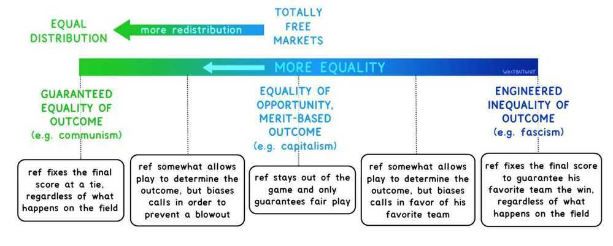
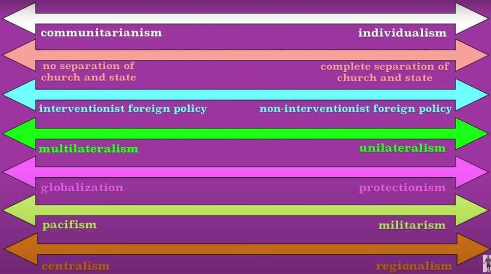

# Types of Governments

turtles move slow, the government moves slower

**Political Ideology**

### Monarchy

### Democracy

[Is Democracy Doomed? The Global Fight for Our Future | Timothy Snyder | TED - YouTube](https://www.youtube.com/watch?v=YY6LCOJbve8)

I disapprove of what you say, but will defend to the death your right to say it.

[How to Build Democracy — in an Authoritarian Country | Tessza Udvarhelyi | TED - YouTube](https://www.youtube.com/watch?v=-QkDwqktaVk)

Democracy is not a noun but a verb, it something you do

A wicked citizen cannot do evil in a republic that is not corrupted

[Democracy Lab | TED-Ed](https://ed.ted.com/democracy-lab)

#### Links

- [Is India becoming a DICTATORSHIP? | Chandigarh Elections | Farmers Protest | Dhruv Rathee - YouTube](https://www.youtube.com/watch?v=Y9253_M38Xk&ab_channel=DhruvRathee)
- [Is Modi a dictator? | Dhruv Rathee vs The World - YouTube](https://www.youtube.com/watch?v=DnzM1cnRZPc&ab_channel=meghnerd)
- [किसको चाहिए डिक्टेटर? कद्दू समझ रखा है? | Who wants Dictatorship in India?? - YouTube](https://www.youtube.com/watch?v=U68aORo533I&ab_channel=RavishKumarOfficial)
- [The Age of The Strongman: How the Cult of the Leader Threatens Democracy around the World eBook : Rachman, Gideon](https://www.amazon.in/Age-Strongman-Leader-Threatens-Democracy-ebook/dp/B09HJZNQ5R)
- [How Dictatorships Work: Power, Personalization, and Collapse, Geddes, Barbara, Wright, Joseph, Frantz, Erica](https://www.amazon.com/How-Dictatorships-Work-Personalization-Collapse/dp/1107115825#:~:text=Importantly%2C%20this%20book%20explains%20how,the%20rest%20of%20the%20world.)
- [How to Be a Dictator: The Cult of Personality in the Twentieth Century : Dikötter, Frank](https://www.amazon.in/How-Be-Dictator-Personality-Twentieth/dp/1635573793)
- [Illegitimate Authority: Facing the Challenges of Our Time](https://www.amazon.in/Illegitimate-Authority-Facing-Challenges-Time/dp/0241629942)
- [Dictatorland: The Men Who Stole Africa](https://www.amazon.in/Dictatorland-Men-Who-Stole-Africa/dp/1784972134)
- [Myth of the Strong Leader](https://www.amazon.in/Myth-Strong-Leader-Archie-Brown/dp/0099554852)
- [The Origins of Totalitarian Democracy](https://www.amazon.in/Origins-Totalitarian-Democracy-Jacob-Talmon/dp/1013896661)
- [The Origins of Totalitarianism (Penguin Modern Classics)](https://www.amazon.in/Origins-Totalitarianism-Penguin-Modern-Classics/dp/0241316758)

### Oligarchy

a small group of people having control of a country or organization.

### Authoritarianism

the enforcement or advocacy of strict obedience to authority at the expense of personal freedom.

### Totalitarianism

a system of government that is centralized and dictatorial and requires complete subservience to the state.

### Meritocracy

### Populism

a political approach that strives to appeal to ordinary people who feel that their concerns are disregarded by established elite groups.

### Federalism

Federalism is the mixed or compound mode of [government](https://en.wikipedia.org/wiki/Government), combining a general government (the central or "federal" government) with regional governments (provincial, state, cantonal, territorial or other sub-unit governments) in a single political system.

Federalism can thus be defined as a form of government in which there is a division of powers between two levels of government of equal status.

https://en.wikipedia.org/wiki/Federalism

### Egalitarian

believing in or based on the principle that all people are equal and deserve equal rights and opportunities.

### Socialism

a political and economic theory of social organization which advocates that the means of production, distribution, and exchange should be owned or regulated by the community as a whole.

### Capitalism

an economic and political system in which a country's trade and industry are controlled by private owners for profit, rather than by the state.

### Feudalism

the dominant social system in medieval Europe, in which the nobility held lands from the Crown in exchange for military service, and vassals were in turn tenants of the nobles, while the peasants (villeins or serfs) were obliged to live on their lord's land and give him homage, labour, and a share of the produce, notionally in exchange for military protection.

### Imperialism

A policy of extending a country's power and influence through colonization, use of military force, or other means.

Imperialism is the highest form of capitalism

### Sectarianism

Excessive attachment to a particular sect or party, especially in religion.

### Secularism

The principle of separation of the state from religious institutions.

### Communism

Communism (from [Latin](https://en.wikipedia.org/wiki/Latin) communis, 'common, universal') is a [philosophical](https://en.wikipedia.org/wiki/Political_philosophy), [social](https://en.wikipedia.org/wiki/Social_philosophy), [political](https://en.wikipedia.org/wiki/Political_movement), [economic](https://en.wikipedia.org/wiki/Economic_ideology) ideology and [movement](https://en.wikipedia.org/wiki/Political_movement) whose ultimate goal is the establishment of a [communist society](https://en.wikipedia.org/wiki/Communist_society), namely a [socioeconomic](https://en.wikipedia.org/wiki/Socioeconomics) order structured upon the ideas of [common ownership](https://en.wikipedia.org/wiki/Common_ownership) of the [means of production](https://en.wikipedia.org/wiki/Means_of_production) and the absence of [social classes](https://en.wikipedia.org/wiki/Social_class), [money](https://en.wikipedia.org/wiki/Money) and the [state](https://en.wikipedia.org/wiki/State_(polity)). - https://en.wikipedia.org/wiki/Communism

[Communism - Wikipedia](https://en.wikipedia.org/wiki/Communism)

### Orwellian

"Orwellian" is an [adjective](https://en.wikipedia.org/wiki/Adjective) describing a situation, idea, or societal condition that [George Orwell](https://en.wikipedia.org/wiki/George_Orwell) identified as being destructive to the welfare of a free and [open society](https://en.wikipedia.org/wiki/Open_society). It denotes an attitude and a brutal policy of draconian control by [propaganda](https://en.wikipedia.org/wiki/Propaganda), [surveillance](https://en.wikipedia.org/wiki/Surveillance), [disinformation](https://en.wikipedia.org/wiki/Disinformation), [denial of truth](https://en.wikipedia.org/wiki/Denialism) ([doublethink](https://en.wikipedia.org/wiki/Doublethink)), and manipulation of the past, including the "[unperson](https://en.wikipedia.org/wiki/Unperson)" - a person whose past existence is expunged from the public record and memory, practiced by modern repressive governments. Often, this includes the circumstances depicted in his novels, particularly [Nineteen Eighty-Four](https://en.wikipedia.org/wiki/Nineteen_Eighty-Four) but political [doublespeak](https://en.wikipedia.org/wiki/Doublespeak) is criticized throughout his work, such as in [Politics and the English Language](https://en.wikipedia.org/wiki/Politics_and_the_English_Language).

https://en.wikipedia.org/wiki/Orwellian

https://en.wikipedia.org/wiki/Nineteen_Eighty-Four

### Gerontocracy

a state, society, or group governed by old people

### Plutocracy

government by the wealthy

an elite or ruling class whose power derives from their wealth

### Paedocracy

Rule by children

### Elite Theory

In [philosophy](https://en.wikipedia.org/wiki/Philosophy "Philosophy"), [political science](https://en.wikipedia.org/wiki/Political_science "Political science") and [sociology](https://en.wikipedia.org/wiki/Sociology "Sociology"), **elite theory** is a theory of the State that seeks to describe and explain power relationships in contemporary society. The theory posits that a small minority, consisting of members of the [economic](https://en.wikipedia.org/wiki/Economic "Economic") elite and [policy](https://en.wikipedia.org/wiki/Policy "Policy")-planning networks, holds the most power-and that this power is independent of democratic elections.

[Elite theory - Wikipedia](https://en.wikipedia.org/wiki/Elite_theory)

### Rhine Captalism

[Social market economy - Wikipedia](https://en.wikipedia.org/wiki/Social_market_economy)

[Don't Underestimate The German Economy | Economics Explained - YouTube](https://www.youtube.com/watch?v=XXI6AoOGEmU)

https://en.wikipedia.org/wiki/Government

- Full presidential republics
- Semi-presidential republics
- Republics with an executive president elected by or nominated by the legislature that may or may not be subject to parliamentary confidence
- Parliamentary republics
- Parliamentary constitutional monarchies
- Parliamentary semi-constitutional monarchies which have a separate head of government but where royalty holds significant executive and/or legislative power
- Absolute monarchies
- One-party states
- Countries where constitutional provisions for government have been suspended (e.g. military dictatorships)
- Countries which do not fit any of the above systems (e.g. provisional governments/unclear political situations)

https://en.wikipedia.org/wiki/Parliamentary_system

## Permanent Revolution

**Permanent revolution** is the strategy of a [revolutionary](https://en.wikipedia.org/wiki/Revolution "Revolution") [class](https://en.wikipedia.org/wiki/Social_class "Social class") pursuing its own interests independently and without compromise or alliance with opposing sections of society. As a term within [Marxist theory](https://en.wikipedia.org/wiki/Marxist_theory "Marxist theory"), it was first coined by [Karl Marx](https://en.wikipedia.org/wiki/Karl_Marx "Karl Marx") and [Friedrich Engels](https://en.wikipedia.org/wiki/Friedrich_Engels "Friedrich Engels") as early as 1850, but since then it has been used to refer to different concepts by different theorists, most notably [Leon Trotsky](https://en.wikipedia.org/wiki/Leon_Trotsky "Leon Trotsky").

[Permanent revolution - Wikipedia](https://en.wikipedia.org/wiki/Permanent_revolution)

## Liberalism

[Every Liberalism Term Explained in 5 Minutes - YouTube](https://www.youtube.com/watch?v=NAq-Qlm-qhA&ab_channel=TheWhiteboardExplainer)

## The Political Spectrums - Left wing vs right wing, centrism (Crap)

### Left (Liberal)

- Liberty - Freedom to do everything which injures no one else
- Equality (egalitarianism)

The idea of fairness for all humans

- Progress
- Internationalism
- **Reform**

### Right (Conservative)

- Authority
- Hierarchy
- Tradition
- Nationalism
- **Reaction**

https://www.youtube.com/watch?v=8SOQduoLgRw

### Bipartisan

Of or involving the agreement or cooperation of two political parties that usually oppose each other's policies.

"the reforms received considerable bipartisan approval"

## Others

[Hermeticism - Wikipedia](https://en.wikipedia.org/wiki/Hermeticism)

[New Age - Wikipedia](https://en.wikipedia.org/wiki/New_Age)

## Links

[Consitution of Indian - others](knowledge/law/constitution-of-india/others.md)
