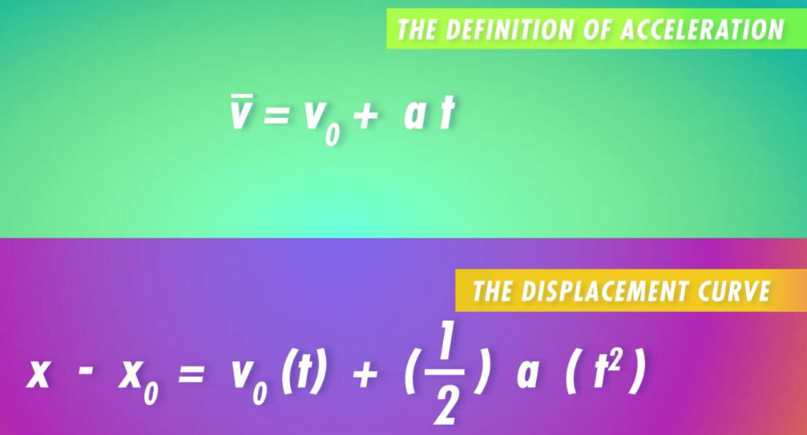

# Crash Course Physics

1. Motion in a Straight Line

    - Kinematic Equations
    - Dimensions - (Time, Position, Velocity, Acceleration)
    - Velocity is the way our position changes over time. (m/s)
    - Acceleration is the change in velocity over time (m/s^2^)
    - 2nd Kinematic Equation - Displacement Curve

    

2. Derivatives
3. Integrals
4. Vectors and 2D Motion
5. Newton's Laws
6. Friction
7. Uniform Circular Motion
8. Newtonian Gravity
9. Work, Energy and Power
10. Collisions
11. Rotational Motion
12. Torque
13. Statics
14. Fluids at Rest
15. Fluids in Motion
16. Simple Harmonic Motion
17. Traveling Waves
18. Sound
19. The Physics of Music
20. Temperature
21. Kinetic Theory and Phase Changes
22. The Physics of Heat
23. Thermodynamics
24. Engines
25. Electric Charge
26. Electric Fields
27. Voltage, Electric Energy, and Capacitors
28. Electric Current
29. DC Resistors & Batteries
30. Circuit Analysis
31. Capacitors and Kirchhoff
32. Magnetism
33. Ampere's Law
34. Induction
35. How Power Gets to Your Home
36. AC Circuits
37. Maxwell's Equations
38. Geometric Optics
39. Light in Waves
40. Spectra Interference
41. Optical Instruments
42. Special Relativity
43. Quantum Mechanics Part 1
44. Quantum Mechanics Part 2
45. Nuclear Physics
46. Astrophysics and Cosmology
