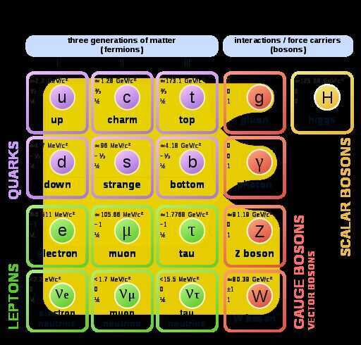

# Intro

1. Retrocausality - That future can effect the past. Ex - if i spill the coffee tomorrow then i can see the stain today.

## Momentum

In [Newtonian mechanics](https://en.wikipedia.org/wiki/Newtonian_mechanics), linear momentum, translational momentum, or simplymomentum([pl.](https://en.wikipedia.org/wiki/Plural) momenta) is the product of the [mass](https://en.wikipedia.org/wiki/Mass) and [velocity](https://en.wikipedia.org/wiki/Velocity) of an object. It is a [vector](https://en.wikipedia.org/wiki/Euclidean_vector) quantity, possessing a magnitude and a direction in three-dimensional space. Ifmis an object's mass andvis the velocity (also a vector), then the momentum is

p = mv

In [SI units](https://en.wikipedia.org/wiki/International_System_of_Units), it is measured in [kilogram meters per second](https://en.wikipedia.org/wiki/Kilogram_metre_per_second)([kg](https://en.wikipedia.org/wiki/Kilogram)⋅[m/s](https://en.wikipedia.org/wiki/Meters_per_second)).[Newton's second law](https://en.wikipedia.org/wiki/Newton%27s_second_law) of motion states that a body's rate of change in momentum is equal to the net force acting on it.

Momentum depends on the [frame of reference](https://en.wikipedia.org/wiki/Frame_of_reference), but in any inertial frame it is aconservedquantity, meaning that if a [closed system](https://en.wikipedia.org/wiki/Closed_system) is not affected by external forces, its total linear momentum does not change. Momentum is also conserved in [special relativity](https://en.wikipedia.org/wiki/Special_relativity), (with a modified formula) and, in a modified form, in [electrodynamics](https://en.wikipedia.org/wiki/Electrodynamics), [quantum mechanics](https://en.wikipedia.org/wiki/Quantum_mechanics), [quantum field theory](https://en.wikipedia.org/wiki/Quantum_field_theory), and [general relativity](https://en.wikipedia.org/wiki/General_relativity). It is an expression of one of the fundamental symmetries of space and time:[translational symmetry](https://en.wikipedia.org/wiki/Translational_symmetry).

Advanced formulations of classical mechanics, [Lagrangian](https://en.wikipedia.org/wiki/Lagrangian_mechanics) and [Hamiltonian mechanics](https://en.wikipedia.org/wiki/Hamiltonian_mechanics), allow one to choose coordinate systems that incorporate symmetries and constraints. In these systems the conserved quantity isgeneralized momentum, and in general this is different from thekineticmomentum defined above. The concept of generalized momentum is carried over into quantum mechanics, where it becomes an operator on a [wave function](https://en.wikipedia.org/wiki/Wave_function). The momentum and position operators are related by the [Heisenberg uncertainty principle](https://en.wikipedia.org/wiki/Heisenberg_uncertainty_principle).

In continuous systems such as electromagnetic fields, fluids and deformable bodies, a momentum density can be defined, and a continuum version of the conservation of momentum leads to equations such as the [Navier--Stokes equations](https://en.wikipedia.org/wiki/Navier%E2%80%93Stokes_equations) for fluids or the [Cauchy momentum equation](https://en.wikipedia.org/wiki/Cauchy_momentum_equation) for deformable solids or fluids.

## References

<https://en.wikipedia.org/wiki/Momentum>

## Types of Collision

- **Elastic -** two objects collide and bounce of each other
- **Perfectly inelastic**
- **Partially inelastic**

## 4 Fundamental forces

- Strong and weak force
- Electromagnetism
- Gravity

## Standard model of particle physics

Proton - 2 up quarks and 1 down quark

Neutron - 1 up quark and 2 down quarks

<https://en.wikipedia.org/wiki/Standard_Model>

[The Standard Model of Particle Physics: A Triumph of Science - YouTube](https://www.youtube.com/watch?v=Unl1jXFnzgo)

[The Fundamental Constituents of Matter and the Eightfold Way](https://www.youtube.com/watch?v=SSswwu8JEYQ)

[Searching for new physics with low-energy techniques - with Danielle Speller - YouTube](https://www.youtube.com/watch?v=NDUUTEhKj54)

[On the origin of time – with Thomas Hertog - YouTube](https://www.youtube.com/watch?v=fY3MbKNNG8o&ab_channel=TheRoyalInstitution)

[How did Michael Faraday invent? – with David Ricketts - YouTube](https://www.youtube.com/watch?v=z1uOsg2-LTA&ab_channel=TheRoyalInstitution)

[The magic of physics - with Felix Flicker - YouTube](https://www.youtube.com/watch?v=H3wSaLSXdBM&ab_channel=TheRoyalInstitution)

[Particle physics made easy - with Pauline Gagnon - YouTube](https://www.youtube.com/watch?v=Gg35wa82pLQ)

[Did AI Prove Our Proton Model WRONG? - YouTube](https://www.youtube.com/watch?v=TbzZIMQC6vk)
