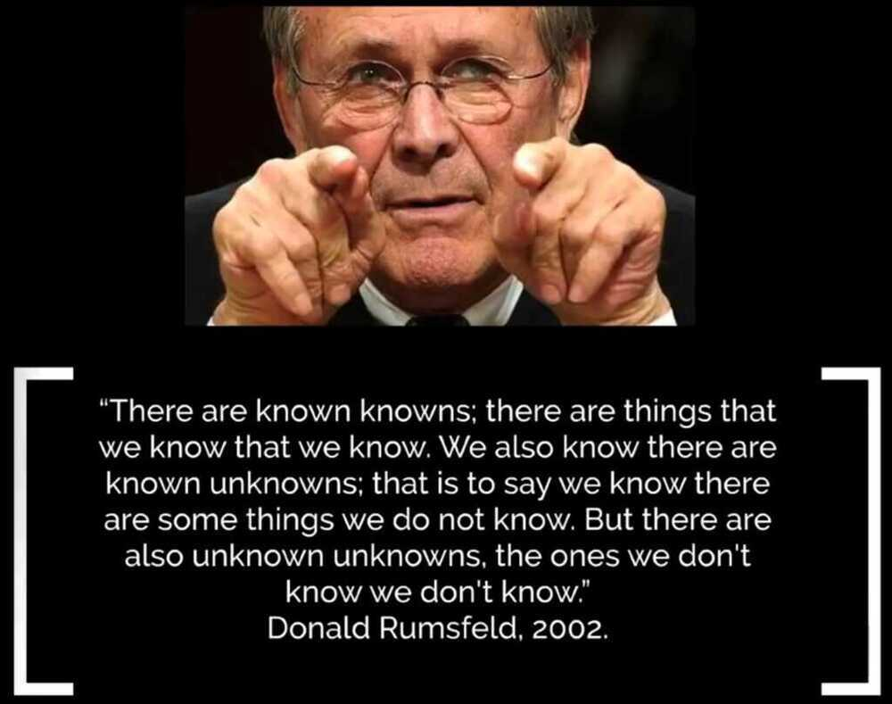

# Business / Management

97.42% is a fictional number that figuratively conveys the idea of a significant percentage

Vision + Values = Mission

If the rate of change in outside world is greater than the organization, then the end is near

Dress for the job you want, not the job you have

If you fail to plan, you plan to fail

Accountability without autonomy doesn't work i.e. I want you to improve X but you cannot change anything

Customers are investors, employees are assets

Short term gain vs long term pain

If you are not paying, you are the product

For every rule you have an exception and for every exception you have a rule

In the long-run, prioritization beats efficiency

In Weak Companies, best politics wins. In Strong companies, best ideas wins.

In economic matters, the road to hell is paved with good intentions

Competition gives people access to the best the world has to offer

What gets measured gets controlled and improved

Buck stopper - Buck stops here

All rumors are false until officially denied.

Don’t look for the needle in the haystack. Just buy the haystack! -- John C. Bogle

### 22 sentences that will further your career more than a Harvard MBA

1. Done is always better than perfect
2. Network is your ONLY shortcut
3. Sell before you fulfill
4. Knowledge compounds faster than money
5. The best time to build a personal brand was 10 years ago, the next best time is now
6. What you work on is more important than how hard you work
7. The internet is the only school you need, and it's free
8. Don't fight uphill battles, start your business in a high demand market
9. Practice > theory (get your hands dirty)
10. People aren't computers, manage them by understanding their feelings
11. Steer clear of landmines by learning from those ahead of you
12. Leadership should be taught, never assumed
13. The quickest way to get rich is to make other people rich
14. Avoid complacency by keeping the fire lit under you ass, even when your business is doing great
15. Risk is unavoidable, so calculate cautiously
16. If you love what you do, you'll outwork your competitors without even trying
17. Your next handshake could be your next million, put yourself out there
18. Dress, move, and talk like the founder you strive to be
19. Ads get customers in the door, but it's your brand that invites them to stay for dinner
20. Markets are always changing, innovate or be left-behind - or better yet, pioneer the evolution
21. Stop guessing, start split testing
22. Stephen Kings's quote, "kill your darlings" applies to more than just writing, never get attached to any idea

Your strategy is not what you say it is. Your strategy is where you put your resources. --From Move by Patty Azzarello

Don't raise your voice, improve your argument --desmond tutu

Don't argue; try it. If it works, let it spread -- Deng Xiaoping

Action may not always bring happiness, but there is no happiness without action. - Benjamin Disraeli, former British Prime Minister

We always overes- timate the change that will occur in the next two years and underestimate the change that will occur in the next ten. Don't let yourself be lulled into inaction. - **Bill Gates**

Great companies are composed of three ingredients: [the people, the product and the profit](https://www.intercom.com/blog/lessons-learned-from-scaling-a-team/#ingredients). If you can get the people right, you'll get the product; if you can get the product, you'll get the profit.

No matter how it looks at first, it's always a people problem --[Gerald M. Weinberg](https://www.amazon.com/Secrets-Consulting-Giving-Getting-Successfully/dp/0932633013)

A person who knows how may always have a job, but the person who knows why will always be his boss. -- From How Successful People Think by John C. Maxwell

If it is not on your schedule, it doesn't exists

People follow incentives, not advice.

The best arguments in the world won't change a single person's mind. The only thing that can do that is a good story.

What if you train your employee, and he leaves. What if you don't train your employees and he stays.

We overestimate short-term effects and underestimate long-term effects. -- Amara's Law

The fact of the matter is that the world is very complicated, which is why it's smart to get as many perspectives as possible. -- From Factfulness by Hans Rosling

Victor hugo once said, "No power on earth can stop an idea whose time has come".

If everything is a priority, then nothing is a priority.

Don't try to find a solution to a problem that doesn't exist

Don't find a solution, and then try to make a problem to fit that (cryto)

Isn't this a solution begging for a problem? A problem, which by the way doesn't even exist right now

When failure is reversible, act quickly.

When failure is irreversible, think carefully.

Power is not Corruption, Power is a Possibility -- Sadhguru

The 5R's of Curbing Corruption

1. Reduce - Corruption
2. Refuse - Bribe
3. Reuse - Honesty
4. Reframe - Laws
5. Remember - Corruption is a curse. Let's fight against it.

One man's ceiling is another man's floor

If all you have is a hammer, everything looks like a nail.

Never catch a falling knife

The reputation of a thousand years may be undermined by the conduct of one hour

Failing to plan is, planning to fail.

Don't find customers for your products, find products for your customers -- Seth Godin

Not doing something will always be faster than doing it.

If you are leading change in an organization, you're going to try some things that will work and some things that won't work.

The success of every business rests on its ability to use technology, and in particular software and data, to create a competitive advantage

Those who cannot remember the past are condemned to repeat it.

I am a member of the team, and I rely on that team. I defer to it and sacrifice for it. Because the team, not the individual, is the ultimate champion

A jack of all trades is a master of none, but oftentimes better than a master of one

Qualifications only give you entry. It is competence that ultimately works. -- Sadhguru

There are some things you can't learn from others. You have to pass through the fire. -- Norman Douglas

Reputation = How much you stand-out + competence.

The most exciting phrase to hear in science, the one that heralds discoveries, is not 'Eureka!' but 'Now that's funny...' -- Isaac Asimov

We need a government, alas, because of the nature of humans -- P.J. O'Rourke

Everyone can do whatever they want, as long as it doesn't harm anyone else.

Your right to swing your arms ends just where another person's nose begins.

Give a man a fish and you feed him for a day. Teach a man to fish and you feed him for a lifetime;
Teach an AI to fish and it will teach itself biology, chemistry, oceanography, evolutionary theories.. and fish all the fish to extinction.

You don't need to predict it to prevent it -- Miller

Deficits matter, but what matters is what you're spending it on. -- Mazzucato

Before you can change how you act, you have to change how you think

In a complex world, constant experiments and relentless incremental progress win the day

There are no facts, only interpretations -- Friedrich Nietzsche

If you want a team to go fast, a feeling of momentum is more important than a sense of urgency. -- Elisabeth Hendrickson

As such, there is no right decision in life. If you make a decision and put your everything into it, it will turn out wonderfully. -- Sadhguru

The best way to predict the future is to invent it. -- Alan Kay

Rome wasn't built in a day, but they were laying bricks every hour.

We apparently only use about 20% of the things we own

Proper office ergonomics can increase productivity by 11%

To win one hundred victories in one hundred battles is not the acme of skill. To subdue the enemy without fighting is the acme of skill. -- Sun Tzu, The Art of War

Military strategistSun Tzuon preparation:

"The art of war teaches us to rely not on the likelihood of the enemy's not coming, but on our own readiness to receive him; not on the chance of his not attacking, but rather on the fact that we have made our position unassailable.

Nothing is certain in life but death and taxes

Being a leader does not mean dominating the situation. It means empowering people to do what they would not have imagined possible. -- Sadhguru

There is nothing so useless as doing efficiently that which should not be done at all.

Hiring is hard enough, don't make it harder

Supreme court is supreme, but not infallible.

"When failure is expensive, plan carefully.

When failure is cheap, act quickly."

Do not wait. If there is something you wish to do, go do it.

Death comes for busy people too. It will not pause and return at a more convenient time.

Aadhaar is like salt. You need to have it in everything. Else the thing is bland and incomplete.

But by itself, it's useless. It can't be eaten. It has no power.

And it means nothing.

Aadhaar is salt.

ZEV's - Zero Economic Value citizens

Q. How do you become a millionaire in the airline industry?

Ans. Start as a billionaire and buy an airline.

Nothing is a panacea

If the only tool you have is ahammer, you treat everything as if it were anail. -- Abraham Maslow

Nothing someone says before the word "but" really counts

Each day is a new battle to say yes to what matters and say no to what doesn't. Focus is a practice.

Don't push growth; remove the factors limiting growth.-- Peter Senge

Be greedy when others are fearful, be fearful when others are greedy -- Warren Buffet

Opportunities come infrequently. When it rains gold, put out the bucket, not the thimble.-- Warren Buffet

"The trend is you friend". Well, the moving averages help you identify this friend.

The best way to get the attention and respect of exceptional people is to do exceptional work. Like attracts like.

Tell me how you measure me, and I will tell you how I will behave. -- Eliyahu Goldratt

There are decades where nothing happens; and there are weeks where decades happen.

The problem of the average: This is common sense, but it helps to establish a key point. The average is a useful concept -- but it can not give a good idea of the underlying values. Here is a popular statement: Someone can put one of my legs in a freezer and another leg in a heated oven. On average, this should be comfortable!

Better be without sense than misapply it as you do.

How to 80/20 your work:

1. Make a list of the 10 things you spend the most time on.
2. Circle the two that truly drive your results. Do more of those.
3. Look at the others. Eliminate ruthlessly. Automate or outsource what you can. Press pause on the rest.
4. Repeat.

"Time spent working hard is often better spent identifying where the bottleneck is located.

Working hard on the wrong thing leads to frustration, not progress."

Averaged across industries, a business in its 25th year has roughly the same probability of dying as it did in its 10th year

there is no age at which business gets easy.

"Keep running" just to stay in place is how evolution works. It's how business and investing work, too.

An estimate is nothing more than a well educated guess.

A minute spend in planning will save 10 minutes in execution.

Implementation is the Key

Sorry, the shit has hit the fan, we will clean up as best as we can.

It does not make sense to hire smart people and then tell them what to do : we hire smart people so they can tell us what to do.

Start every big problem by starting off with two questions

- Who has dealt with this problem well
- What can we learn from them

Rowing harder doesn't help if the boat is headed in the wrong direction. -- AntiPatterns in Project Management

Coming together is a beginning. Keeping together is progress. Working together is success -- Henry Ford

There is big, bigger, biggest. And then there is LIC

A list of 10 principles from an early internal memo at Nike, long before the company grew into a global brand. This list is rumored to have been written in 1977 by the first head of marketing, Rob Strasser, and was shared decades later by lead designerMarkus Kittner.

1. Our business is change.
2. We're on offense. All the time.
3. Perfect results count - not a perfect process. Break the rules: fight the law.
4. This is as much about battle as about business.
5. Assume nothing. Make sure people keep their promises. Push yourselves push others. Stretch the possible.
6. Live off the land.
7. Your job isn't done untilthejob is done.
8. Dangers:

   - Bureaucracy
   - Personal ambition
   - Energy takers vs. energy givers
   - Knowing our weaknesses
   - Don't get too many things on the platter

9. It won't be pretty.
10. If we do the right things we'll make money damn near automatic.

Know your enemy and know yourself and you can fight a hundred battles without disaster. -- Sun Tzu (The Art of War)

Confidence is no substitute for clarity. To be successful, you need clarity, not confidence. -- Sadhguru

Once you have no problem making mistakes, admitting them, and correcting them, hardly any mistakes will happen. -- Sadhguru

Before you begin, think as if you are a lazy person. Imagine the competition will work harder. Your only chance is a better strategy.

After you begin, work as if you are a dumb person. Imagine the competition is smarter and more talented. Your only chance is to outwork them.

Modeling a behavior is stronger than telling someone to act differently.

Kids imitate the habits of their parents. Teammates match the competitive energy of one another. Employees learn to manage like their supervisor.

Be the standard and others will raise their standards.

You can do so much in ten minutes' time. Ten minutes, once gone, are gone for good. Divide your life into 10-minute units and sacrifice as few of them as possible in meaningless activity. -- **Ingvar Kamprad**, the founder of IKEA, on the value of time

It is the ability to bring out the best in others that makes you a leader. -- Sadhguru

In the long run, the way you treat your time is the way others treat it too.

Financial projection appears to be a science that makes astrology look respectable

Instead of working toward retirement, work toward your ideal lifestyle. There is usually a path to get there in a few years instead of a few decades.

If the plan doesn't work, change the plan, but never the goal.

Smarter people take more risks

Imagination is more important than Knowledge -- Albert Einstein

Whatever problem you're struggling with is probably addressed in some book somewhere written by someone a lot smarter than you. -- Ryan Holiday

"The sooner you make a choice, the sooner you can make an adjustment."

"There are three types of people in the world: Those who are immovable, people who don't get it, or don't want to do anything about it; there are people who are movable, people who see the need for change and are prepared to listen to it; and there are people who move, people who make things happen." - Benjamin Franklin

If I had asked the public what they wanted, they would have said a faster horse. -- Henry Ford

Predictability is so unpredictable that you cannot even predict why it is unpredictable -- someone predictably unpredictable

The best properties are rarely for sale.

The best employees are rarely job hunting.

The best clients are rarely shopping.

The best option is usually off the market. Most people think this means you can't have it. What it really means is you have to go find it and sell yourself

More effort is wasted doing things that don't matter than is wasted doing things inefficiently.

Elimination is the highest form of optimization.

A recipe for getting more out of what you read:

Start more books. Quit most of them. Read the great ones twice.

Saying no saves you time in the future. Saying yes costs you time in the future.

No is like a time credit. You can spend that block of time in the future.

Yes is like a time debt. You have to repay that commitment at some point.

No is a decision. Yes is a responsibility.

Stuck between a rock and a hard place. Damned if you do, damned if you don't.

A Leader is one who knows the way, goes the way and shows the way

People don't leave job, People leave managers.

Every minute spent in planning, saves ten minutes in execution

"The things you take pride in are the same things you are likely to be biased about.

How might the things you take pride in be misleading you?

The tighter you cling to your current identity, the harder it becomes to grow beyond it."

I'm not interested in whether the glass is half empty or half full. I'm interested in figuring out how to fill the glass.

In many cases, improvement is not about doing more things right, but about doing less things wrong.

Don't look for things to add. Look for things to eliminate.

From good to great

James Collins, the best-selling author, and business guru makes a telling remark in the opening paragraph of his book 'Good to great'---"Good is the enemy of great. We don't have great schools, principally because we have good schools. We don't have great governments, principally because we have good governments. Few people attain great lives, in large part because it is just so easy to settle for a good life. The vast majority of companies never become great, precisely because the vast majority become quite good - and that is their main problem."

Profit is not an event. Profit is a habit. - Mike Michalowicz

I need no help with increasing my talent pipeline -- said no recruiter ever

It was like riding a tiger, not knowing how to get off without being eaten -- Byrraju Ramalinga Raju

There is a difference between moving fast and rushing.

You can move fast and be thoughtful. When you rush, you sacrifice thoughtfulness.

Conversely, when you are thoughtful but not moving fast, you are overthinking it. Procrastination in disguise.

Don't rush, but don't wait.

"Following through is related to focus, self-discipline, action, and persistence, but it is not synonymous to any of them. Rather, it is a composite of all of them." - Peter Hollins

Investor Dean Williams once said, "Expertise is great, but it has a bad side effect. It tends to create an inability to accept new ideas."

Never attempt to win by force, what can be won by deception

Financial projection appears to be a science that makes astrology look respectable -- Burton Malkiel

Being right is the enemy of staying right because it leads you to forget the way the world works. -- Jason Zweig

Simple is nearly always better. But if it's going to be complicated, then make sure the problem is worth the complexity. A great deal of time is wasted creating complex solutions to relatively unimportant problems.

Server the best, or you are just like the rest

My capex is your barrier to entry

Remember: customers rarely care about how novel your technology is, only what problems it solves for them. Never lose sight of that as a startup.

Pessimists sound smart. Optimists make money

"Remove the branches of a thorn bush today and you'll avoid a scrape this year. But next year, you'll face the same problem again.

Remove the root of the bush today, and the entire plant will die.

Are you solving problems at the branch level or the root level?"

There's many a slip between the cup and the lip

There's many a slip 'twixt the cup and the lip

Success breeds complacency, complacency breeds failure. Only the paranoid survive -- Intel's ex-CEO, Andrew Grove

Wonderful businesses come with a curse of three. These are: surplus cash, surplus time, surplus confidence.

Tomorrow doesn't come randomly and a large part of it can be predicted today

Throw money into the sea if you must, but count it first.

Chinese proverb that goes “The person who says it cannot be done, should not interrupt the person doing it.

A great founder is one who creates a company and then works hard to make the company survive without them.

Working IN the business vs working ON the business.
Working IN means working on day to day tasks like delivery product/service, answering mails/questions, etc
Working ON means taking a zoomed out approach and thinking: what systems could we implement to do this more efficiently in future? What tasks can be eliminated, automated or outsourced? Where should we be focusing more resources in order to achieve our goals faster?

If your business can't run without you - if you can't safely leave your business for a few weeks - you don't really have a business; you have a job.
