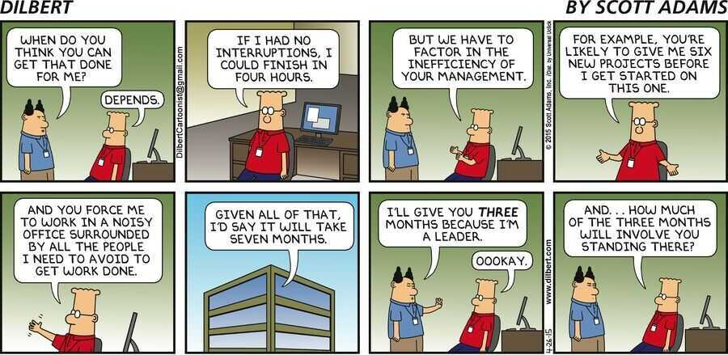
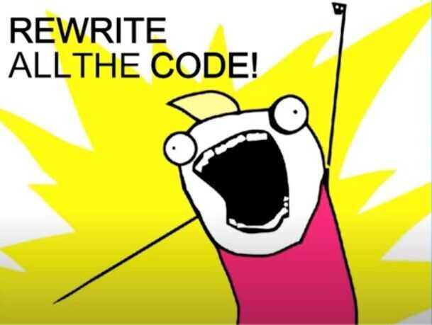
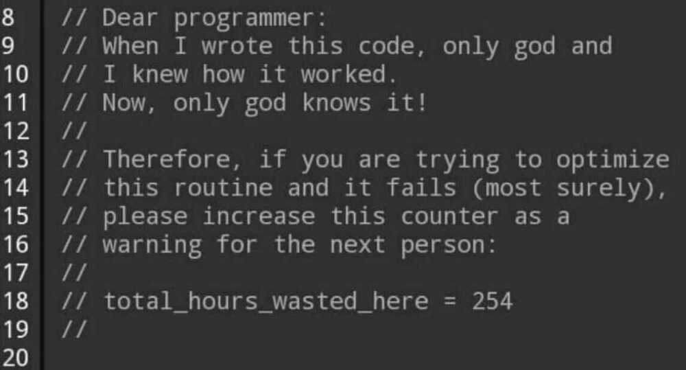

# Coding

Only ~0.3% of the world's population today can code, and this small group has built all of the world's ~6.3 million mobile apps. Which means that 99.7% of the world fully depends on 0.3%, which is huge

In the next 5 years, a total of ~500 million apps are likely to be built of which 450 million are likely to be built using no/low-code platforms.

Switch away from the approach of code-by-default and instead **code-when-necessary**

**There are no solutions, only tradeoffs**

**I don't know, But I will find out**

**See one, do one, teach one**

**Everything fails, all the time**

**garbage in, garbage out (GIGO)**

No hug and kisses | only bug and fixes

A framework is only as good as the developer that is using it

If you're the smartest person in the room, you're in the wrong room.

In God we trust. All others must bring data.

Once you really understand programming, than these languages are mainly syntax, and you can pick-up syntax a lot faster than you can underlying concepts. Now knowing how to solve the problems takes years to learn. -- [Corey Schafer](https://www.youtube.com/channel/UCCezIgC97PvUuR4_gbFUs5g) YouTuber

Correct by Construction

Correctness by Construction

Algorithms: a common language for nature, human, and computer. -- Avi Wigderson

Hofstadter's Law: It always takes longer than you expect, even when you take into account Hofstadter's Law.

Classes should be immutable unless there's a very good reason to make them mutable... If a class cannot be made immutable, you should still limit its mutability as much as possible.

The generation of random numbers is too important to be left to chance. -- (R)obert R. Coveyou

Those who cannot remember the past are condemned to repeat it. -- (D)ynamic Programming

Shipping beats perfection. --Khan Academy's Development Mantra

**The best code is that you never write. The worst code is the code you write two or more times**

The best code is no code at all, and the most effective programmer is the one who knows when not to code.

One of my most productive days was throwing away 1000 lines of code.--Ken Thompson

80 percent of data science is preparing data, and the other 20 percent is complaining about preparing data.

One person's 'paranoia' is another person's 'engineering redundancy.' -- Marcus J. Ranum

"A good programmer is someone who always looks both ways before crossing a one-way street." - Doug Linder

Remember that there is no code faster than no code.

Measuring programming progress by lines of code is like measuring aircraft building progress by weight -- Bill Gates

**Rating in google play store - This app is very well architected (to all developers)**

Computers are incredibly fast, accurate, and stupid. Humans are incredibly slow, inaccurate, and brilliant. Together they are powerful beyond imagination.

Knowing when not to code is possibly the most important skill a programmer can learn.--[The Art Of Readable Code](https://www.amazon.com/Art-Readable-Code-Practical-Techniques/dp/0596802293)

First learn computer science and all the theory. Next develop a programming style. Then forget all that and just hack. -- George Carrette

One of the antidotes to complexity is the power ofabstraction.

"The only people who have anything to fear from free software are those whose products are worth even less." - David Emery

One does simply not push a code change to mitigate an outage caused by a previous code change.

Robust systems are not built overnight: they are built through continuous iterations.

All problems in computer science can be solved by another level of indirection, except for the problem of too many layers of indirection. -- David J. Wheeler

Any code of your own that you haven't looked at for six or more months might as well have been written by someone else. -- Eagleson's Law

The first 90% of the code accounts for the first 90% of the development time. The remaining 10% of the code accounts for the other 90% of the development time. -- Tom Cargill

Before you can make things better, you have to stop making them worse

Thinking is also work

As soon as we started programming, we found to our surprise that it wasn't as easy to get programs right as we had thought. Debugging had to be discovered. I can remember the exact instant when I realized that a large part of my life from then on was going to be spent in finding mistakes in my own programs." - Maurice Wilkes

Good programmers use their brains, but good guidelines save us having to think out every case. - Francis Glassborow

Everyone but you writes terrible code.

action without thought is a waste of effort

No amount of testing can prove a software right. A single test can prove a software wrong. - Amir Ghahrai

Something that is untested is broken.

Debugging is twice as hard as writing the code in the first place. Therefore, if you write the code as cleverly as possible, you are, by definition, not smart enough to debug it. -- Brian Kernighan, co-creator of the C language

The value of a prototype is in the education it gives you, not in the code itself. -- Alan Cooper

WYSIWYG (What You See Is What You Get)

Clarity is the prerequisite and foundation for good work

Today, most software exists, not to solve a problem, but to interface with other software. -- Ian Angell

Technical skill is mastery of complexity, while creativity is mastery of simplicity. - Christopher Zeeman

Perfection is finally attained not when there is no longer anything to add, but when there is no longer anything to take away. -- Antoine de Saint-Exupéry

The highest level of mastery is simplicity.

Most information is irrelevant and most effort is wasted, but only the expert knows what to ignore.

To err is human. But to really foul things up, you need a computer. -- Paul Ehrlich

Go **fsck** yourself

Data matures like wine, Application code matures like fish

Any fool can write code that a computer can understand. Good programmers write code that humans can understand. -- Martin Fowler

There are only two hard things in Computer Science: cache invalidation and naming things -- Phil Karlton

The hardest part of solving a problem is accurately defining it.

In theory there is no difference between theory and practice. In practice there is. - Yogi Berra

e = mc² (errors = more code ^2)

It's not about finding the best framework, it's about finding the right framework.

A complex system designed from scratch never works and cannot be patched up to make it work. You have to start over, beginning with a working simple system -- (S)ystemantics

Scalability and fault-tolerance need to be designed from day one.

A complex system that works is invariably found to have evolved from a simple system that works.

History repeats itself because nobody was listening the first time

A ship in port is safe, but that's not what ships were built for. -- Grace Hopper

If someone says NoSQL missing join, you are missing the point.

Good judgment comes from experience. Experience comes from bad judgment. -- unknown

Walking on water and developing software from a specification are easy if both are frozen. -- Edward V. Berard

Act in haste and repent at leisure. Code too soon and debug forever. -- Dr. Raymond Kennington

The reigning data processing philosophy is to save all of yesterday's data today, since it is unknown what could be important tomorrow.

**RTFM - Read the Fucking Manual**

We deliver yesterday's insights, tomorrow! -- ETL Process

Any intelligent fool can make things bigger and more complex. It takes a touch of genius -- and a lot of courage -- to move in the opposite direction. -- Ernst Schumacher

Don't worry if it doesn't work right. If everything did, you'd be out of a job -- Mosher's Law of Software Engineering

I have spend three hours refactoring that component but it will save us weeks of debugging later on.

We've invested a lot of time in this feature but I'm not sure it's worth the cost.

Planning is everything. Plans are nothing. -- Helmuth von Moltke

Simplicity is prerequisite for reliability. -- Edsger Dijkstra

If you want to truly understand something, try to change it." -- Kurt Lewin

You can have data without information, but you cannot have information without data." -- Daniel Keys Moran

"People worry that computers will get too smart and take over the world. But the real problem is that computers are too stupid and they've already taken over the world." -- Pedro Domingos

[Douglas Adams' Rules of Technology](https://fs.blog/2014/05/douglas-adams-reactions-technology-over-time/)

1. Anything that is in the world when you're born is normal and ordinary and is just a natural part of the way the world works.

2. Anything that's invented between when you're fifteen and thirty-five is new and exciting and revolutionary and you can probably get a career in it.

3. Anything invented after you're thirty-five is against the natural order of things.

"Programming without an overall architecture or design in mind is like exploring a cave with only a flashlight: You don't know where you've been, you don't know where you're going, and you don't know quite where you are." -- Danny Thorpe

"Looking at code you wrote more than two weeks ago is like looking at code you are seeing for the first time." -- Dan Hurvitz

Regardless of what we discover, we understand and truly belive that everyone did the best job they could, given what they knew at the time, their skills and abilities, the resources available, and the situation at hand -- Sprint retrospective

We shall do a much better programming job, provided we approach the task with a full appreciation of its tremendous difficulty, provided that we respect the intrinsic limitations of the human mind and approach the task as very humble programmers. -- Alan Turing

If you have to manually change something in your production environment, you are putting yourself at risk.

Manual processes are risk without reward.

The first 90% of the code accounts for the first 90% of the development time. The remaining 10% of the code accounts for the other 90% of the development time. - Cargill's Rule

With a sufficient number of users of an API, it does not matter what you promise in the contract: all observable behaviours of your system will be depended on by somebody -- Hyrum's Law

Less than 10% of the code has to do with the ostensible purpose of the system. The rest deals with input-output, data validation, data structure maintenance, and other housekeeping. -- Mary Shaw

Computer programming is an art because it applies accumulated knowledge to the world, because it requires skill and ingenuity, and especially because it produces objects of beauty. Programmers who subconsciously view themselves as artists will enjoy what they do and will do it better." -- Donald Knuth

It is always important to understand the semantics of data you are working with.

Programs must be written for people to read, and only incidentally for machines to execute. -- Hal Abelson

"The only truly secure system is one that is powered off, cast in a block of concrete and sealed in a lead-lined room with armed guards." -- Gene Spafford

"Beginner = ignorant simplicity

Intermediate = functional complexity

Advanced = profound simplicity"

**Scalability Paradox - Speed vs. Scale**

There's an old Twitter joke that every app evolves until it eventually becomes a chat app. The 2020 version of that joke is that every app evolves until it eventually becomes a bank.

Hardware eventually fails. Software eventually works. -- Michael Hartung

"It's not at all important to get it right the first time. It's vitally important to get it right the last time." -- Andrew Hunt and David Thomas, in the classic book The Pragmatic Programmer

"The golden rule of level design - finish your first level last." - John Romero (co-creator of DOOM)

If you never copy best practices, you'll have to repeat all the mistakes yourself.

If you only copy best practices, you'll always be one step behind the leaders.

**"Knowledge without practice is useless, and practice without knowledge is dangerous."**

A user interface is like a joke. If you have to explain it, it's not that good. -- Martin LeBlanc

"Any app that can be written in JavaScript will eventually be written in JavaScript." -- Atwood's Law

"A secure system is one that does what it is supposed to do, and nothing more." -- John B. Ippolito

"Security is always excessive until it's not enough." -- Robbie Sinclair

"You can have data without information. But you cannot have information without data." -- Daniel Keys Moran

"The fastest algorithm can frequently be replaced by one that is almost as fast and much easier to understand." -- Douglas W. Jones

**We don't have time to do it right**

**Do you have time to do it twice?**

There are only two kinds of programming languages: the ones people complain about and the ones nobody uses." ― Bjarne Stroustrup, creator of the C++ programming language

**Rule of Three**

- 1st time? Just do it.
- 2nd time? Wince and duplicate.
- 3rd time? Refactor!

First do it, then do it right, then do it better.

"It's easy to shoot your foot off with Git. But it's also easy to revert to a previous foot, then merge it with your current leg." -- Jack William Bell, Software Engineer and Git user

"To iterate is human. To recurse is divine." -- L Peter Deutsch, computer scientist and mainframe programmer

"Any sufficiently advanced technology is indistinguishable from magic." -- (C)larke's Third Law

"Nobody sets out to create a mission-critical spreadsheet. They just happen." -- Felienne Hermans, Scientist and Computer Science Professor

"I know a lot about artificial intelligence. But not as much as it knows about me." -- Dave Waters, Geology Professor and Machine Learning Enthusiast

Cryptography is typically bypassed, not penetrated -- Adi Shamir

I love my slow database -- said no one ever

"An individual block of code takes moments to write, minutes to debug, and can last forever without being touched again. It's only when you visit code written yesterday that having code written in a clear, consistent style becomes extremely useful. Understandable code frees up your mental bandwidth from having to puzzle out inconsistencies, making it easier to maintain and enhance projects of all sizes." -- Daniel Roy Greenfeld, Python Django developer and author

"One person's paranoia is another person's engineering redundancy." -- Marcus Ranum, Network Security Researcher

It's not a ML project, it's a software project with ML in it

I think the lack of extra crap is a feature.-- Craig Lam

"Smart data structures and dumb code work a lot better than the other way around." -- Eric S. Raymond, developer and author of the pioneering book on open source, "The Cathedral and the Bazaar"

"Python is the most powerful language you can still read." - Paul Dubois, physicist and lead developer of NumPy

A database administrator walks into a NoSQL bar. But he turns and leaves because he couldn't find a table. -- Erlend Oftedal, security researcher and maintainer of Retire.js

"Don't worry about people trying to steal your design work. Worry about the day that they stop." -- Jeffery Zeldman, Developer, Designer, and co-founder of the Web Standards Project

The first rule of any technology used in a business is that automation applied to an efficient operation will magnify the efficiency. The second is that automation applied to an inefficient operation will magnify the inefficiency -- (B)ill Gates

"Linux only became possible because 20 years of operating system research was carefully studied, analyzed, discussed, and thrown away." -- Ingo Molnar, Prolific Linux Contributor from Hungary

Programming without an overall architecture or design in mind is like exploring a cave with only a flashlight: You don't know where you've been, you don't know where you're going, and you don't know quite where you are." -- Danny Thorpe, Software Engineer and major contributor to the Delphi programming language

"When I am working on a problem, I never think about beauty. I think only of how to solve the problem. But when I have finished, if the solution is not beautiful, I know it is wrong." -- Buckminister Fuller, Architect and Systems Theorist

The pinnacle of game design craft is combining perfect mechanics and compelling fiction into one seamless system of meaning." -- Tynan Sylvester, Developer and Indie Game Designer

I'm old-fashioned. I like my CSS seperated from my HTML; my HTML seperated from my JS; my JS separated from my CSS. I like my JS layer only added when I need it, usually progressively. CSS added progressively on top of semantic markup. I don't fight the C in CSS, I embrace it." -- Sara Soueidan, Software Engineer and Accessibility Advocate

During the production of the movie Toy Story 2, an unnamed Pixar employee was doing some routine data cleanup. They wanted to delete some of their files. So they typed this into their command line: bin/rm -r -f *. But they didn't realize that they were running the command inside the server's root folder. Animators knew something was wrong when the files they were working on started vanishing. They rushed over and unplugged the computer. But it was too late. 90% of the Toy Story 2's files had been deleted. The team was going to have to completely restart the $100,000,000 project. Luckily, one of their animators was working from home after having a baby. She had a 2-week old backup of the data sitting on her desk. After she carefully drove her computer to the office, they were able to restore the database.

A complex system that works is invariably found to have evolved from a simple system that worked. The inverse proposition also appears to be true: A complex system designed from scratch never works and cannot be made to work. You have to start over, beginning with a working simple system

A very simple but particularly useful technique for finding the cause of a problem is simply to explain it to someone else. The other person should look over your shoulder at the screen, and nod his or her head constantly (like a rubber duck bobbing up and down in a bathtub)." -- Andrew Hunt and David Thomas, authors of the 1999 book The Pragmatic Programmer

https://www.freecodecamp.org/news/rubber-duck-debugging

Composability is to software as compounding interest is to finance

"Changing random stuff until your program works is 'hacky' and a 'bad coding practice'. But if you do it fast enough, it's called 'Machine Learning' and pays 4x your current salary." -- Steve Maine, Software Engineer

Computer Science is no more about computers than astronomy is about telescopes." -- Edsger Dijkstra, Mathematician, Computer Scientist, Turing Award Winner

Games were not just a diversion, I realized. Games could make you feel. If great literature could wield its power through nothing but black squiggles on a page, how much more could be done with movement, sound, and color?" -- Sid Meier, Game Developer and creator of the Civilization strategy game series

Writing code should be the last option because everyone line of code once created becomes a liability to the development team. Once you create code, it must be maintained and adds to the complexity of the code base.

Spend the first 3 years of your career ensuring these to accelerate your growth

- become proficient in at least one stack
- understand infrastructure and architecture
- understand how your work fits into the big scheme
- show extreme ownership and lead
- help others succeed

"Software engineering is programming integrated over time" - That’s an interesting statement from Software Engineering at Google which I agree with. When you are sitting alone, writing the code for your side project as a habit, it's programming. All thoughts are encapsulated in your mind. But when you and your colleagues work on one project, discuss how to write the code correctly, trade-off between scalability and delivery, how to scale the engineering team and product by hiring and creating standard processes…etc, at Money Forward i, we call all that engineering. -- Tran B.V. Son, CTO @ money forward i

You can often fix something that's been broken, but you can't fix something that never worked in the first place.. -- Mira Kirshenbaum

Any intelligent fool can make things bigger, more complex, and more violent. It takes a touch of genius - and a lot of courage - to move in the opposite direction. -- EF Schumacher

There are only two industries that call their customers 'users': illegal drugs and software -- Edward Tufte

[GitHub - mame/quine-relay: An uroboros program with 100+ programming languages](https://github.com/mame/quine-relay)

Only ugly languages become popular. Python is the one exception. - Donald Knuth

Software engineering is not a zero-sum game.
One hour of work is not equal to one hour of productivity.
On some days, one hour of work is equivalent to the job of an entire day.
On other days, a whole day of work doesn't even worth one hour.

You can either code fast or produce fast code. You cannot do both. -- Hussein Nasser
