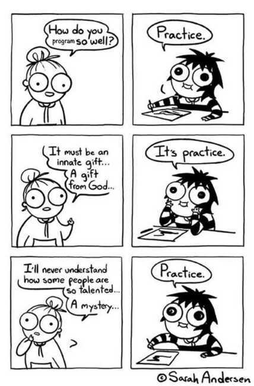

# Motivation

**War Cry - Give up nahi karna hai**

**Watch great leaders motivational videos** - oprah wimfrey

Better try then cry

<https://dariusforoux.com/inspirational-quotes>

<https://www.scotthyoung.com/blog/2020/11/02/motivation>

[Principles For Success in 8 Episodes](https://www.youtube.com/playlist?list=PLykIL_1_MFWkWDDgvdZ6L7rsvKCKl-39j)

Motivation comes after you start the work and not before

[How to Trick Your Brain to Like Doing Hard Things -- Atomic Habits by James Clear](https://www.youtube.com/watch?v=o7w5r5PfBKo)

[My fitness journey - Ankur Warikoo | How getting 6 pack abs saved my life | Fitness motivation Hindi](https://www.youtube.com/watch?v=Y2ZXRYeNf6E)

[Motivational Speech with Epic Music | Greg Plitt](https://www.youtube.com/watch?v=DmPgYsb1jX0&ab_channel=Muhud)

One of the most important keys to achievement is having the drive and discipline to do what you know you should do, especially when you don't feel like doing it. Your ability and willingness to do the difficult thing makes life easier.

Deliberate Practice

Grit is passion and perseverance for long term goals

Do things, learn from them, repeat

Invest in Yourself

No self doubt (be bold)

Duty is joy

DREAM BIG

All things start small

Little Big Things

Getting Started

Hope is a waking dream - Nelson Mandela

Does this activity fill me with energy or drain me of energy?

What are you working on when time fades away?

You have to dream before your dreams can come true -- Maulana Kalam Azad

The antidote to a bad day is a good workout.

The more you move, the easier it is to keep moving. Maintain the momentum.

Many people wish they started sooner. Almost nobody wishes they started later.

If you work, inspiration will come.

If you wait, inspiration will too.

Entrepreneur's mind.

Athlete's body.

Artist's soul.

Doomed if you do, Doomed if you don't

It always seems impossible until it's done -- Nelson Mandela

If not now, when, if not me then who

If I think I have won, the game is over for me!

"Just have one good day. Then repeat."

Whether it is easy or hard, never lose your focus as to where you want to go. -- Sadhguru

Happiness starts with you -- not with your relationships, job, or money.

The more disciplined your environment is, the less disciplined you need to be. Don't swim upstream.

Laziness is nothing more than the habit of resting before you get tired -- Jules Renard

Motivation comes and goes. If you want to do something consistently, then don't pick a level of difficulty that requires great motivation.

Make it easy enough and simple enough that you'll do it even when you don't feel very motivated.

To reduce stress, start sooner. To be happy, learn to finish what you started.

The hardest thing to do is leaving your comfort zone. But you have to let go of the life you're familiar with and take the risk to live the life you dream about

It's hard to grow beyond something if you won't let go of it.

Antifragile: Things That Gain from Disorder by Nassim Nicholas Taleb

### Antifragile

- Bones
- Immune System
- Children

[Jonathan Haidt: The Three Terrible Ideas Weakening Gen Z and Damaging Universities and Democracies](https://www.youtube.com/watch?v=B5IGyHNvr7E)

"Raise your ambitions. Lower your expectations.

The higher your ambitions, the bolder your actions.

The lower your expectations, the greater your satisfaction.

Achieve more and be happy along the way."

My success mantra is really straightforward -- set 10X goals, work 10X as hard, provide 10X the value to clients, and make the lives everyone involved better. I think one should keep improving every month since you lose when you stop.

Crying is all right in its way while it lasts. But you have to stop sooner or later, and then you still have to decide what to do -- C.S. Lewis

"Success usually comes to those who are too busy to be looking for it."

Genius - to have a disinterested obsession with something that matters

<http://paulgraham.com/genius.html>

When making plans, think big, When making progress, think small.

Knowledge and Action

what you learn is RIGHT and the actions you take is CORRECT

The foundation of all achievement is action

Most big, deeply satisfying accomplishments in life take at least five years to achieve. This can include building a business, cultivating a loving relationship, writing a book, getting in the best shape of your life, raising a family, and more.

Five years is a long time. It is much slower than most of us would like. If you accept the reality of slow progress, you have every reason to take action today. If you resist the reality of slow progress, five years from now you'll simply be five years older and still looking for a shortcut.

Optimism isn't a belief that everything will go well all the time. It's a belief that despite the inevitable challenges, we will make progress. We need more of it.

### State of Flow - 4 conditions

1. Focus - When your life is on the line, it's easy to focus, belive that what you need to do is very important (when people say that your goal must be bigger than yourself)
2. Challenge skill balance - Challenge must be slightly harder than your skillset, you cannot overwhelm yourself, or too low. Flow exists between 45 degree angle between anxiety and boredom. The only easy day was yesterday. It should be slightly harder from the last time everyday.
3. Clear goals (specific with immediate feedback)
4. Flow is 4 state

   - priming/overwhelm don't attach to frustration
   - release (sex/walk/drive)
   - Learning and memory consolidation state
   - Struggle

### Blogs

<https://theascent.pub/how-to-be-so-disciplined-itll-look-like-you-have-superpowers-e35d695f49d5>

### Motivation

- Peace of Mind
- I have the power to do and to be whatever i wish to do and be.
- No negative thoughts
- No one can limit us but ourselves
- I have courage because I desire it; because I need it; because I use it and because I refuse to become such a weakling as cowardice produces.
- Love what you do and put a smile on your face while doing it
- Find play in everything you doi

### Story

"Todd, what do you think about writing only when you feel motivated? I feel like I always do my best work when I get a spark of creativity or inspiration, but that only happens every now and then. I'm pretty much only writing when I feel like it, which means I'm inconsistent. But if I write all the time, then I'm not creating my best work."

"That's cool," Todd replied. "I only write when I'm motivated too. I just happened to be motivated every day at 8am."

### Psychology of self-motivation

1. Empowerment

   - Can you do it? (self-efficacy)
   - Will it work? (response-efficacy)
   - Is it worth it?

2. C - word

   - Competance
   - Consequences drive us
   - Choice (success seeker)
   - Community (relatedness)

[The psychology of self-motivation | Scott Geller | TEDxVirginiaTech](https://www.youtube.com/watch?v=7sxpKhIbr0E)

### Teddy/Theodore Roosevelt's famous speech titled "The Man in the Arena"

"It is not the critic who counts; not the man who points out how the strong man stumbles, or where the doer of deeds could have done them better. The credit belongs to the man who is actually in the arena, whose face is marred by dust and sweat and blood; who strives valiantly; who errs, who comes short again and again, because there is no effort without error and shortcoming; but who does actually strive to do the deeds; who knows great enthusiasms, the great devotions; who spends himself in a worthy cause; who at the best knows in the end the triumph of high achievement, and who at the worst, if he fails, at least fails while daring greatly, so that his place shall never be with those cold and timid souls who neither know victory nor defeat."

### Relentless by Tim Grover

Tim Groverwas the athletic trainer used by Michael Jordan (and many elite NBA players). Here he is describing the three things he asks of every player:

"I don't care how much you can lift, how fast you can run, how many pull-ups you can do, or whether you can hit a three while blindfolded. There are only three things I ask of every client... Show up, work hard, and listen. That's it. It requires no talent, no special genetics, or any skill whatsoever to show up, work hard, and listen."

He adds:

"When I train my athletes, it's a dictatorship withthree rules: show up, work hard, and listen. If you can do those three things, I can help you. If you can't we have no use for each other. I will bust my ass for you every way possible, but I expect you to do the same for yourself. I'm not going to work harder than you do for your benefit. Show me you want it, and I'll give it to you."

### Qualities that lead to increasing intelligence

1. The curiosity to experiment and explore.
2. The honesty to observe the world as it is, not as you wish it to be.
3. The humility to kill your favorite ideas when you learn something new.
4. The consistency to repeat this cycle for life.

Three common patterns to the problem of motivation:

1. **DRIVE:** You don't have a strong enough drive to learn.
2. **ANXIETY:** You have too strong an aversion to learning.
3. **DISTRACTION:** You have something else that motivates you more.

The fact that you go to the gym even though you don't "need" to... is why you don't need to.

The fact that you save when you could spend... is why you have money to spend.

Your habits create your strength.

When you build a habit, you don't have to spend mental energy deciding what to do -- The Heart to State by David Kadavy

It'sneveras bad as you think it is at the time, and there is always a silver lining -- The Golden rule of career catastrophes

You can make any job a work of art if you put the right energy into it.

Live as if you were to die tomorrow. Learn as if you were to live forever. -- Gandhi

God, grant me the serenity to accept the things I cannot change, The courage to change the things I can, And the wisdom to know the difference. -- Reinhold Niebuhr

Discomfort causes Growth (Growth rings)

Every action you take is a vote for the type of person you wish to become. Start small: a habit must be established before it can be improved. Never miss twice. --Atomic Habits

Courage is not the absence of fear, but the ability to act despite it. -- Archbishop Desmond Tutu

Most people overestimate what they can do in a day, but underestimate what they can do in a year.

People tend to overestimate what can be done in one year and to underestimate what can be done in five or ten years. -- JCR Licklider, co-creator of the internet

**Law of serendipity -** Lady luck favours the one who tries

<https://www.dwarkeshpatel.com/p/annus-mirabilis>

Luck favors the prepared Mind -- Pasteur

We cannot control our luck - good or bad - but we can control our effort and preparation.

Luck smiles on us all from time to time. And when it does, the way to honor your good luck is to work hard and make the most of it.

Being pleasant and having a good attitude is a simple way to become luckier.

Opportunities come through people, and people are more likely to bring opportunities to people they like.

It's hard to win if your attitude adds friction to every interpersonal experience.

If others would think as hard as I did, then they would get similar results -- Newton

The more you know, the more you learn; the more you learn, the more you can do; the more you can do, the more the opportunity

Health is not just being disease-free. Health is when every cell in your body is bouncing with life. -- Sadhguru

Keep your eye on the price

Do everything like it is the last thing you do. There is nothing to hold back, nothing to save for later. -- Sadhguru

Success is a few simple disciplines, practiced every day; while failure is simply a few errors in judgment, repeated every day. -Jim Rohn

It's more important to start, than to succeed

Optimism is the faith that leads to achievement. Nothing can be done without hope and confidence -- Helen Keller

Just because you can't do everything you want to do, doesn't mean you should give up and do nothing -- Jerry Bostick

Fall down seven times, stand up eight

Sport suspends Reality for you, allowing you a breath of fresh air from the rigors of the mundane. -- Sadhguru

Devotion is the highest form of intelligence. When you overflow with sweetness of Devotion, then you function at your Best -- Sadhguru

Everyone has dreams, but how many are willing to stake their life to fulfill that dream? -- Sadhguru

Excellence is not about being better than someone else. Excellence means to function with utmost ease and at your best. -- Sadhguru

To iterate is human, to recurse divine -- L. Peter Deutsch

Perhaps "great', is just "good", but repeatable.

If you cannot do great things, do small things a great number of times".

If you cannot do great things, do small things in a great way -- Napolean Hill

"The only way to become excellent is to be endlessly fascinated by doing the same thing over and over. You have to fall in love with boredom." - Atomic Habits, James Clear

"You cannot escape the responsibility of tomorrow by evading ittoday." -- Abraham Lincoln

It doesn't take any great intellect or qualifications to create something wonderful, just absolute devotion towards what you wish to do. -- Sadhguru

Remember don't HOPE for a fantastic week, hope is not a strategy! Let's make it so! :) --Jim Kwik

Making progress in your health, your work, and your life isn't about learning how to focus and concentrate better, it's about learning how to choose and commit to a specific task. -- James Clear

Don't just sit there, do something. Without action, there is no outcome.

In the long-run (and often in the short-run), your willpower will never beat your environment.

Practice is the price you pay today to be better tomorrow.

The essence of Inner Engineering is to engineer yourself in such a way that every moment of your life is a new possibility. -- Sadhguru

If there is total clarity, there is no need for courage, because clarity will carry you across. -- Sadhguru

An intention will not make things happen. It will only set the direction. You still have to make the journey. -- Sadhguru

There is really no limit as to what one can do. Because capabilities can be constantly enhanced. -- Sadhguru

In a complex world, constant experiments and relentless incremental progress win the day. -- Sadhguru

All that moves will exhaust itself. Only that which is still, is for always. Meditation is essentially to move towards that stillness, to become like the core of existence. -- Sadhguru

Nothing wonderful is ever going to happen unless we actively make it happen. -- Sadhguru

There are two ways of spreading light: to be the candle or the mirror that reflects it.-- Edith Wharton

It's remarkable what you can build if you just don't stop.

It's remarkable the business you can build if you don't stop working.

It's remarkable the body you can build if you don't stop training.

It's remarkable the knowledge you can build if you don't stop learning.

10 Lessons for a Good Life

1. Focus on what you want (not on what you don't want)
2. Do it
3. Show initiative
4. Be contrarian
5. Show up
6. Quit things that don't work (but don't give up)
7. Stay in shape
8. Rest often
9. Ignore pessimists
10. Remind yourself what you want

"If you want to increase your success rate, double your failure rate." - Thomas Watson

Courageous people do idiotic things. Fearful people do little. Fearless people see life as it is and do what is needed. -- Sadhguru

An ant on the move does more than a dozing ox. -- Lao Tzu

Someone says something nasty to you because something nasty is happening within them. They need your love, compassion, or distance. Do not let the spiral of nastiness suck you in. -- Sadhguru

New, challenging situations are possibilities, not problems. A problem would be if nothing new happens to you. -- Sadhguru

Whether you can perform like someone else or not is not the point. The question is, are you exploring the full depth of your potential. -- Sadhguru

Focus is the art of knowing what to ignore.

Three types of Energy

- Mental energy (Meditation)

Your ability to concentrate, focus, work, pay attention, listen,

- Physical energy (Exercise)

Your ability to perform physical tasks.

- Emotional energy (Human interaction)

Your ability to show compassion to yourself and to others.

<https://dariusforoux.com/manage-personal-energy>

Success will come easy once you function at your full potential. -- Sadhguru

When life doesn't challenge you, challenge yourself.

Those who know how to learn... know enough. - - Henry Adams

Do not think about enlightenment -- look at your limitations and how to go beyond them. That's the way to progress. -- Sadhguru

Every action is a vote for the type of person you wish to become.

John Gardner, a politician and a recipient of the 1964 Presidential Medal of Freedom, on how to live a meaningful life:

"There's a myth that learning is for young people. But as the proverb says, 'It's what you learn after you know it all that counts.' The middle years are great, great learning years. Even the years past the middle years. I took on a new job after my 77th birthday -- and I'm still learning. Learn all your life. Learn from your failures. Learn from your successes, When you hit a spell of trouble, ask 'What is it trying to teach me?' The lessons aren't always happy ones, but they keep coming

If every moment of your life, no matter what the nature of your work or your life situations, you can remain playful and exuberant, that means you are liberated. -- Sadhguru

The one who follows the crowds will usually get no further than the crowd. The one who walks alone, is likely to find himself in places no one has ever been.

If you are content with who you are right now, you are not aware who you could be if you are willing to strive. -- Sadhguru

Tough times never last, but tough people do.

Always seeking the unknown and believes the impossible is just lack of trying

"Without hard work, a great strategy remains a dream.

Without a great strategy, hard work becomes a nightmare."

To achieve great things, two things are needed: a plan, and not quite enough time. -- Leonard Bernstein

Patience and perseverance, if we have them, overcome mountains of difficulties -- Mahatma Gandhi

"Someday" is a disease that will take your dreams to the grave with you."-Tim Ferriss

"If the only reason you're not pursuing a dream is because of the length of time it will take to achieve it, you should start right now. Think long-term."

"The difference between motion and action.

Motion:

-talk to a personal trainer

-research your book idea

-explore different types of meditation

Action:

-do 10 squats

-write 1 sentence

-meditate for 1 minute

**Motion feels like progress. Action is progress**

"If you want to build a ship, don't drum up the people to gather wood, divide the work, and give orders. Instead, teach them to yearn for the vast endless sea."

To create anything, you need to invest in yourself.

The most overlooked and underappreciated growth strategy is patience.

(More specifically, consistently producing great work over a long time horizon.)

A small body of determined spirits fired by an unquenchable faith in their mission can alter the course of history. -- Mahatma Gandhi

When you are offered a seat on a rocket ship you don't ask which seat

Most people think they lack motivation when they really lack clarity.

What looks like talent is often careful preparation.

What looks like skill is often persistent revision.

Some people want it happen, some wish it would happen, others make it happen

Failure is the **condiment** that gives sucess its flavor

Know what you want. Be flexible about how to get there.

If you constantly see how to stretch your physical, mental, emotional, and perceptional limitations, your life is one big adventure. -- Sadhguru

"My best skill was that I was coachable. I was a sponge and aggressive to learn." -Michael Jordan

You can borrow knowledge, but not action.

Successful outcomes are never the result of a single choice. They are built up through good choices over time.

A profitable business is never a choice, it is a series of choices.

A fit body is never a choice, it is a series of choices.

A strong relationship is never a choice, it is a series of choices.

If one asked permission there was a 50% chance it would be refused. If one just got on with it, 19 times out of 20 nothing was said.

If you are content with who you are right now, you are not aware of who you could be if you were willing to strive. -- Sadhguru

Lethargy essentially comes from overconsumption of either food or thought. -- Sadhguru

Read more books and the books get more interesting.

Your favorite athlete's first workout was just as bad as yours.

Your favorite chef's first meal was just as bad as yours.

Your favorite artist's first work was just as bad as yours.

Keep going.

"Improvements are only temporary until they become part of who you are.

-The goal is not to read a book, the goal is to become a reader.

-The goal is not to run a marathon, the goal is to become a runner.

-The goal is not to learn an instrument, the goal is to become a musician.

This year, focus on the identity you want to build."

Don't become a wandering generality. Be a meaningful specific

There are nearly endless opportunities to improve each day and finding them largely boils down to being curious.

People who are better in the end are usually curious in the beginning

There is no way to happiness. Happiness is the way.

C - Chunk it out

H - Have a go

A - Assess your results

M - Maintain your mindset

P - People (hang out with the right people)

I - Investigate the best

O - Own the outcome

N - Never give up

**The Process:**

- Decide what you want to achieve.
- Try different ways of achieving it until you find one that works for you.
- Do more of what works. Do less of what doesn't.
- Don't stop doing it until it stops working.
- Repeat.

If I keep doing what I am about to do today for the next five years, will I end up with more of what I want or less of what I want?

"Too often, we fall into an all-or-nothing cycle with our habits.

The problem is not slipping up; the problem is thinking that if you can't do something perfectly, then you shouldn't do it at all."

Instead of feeling that you've blown the day and thinking, "I'll get back on track tomorrow," try thinking of each day as a set of four quarters: morning, midday, afternoon, evening. If you blow one quarter, you get back on track for the next quarter.

Fail small, not big.

"The Cardinal Rule of Behavior Change:

What gets rewarded, gets repeated. What gets punished, gets avoided.

Don't reward behavior you don't want to see repeated."

"The bad days are more important than the good days.

If you write or exercise or meditate or cook when you don't feel like it, then you maintain the habit.

And if you maintain the habit, then all you need is time."

"You can usually accomplish more by giving something your full effort for a few years rather than giving it a lukewarm effort for fifty years.

Pick a priority for this season of your life and do it to the best of your ability."

"If you want a significant change in your results, then you probably need a significant change to your strategy. Working harder on your current strategy is unlikely to move the needle.

Before you work harder, work on the right thing.

Play better games. Win better prizes."

"Know what you want.

Follow a trajectory where what you want is a possible outcome.

Build a system to incrementally improve your ability to follow that trajectory.

Trust yourself.

Enjoy the outcomes.

Repeat."

There are hundreds of paths up the mountain, all leading in the same direction, so it doesn't matter which path you take. The only one wasting time is the one who runs around and around the mountain, telling everyone that his or her path is wrong.

"A brief guide to compounding:

If you don't enjoy something, you won't stick with it.

If you don't stick with it, it won't compound.

Being interested precedes the results.

## Blinkist - Can't hurt me by David Goggins

- When you're thinking of quitting: accept the pain and refuse to quit as a possibility
- Push yourself daily to do what you don't want to do
- Week after week expand the limits of your comfort zone little by little
- Use enemies and hardships as fuel for your motivation
- Build your cookie jar of accomplishments and use that for motivation
- The best way to overcome anything in life is to become a master of what you're afraid of. Become a master of your insecurities.
- It's easy to stand out among people and be a big fish in small pond. It's much more difficult when you're a wolf, surrounded by wolves.
- Torch the complacency you feel gathering around you, continue to put obstacles in front of yourself because that's where you will find the friction that will help you grow even stronger.

[NEVER FINISHED by David Goggins | Core Message - YouTube](https://www.youtube.com/watch?v=OS5tb5WK1XQ&ab_channel=ProductivityGame)

## Blinkist - Design Your Future by Dominick Quartuccio (8 May 2019)

Three simple steps to stop drifting and start living

- Overcoming limiting ideas can help you avoid the trap of predictability
  - Trapped is what you feel when you are living into a future of more of the same
- Fear keeps people stuck in the status quo, but you can move forward by taking three simple steps
  - Awakening (mindfulness)
    - Observe yourself and your behavior
  - Disrupting
    - Breaking out of negative cycles
  - Designing
    - Creating a new, positive routine
- Challenging habits and being picky about your social circle can help positively disrupt your life
- Focusing on one goal at a time makes it much more likely that you'll fulfill your ambitions
- Scorecards and daily rituals are great tools to help you design your future
- Achieving success is all about keeping your eyes on the prize and taking things one step at a time
- Reconnect to the old enthusiasm when you started the project, when the project gets difficult. That will help you to push through

<https://www.scotthyoung.com/blog/2020/06/15/narrow-success>

## Blinkist - Shoot for the Moon by Richard Wiseman (19 May 2019)

Achieve the impossible with the apollo mindset

- Having a sense of purpose is a great motivator, as is the presence of known competitors
  - Motivating factor could be increased even further when the competitor is a personally-familiar rival
  - ...merely imagining that you are competing against a rival can help boost performance
- Taking breaks and getting a good night's sleep are important to foster innovative powers
  - People who walked on a treadmill during their break could increase creativitiy by up to 60 percent compared to those who sat down
- For success, it is important to cultivate a positive outlook and to find heroes to worship
- For success, it is important to have a growth mind-set, especially when dealing with failures
- To avoid procrastination, take things one step at a time and set yourself smart deadlines
  - Prevent needless procrastination by avoiding dates that spill over into the following year, month or even week
- To achieve your goals, you have to make tough decisions, so you should learn to embrace your fears
- Being well-prepared for major events is crucial, and identifying potential probelems in advance helps
- Being adaptable is important for achieving goals, and it also promotes happiness
- **Actionable advice - Create your own competition to boost motivation**

## The power of one more by Ed Mylett

- Divide your days into 3 parts with 6 hours each.
- Do things in 6 hours that people do it in 18 hours
- One more day
- One more after thinking of giving up

[THE POWER OF ONE MORE by Ed Mylett | Core Message](https://youtu.be/FYc-ynxOxRU)

Energy osmosis - High concentrated area to lower concentrated, if you go to gym, the energy of gym gets into you and you don't feel sleepy

### Locus of Control

[How To Stay Motivated - The Locus Rule](https://www.youtube.com/watch?v=8ZhoeSaPF-k)

The degree to which you believe you have control over your life

- External locus of control- You believe environment controls you
- Internal locus of control - You believe you control environment and whatever you do matters for your results

The true mark of a pro - at anything - is that he understands, loves, and is good at even the drudgery of his profession.

[How to Do Laundry When You're Depressed | KC Davis | TED](https://www.youtube.com/watch?v=kqItMybTKTo)

- Good enough is perfect

[Six behaviors to increase your confidence | Emily Jaenson | TEDxReno](https://www.youtube.com/watch?v=IitIl2C3Iy8)

[The Dip](../../book-summaries/the-dip)

[Chasing Excellence](../../book-summaries/chasing-excellence)

[The Art of Impossible](../../book-summaries/the-art-of-impossible)

[How One Small Idea Led to $1 Million of Paid Water Bills | Tiffani Ashley Bell | TED - YouTube](https://www.youtube.com/watch?v=bIBNebXhNuU) - You have to be that somebody who does something and just not curse and move on

[HOW TO BEGIN by Michael Bungay Stanier | Core Message - YouTube](https://www.youtube.com/watch?v=YCOkYefqoyY)

Passion and Ownership: Buffett stressed the importance of working on something you truly love, ideally in your own business or at least having equity in it. Passion and ownership are key drivers for success, according to the Oracle of Omaha.
