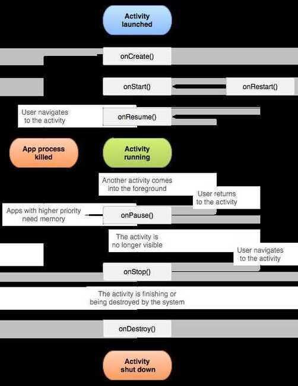
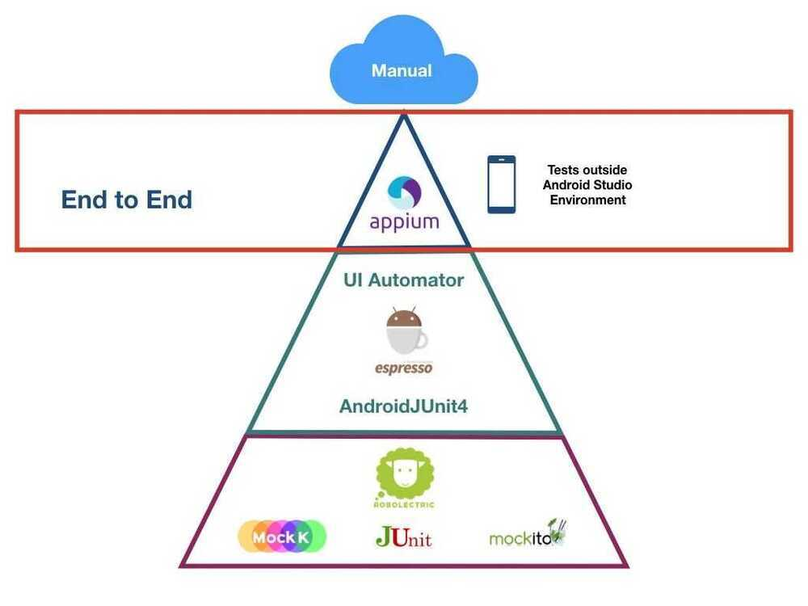

# Android

## Nocode

<https://flutterflow.io>

<https://www.judo.app>

Judo brings server-driven UI to your iOS and Android apps. Build user interfaces visually in a fraction of time and publish them instantly without submitting to the app store.

## Databases

- ObjectBox
- Firebase real time DB

## Contexts (Application Context)

<https://blog.mindorks.com/understanding-context-in-android-application-330913e32514>

[Memory Leak - Part 1, Curious Case of Memory Leak](https://www.youtube.com/watch?v=OqalhCheKXQ)

Contexts = Activities + Services + 1 Application Context


## Libraries

Layouts

1. Drawer layout
2. Linear layout
3. Relative layout
4. Constraint layout
5. Coordinator layout
6. Tabbed layout

Eventbus greenbot

ORM greenbot

### SQLite Database

How to corrupt - <https://sqlite.org/howtocorrupt.html>

RxJava
GCM
Mosquitto MQTT Broker

## Serializable vs Parcelable

<http://www.developerphil.com/parcelable-vs-serializable>

## Service

A [Service](https://developer.android.com/reference/android/app/Service) is an [application component](https://developer.android.com/guide/components/fundamentals#Components) that can perform long-running operations in the background. It does not provide a user interface. Once started, a service might continue running for some time, even after the user switches to another application. Additionally, a component can bind to a service to interact with it and even perform interprocess communication (IPC). For example, a service can handle network transactions, play music, perform file I/O, or interact with a content provider, all from the background.

## Types of services

### Foreground

A foreground service performs some operation that is noticeable to the user. For example, an audio app would use a foreground service to play an audio track. Foreground services must display a [Notification](https://developer.android.com/guide/topics/ui/notifiers/notifications). Foreground services continue running even when the user isn't interacting with the app.

When you use a foreground service, you must display a notification so that users are actively aware that the service is running. This notification cannot be dismissed unless the service is either stopped or removed from the foreground.

### Background

A background service performs an operation that isn't directly noticed by the user. For example, if an app used a service to compact its storage, that would usually be a background service.

### Bound

A service is *bound* when an application component binds to it by calling [bindService()](https://developer.android.com/reference/android/content/Context#bindService(android.content.Intent,%20android.content.ServiceConnection,%20int)). A bound service offers a client-server interface that allows components to interact with the service, send requests, receive results, and even do so across processes with interprocess communication (IPC). A bound service runs only as long as another application component is bound to it. Multiple components can bind to the service at once, but when all of them unbind, the service is destroyed.

<https://developer.android.com/guide/components/services>

## Android Interface Description Language (AIDL)

AIDL (Android Interface Definition Language) allows you to define the programming interface that both the client and service agree upon in order to communicate with each other using interprocess communication (IPC). On Android, one process cannot normally access the memory of another process. So to talk, they need to decompose their objects into primitives that the operating system can understand, and marshall the objects across that boundary for you. The code to do that marshalling is tedious to write, so Android handles it for you with AIDL.

## Project

1. UserStudyFramework - An application to collect data from three applications
2. Dynamic Password Image
3. Dynamic Password Text
4. Dynamic Password Numerical

## Architectural Styles

### Clean Architecture

<https://www.toptal.com/android/benefits-of-clean-architecture-android>

### Repository Pattern

<https://medium.com/swlh/repository-pattern-in-android-c31d0268118c>

<https://developer.android.com/codelabs/kotlin-android-training-repository#0>

<https://medium.com/corebuild-software/android-repository-pattern-using-rx-room-bac6c65d7385>

#### Why the Repository Pattern ?

- decouples the application from the data sources
- provides data from multiple sources (DB, API) without clients being concerned about this
- isolates the data layer
- single place, centralized, consistent access to data
- testable business logic via Unit Tests
- easily add new sources

### MVI Pattern in Android without RxJava

<https://proandroiddev.com/android-unidirectional-state-flow-without-rx-596f2f7637bb>

## HAL (Hardware Abstraction Layer)

<https://source.android.com/devices/architecture/hal-types>

## HILT

Hilt provides a standard way to incorporate Dagger dependency injection into an Android application.

The goals of Hilt are:

- To simplify Dagger-related infrastructure for Android apps.
- To create a standard set of components and scopes to ease setup, readability/understanding, and code sharing between apps.
- To provide an easy way to provision different bindings to various build types (e.g. testing, debug, or release).

<https://dagger.dev/hilt>

<https://developer.android.com/codelabs/android-hilt>

## Tools

- Hierarchy Viewer
- APK Analyzer
- Espresso Test Generator
- Cloud test lab support
- Jack compiler for java 8 support
- Enhanced lint
- Leak canary (for tracking memory leaks)
- Monkey profile viewer
- Logcat monitor
- CPU monitor
- Allocation tracker
- Memory information
- Dalvik debug monitor server
- Pixel perfect
- Systrace
- Battery profiling
- Dumping the Java Heap Memory (Monitor / Heap Memory Dump)
- HPROF (Heap/CPU profiling tool)
- Travis CI (Continous Integration Tool)
- Circle CI (Continous Integration Tool)
- Jenkins (Continous Integration Tool)
- BuddyBuild (Continous Integration Tool & Crash Reporting)
- Crashlytics (Crash Reporting) - Crashlytics.log(int priority, String tag, String msg);
- <https://firebase.google.com/docs/crashlytics/customize-crash-reports?platform=android>
- InstaBug (Crash Reporting)
- Hudson (Continuous Integration Tool)
- TestNG/JMock (Automated Testing)
- Maven (Deployment Tool)
- [Storage Access Framework](https://developer.android.com/guide/topics/providers/document-provider.html)
- [MediaPlayer](https://developer.android.com/guide/topics/media/mediaplayer.html)
- [ExoPlayer](https://developer.android.com/guide/topics/media/exoplayer.html)
- NDK (Native Development Kit)
  - <http://www.packtpub.com/sites/default/files/downloads/Developing_Multimedia_Applications_with_NDK.pdf>
- CMake
- Toolchain (Cross compilers)
- Gradle (Build System)
- Instrumented tests
- **Testing Frameworks**
  - Local Unit Tests (Mockito)
  - Robotium
  - Calabash
  - Appium
  - Android JUnit Runner
  - Functional UI Testing (Espresso)
  - Functional UI Testing (UIAutomator)
  - Hamcrest is a framework for writing matcher objects allowing 'match' rules to be defined declaratively.
  - Monkey / Monkey Runner
  - Android Testing Support Library
  - **Test Lab runs [Espresso](https://developer.android.com/training/testing/ui-testing/espresso-testing.html) and [UI Automator 2.0](http://developer.android.com/tools/testing-support-library/index.html#UIAutomator) tests on Android apps, and [XCTest](https://developer.apple.com/documentation/xctest) tests on iOS apps.**
  - **RoboTest (easiest)**
    - <https://firebase.google.com/docs/test-lab/android/robo-ux-test>
    - <https://developer.android.com/training/testing>
    - <https://developer.android.com/training/testing/fundamentals>
- Parceler (<http://parceler.org>)

## Features

- Locale (Android Localization)
- Runtime permissions
- Spinners
- Radio buttons and groups
- MultiChoiceModeListener for gridView
- Chronometer
- SeekBar
- RangeBar
- AlertDialogBox
- Floating action button (FAB)
- AsyncTask
- Volley
- Retrofit
- OkHTTP
- Dagger
- ButterKnife
- Universal Image Loader
- Picasso
- Glide
- AlarmManager
- AppIntro (paolo rotolo)
- ZeroMQ
- RabbitMQ
- Gson
- JsonObjectParser
- RecyclerView
- CardView
- MPAndroidChart
- AChartEngine
- HSSFWorkbook
- Vuforia for image processing in backend
- Pagination
- Infinite scroll
- ParallaxEffect on Toolbar
- Collapsible Toolbar
- ContentResolver
- ADL (Android Definition Language)
- Annotation based development
- GreenRobot EventBus
- GreenRobot greenDAO

## Questions

### Activity Lifecycle



<https://developer.android.com/guide/components/activities/activity-lifecycle>

### What is a ContentProvider and what is it typically used for?

AContentProvidermanages access to a structured set of data. It encapsulates the data and provide mechanisms for defining data security.ContentProvideris the standard interface that connects data in one process with code running in another process.

### Describe three common use cases for using an Intent

Common use cases for using an Intent include:

- To start an activity: You can start a new instance of an Activity by passing an Intent tostartActivity()method.
- To start a service: You can start a service to perform a one-time operation (such as download a file) by passing an Intent tostartService().
- To deliver a broadcast: You can deliver a broadcast to other apps by passing an Intent tosendBroadcast(), sendOrderedBroadcast(), orsendStickyBroadcast().

### What is DDMS? Describe some of its capabilities

DDMS is theDalvik Debug Monitor Serverthat ships with Android. It provides a wide array of debugging features including:

- port-forwarding services
- screen capture
- thread and heap information
- network traffic tracking
- incoming call and SMS spoofing
- simulating network state, speed, and latency
- location data spoofing

### What is the relationship between the life cycle of an AsyncTask and an Activity? What problems can this result in? How can these problems be avoided?

An AsyncTask is not tied to the life cycle of the Activity that contains it. So, for example, if you start an AsyncTask inside an Activity and the user rotates the device, the Activity will be destroyed (and a new Activity instance will be created) but the AsyncTask will not die but instead goes on living until it completes.

Then, when the AsyncTask does complete, rather than updating the UI of the new Activity, it updates the former instance of the Activity (i.e., the one in which it was created but that is not displayed anymore!). This can lead to an Exception (of the type java.lang.IllegalArgumentException: View not attached to window manager if you use, for instance, findViewById to retrieve a view inside the Activity).

There's also the potential for this to result in a memory leak since the AsyncTask maintains a reference to the Activty, which prevents the Activity from being garbage collected as long as the AsyncTask remains alive.

For these reasons, using AsyncTasks for long-running background tasks is generally a bad idea . Rather, for long-running background tasks, a different mechanism (such as a service) should be employed.

### What is an Intent? Can it be used to provide data to a ContentProvider? Why or why not?

The Intentobject is a common mechanism for starting new activity and transferring data from one activity to another. However, you cannot start a ContentProvider using an Intent.

When you want to access data in aContentProvider, you must instead use the ContentResolver object in your application's Context to communicate with the provider as a client. The Content Resolver object communicates with the provider object, an instance of a class that implements ContentProvider. The provider object receives data requests from clients, performs the requested action, and returns the results.

### What is the difference between a fragment and an activity? Explain the relationship between the two

An activity is typically a single, focused operation that a user can perform (such as dial a number, take a picture, send an email, view a map, etc.). Yet at the same time, there is nothing that precludes a developer from creating an activity that is arbitrarily complex.

Activity implementations can optionally make use ofthe Fragment classfor purposes such as producing more modular code, building more sophisticated user interfaces for larger screens, helping scale applications between small and large screens, and so on. Multiple fragments can be combined within a single activity and, conversely, the same fragment can often be reused across multiple activities. This structure is largely intended to foster code reuse and facilitate economies of scale.

A fragment is essentially a modular section of an activity, with its own lifecycle and input events, and which can be added or removed at will. It is important to remember, though, that a fragment's lifecycle is directly affected by its host activity's lifecycle; i.e., when the activity is paused, so are all fragments in it, and when the activity is destroyed, so are all of its fragments.

### What is difference between Serializable and Parcelable ? Which is best approach in Android ?

Serializable is a standard Java interface. You simply mark a class Serializable by implementing the interface, and Java will automatically serialize it in certain situations.

Parcelable is an Android specific interface where you implement the serialization yourself. It was created to be far more efficient than Serializable, and to get around some problems with the default Java serialization scheme.

### What is the difference between Service and IntentService? How is each used?

Serviceis the base class for Android services that can be extended to create any service. A class that directly extendsServiceruns on the main thread so it will block the UI (if there is one) and should therefore either be used only for short tasks or should make use of other threads for longer tasks.

IntentService is a subclass of Servicethat handles asynchronous requests (expressed as "Intents") on demand. Clients send requests throughstartService(Intent)calls. The service is started as needed, handles eachIntentin turn using a worker thread, and stops itself when it runs out of work. Writing anIntentServicecan be quite simple; just extend theIntentServiceclass and override the onHandleIntent(Intent intent)method where you can manage all incoming requests.

### What is ANR, and why does it happen?

'ANR' in Android is 'Application Not Responding.' It means when the user is interacting with the activity, and the activity is in theonResume()method, a dialog appears displaying "application not responding."

It happens because we start a heavy and long running task like downloading data in the main UI thread. The solution of the problem is to start your heavy tasks in the backbround using Async Task class.

### Which method is called only once in a fragment life cycle?

onAttached()

### Is it possible to create an activity in Android without a user interface ?

Yes, an activity can be created without any user interface. These activities are treated as abstract activities.

### What is a broadcast receiver?

The broadcast receiver communicates with the operation system messages such as "check whether an internet connection is available," what the battery label should be, etc.

<https://www.toptal.com/app/interview-questions>

## Android Code analysis tools

### Android Lint

1. This one comes with Android Studio by default
2. It checks your Android project source files for potential bugs and optimizations for correctness, security, performance, usability, accessibility, and internationalization
3. Analyze > Inspect Code

### Checkstyle

1. It basically analyses source code and looks to improve the coding standard by traversing over simple AST generated by Checkstyle.
2. It verifies the source code for coding conventions like headers, imports, whitespaces, formatting etc.

### Findbugs

1. It analyses Java byte code mainly .classes to find any design flaw and potential bugs.
2. It needs compiled code to work around and will eventually be fast since it works on byte code level.
3. The major categories in this tool are: Correctness, Bad practice, Dodgy code, Multithreaded Correctness, Performance Malicious, Code Vulnerability, Security Experimental and Internationalization

<https://medium.com/achieve-high-quality-android-code-with-static-code/static-code-analysis-tools-80558d9cb6cb>

## Testing



<https://proandroiddev.com/a-guide-to-test-pyramid-in-android-end-to-end-and-manual-tests-part-4-3a16af96b78c>

## RoboElectric

[Robolectric](http://robolectric.org/) is an Android unit testing framework that allows you to run tests inside the JVM on your development workstation. Robolectric rewrites Android SDK classes as they're being loaded and makes it possible for them to run on a regular JVM, resulting in fast test times. Furthermore, it handles inflation of views, resource loading, and more stuff that's implemented in native C code on Android devices, making the need for emulators and physical devices to run automated tests obsolete.

## Mockito

[Mockito](https://code.google.com/p/mockito/) is a mocking framework that enables us to write clean tests in java. It simplifies the process of creating test doubles (mocks), which are used to replace the original dependencies of a component/module used in production. A StackOverflow answer discusses [about the differences between mocks and stubs](http://stackoverflow.com/a/346440/2018294) in fairly simple terms that you can read to learn more.

```java
// you can mock concrete classes, not only interfaces
LinkedList mockedList = mock(LinkedList.class);

// stubbing appears before the actual execution
when(mockedList.get(0)).thenReturn("first");

// the following prints "first"
System.out.println(mockedList.get(0));

// the following prints "null" because get(999) was not stubbed
System.out.println(mockedList.get(999));
```

Additionally, with Mockito we can verify if a method has been called:

```java
// mock creation
List mockedList = mock(List.class);

// using mock object - it does not throw any "unexpected interaction" exception
mockedList.add("one");
mockedList.clear();

// selective, explicit, highly readable verification
verify(mockedList).add("one");
verify(mockedList).clear();
```

<https://github.com/mockito/mockito>

<https://www.toptal.com/android/testing-like-a-true-green-droid>

## Other Tools

### SmartLook

Smartlook records users on websites and in mobile apps.With features that allow you to find useful information even in thousands of recordings in no time.

<https://www.smartlook.com>

<https://smartlook.github.io/docs/sdk/android>

- <https://github.com/CameraKit/camerakit-android>
- <https://ui.perfetto.dev>
- Bluestacks
- Nox Player
- <https://github.com/Genymobile/scrcpy>

## Others

<https://medium.com/snapp-mobile/android-keeping-release-and-debug-installed-all-the-time-43f5812d6637>

<https://www.toptal.com/android/functional-reactive-programming-part-2>

[GitHub - Genymobile/scrcpy: Display and control your Android device](https://github.com/Genymobile/scrcpy)
