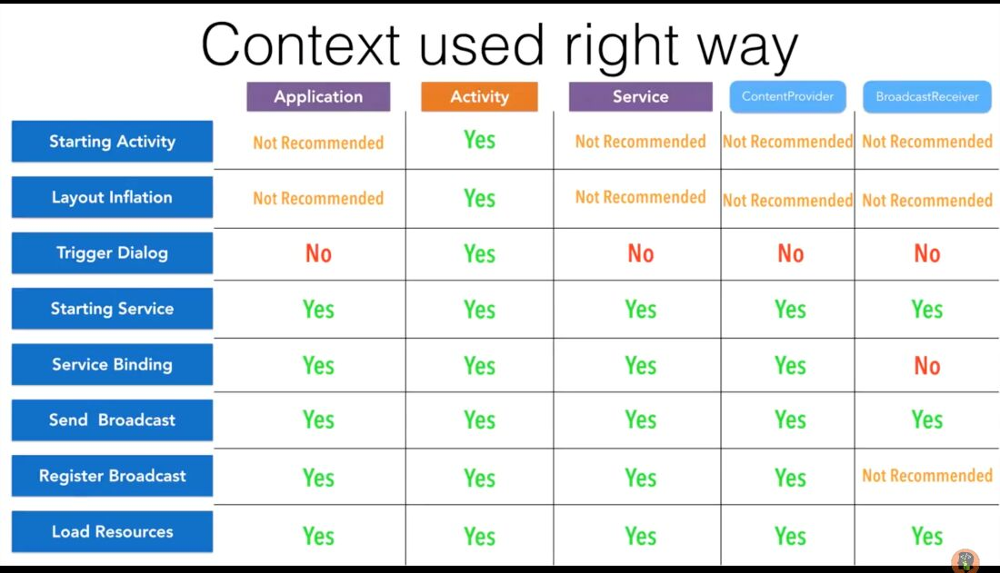

# Android

- [jetpack](languages/frameworks/android/jetpack.md)
- [kotlin](languages/frameworks/android/kotlin.md)
- [service](languages/frameworks/android/service.md)
- [tools](languages/frameworks/android/tools.md)
- [testing](languages/frameworks/android/testing.md)
- [questions](languages/frameworks/android/questions.md)

## Nocode

https://flutterflow.io

https://www.judo.app

Judo brings server-driven UI to your iOS and Android apps. Build user interfaces visually in a fraction of time and publish them instantly without submitting to the app store.

## Databases

- ObjectBox
- Firebase real time DB

## Contexts (Application Context)

https://blog.mindorks.com/understanding-context-in-android-application-330913e32514

[Memory Leak - Part 1, Curious Case of Memory Leak](https://www.youtube.com/watch?v=OqalhCheKXQ)

Contexts = Activities + Services + 1 Application Context

## Libraries

Layouts

1. Drawer layout
2. Linear layout
3. Relative layout
4. Constraint layout
5. Coordinator layout
6. Tabbed layout

Eventbus greenbot

ORM greenbot

### SQLite Database

How to corrupt - https://sqlite.org/howtocorrupt.html

RxJava
GCM
Mosquitto MQTT Broker

## Serializable vs Parcelable

http://www.developerphil.com/parcelable-vs-serializable

## Android Interface Description Language (AIDL)

AIDL (Android Interface Definition Language) allows you to define the programming interface that both the client and service agree upon in order to communicate with each other using interprocess communication (IPC). On Android, one process cannot normally access the memory of another process. So to talk, they need to decompose their objects into primitives that the operating system can understand, and marshall the objects across that boundary for you. The code to do that marshalling is tedious to write, so Android handles it for you with AIDL.

## Architectural Styles

### Clean Architecture

https://www.toptal.com/android/benefits-of-clean-architecture-android

### Repository Pattern

https://medium.com/swlh/repository-pattern-in-android-c31d0268118c

https://developer.android.com/codelabs/kotlin-android-training-repository#0

https://medium.com/corebuild-software/android-repository-pattern-using-rx-room-bac6c65d7385

#### Why the Repository Pattern ?

- decouples the application from the data sources
- provides data from multiple sources (DB, API) without clients being concerned about this
- isolates the data layer
- single place, centralized, consistent access to data
- testable business logic via Unit Tests
- easily add new sources

### MVI Pattern in Android without RxJava

https://proandroiddev.com/android-unidirectional-state-flow-without-rx-596f2f7637bb

## HAL (Hardware Abstraction Layer)

https://source.android.com/devices/architecture/hal-types

## HILT

Hilt provides a standard way to incorporate Dagger dependency injection into an Android application.

The goals of Hilt are:

- To simplify Dagger-related infrastructure for Android apps.
- To create a standard set of components and scopes to ease setup, readability/understanding, and code sharing between apps.
- To provide an easy way to provision different bindings to various build types (e.g. testing, debug, or release).

https://dagger.dev/hilt

https://developer.android.com/codelabs/android-hilt

## Others

- https://medium.com/snapp-mobile/android-keeping-release-and-debug-installed-all-the-time-43f5812d6637
- https://www.toptal.com/android/functional-reactive-programming-part-2
- [GitHub - Genymobile/scrcpy: Display and control your Android device](https://github.com/Genymobile/scrcpy)
- Deployment Patterns
    - [Soft Launch, Dark Launch, and Canary Release for Mobile Apps | Instabug](https://www.instabug.com/blog/soft-launch-dark-launch-and-canary-release-for-mobile-apps)
    - [Gradually roll out Firebase App Check using Firebase Remote Config](https://firebase.google.com/codelabs/app-attest-remote-config#0)
    - [How to Stage Rollout Features using Firebase Remote Config (Android & iOS) - Rebecca Franks - @riggaroo](https://riggaroo.dev/stage-rollout-features-firebase-remote-config-ios-android/)
    - [Android Developers Blog: Staged releases allow you to bring new features to your users quickly, safely and regularly.](https://android-developers.googleblog.com/2018/09/staged-releases-allow-you-to-bring-new.html)
