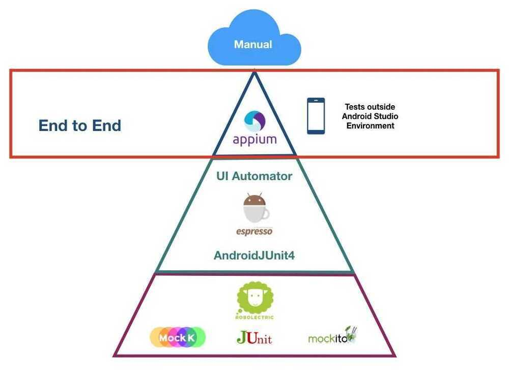

# Testing

## Android Code analysis tools

### Android Lint

1. This one comes with Android Studio by default
2. It checks your Android project source files for potential bugs and optimizations for correctness, security, performance, usability, accessibility, and internationalization
3. Analyze > Inspect Code

### Checkstyle

1. It basically analyses source code and looks to improve the coding standard by traversing over simple AST generated by Checkstyle.
2. It verifies the source code for coding conventions like headers, imports, whitespaces, formatting etc.

### Findbugs

1. It analyses Java byte code mainly .classes to find any design flaw and potential bugs.
2. It needs compiled code to work around and will eventually be fast since it works on byte code level.
3. The major categories in this tool are: Correctness, Bad practice, Dodgy code, Multithreaded Correctness, Performance Malicious, Code Vulnerability, Security Experimental and Internationalization

https://medium.com/achieve-high-quality-android-code-with-static-code/static-code-analysis-tools-80558d9cb6cb

## Testing



https://proandroiddev.com/a-guide-to-test-pyramid-in-android-end-to-end-and-manual-tests-part-4-3a16af96b78c

## RoboElectric

[Robolectric](http://robolectric.org/) is an Android unit testing framework that allows you to run tests inside the JVM on your development workstation. Robolectric rewrites Android SDK classes as they're being loaded and makes it possible for them to run on a regular JVM, resulting in fast test times. Furthermore, it handles inflation of views, resource loading, and more stuff that's implemented in native C code on Android devices, making the need for emulators and physical devices to run automated tests obsolete.

## Mockito

[Mockito](https://code.google.com/p/mockito/) is a mocking framework that enables us to write clean tests in java. It simplifies the process of creating test doubles (mocks), which are used to replace the original dependencies of a component/module used in production. A StackOverflow answer discusses [about the differences between mocks and stubs](http://stackoverflow.com/a/346440/2018294) in fairly simple terms that you can read to learn more.

```java
// you can mock concrete classes, not only interfaces
LinkedList mockedList = mock(LinkedList.class);

// stubbing appears before the actual execution
when(mockedList.get(0)).thenReturn("first");

// the following prints "first"
System.out.println(mockedList.get(0));

// the following prints "null" because get(999) was not stubbed
System.out.println(mockedList.get(999));
```

Additionally, with Mockito we can verify if a method has been called:

```java
// mock creation
List mockedList = mock(List.class);

// using mock object - it does not throw any "unexpected interaction" exception
mockedList.add("one");
mockedList.clear();

// selective, explicit, highly readable verification
verify(mockedList).add("one");
verify(mockedList).clear();
```

https://github.com/mockito/mockito

https://www.toptal.com/android/testing-like-a-true-green-droid

## Release

### 1. Registration & Development (iOS & Android)

- Enroll in Apple's Developer Program and Google Play Console as iOS and Android developer
- Code using platform-specific tools: Swift/Obj-C for iOS, and Java/Kotlin for Android

### 2. Build & Test (iOS & Android)

- Compile the app's binary, run extensive tests on both platforms to ensure functionality and performance. Create a release candidate build.

### 3. QA

- Internally test the app for issue identification (dogfooding)
- Beta test with external users to collect feedback
- Conduct regression testing to maintain feature stability

### 4. Internal Approvals

- Obtain approval from stakeholders and key team members.
- Comply with app store guidelines and industry regulations
- Obtain security approvals to safeguard user data and privacy

### 5. App Store Optimization (ASO)

- Optimize metadata, including titles, descriptions, and keywords, for better search visibility
- Design captivating screenshots and icons to entice users
- Prepare engaging release notes to inform users about new features and updates

### 6. App Submission To Store

- Submit the iOS app via App Store Connect following Apple's guidelines
- Submit the Android app via Google Play Console, adhering to Google's policies
- Both platforms may request issue resolution for approval

### 7. Release

- Upon approval, set a release date to coordinate the launch on both iOS and Android platforms


