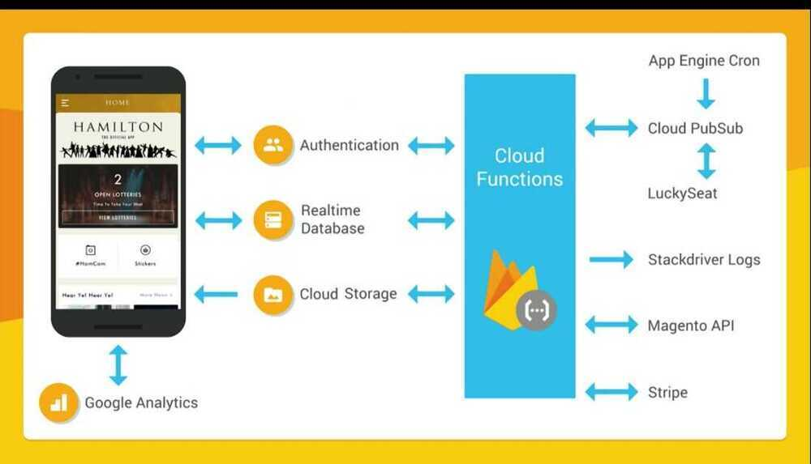

# Flutter

Flutter is used to develop apps that run on Android and iOS and deliver the same user experience. Flutter will also be able to target Fuchsia, the upcoming OS from Google

Flutter development is done in Dart, an open-source programming language developed by Google.

- Serverless architecture
- both for ios and android
- By Google

In Record Time: how we quickly built a serverless app with Firebase and Flutter

(GDD Europe '17)

Hamiltion app

- Ticket Lottery system
- Ecommerce for buying merchandise
    - with firebase functions and flutter
- location based overlays
- In 3 months time
- Both for android + IOS

## Realtime Database

- No refresh in whole app
- You put data in database and it's live to all places

## Authentication

- Using email + google + facebook and everything else

## Cloud Storage

- Storing images in cloud storage is very easy and efficient

## Cloud Functions

- Integrate with Magenta + Stripe API
- Serverless architecture using real-time database + cloud functions
- 0 https web api (no api)

## Example app

- **Dependencies**
    - Only using firebase admin and firebase functions
    - Use TypeScript + Webpack
- **Features**
    - No node
    - No express
    - No middleware
    - No networking code to write or manage
    - Authentication and error handling in Firebase SDK
    - High scale, real-time performance
    - No servers to provision or manage, automatic scaling
    - No web servers, OS's or libraries to maintain and patch

## Flutter

- Consistent design over android and IOS
- All code is compiled to arm for fast performance
- Only Java, no XML, no HTML or any other language
- Statefull Hot Reload
- Reactive

## References

[**https://www.youtube.com/watch?v=wUSkeTaBonA&ab_channel=Firebase**](https://www.youtube.com/watch?v=wUSkeTaBonA&ab_channel=Firebase)

https://flutter.dev/web

https://www.toptal.com/flutter/flutter-tutorial

https://www.freecodecamp.org/news/flutter-app-course-mobile-web-desktop

[In Record Time: How we Quickly Built a Serverless app with Firebase and Flutter (GDD Europe '17)](https://www.youtube.com/watch?v=prlK_QL_qOA)

https://www.freecodecamp.org/news/code-a-full-stack-instagram-clone-with-flutter-and-firebase

https://www.freecodecamp.org/news/learn-flutter-full-course

[What’s next for Flutter](https://medium.com/flutter/whats-next-for-flutter-b94ce089f49c)

[What’s new in Flutter 3.7](https://medium.com/flutter/whats-new-in-flutter-3-7-38cbea71133c)
