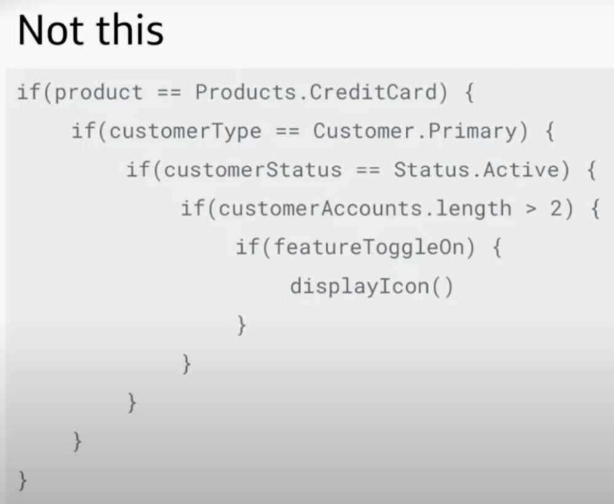
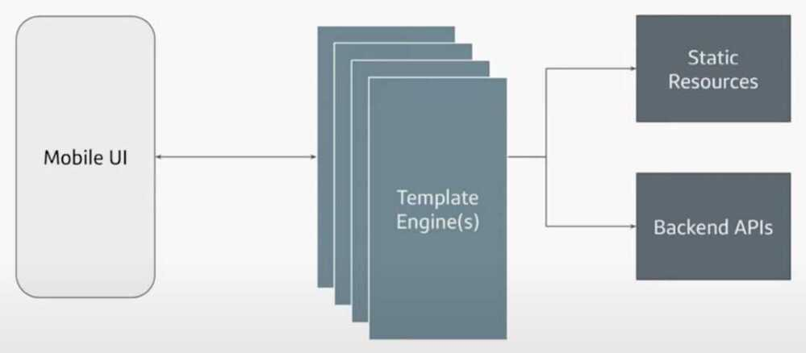
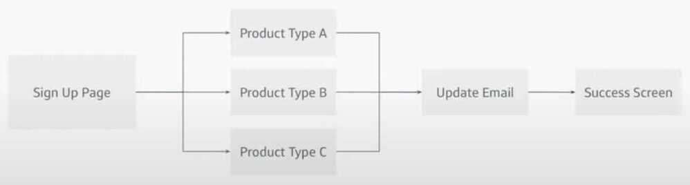
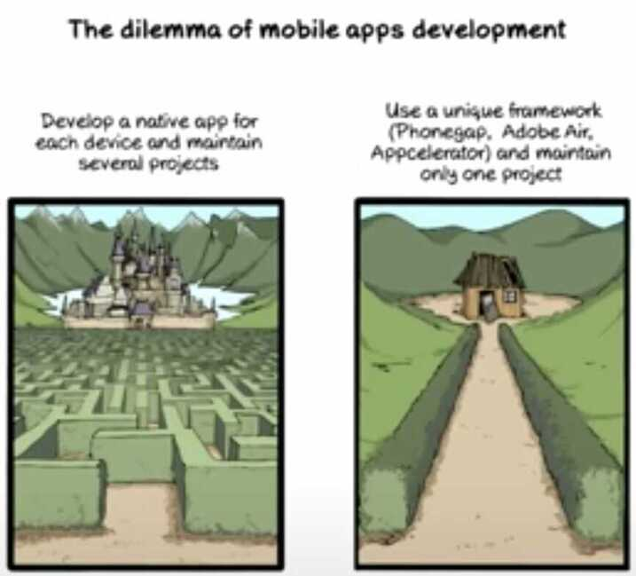

# Server Driven Mobile UIs

## Apps

- Personlized
- Smart
- Dynamic
- Complex

## Challenges

- **Context Driven**
  - Apps behave differently depending on its current context
  - ML enables hyper-personalization of content and experiences depending on the customer
- **More Features**
  - Apps have to support more features, screen real estate is the same
  - Apps need to actually be useful

## Sideways building

- **Frontend should be dumb**

- **Frontend Templates**
  - Templates are predefined UI layouts
  - Templates have static layout, but dynamic content
  - Templates can contain
    - Text labels
    - Images
    - Buttons
    - Input fields
    - Toggles
  - Templates have their own implementation per platform
    - iOS - Android - Web
- **Backend -** to provide data to frontend templates
  - Backend consists of an API server that serves JSON
  - JSON follows standard template contract and is consistent across platforms
  - JSON specifies context which includes
    - Text
    - Images
    - Actions
    - Conditional logic
  - A single data source means that any update to context and page flow only needs to happen once

## Data Flow

Example

- Mobile UI initiates call to Template Engine
- Template Engine returns initial JSON
- Mobile UI triggers local/external actions
- Mobile UI calls Template Engine
- Template Engine returns next set of JSON
- Repeat until finished

Use Case

- A/B Testing
  - Dynamic layouts are great for A/B Testing
  - Server determines which assets to load based on your own criteria
  - Iterate through different prototypes quickly
- Dynamic Messaging
  - Publish important messaging through templates
  - Having a variety of template types can help provide more specific details per user
  - No need for app updates to provide critical messaging
- User Setup
  - User setup can be customized based on product type
  - You can easily create non-linear flows

- You can easily add new screen without UI updates
- Isolation of view & business logic enables better testing
  - Testing of flows can be done on backend!

## Tips & Tricks

- Define a good use case first
  - Dynamic and simple content is the best way to start
  - Find duplicate views and features that are consistent across platforms
- Define your templates
- Define your template contract
  - Determine what are the necessary components that can populate your template
- Start with static JSON
  - Host it on the app to start
- Incrementally build out backend as needed

## Other Considerations

- Is this worth the extra work?
- How can I test my UI?
- How does this scale?
- Are front-end developers deprecated?

[GOTO 2020 - Server Driven UI on Mobile - JJ Qi](https://www.youtube.com/watch?v=CtSfG8tYRdg&ab_channel=GOTOConferences)

<https://tech.affirm.com/solving-spaghetti-code-with-a-state-machine-aaec159f6659>

<https://medium.com/rocket-fuel/server-driven-ui-for-android-with-jetpack-compose-6763ec60f33e>

<https://medium.com/android-dev-hacks/jetpack-compose-with-server-driven-ui-396a19f0a661>

<https://medium.com/okcredit/oklayoutinflater-3c5cd93c6ebc>
