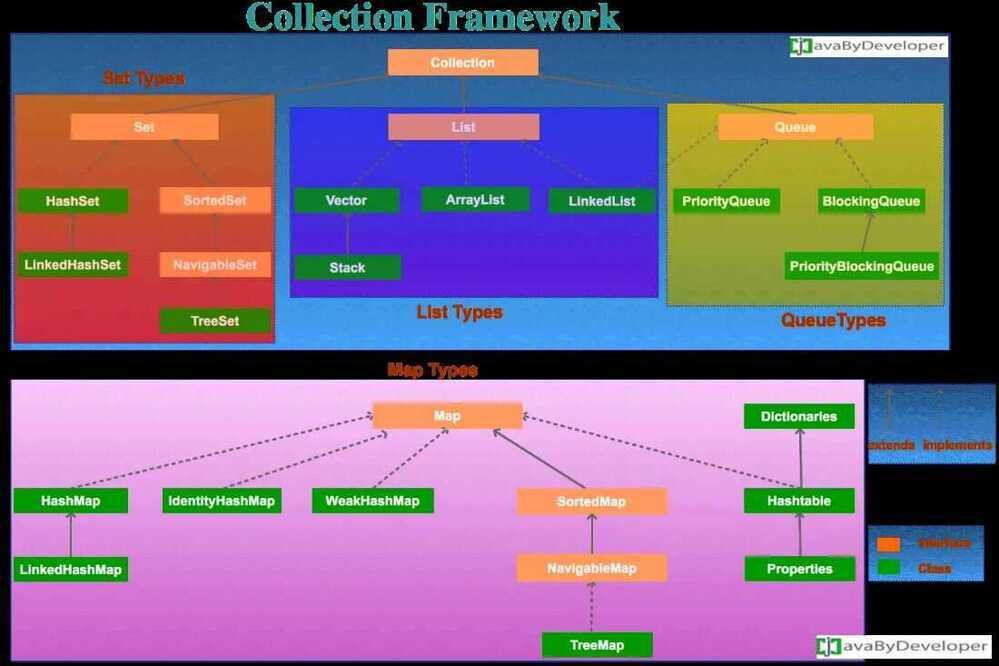

# Collections

A*collection*--- sometimes called a container - is simply an object that groups multiple elements into a single unit. Collections are used to store, retrieve, manipulate, and communicate aggregate data.

## What Is a Collections Framework?

A*collections framework*is a unified architecture for representing and manipulating collections. All collections frameworks contain the following:

- **Interfaces:**These are abstract data types that represent collections. Interfaces allow collections to be manipulated independently of the details of their representation. In object-oriented languages, interfaces generally form a hierarchy.
- **Implementations:**These are the concrete implementations of the collection interfaces. In essence, they are reusable data structures.
- **Algorithms:**These are the methods that perform useful computations, such as searching and sorting, on objects that implement collection interfaces. The algorithms are said to be *polymorphic*: that is, the same method can be used on many different implementations of the appropriate collection interface. In essence, algorithms are reusable functionality.

Apart from the Java Collections Framework, the best-known examples of collections frameworks are the C++ Standard Template Library (STL) and Smalltalk's collection hierarchy.

