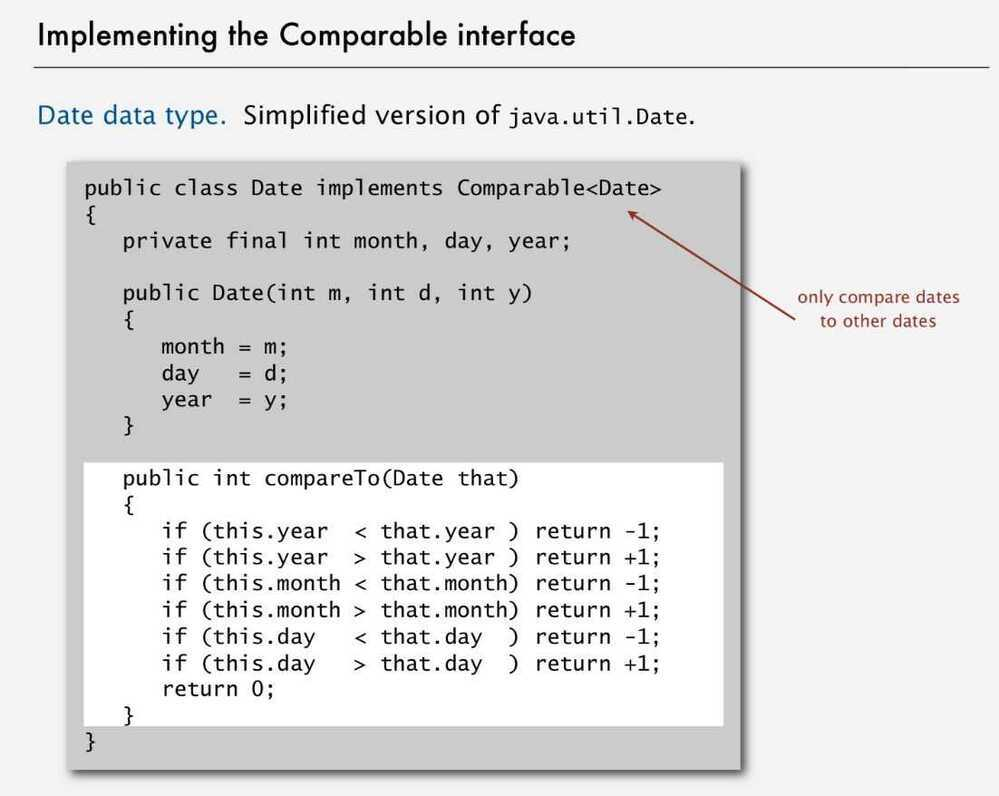

# Comparable Interface

Goal - Sort any type of data

Que - How can sort() know how to compare data of type Double, String, and java.io.File without any information about the type of an item's key?

Sol - **Callback = reference to executable code**

- Client passes array of objects to sort() function.
- The sort() function calls back object's compareTo() method as needed.
