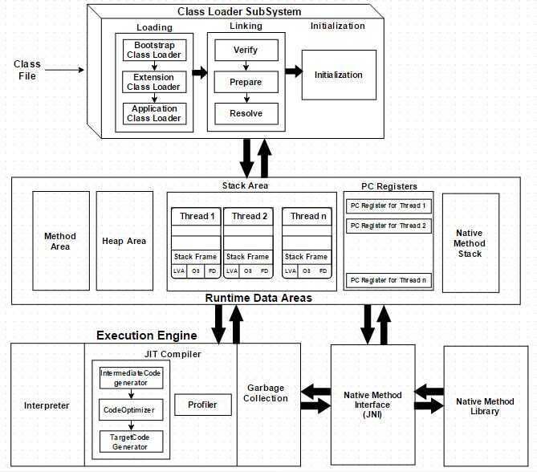

# JVM Architecture

JVM is divided into three main subsystems

1. Class Loader Subsystem
2. Runtime Data Area
3. Execution Engine

### 1. Class Loader Subsystem

Java's dynamic class loading functionality is handled by the class loader subsystem. It loads, links and initializes the class when it refers to a class for the first time atruntime, not atcompile-time.It performs three major functionality such as Loading, Linking, and Initialization.

1. Loading

Classes will be loaded by this component.BootStrap ClassLoader, Extension ClassLoader, Application ClassLoader are the three class loader which will help in achieving it.

- BootStrapClassLoader-- Responsible for loading classes from the bootstrap classpath, nothing butrt.jar.Highest priority will be given to this loader.

- Extension ClassLoader-- Responsible for loading classes which are insideextfolder(jrelib)

- Application ClassLoader--Responsible for loadingApplication Level Classpath, path mentioned Environment Variable etc.

The aboveClass Loaderswill followDelegation Hierarchy Algorithmwhile loading the class files.

2. Linking

   - Verify-- Bytecode verifier willverify whether the generated bytecode is proper or not if verification fails we will getverification error

   - Prepare-- For allstatic variables memory will be allocated and assigned withdefault values.

   - Resolve-- Allsymbolic memory referencesare replaced with theoriginal referencesfromMethod Area.

3. Initialization

This is the final phase of Class Loading, here all [static variable](https://www.javainterviewpoint.com/use-of-static-keyword-in-java/) will be assigned with theoriginal values and [static block](https://www.javainterviewpoint.com/java-static-import/) will be executed.

### 2. Runtime Data Area

Runtime Data Area is divided into 5 major components

1. Method Area-- All theClass level datawill be stored hereincludingstatic variables.Method Areaisone per JVMand it is a shared resource.

2. Heap Area-- All theObjectsand its correspondinginstance variablesandarrayswill be stored here.Heap Areais alsoone per JVMsinceMethod areaandHeap areashares memory for multiple threads the data stored isnot thread safe.

3. Stack Area-- For every thread, a separateruntime stackwill be created. For everymethod call, one entry will be made in the stack memorywhichis called asStack Frame. Alllocal variableswill be created in the stack memory.Stack area is thread safe since it is not a shared resource. Stack Frame is divided into three sub-entities such as

   - Local Variable Array-- Related to the method how manylocal variablesare involved and the corresponding values will be stored here.

   - Operand stack-- If any intermediate operation is required to perform, operand stackact as runtime workspace to perform the operation.

   - Frame data-- All symbols corresponding to the method is stored here. In the case of anyexception, the catch block information will be maintained in the frame data.

4. PC Registers-- Each thread will have separatePC Registers, to hold address ofcurrent executing instructiononce the instruction is executed the PC register will beupdatedwith the next instruction

5. Native Method stacks-- Native Method Stack holds native method information. For every thread, separate native method stack will be created.

### 3. Execution Engine

The bytecode which is assigned to theRuntime Data Areawill be executed by the Execution Engine. The Execution Engine reads the byte code and executes one by one.

- Interpreter-- Reads the bytecode, interprets it and executes it one by one. The interpreter interprets the bytecode faster but executes slowly. The disadvantage of the interpreter is that when one method called multiple times, every time interpretation is required.

- JIT Compiler-- JIT Compiler neutralizes the disadvantage of the Interpreter ( a single method called multiple times, each time interpretation is required ), The Execution Engine will be using the help of Interpreter in converting but when it found repeated code it uses JIT compiler which compiles the entire bytecode andchanges it to native code. This native code will be used directly for repeated method calls which improve the performance of the system.

- Intermediate Code generator-- produces intermediate code

- Code Optimizer-- Code Optimizer is responsible for optimizing the intermediate code generated above

- Target Code Generator-- Target Code Generator is responsible for Generating Machine Code/ Native Code

- Profiler--Profiler is a special component, it is responsible for finding the hotspots (i.e) Used to identify whether the method is called multiple time or not.

- Garbage Collector: Garbage Collector is a part of Execution Engine, it collects/removes the unreferenced objects. Garbage Collection can be triggered by calling"System.gc()", but the execution is not guaranteed.Garbage collector of JVM collects only those objects that are created bynewkeyword. So if you have created any object withoutnew, you can usefinalize methodto perform cleanup.

https://www.javainterviewpoint.com/java-virtual-machine-architecture-in-java

## Java Native Interface (JNI)

JNI will be interacting with the Native Method Libraries and provides the Native Libraries required for the Execution Engine

## Native Method Libraries: It is a Collection of the Native Libraries which is required for the Execution Engine

## Z Garbage Collector (Introduced in Java 11)

The Z Garbage Collector, also known asZGC, is ascalablelow latency garbage collector designed to meet the following goals:

- Pause timesdo notexceed10ms
- Pause timesdo notincrease with the heap or live-set size
- Handle heaps ranging from afew hundred megabytestomulti terabytesin size

At a glance, ZGC is:

- Concurrent
- Region-based
- Compacting
- NUMA-aware
- Using colored pointers
- Using load barriers

At its core, ZGC is a concurrent garbage collector, meaning all heavy lifting work is done whileJava threads continue to execute. This greatly limits the impact garbage collection will have on your application's response time.

https://wiki.openjdk.java.net/display/zgc/Main
