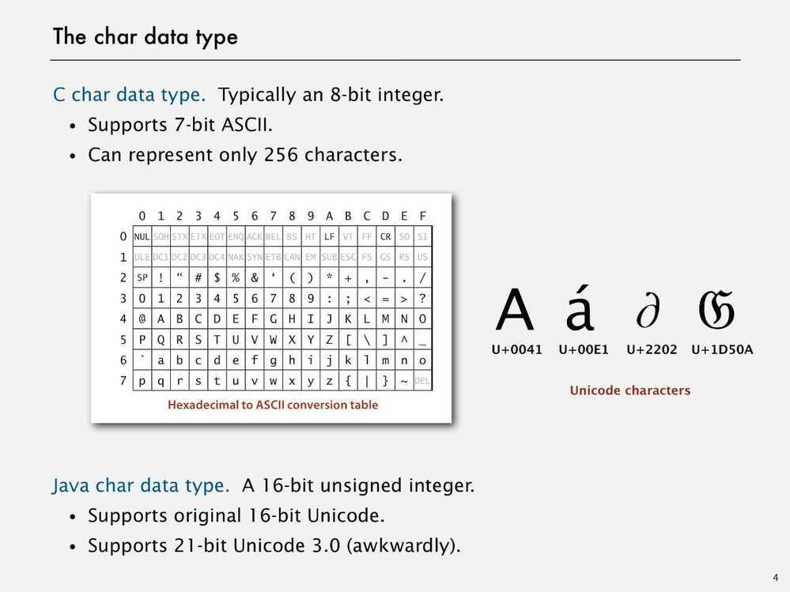
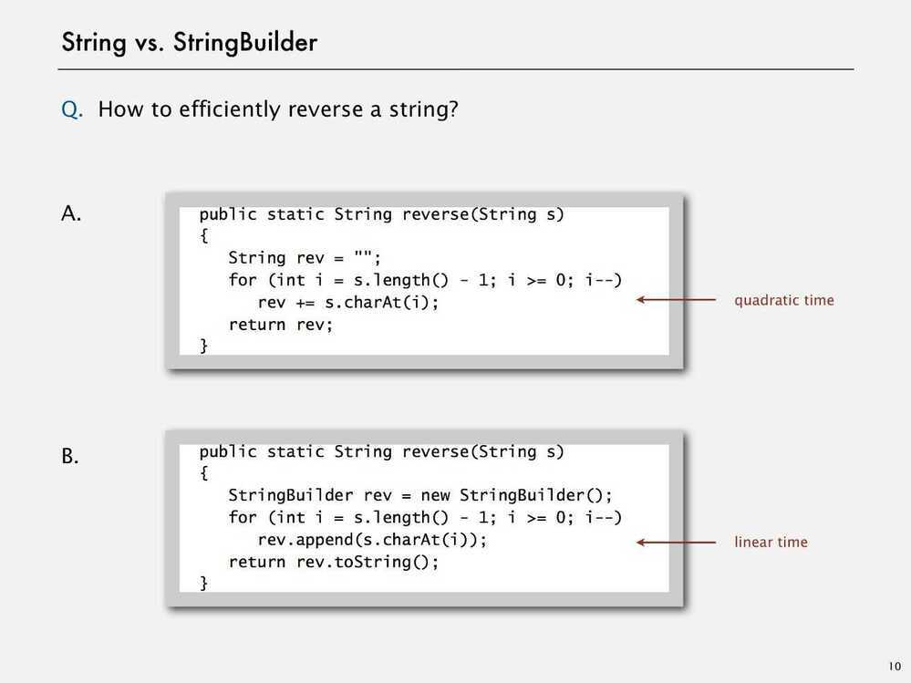

# Others

Jshell for java REPL (Read-Eval-Print Loop, interactive toplevel or language shell)

## Generics

1. Avoid casting in client.

2. Discover type mismatch errors at compile-time instead of run-time.

3. AutoBoxing

```java
Stack<Integer> stack = new Stack<Integer>();

s.push(17) // s.push(new Integer(17));

int a = s.pop() // int a = s.pop().intValue();
```

## Iterators

Iterable Interface

What is Iterable?
  It is a class that has a method that returns an Iterator.

What is Iterator?
  Class that has methods hasNext() and next() (also remove(), but not used)

## Comparator Interface

Supports multiple orderings of a given data type.

Decouples the definition of the data type from the definition of what it means to compare two objects of that type.

- To Use Java system sort:
    - Create Comparator object
    - Pass as second argument to Arrays.sort()
    - Bottom line - Decouples the definition of the data type from the definition of what it means to compare two objects of that type.

## String vs StringBuilder






Java

JMH - Java Microbenchmark Harness

Mule ESB

Service-oriented architecture (SOA) [Characteristics - abstraction, autonomy, composability, discoverability, formal contract, loose coupling, reusability and statelessness.]

Enterprise Application Integration (EAI)

Enterprise Integration Patterns

Domain-Driven-Design for the N-Tier Architecture

Daisy Architecture

http://www.codeproject.com/Articles/1182588/Application-Architecture-First-Know-Dependency-Bef

Visible Dependencies

Hidden Dependencies

Direct Dependencies

Indirect Dependencies

Compile-Time Dependencies

Run-Time Dependency
