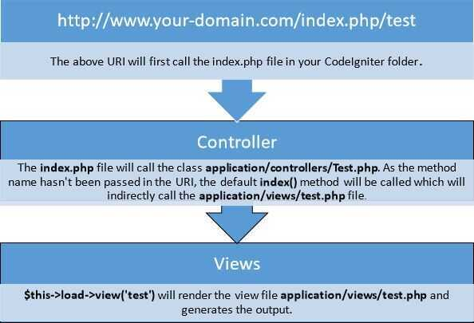

# MVC



## Views

Views are the simplest files and are typically HTML with very small amounts of PHP. The PHP should be very simple, usually just displaying a variable's contents, or looping over some items and displaying their information in a table.

Views get the data to display from the controllers, who pass it to the views as variables that can be displayed with simpleechocalls. You can also display other views within a view, making it pretty simple to display a common header or footer on every page.

Views are generally stored in/app/Views, but can quickly become unwieldy if not organized in some fashion. CodeIgniter does not enforce any type of organization, but a good rule of thumb would be to create a new directory in theViewsdirectory for each controller. Then, name views by the method name. This makes them very easy to find later on. For example, a user's profile might be displayed in a controller namedUser, and a method namedprofile. You might store the view file for this method in/app/Views/User/Profile.php.

That type of organization works great as a base habit to get into. At times you might need to organize it differently. That's not a problem. As long as CodeIgniter can find the file, it can display it.

```html
<!DOCTYPE html>
<html lang = "en">
 <head>
      <meta charset = "utf-8">
      <title>CodeIgniter View Example</title>
   </head>

   <body>
      CodeIgniter View Example
   </body>

</html>
```

## Models

A model's job is to maintain a single type of data for the application. This might be users, blog posts, transactions, etc. In this case, the model's job has two parts: enforce business rules on the data as it is pulled from, or put into, the database; and handle the actual saving and retrieval of the data from the database.

For many developers, the confusion comes in when determining what business rules are enforced. It simply means that any restrictions or requirements on the data is handled by the model. This might include normalizing raw data before it's saved to meet company standards, or formatting a column in a certain way before handing it to the controller. By keeping these business requirements in the model, you won't repeat code throughout several controllers and accidentally miss updating an area.

Models are typically stored in/app/Models, though they can use a namespace to be grouped however you need.

Models classes are designed to work with information in the database. As an example, if you are using CodeIgniter to manage users in your application then you must have model class, which contains functions to insert, delete, update and retrieve your users' data.

```php
<?php
Class User_model extends CI_Model {

    Public function __construct() {
        parent::__construct();
    }

}
?>
```

Model can be called in controller. Following code can be used to load any model.

$this->load->model('model_name');

Where model_name is the name of the model to be loaded. After loading the model you can simply call its method as shown below.

$this->model_name->method();

There may be situations where you want some model class throughout your application. In such situations, it is better if we autoload it. (application > config > autoload.php)

## Controllers

Controllers have a couple of different roles to play. The most obvious one is that they receive input from the user and then determine what to do with it. This often involves passing the data to a model to save it, or requesting data from the model that is then passed on to the view to be displayed. This also includes loading up other utility classes, if needed, to handle specialized tasks that is outside of the purview of the model.

The other responsibility of the controller is to handle everything that pertains to HTTP requests - redirects, authentication, web safety, encoding, etc. In short, the controller is where you make sure that people are allowed to be there, and they get the data they need in a format they can use.

Controllers are typically stored in/app/Controllers, though they can use a namespace to be grouped however you need.

- The name of the controller class must start with an uppercase letter.
- The controller must be called with lowercase letter.
- Do not use the same name of the method as your parent class, as it will override parent class's functionality.

```php
<?php
class Test extends CI_Controller {

    public function index() {
        echo "This is default function.";
    }

    public function hello() {
        $this->load->view('test');
    }
}
?>
```

<https://codeigniter.com/user_guide/concepts/mvc.html>

<https://www.tutorialspoint.com/codeigniter/codeigniter_basic_concepts.htm>

## Hierarchical model--view--controller (HMVC)

Hierarchical model--view--controller(HMVC) is a software [architectural pattern](https://en.wikipedia.org/wiki/Architectural_pattern), a variation of [model--view--controller](https://en.wikipedia.org/wiki/Model%E2%80%93view%E2%80%93controller)(MVC) similar to [presentation--abstraction--control](https://en.wikipedia.org/wiki/Presentation%E2%80%93abstraction%E2%80%93control)(PAC), that was published in 2000 in an articlein [JavaWorld](https://en.wikipedia.org/wiki/JavaWorld) Magazine, the authors apparently unawareof PAC, which was published 13 years earlier.

The controller has some oversight in that it selects first the model and then the view, realizing an approval mechanism by the controller. The model prevents the view from accessing the data source directly.

<https://en.wikipedia.org/wiki/Hierarchical_model%E2%80%93view%E2%80%93controller>

<https://code.tutsplus.com/tutorials/hmvc-an-introduction-and-application--net-11850>
