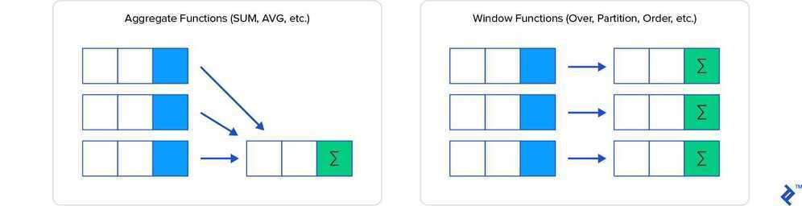

# Concepts

## Predicate

A WHERE clause is a predicate. Retrieving records from a database using a projection statement like SELECT and combining it with any other clause that limits or filters your result set is considered to be a predicate. A predicate is an assertion which returns true or false. Only the true path affects the result set

A predicate defines a logical condition being applied to rows in a table. SQL Predicates are found on the tail end of clauses, functions, and SQL expressions in existing query statements. It is an expression that evaluates to **TRUE**, **FALSE**, or **UNKNOWN**. Predicates are used in the search condition of **WHERE** clauses and **HAVING** clauses, the join conditions of **FROM** clauses, and other constructs where a Boolean value is required.

The Transact-SQL language supports the following predicates:

- In Operator
- Exists function
- Between Operator
- Like Operator
- All and any Operator
- Like

### LIKE Operator

LIKE is an operator that compares column values with a specified pattern. During pattern matching, regular characters must exactly match the characters specified in the character string. The data type of the column can be any character or date data type. There are certain characters within the pattern, called wildcard characters.

I have used four types of wildcards; they are:

- Percent sign (%): It is used to represent or search any string of zero or more characters.
- Underscore (_): It is used to represent or search a single character.
- Bracket ([]): It is used to represent or search any single character within the specified range.
- Caret (^): It is used to represent or search any single character not within the specified range.

## Example

`-- Like Operator`

`Select User_ID, FirstName, LastName, Salary from UserDetail where FirstName LIKE '%h%';`

<https://www.quora.com/What-is-a-predicate-in-SQL>

## SQL Subqueries

- A subquery is a SQL query within a query.
- Subqueries are nested queries that provide data to the enclosing query.
- Subqueries can return individual values or a list of records
- Subqueries must be enclosed with parenthesis

<https://www.dofactory.com/sql/subquery>

## SQL Window Functions

Window functions can be simply explained as calculation functions similar to aggregating, but where normal aggregating via theGROUP BYclause combines then hides the individual rows being aggregated, window functions have access to individual rows and can add some of the attributes from those rows into the result set.

<https://www.toptal.com/sql/intro-to-sql-windows-functions>

<https://mjk.space/advances-sql-window-frames>
