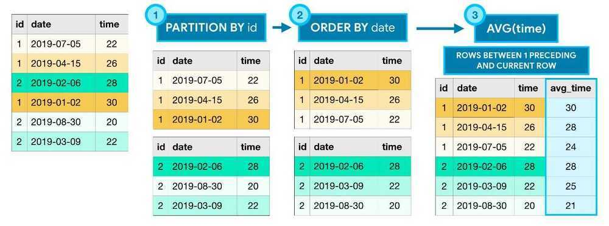

# Analytical Queries

Aggregate functions perform calculations based on sets of rows

Unlike aggregate functions, **analytic functions** return a (potentially different) value for each row in the original table.

All analytic functions have an **OVER** clause, which defines the sets of rows used in each calculation.

The OVER clause has three (optional) parts:

- The **PARTITION BY** clause divides the rows of the table into different groups
- The **ORDER BY** clause defines an ordering within each partition.
- The final clause (ROWS BETWEEN 1 PRECEDING AND CURRENT ROW) is known as a**window frame** clause. It identifies the set of rows used in each calculation. We can refer to this group of rows as a **window**. (Actually, analytic functions are sometimes referred to as **analytic window functions** or simply **window functions**)



There are many ways to write window frame clauses:

- **ROWS BETWEEN 1 PRECEDING AND CURRENT ROW** - the previous row and the current row.
- **ROWS BETWEEN 3 PRECEDING AND 1 FOLLOWING** - the 3 previous rows, the current row, and the following row.
- **ROWS BETWEEN UNBOUNDED PRECEDING AND UNBOUNDED FOLLOWING** - all rows in the partition.
- **ROWS BETWEEN UNBOUNDED PRECEDING AND CURRENT ROW** - a window frame that spans from the start of the partition to the current row, inclusive.

The lowest possible bound  is UNBOUNDED PRECEDING (the first row), the current row is CURRENT ROW and the highest possible row is UNBOUNDED FOLLOWING (the last row).

## Examples

```sql
SELECT time, buy,
  avg(buy) OVER (ORDER BY time rows between 1 preceding and current row) as average_2,
  avg(buy) OVER (ORDER BY time rows between 2 preceding and current row) as average_3
FROM my_table;

-- https://stackoverflow.com/questions/56063397/how-to-understand-the-results-of-rows-between-2-preceding-and-current-row

SELECT sale_day, sale_time, branch, article, quantity, revenue,
SUM(quantity) OVER (PARTITION BY article) AS total_units_sold
FROM sales;

SELECT DISTINCT article,
 EXTRACT('month' FROM sale_day) AS month,
 SUM(quantity) OVER (PARTITION BY article, sale_month) AS units_sold_month,
 SUM(quantity) OVER (PARTITION BY article) AS units_sold_year,
 ((SUM(quantity) OVER (PARTITION BY article, sale_month)::decimal / SUM(quantity) OVER (PARTITION BY article)::decimal ) * 100) AS month_percentage
FROM sales
WHERE EXTRACT('YEAR' FROM sale_day) = 2021
ORDER BY article, month

WITH branch_month_sales AS (
 SELECT DISTINCT
 branch,
 EXTRACT('MONTH' FROM sale_day) AS month,
 SUM(revenue) OVER (PARTITION BY branch, sale_month ) AS revenue
 FROM sales
)
SELECT branch,
 month,
 revenue AS revenue_current_month,
 LAG(revenue) OVER (PARTITION BY branch ORDER BY month) AS revenue_prev_month,
 revenue - LAG(revenue) OVER (PARTITION BY branch ORDER BY month) AS revenue_delta
FROM branch_month_sales
ORDER BY branch, month

-- using ANY_VALUE and IF to transpose rows in columns based on rank
WITH ranked_transactions AS (
SELECT
atr.userId,
atr.operation,
atr.confirmedAt,
ROW_NUMBER() OVER (PARTITION BY atr.userId
ORDER BY
atr.confirmedAt ASC) AS rn
FROM
all_transactions atr
)
SELECT
rt.UserId,
ANY_VALUE(IF(rt.rn = 1, rt.operation, NULL), TRUE) AS firstEntryProduct,
ANY_VALUE(IF(rt.rn = 2, rt.operation, NULL), TRUE) AS secondEntryProduct,
FROM ranked_transactions rt GROUP BY userId
```

## Links

[Window Functions](languages/sql/dql-data-query-language/window-functions.md)

[Aggregation Queries](languages/sql/dql-data-query-language/aggregation-queries.md)

**[What Is the OVER() Clause in SQL? | LearnSQL.com](https://learnsql.com/blog/sql-over-clause/)**

[ROWS PRECEDING and FOLLOWING in TSQL 2012 - Steve Stedman](https://stevestedman.com/2012/03/rows-preceding-and-following-in-tsql-2012/)
