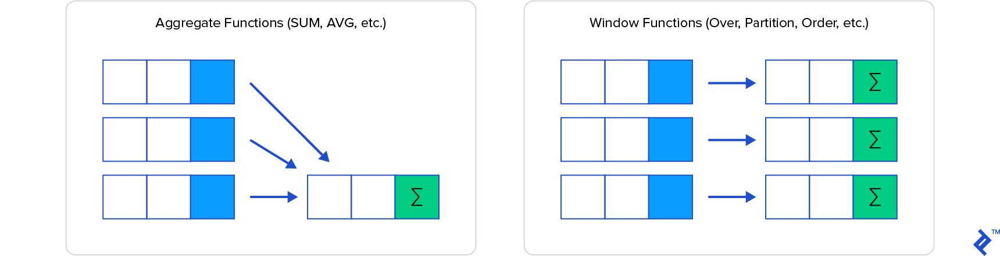

# Window Functions

Window functions can be simply explained as calculation functions similar to aggregating, but where normal aggregating via the GROUP BY clause combines then hides the individual rows being aggregated, window functions have access to individual rows and can add some of the attributes from those rows into the result set.



https://www.toptal.com/sql/intro-to-sql-windows-functions

https://mjk.space/advances-sql-window-frames

### Questions

#### What does a window function in SQL do?

A window function performs calculations over a set of rows, and uses information within the individual rows when required.

#### How is a window aggregate function different from a "group by" aggregate function?

With "group by," you can only aggregate columns not in the "group by" clause. Window functions allow you to gather both aggregate and non-aggregate values at once.

#### Can you use more than one window function in a single SELECT statement?

Yes, and this is a great advantage, since the window "frames" in each can be based on different filters.

#### Can I access previous data with window functions?

Yes, you can access both previous and future rows, using the LAG and LEAD functions.

#### Can I generate running totals with window functions?

Yes, you can add the ORDER BY clause to produce running totals on each row.

### What are window functions?

They make building **complex aggregations** much simpler. They are so powerful that they serve as a dividing point in time: people talk about SQL before window functions and SQL after window functions. After window functions and Common Table Expressions were introduced to SQL, SQL has become Turing complete!

Window functions operate on a group of rows, referred to as a window, and calculate a return value for each row based on the group of rows. Window functions are useful for processing tasks such as calculating a moving average, computing a cumulative statistic, or accessing the value of rows given the relative position of the current row.

## Syntax

```sql
function OVER { window_name | ( window_name ) | window_spec }

function
  { ranking_function | analytic_function | aggregate_function }

over_clause
  OVER { window_name | ( window_name ) | window_spec }

window_spec
  ( [ PARTITION BY partition [ , ... ] ] [ order_by ] [ window_frame ] )
```

## Parameters

### function

The function operating on the window. Different classes of functions support different configurations of window specifications.

#### ranking_function

Any of the [Ranking window functions](https://docs.databricks.com/sql/language-manual/sql-ref-functions-builtin.html#ranking-window-functions).

If specified the window_spec must include an [ORDER BY clause](https://docs.databricks.com/sql/language-manual/sql-ref-syntax-qry-select-orderby.html), but not a window_frame clause.

#### analytic_function

Any of the [Analytic window functions](https://docs.databricks.com/sql/language-manual/sql-ref-functions-builtin.html#analytic-window-functions).

#### aggregate_function

Any of the [Aggregate functions](https://docs.databricks.com/sql/language-manual/sql-ref-functions-builtin.html#aggregate-functions).

If specified the function must not include a FILTER clause.

### window_name

Identifies a [named window](https://docs.databricks.com/sql/language-manual/sql-ref-syntax-qry-select-named-window.html) specification defined by the [query](https://docs.databricks.com/sql/language-manual/sql-ref-syntax-qry-query.html).

### window_spec

This clause defines how the rows will be grouped, sorted within the group, and which rows within a partition a function operates on.

#### partition

One or more expression used to specify a group of rows defining the scope on which the function operates. If no PARTITION clause is specified the partition is comprised of all rows.

#### order_by

The [ORDER BY clause](https://docs.databricks.com/sql/language-manual/sql-ref-syntax-qry-select-orderby.html) specifies the order of rows within a partition.

#### window_frame

The [window frame clause](https://docs.databricks.com/sql/language-manual/sql-ref-syntax-window-functions-frame.html) specifies a sliding subset of rows within the partition on which the aggregate or analytics function operates.

You can specify SORT BY as an alias for ORDER BY.

You can also specify DISTRIBUTE BY as an alias for PARTITION BY. You can use CLUSTER BY as an alias for PARTITION BY in the absence of ORDER BY.

## Ranking Window Functions

|Function|Description|
|---|---|
|[dense_rank()](https://docs.databricks.com/sql/language-manual/functions/dense_rank.html)|Returns the rank of a value compared to all values in the partition.|
|[ntile(n)](https://docs.databricks.com/sql/language-manual/functions/ntile.html)|Divides the rows for each window partition into n buckets ranging from 1 to at most `n`.|
|[percent_rank()](https://docs.databricks.com/sql/language-manual/functions/percent_rank.html)|Computes the percentage ranking of a value within the partition.|
|[rank()](https://docs.databricks.com/sql/language-manual/functions/rank.html)|Returns the rank of a value compared to all values in the partition.|
|[row_number()](https://docs.databricks.com/sql/language-manual/functions/row_number.html)|Assigns a unique, sequential number to each row, starting with one, according to the ordering of rows within the window partition.|

### rank() vs dense_rank() vs row_number()

You will only see the difference if you have ties within a partition for a particular ordering value.

RANK numbers are skipped so there may be a gap in rankings, and may not be unique. DENSE_RANK numbers are not skipped so there will not be a gap in rankings, and may not be unique.

Unlike `DENSE_RANK`, `RANK` skips positions after equal rankings. The number of positions skipped depends on how many rows had an identical ranking. For example, Mary and Lisa sold the same number of products and are both ranked as #2. With `RANK`, the next position is #4; with `DENSE_RANK`, the next position is #3.

Both `RANK` and `RANK_DENSE` work on partitions of data

`RANK` and `DENSE_RANK` are deterministic in this case, all rows with the same value for both the ordering and partitioning columns will end up with an equal result, whereas `ROW_NUMBER` will arbitrarily (non deterministically) assign an incrementing result to the tied rows.

[What’s the Difference Between RANK and DENSE\_RANK in SQL? | LearnSQL.com](https://learnsql.com/cookbook/whats-the-difference-between-rank-and-dense_rank-in-sql/)

### Examples

```sql
-- RANK()
SELECT name,
         dept,
         RANK() OVER (PARTITION BY dept ORDER BY salary) AS rank
  FROM employees;

  Lisa       Sales  10000    1
  Alex       Sales  30000    2
  Evan       Sales  32000    3
  Fred Engineering  21000    1
   Tom Engineering  23000    2
 Chloe Engineering  23000    2
  Paul Engineering  29000    4
-- Rank - 1,2,2,4

-- DENSE_RANK()
SELECT name,
         dept,
         DENSE_RANK() OVER (PARTITION BY dept ORDER BY salary
                            ROWS BETWEEN UNBOUNDED PRECEDING AND CURRENT ROW) AS dense_rank
    FROM employees;

  Lisa       Sales  10000          1
  Alex       Sales  30000          2
  Evan       Sales  32000          3
  Fred Engineering  21000          1
   Tom Engineering  23000          2
 Chloe Engineering  23000          2
  Paul Engineering  29000          3
-- Rank - 1,2,2,3

-- Example
WITH T(StyleID, ID)
     AS (SELECT 1,1 UNION ALL
         SELECT 1,1 UNION ALL
         SELECT 1,1 UNION ALL
         SELECT 1,2)
SELECT *,
       RANK() OVER(PARTITION BY StyleID ORDER BY ID)       AS [RANK],
       ROW_NUMBER() OVER(PARTITION BY StyleID ORDER BY ID) AS [ROW_NUMBER],
       DENSE_RANK() OVER(PARTITION BY StyleID ORDER BY ID) AS [DENSE_RANK]
FROM   T

StyleID     ID       RANK      ROW_NUMBER      DENSE_RANK
----------- -------- --------- --------------- ----------
1           1        1         1               1
1           1        1         2               1
1           1        1         3               1
1           2        4         4               2
```

In the context of the query, the window frame (ROWS BETWEEN UNBOUNDED PRECEDING AND CURRENT ROW) is used by the DENSE_RANK() function to calculate the dense rank of each row within its respective department. The dense rank is determined by the order of the "salary" values within the partition.

The clause "ROWS BETWEEN UNBOUNDED PRECEDING AND CURRENT ROW" in the given query specifies the default window frame for the DENSE_RANK() function. If you omit this clause, the result will indeed remain the same because the default behaviour of the DENSE_RANK() function is to use the entire partition as the window frame.

## Analytic window functions

|Function|Description|
|---|---|
|[cume_dist()](https://docs.databricks.com/sql/language-manual/functions/cume_dist.html)|Returns the position of a value relative to all values in the partition.|
|[lag(expr[,offset[,default]])](https://docs.databricks.com/sql/language-manual/functions/lag.html)|Returns the value of `expr` from a preceding row within the partition.|
|[lead(expr[,offset[,default]])](https://docs.databricks.com/sql/language-manual/functions/lead.html)|Returns the value of `expr` from a subsequent row within the partition.|
|[nth_value(expr, offset[, ignoreNulls])](https://docs.databricks.com/sql/language-manual/functions/nth_value.html)|Returns the value of `expr` at a specific `offset` in the window.|

## SQL Window Functions Cheat Sheet


[SQL Window Functions Cheat Sheet | LearnSQL.com](https://learnsql.com/blog/sql-window-functions-cheat-sheet/)

## Links

- [Analytical Queries](languages/sql/dql-data-query-language/analytical-queries.md)
- [Aggregation Queries](languages/sql/dql-data-query-language/aggregation-queries.md)
- [What Is the OVER() Clause in SQL? | LearnSQL.com](https://learnsql.com/blog/sql-over-clause/)
- [Introducing Window Functions in Spark SQL - The Databricks Blog](https://www.databricks.com/blog/2015/07/15/introducing-window-functions-in-spark-sql.html)
- [Window functions | Databricks on AWS](https://docs.databricks.com/sql/language-manual/sql-ref-window-functions.html)
- [Window Functions - Spark 3.4.0 Documentation](https://spark.apache.org/docs/latest/sql-ref-syntax-qry-select-window.html)
- [Spark Window Functions with Examples - Spark By Examples](https://sparkbyexamples.com/spark/spark-sql-window-functions/)
- [8 Best SQL Window Function Articles | LearnSQL.com](https://learnsql.com/blog/best-window-functions-articles/)
- [5 Practical Examples of Using ROWS BETWEEN in SQL | LearnSQL.com](https://learnsql.com/blog/sql-window-functions-rows-clause/)
- [Introducing Window Functions in Spark SQL - The Databricks Blog](https://www.databricks.com/blog/2015/07/15/introducing-window-functions-in-spark-sql.html)
- [Spark Window Functions with Examples - Spark By Examples](https://sparkbyexamples.com/spark/spark-sql-window-functions/)
- [Calculate SQL Percentile using the PERCENT\_RANK function in SQL Server](https://www.sqlshack.com/calculate-sql-percentile-using-the-sql-server-percent_rank-function/)
- [motifanalytics.com/blog/a-beginners-guide-to-sequence-analytics-in-sql](https://www.motifanalytics.com/blog/a-beginners-guide-to-sequence-analytics-in-sql)
