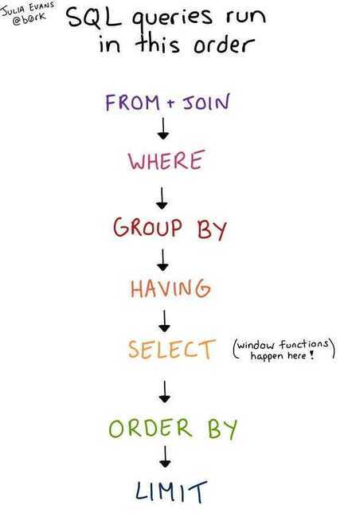

# Intro

**SQL is a declarative language, you tell the system what do you want, and system figures it out how to give it to you**

SQL (Structured Query Language) is a special-purpose programming language designed for managing information in a relational database management system (RDBMS). The word relational here is key; it specifies that the database management system is organized in such a way that there are clear relations defined between different sets of data. SQL operates through simple, declarative statements. This keeps data accurate and secure, and helps maintain the integrity of databases, regardless of size.

Typically, you need to extract, transform, and load data into your RDBMS before you're able to manage it using SQL,

### SQL Queries Syntax Order

`SELECT... FROM... WHERE... GROUP BY... HAVING... ORDER BY... LIMIT...`

### SQL Queries Execution Order - **FJWGHSOL**

https://jvns.ca/blog/2019/10/03/sql-queries-don-t-start-with-select

## How to describe tables

**City**

| **Field**   | **Type**     |
|-------------|--------------|
| ID          | NUMBER       |
| NAME        | VARCHAR2(17) |
| COUNTRYCODE | VARCHAR2(3)  |
| DISTRICT    | VARCHAR2(20) |
| POPULATION  | NUMBER       |

## Critique of SQL

SQL's shortcomings can be grouped into these categories:

- lack of proper orthogonality - SQL is hard to compose
- lack of compactness - SQL is a large language
- lack of consistency - SQL is inconsistent in syntax and semantics
- poor system cohesion - SQL does not integrate well enough with application languages and protocols

### SQL Naming Conventions

https://launchbylunch.com/posts/2014/Feb/16/sql-naming-conventions

## References

### Games

- [Solve SQL | HackerRank](https://www.hackerrank.com/domains/sql)
- https://mystery.knightlab.com
- https://selectstarsql.com
- https://littlekendra.com/course-category/sqlchallenges
- https://github.com/WebDevSimplified/Learn-SQL

### Others

- DBA
   	- [Becoming a Production MySQL DBA | Udemy](https://www.udemy.com/course/becoming-a-production-mysql-dba/)
   	- [MySQL Replication course from zero to hero | MySQL DBA | Udemy](https://www.udemy.com/course/mysql-replication-course-from-zero-to-hero/)
- [**SQL Concepts From A to Z**](http://www.helenanderson.co.nz/sql-concepts-from-a-to-z)
    - [Alias](https://www.helenanderson.co.nz/sql-concepts-from-a-to-z/#chapter-1)
    - [Begin transaction](https://www.helenanderson.co.nz/sql-concepts-from-a-to-z/#chapter-2)
    - [CTEs v subqueries](https://www.helenanderson.co.nz/sql-concepts-from-a-to-z/#chapter-3)
    - [Design](https://www.helenanderson.co.nz/sql-concepts-from-a-to-z/#chapter-4)
    - [ETL](https://www.helenanderson.co.nz/sql-concepts-from-a-to-z/#chapter-5)
    - [Function](https://www.helenanderson.co.nz/sql-concepts-from-a-to-z/#chapter-6)
    - [Group by](https://www.helenanderson.co.nz/sql-concepts-from-a-to-z/#chapter-7)
    - [Heaped storage](https://www.helenanderson.co.nz/sql-concepts-from-a-to-z/#chapter-8)
    - [Integrity](https://www.helenanderson.co.nz/sql-concepts-from-a-to-z/#chapter-9)
    - [Join](https://www.helenanderson.co.nz/sql-concepts-from-a-to-z/#chapter-10)
    - [Key](https://www.helenanderson.co.nz/sql-concepts-from-a-to-z/#chapter-11)
    - [Lock](https://www.helenanderson.co.nz/sql-concepts-from-a-to-z/#chapter-12)
    - [Massive parallel processing](https://www.helenanderson.co.nz/sql-concepts-from-a-to-z/#chapter-13)
    - [Normalisation](https://www.helenanderson.co.nz/sql-concepts-from-a-to-z/#chapter-14)
    - [OLTP v OLAP](https://www.helenanderson.co.nz/sql-concepts-from-a-to-z/#chapter-15)
    - [Privileges](https://www.helenanderson.co.nz/sql-concepts-from-a-to-z/#chapter-16)
    - [Query plan](https://www.helenanderson.co.nz/sql-concepts-from-a-to-z/#chapter-17)
    - [Disaster recovery](https://www.helenanderson.co.nz/sql-concepts-from-a-to-z/#chapter-18)
    - [System tables](https://www.helenanderson.co.nz/sql-concepts-from-a-to-z/#chapter-19)
    - [Truncate v Drop](https://www.helenanderson.co.nz/sql-concepts-from-a-to-z/#chapter-20)
    - [Union](https://www.helenanderson.co.nz/sql-concepts-from-a-to-z/#chapter-21)
    - [View](https://www.helenanderson.co.nz/sql-concepts-from-a-to-z/#chapter-22)
    - [Window function](https://www.helenanderson.co.nz/sql-concepts-from-a-to-z/#chapter-23)
    - [XML](https://www.helenanderson.co.nz/sql-concepts-from-a-to-z/#chapter-24)
    - [Year](https://www.helenanderson.co.nz/sql-concepts-from-a-to-z/#chapter-25)
    - [Zero](https://www.helenanderson.co.nz/sql-concepts-from-a-to-z/#chapter-26)
- https://dev.to/helenanders26/sql-201-10-ways-to-tweak-slow-running-queries-3pkb
- https://sql-steps.wizardzines.com
- https://hakibenita.com/sql-dos-and-donts
- http://bytepawn.com/how-i-write-sql-code.html#how-i-write-sql-code
- https://www.codecademy.com/courses/learn-sql/lessons/manipulation/exercises/sql
- https://www.codecademy.com/articles/what-is-rdbms-sql
- https://www.codecademy.com/articles/sql-commands?r=master
- [SQL 50 - Study Plan - LeetCode](https://leetcode.com/studyplan/top-sql-50/)
