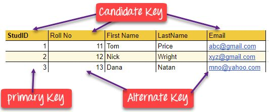

# Keys

## Keys

A DBMS key is an attribute or set of an attribute which helps you to identify a row(tuple) in a relation (table). They allow you to find the relation between two tables. Keys help you uniquely identify a row in a table by a combination of one or more columns in that table.

## Why we need a key

- Keys help you to identify any row of data in a table. In a real-world application, a table could contain thousands of records. Moreover, the records could be duplicated. Keys ensure that you can uniquely identify a table record despite these challenges.
- Allows you to establish a relationship between and identify the relation between tables
- Help you to enforce identity and integrity in the relationship.

## 7 types of Keys

- Super Key
- Primary Key
- Candidate Key
- Alternate Key
- Foreign Key
- Compound Key
- Composite Key
- Surrogate Key

## What is the Super key?

A superkey is a group of single or multiple keys which identifies rows in a table. A Super key may have additional attributes that are not needed for unique identification.

Example:

| **EmpSSN** | **EmpNum** | **Empname** |
|------------|------------|-------------|
| 9812345098 | AB05       | Shown       |
| 9876512345 | AB06       | Roslyn      |
| 199937890  | AB07       | James       |

In the above-given example, EmpSSN and EmpNum name are superkeys.

## What is a Primary Key?

A column or group of columns in a table which helps us to uniquely identifies every row in that table is called a primary key. The same value can't appear more than once in the table.

Rules for defining Primary key:

- Two rows can't have the same primary key value
- It must for every row to have a primary key value.
- The primary key field cannot be null.
- The value in a primary key column can never be modified or updated if any foreign key refers to that primary key.

Example:

In the following example, StudID is a Primary Key.

| **StudID** | **Roll No** | **First Name** | **LastName** | **Email** |
|---|---|---|---|---|
| 1 | 11 | Tom | Price | abc@gmail.com |
| 2 | 12 | Nick | Wright | xyz@gmail.com |
| 3 | 13 | Dana | Natan | mno@yahoo.com |

## What is the Alternate key?

All the keys which are not primary key are called an alternate key. It is a candidate key which is currently not the primary key. However, A table may have single or multiple choices for the primary key.

Example

StudID, Roll No, Email are qualified to become a primary key. But since StudID is the primary key, Roll No, Email becomes the alternative key.

| **StudID** | **Roll No** | **First Name** | **LastName** | **Email** |
|---|---|---|---|---|
| 1 | 11 | Tom | Price | abc@gmail.com |
| 2 | 12 | Nick | Wright | xyz@gmail.com |
| 3 | 13 | Dana | Natan | mno@yahoo.com |

## What is a Candidate Key?

A super key with no repeated attribute is called candidate key.

The Primary key should be selected from the candidate keys. Every table must have at least a single candidate key.

Properties of Candidate key:

- It must contain unique values
- Candidate key may have multiple attributes
- Must not contain null values
- It should contain minimum fields to ensure uniqueness
- Uniquely identify each record in a table

Example: In the given table Stud ID, Roll No, and email are candidate keys which help us to uniquely identify the student record in the table.

| **StudID** | **Roll No** | **First Name** | **LastName** | **Email** |
|---|---|---|---|---|
| 1 | 11 | Tom | Price | abc@gmail.com |
| 2 | 12 | Nick | Wright | xyz@gmail.com |
| 3 | 13 | Dana | Natan | mno@yahoo.com |

## What is the Foreign key?

A foreign key is a column which is added to create a relationship with another table. Foreign keys help us to maintain data integrity and also allows navigation between two different instances of an entity. Every relationship in the model needs to be supported by a foreign key.

Example:

| DeptCode | DeptName |
|----------|----------|
| 001      | Science  |
| 002      | English  |
| 005      | Computer |

| Teacher ID | Fname | Lname   |
|------------|-------|---------|
| B002       | David | Warner  |
| B017       | Sara  | Joseph  |
| B009       | Mike  | Brunton |

In this example, we have two table, teach and department in a school. However, there is no way to see which search work in which department.

In this table, adding the foreign key in Deptcode to the Teacher name, we can create a relationship between the two tables.

| Teacher ID | DeptCode | Fname | Lname   |
|------------|----------|-------|---------|
| B002       | 002      | David | Warner  |
| B017       | 002      | Sara  | Joseph  |
| B009       | 001      | Mike  | Brunton |

This concept is also known as Referential Integrity.

## What is the Compound key?

Compound key has many fields which allow you to uniquely recognize a specific record. It is possible that each column may be not unique by itself within the database. However, when combined with the other column or columns the combination of composite keys become unique.

Example:

| OrderNo | ProductID | Product Name  | Quantity |
|---------|-----------|---------------|----------|
| B005    | JAP102459 | Mouse         | 5        |
| B005    | DKT321573 | USB           | 10       |
| B005    | OMG446789 | LCD Monitor   | 20       |
| B004    | DKT321573 | USB           | 15       |
| B002    | OMG446789 | Laser Printer | 3        |

In this example, OrderNo and ProductID can't be a primary key as it does not uniquely identify a record. However, a compound key of Order ID and Product ID could be used as it uniquely identified each record.

## What is the Composite key?

A key which has multiple attributes to uniquely identify rows in a table is called a composite key. The difference between compound and the composite key is that any part of the compound key can be a foreign key, but the composite key may or maybe not a part of the foreign key.

## What is a Surrogate Key?

An artificial key which aims to uniquely identify each record is called a surrogate key. These kind of key are unique because they are created when you don't have any natural primary key. They do not lend any meaning to the data in the table. Surrogate key is usually an integer.

| Fname | Lastname | Start Time | End Time |
|-------|----------|------------|----------|
| Anne  | Smith    | 09:00      | 18:00    |
| Jack  | Francis  | 08:00      | 17:00    |
| Anna  | McLean   | 11:00      | 20:00    |
| Shown | Willam   | 14:00      | 23:00    |

Above, given example, shown shift timings of the different employee. In this example, a surrogate key is needed to uniquely identify each employee.

Surrogate keys are allowed when

- No property has the parameter of the primary key.
- In the table when the primary key is too big or complicated.

## Difference Between Primary key & Foreign key

| **Primary Key** | **Foreign Key** |
|---|---|
| Helps you to uniquely identify a record in the table. | It is a field in the table that is the primary key of another table. |
| Primary Key never accept null values. | A foreign key may accept multiple null values. |
| Primary key is a clustered index and data in the DBMS table are physically organized in the sequence of the clustered index. | A foreign key cannot automatically create an index, clustered or non-clustered. However, you can manually create an index on the foreign key. |
| You can have the single Primary key in a table. | You can have multiple foreign keys in a table. |

https://www.freecodecamp.org/news/primary-key-sql-tutorial-how-to-define-a-primary-key-in-a-database

Whenever you're choosing a Primary Key, think of an identity crisis.
