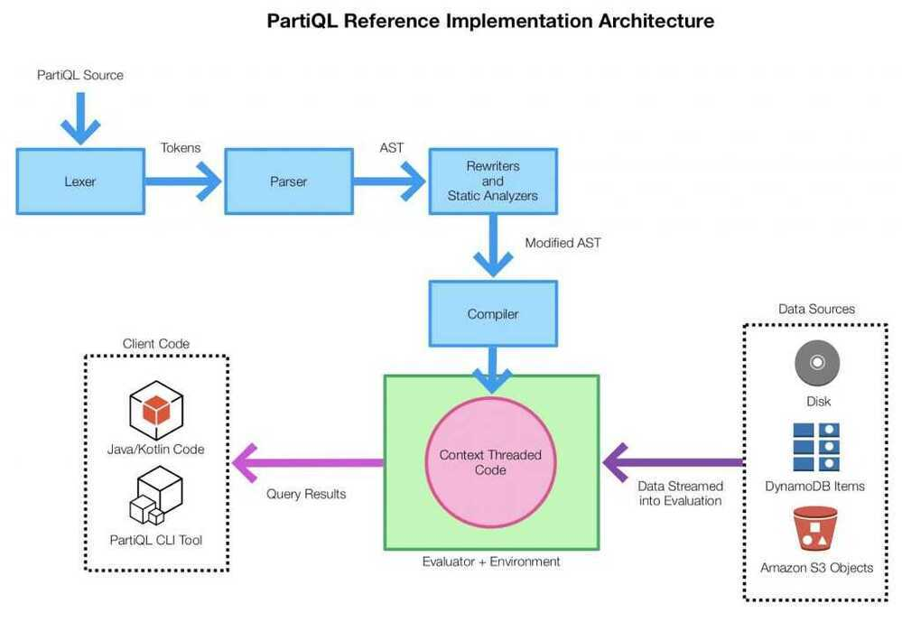

# PartiQL

Data may also reside in the data lake, stored in formats that may lack schema, or may involve nesting or multiple values (e.g., [Parquet](https://parquet.apache.org/), JSON). Every different type and flavor of data store may suit a particular use case, but each also comes with its own query language. The result is tight coupling between the query language and the format in which data is stored. Hence, if you want to change your data to another format, or change the database engine you use to access/process that data (which is not uncommon in a data lake world), or change the location of your data, you may also need to change your application and queries. This is a very large obstacle to the agility and flexibility needed to effectively use data lakes.

Today we are happy to announce [PartiQL](https://partiql.org/), a SQL-compatible query language that makes it easy to efficiently query data, regardless of where or in what format it is stored. As long as your query engine supports PartiQL, you can process structured data from relational databases (both transactional and analytical), semi-structured and nested data in open data formats (such as an Amazon S3 data lake), and even schema-less data in NoSQL or document databases that allow different attributes for different rows. We are open sourcing the PartiQL [tutorial](https://partiql.org/tutorial.html), [specification](https://partiql.org/assets/PartiQL-Specification.pdf), and a [reference implementation](https://github.com/partiql/) of the language under the Apache2.0 license, so that everyone can participate, contribute, and use it to drive widespread adoption for this unifying query language.

The PartiQL open source will make it easy for developers to parse and embed PartiQL in their own applications. The implementation supports users parsing PartiQL queries into abstract syntax trees that their applications can analyze or process and supports interpreting PartiQL queries directly.

## PartiQL design tenets

- **SQL compatibility:** PartiQL facilitates adoption by maintaining compatibility with SQL. Existing SQL queries will continue to work (that is, they will maintain their syntax and semantics) in SQL query processors that are extended to provide PartiQL. This avoids any need to rewrite existing SQL, and makes it easy for developers and business intelligence tools to leverage PartiQL.
- **First-class nested data:** The data model treats nested data as a fundamental part of the data abstraction. Consequently, the PartiQL query language provides syntax and semantics that comprehensively and accurately access and query nested data, while naturally composing with the standard features of SQL.
- **Optional schema and query stability:** PartiQL does not require a predefined schema over a dataset. It is designed to be usable by database engines that assume the presence of a schema (be it schema-on-write or schema-on-read) or schemaless engines. Technically, the result of a working query does not change as a schema is imposed on existing data, so long as the data itself remains the same. It is thus easier to provide consistent access to multiple stores, despite the different schema assumptions of the participating engines.
- **Minimal extensions:** PartiQL has a minimum number of extensions over SQL. The extensions are easy to understand, lend themselves to efficient implementation, and compose well with each other and with SQL itself. This enables intuitive filtering, joining, aggregation, and windowing on the combination of structured, semi-structured, and nested datasets.
- **Format independence:** PartiQL syntax and semantics are not tied to any particular data format. A query is written identically across underlying data in JSON, Parquet, ORC, CSV, Ion, or other formats. Queries operate on a comprehensive logical type system that maps to diverse underlying formats.
- **Data store independence:** PartiQL syntax and semantics are not tied to a particular underlying data store. Thanks to its expressiveness, the language is applicable to diverse underlying data stores.

https://aws.amazon.com/blogs/opensource/announcing-partiql-one-query-language-for-all-your-data

https://docs.aws.amazon.com/amazondynamodb/latest/developerguide/ql-reference.html
