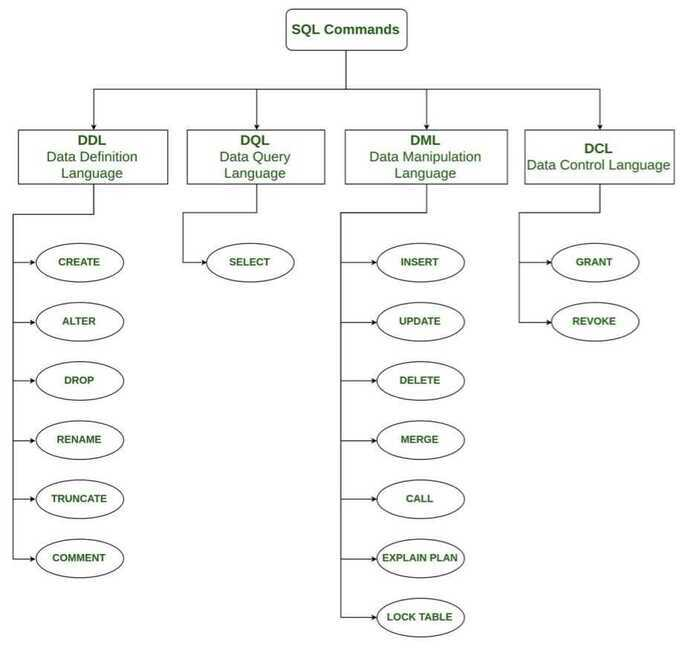

# SQL Commands

## Types

1. DDL - data definition language, such as CREATE, ALTER, DROP
2. DQL - data query language, such as SELECT
3. DML - data manipulation language, such as INSERT, UPDATE, DELETE
4. DCL - data control language, such as GRANT, REVOKE
5. TCL - transaction control language, such as COMMIT, ROLLBACK




## QUERIES

### SHOW

```sql
SHOW CREATE TABLE tbl_name

SHOW FIELDS FROM tbl_name;

SHOW CHARACTER SET;

SHOW GLOBAL VARIABLES where Variable_Name='innodb_buffer_pool_size';
```

### AND

AND is an operator that combines two conditions. Both conditions must be true for the row to be included in the result set.

```sql
SELECT column_name(s)
FROM table_name
WHERE column_1 = value_1
AND column_2 = value_2;
```

### AS

AS is a keyword in SQL that allows you to rename a column or table using an alias.

```sql
SELECT column_name AS 'Alias'
FROM table_name;
```

### BETWEEN

The BETWEEN operator is used to filter the result set within a certain range. The values can be numbers, text or dates.

```sql
SELECT column_name(s)
FROM table_name
WHERE column_name BETWEEN value_1 AND value_2;

SELECT *
FROM movies
WHERE name BETWEEN 'D%' and 'G%';
-- This will select all movies that starts with D, E, F and not G.
```

### CASE

CASE expression is essentially the 'if/then' of the SQL world. Given one value, CASE can return another of your choice - but did you know you're able to use it in ORDER BY clauses to define custom orders based upon other values?

Here's a simple use case. Let's say you have a table listing employees and their job titles:

| **id** | **name** | **title** |
|--------|-----------|-----------|
| 1      | Oscar     | Cleaner   |
| 2      | Carol     | CEO       |
| 3      | Jimbo     | CFO       |
| 4      | Bobby     | Assistant |

If you wanted to have some sort of order based upon job titles, you could use CASE like so:

```sql
SELECT * FROM employees ORDER BY
    CASE
    WHEN title = 'CEO' THEN 1
    WHEN title = 'CFO' THEN 2
    WHEN title = 'CTO' THEN 2
    ELSE 3
    END;
-- (Work in MS SQL Server not in Oracle)
SELECT name,
    CASE
    WHEN genre = 'romance' THEN 'Chill'
    WHEN genre = 'comedy' THEN 'Chill'
    ELSE 'Intense'
    END AS 'Mood'
FROM movies;

SELECT
    CASE
        WHEN Grades.Grade < 8 THEN NULL
        ELSE Students.Name
    END AS 'Student_Name',
    Grades.Grade, Students.Marks
FROM Students
JOIN Grades
ON Students.Marks BETWEEN Grades.Min_Mark and Grades.Max_Mark
ORDER BY Grades.Grade DESC, Students.Name, Students.Marks;
```

### HAVING

HAVING statement always comes after GROUP BY, but before ORDER BY and LIMIT.

```sql
SELECT column_name, aggregate_function(column_name)
FROM table_name
WHERE column_name operator value
GROUP BY column_name
HAVING aggregate_function(column_name) operator value
```

### IN

```sql
    SELECT column_name(s)
    FROM table_name
    WHERE column_name
    IN (value1,value2,..)
```

### OR

OR is an operator that filters the result set to only include rows where either condition is true.

```sql
SELECT column_name
FROM table_name
WHERE column_name = value_1
OR column_name = value_2;
```

### ORDER BY

ORDER BY is a clause that indicates you want to sort the result set by a particular column either alphabetically or numerically.

```sql
SELECT column_name
FROM table_name
ORDER BY column_name ASC|DESC;

SELECT Name
FROM STUDENTS
WHERE Marks > 75
ORDER BY RIGHT(NAME, 3), ID ASC;
```

#### `ORDER BY ALL`

A shorthand equivalent to specifying all expressions in the `SELECT` list in the order they occur. If `sort_direction` or `nulls_sort_order` are specified they apply to each expression.

[ORDER BY clause | Databricks on AWS](https://docs.databricks.com/sql/language-manual/sql-ref-syntax-qry-select-orderby.html)

### LIKE

LIKE is a special operator used with the WHERE clause to search for a specific pattern in a column.

```sql
SELECT column_name(s)
FROM table_name
WHERE column_name LIKE pattern;

SELECT * FROM movies WHERE name LIKE 'Se_en';

-- MY SQL
SELECT DISTINCT CITY
FROM STATION
WHERE
    CITY LIKE 'a%' OR
    CITY LIKE 'e%' OR
    CITY LIKE 'i%' OR
    CITY LIKE 'o%' OR
    CITY LIKE 'u%';

-- MS SQL SERVER
SELECT DISTINCT CITY
FROM STATION
WHERE
    CITY LIKE '%[aeiou]';

-- Here _ in a wildcard for substituting any value % is a wildcard character that matches zero or more missing letters in the pattern
```

LIKE is an operator that compares column values with a specified pattern. During pattern matching, regular characters must exactly match the characters specified in the character string. The data type of the column can be any character or date data type. There are certain characters within the pattern, called wildcard characters.

I have used four types of wildcards; they are:

- Percent sign `(%)`: It is used to represent or search any string of zero or more characters.
- Underscore `(_)`: It is used to represent or search a single character.
- Bracket `([])`: It is used to represent or search any single character within the specified range.
- Caret `(^)`: It is used to represent or search any single character not within the specified range.

`SELECT User_ID, FirstName, LastName, Salary FROM UserDetail WHERE FirstName LIKE '%h%';`

#### LIKE BINARY

The BINARY function converts a value to a binary string.

LIKE BINARY is used for case insensitive search

### LIMIT

LIMIT is a clause that lets you specify the maximum number of rows the result set will have.

```sql
SELECT column_name(s)
FROM table_name
LIMIT number;
```

### WHERE

WHERE is a clause that indicates you want to filter the result set to include only rows where the following condition is true.

```sql
SELECT column_name(s)
FROM table_name
WHERE column_name operator value;
```

## COMBINING TABLES

[SQL Joins](languages/sql/sql-joins.md)

### UNION

This will add all rows of table_name2 on top of table_name1

While a JOIN combines rows of columns horizontally, a UNION combines the results vertically. Using a UNION combines the result of two queries into one column and removes duplicates. If your query has multiple columns, they need to be in the same order to complete the UNION.

```sql
SELECT column_name(s) FROM table_name1
UNION
SELECT column_name(s) FROM table_name2
```

### UNION ALL

The SQL UNION ALL operator is used to combine the result sets of 2 or more SELECT statements. It does not remove duplicate rows between the various SELECT statements (all rows are returned).

Each SELECT statement within the UNION ALL must have the same number of fields in the result sets with similar data types.

**What is the difference between UNION and UNION ALL?**

- UNION removes duplicate rows.
- UNION ALL does not remove duplicate rows.
- Always use UNION ALL unless you need to eliminate duplicate records. By using UNION ALL, you'll avoid the expensive distinct operation the database applies when using a UNION clause.

```sql
SELECT column_name(s) FROM table_name1
UNION ALL
SELECT column_name(s) FROM table_name2
```

### INTERSECT

Well, `UNION` gave you all the results from the first query PLUS the results from the second query. `INTERSECT`, on the other hand, only shows the rows which belong to **BOTH** tables.

```sql
-- names of each person who has medals both in cycling and in skating.
select person from skating
INTERSECT
select person from cycling
```

### EXCEPT

`EXCEPT` shows all the results from the first (left) table with the **exception** of those that also appeared in the second (right) table.

Some databases use the keyword `MINUS` instead of `EXCEPT`.

```sql
-- all the countries which have a medal in cycling but not in skating.
select country from cycling
except
select country from skating
```

### WITH

```sql
WITH previous_query AS (
    SELECT customer_id,
    COUNT(subscription_id) AS 'subscriptions'
    FROM orders
    GROUP BY customer_id
)
SELECT customers.customer_name,
    previous_query.subscriptions
FROM previous_query
JOIN customers
ON previous_query.customer_id = customers.customer_id;
```

**Can be nested**

```sql
WITH
query1 AS (SELECT column1 FROM table1 WHERE condition1),
query2 AS (SELECT column2 FROM table2 WHERE condition2)
    …
```

## SQL Server Clauses

**Over Clause**

**Partition By clause**

The `PARTITION BY` clause is a subclause of the `OVER` clause. The `PARTITION BY` clause divides a query's result set into partitions. The [window function](http://www.sqltutorial.org/sql-window-functions/) is operated on each partition separately and recalculate for each partition.

## MYSQL

Using % for mod (In oracle use **mod()** function)

```sql
SELECT DISTINCT CITY FROM STATION WHERE ID%2 = 0;

-- LENGTH
SELECT LENGTH("SQL Tutorial") AS LengthOfString;

-- CEIL
SELECT CEIL((AVG(salary)) - (AVG(REPLACE(salary, '0', '')))) AS avg_salary FROM employees;

SELECT @@innodb_buffer_pool_size;

-- Information Schema MySQL
select * from information_schema.CHARACTER_SETS;
select * from information_schema.COLLATIONS;
select * from information_schema.COLLATION_CHARACTER_SET_APPLICABILITY;
select * from information_schema.COLUMNS;
select * from information_schema.EVENTS;
select * from information_schema.FILES;
select * from information_schema.KEY_COLUMN_USAGE;
select * from information_schema.PARAMETERS;
select * from information_schema.PARTITIONS;
select * from information_schema.REFERENTIAL_CONSTRAINTS;
select * from information_schema.ROUTINES;
select * from information_schema.SCHEMATA;
select * from information_schema.STATISTICS;
    STATISTICS.CARDINALITY
select * from information_schema.TABLES;
    TABLES.AUTO_INCREMENT
    TABLES.AVG_ROW_LENGTH
    TABLES.CHECKSUM
    TABLES.CHECK_TIME
    TABLES.CREATE_TIME
    TABLES.DATA_FREE
    TABLES.DATA_LENGTH
    TABLES.INDEX_LENGTH
    TABLES.MAX_DATA_LENGTH
    TABLES.TABLE_ROWS
    TABLES.UPDATE_TIME
select * from information_schema.TABLE_CONSTRAINTS;
select * from information_schema.TRIGGERS;
select * from information_schema.VIEWS;
```
