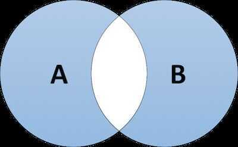

# SQL Joins

The SQL Joins clause is used to combine records from two or more tables in a database. A JOIN is a means for combining fields from two tables by using values common to each.

Default join is **INNER JOIN**

## Types of Joins

### Inner Join

The inner join is probably the most commonly-used type of join in SQL. Inner joins return all rows from two or more tables that meet the join condition.


```sql
SELECT columns
FROM TableA
INNER JOIN TableB
ON A.columnName = B.columnName;
```

### Left [Outer] Join

The left outer join (sometimes abbreviated to left join) returns all rows from the left-hand table specified in the ON condition and only the rows from the right-hand table that meet the join condition.


Sample SQL

```sql
SELECT columns
FROM TableA
LEFT OUTER JOIN TableB
ON A.columnName = B.columnName
```

### Left [Outer] Join without Intersection

This join is a variant on the basic left outer join, but instead, it returns all rows from theleft-hand table specified in the ON condition that also meet the join condition andnoneof the rows from theright-hand table that meet the join condition.


Sample SQL

```sql
SELECT columns
FROM TableA
LEFT OUTER JOIN TableB
ON A.columnName = B.columnName
WHERE B.columnName IS NULL
```

### Right [Outer] Join

The right outer join (sometimes abbreviated to right join) returns all rows from theright-hand table specified in the ON condition andonlythe rows from theleft-hand table that meet the join condition.


Sample SQL

```sql
SELECT columns
FROM TableA
RIGHT OUTER JOIN TableB
ON A.columnName = B.columnName
```

### Right [Outer] Join without Intersection

This join is a variant on the basic right outer join, but instead, it returns all rows from theright-hand table specified in the ON condition that also meet the join condition andnoneof the rows from theleft-hand table that meet the join condition.


Sample SQL

```sql
SELECT columns
FROM TableA
RIGHT OUTER JOIN TableB
ON A.columnName = B.columnName
WHERE A.columnName IS NULL
```

### Full [Outer] Join

The full outer join (sometimes abbreviated to full join) returns all rows from both tables named in the ON condition where the join condition isnotmet (including NULL values).


Sample SQL

```sql
SELECT columns
FROM TableA
FULL JOIN TableB
ON A.columnName = B.columnName
```

### Full [Outer] Join without Intersection

This variant of the full outer join (sometimes abbreviated to full join) returns all rows from both tables named in the ON condition where the join condition isnotmet (excluding NULL values).



Sample SQL

```sql
SELECT columns
FROM TableA
FULL JOIN TableB
ON A.columnName = B.columnName
WHERE A.columnName IS NULL
OR B.columnName IS NULL
```

- **Self Join -** is used to join a table to itself as if the table were two tables, temporarily renaming at least one table in the SQL statement
- **Cartesian Join -** returns the Cartesian product of the sets of records from the two or more joined tables
- **Cross Join -** A CROSS JOIN joins everything with everything. There is no need to provide a key to join on and it can result in a very big data set

## [Joins 13 Ways](https://justinjaffray.com/joins-13-ways/)

- [A join is a lookup](https://justinjaffray.com/joins-13-ways/#a-join-is-a-lookup)
- [A join is a nested loop over rows](https://justinjaffray.com/joins-13-ways/#a-join-is-a-nested-loop-over-rows)
- [A join is a nested loop over columns](https://justinjaffray.com/joins-13-ways/#a-join-is-a-nested-loop-over-columns)
- [A join is compatible alternate realities](https://justinjaffray.com/joins-13-ways/#a-join-is-compatible-alternate-realities)
- [A join is flatMap](https://justinjaffray.com/joins-13-ways/#a-join-is-flatmap)
- [A join is the solution to the N+1 problem](https://justinjaffray.com/joins-13-ways/#a-join-is-the-solution-to-the-n1-problem)
- [A join is paths through a graph](https://justinjaffray.com/joins-13-ways/#a-join-is-paths-through-a-graph)
- [A join is a minimal model](https://justinjaffray.com/joins-13-ways/#a-join-is-a-minimal-model)
- [A join is typechecking](https://justinjaffray.com/joins-13-ways/#a-join-is-typechecking)
- [A join is an operation in the Set monad](https://justinjaffray.com/joins-13-ways/#a-join-is-an-operation-in-the-set-monad)
- [A join is the biggest acceptable relation](https://justinjaffray.com/joins-13-ways/#a-join-is-the-biggest-acceptable-relation)
- [A join is a…join](https://justinjaffray.com/joins-13-ways/#a-join-is-ajoin)
- [A join is a ring product](https://justinjaffray.com/joins-13-ways/#a-join-is-a-ring-product)

## References

[Join Algorithms](languages/sql/join-algorithms.md)

[Spark Joins](technologies/apache/apache-spark/07-joins.md)

<http://www.sql-join.com/sql-join-types>

<https://www.freecodecamp.org/news/sql-joins-tutorial>

[JOIN | Databricks on AWS](https://docs.databricks.com/sql/language-manual/sql-ref-syntax-qry-select-join.html#examples)
