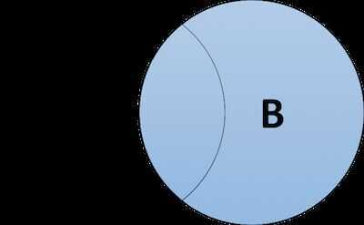
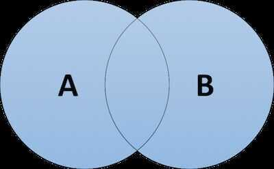

# SQL Joins

The SQL Joins clause is used to combine records from two or more tables in a database. A JOIN is a means for combining fields from two tables by using values common to each.

Default join is **INNER JOIN**

## Types of Joins

### Inner Join / Join (Default)

The inner join is probably the most commonly-used type of join in SQL. Inner joins return all rows from two or more tables that meet the join condition.


```sql
SELECT columns FROM TableA
INNER JOIN TableB
ON A.columnName = B.columnName;
```

### Left [Outer] Join / Outer Join / Left Join

The left outer join (sometimes abbreviated to left join) returns all rows from the left-hand table specified in the ON condition and only the rows from the right-hand table that meet the join condition.

An outer join will combine rows from different tables even if the the join condition is not met. Every row in the left table is returned in the result set, and if the join condition is not met, then NULL values are used to fill in the columns from the right table.


Sample SQL

```sql
SELECT columns FROM TableA
LEFT OUTER JOIN TableB
ON A.columnName = B.columnName

SELECT column_name(s) FROM table_1
LEFT JOIN table_2
ON table_1.column_name = table_2.column_name;
```

### Left [Outer] Join without Intersection

This join is a variant on the basic left outer join, but instead, it returns all rows from the left-hand table specified in the ON condition that also meet the join condition and none of the rows from the right-hand table that meet the join condition.


Sample SQL

```sql
SELECT columns FROM TableA
LEFT OUTER JOIN TableB
ON A.columnName = B.columnName
WHERE B.columnName IS NULL
```

### Right [Outer] Join / Right Join

The right outer join (sometimes abbreviated to right join) returns all rows from the right-hand table specified in the ON condition and only the rows from the left-hand table that meet the join condition.



Sample SQL

```sql
SELECT columns FROM TableA
RIGHT OUTER JOIN TableB
ON A.columnName = B.columnName

SELECT column_name(s)
FROM table_name1
RIGHT JOIN table_name2
ON table_name1.column_name=table_name2.column_name
```

### Right [Outer] Join without Intersection

This join is a variant on the basic right outer join, but instead, it returns all rows from theright-hand table specified in the ON condition that also meet the join condition andnoneof the rows from theleft-hand table that meet the join condition.


Sample SQL

```sql
SELECT columns FROM TableA
RIGHT OUTER JOIN TableB
ON A.columnName = B.columnName
WHERE A.columnName IS NULL
```

### Full [Outer] Join / Full Join

The full outer join (sometimes abbreviated to full join) returns all rows from both tables named in the ON condition where the join condition is not met (including NULL values).



Sample SQL

```sql
SELECT columns FROM TableA
FULL JOIN TableB
ON A.columnName = B.columnName
```

### Full [Outer] Join without Intersection

This variant of the full outer join (sometimes abbreviated to full join) returns all rows from both tables named in the ON condition where the join condition isnotmet (excluding NULL values).


Sample SQL

```sql
SELECT columns FROM TableA
FULL JOIN TableB
ON A.columnName = B.columnName
WHERE A.columnName IS NULL
OR B.columnName IS NULL
```

### Self Join

Self join is used to join a table to itself as if the table were two tables, temporarily renaming at least one table in the SQL statement

```sql
SELECT A1.*, A2.*
FROM TableA A1
JOIN TableA A2
ON A1.id = A2.id
WHERE A1.columnName < A.columnName
```

[Illustrated Guide About Self Join in SQL - StrataScratch](https://www.stratascratch.com/blog/illustrated-guide-about-self-join-in-sql)

### Cartesian Join

Cartesian join returns the Cartesian product of the sets of records from the two or more joined tables

### Cross Join

A CROSS JOIN joins everything with everything. There is no need to provide a key to join on and it can result in a very big data set

Sometimes, we just want to combine all rows of one table with all rows of another table.

For instance, if we had a table of shirts and a table of pants, we might want to know all the possible combinations to create different outfits.

```sql
SELECT shirts.shirt_color, pants.pants_color FROM shirts CROSS JOIN pants;

-- students which has lower marks than any other students
SELECT s1.name FROM students s1 CROSS JOIN students s2 WHERE s1.marks < s2.marks;

SELECT month,
    COUNT(*)
FROM newspaper
CROSS JOIN months
WHERE start_month <= month
    AND end_month >= month
GROUP BY month;
```

### Equi Join / equijoin / equi-join

EQUI JOIN creates a JOIN for equality or matching column(s) values of the relative tables. EQUI JOIN also create JOIN by using JOIN with ON and then providing the names of the columns with their relative tables to check equality using equal sign (=).

```sql
SELECT student.name, student.id, record.class, record.city
FROM student, record
WHERE student.city = record.city;

SELECT student.name, student.id, record.class, record.city
FROM student
JOIN record
ON student.city = record.city;
```

[SQL | EQUI Join and NON EQUI JOIN - GeeksforGeeks](https://www.geeksforgeeks.org/sql-equi-join-and-non-equi-join/)

### Non Equi Join / non-equi join

NON EQUI JOIN performs a JOIN using comparison operator other than equal(=) sign like `>, <, >=, <=` with conditions.

```sql
SELECT student.name, record.id, record.city
FROM student, record
WHERE Student.id < Record.id ;
```

## [Joins 13 Ways](https://justinjaffray.com/joins-13-ways/)

- [A join is a lookup](https://justinjaffray.com/joins-13-ways/#a-join-is-a-lookup)
- [A join is a nested loop over rows](https://justinjaffray.com/joins-13-ways/#a-join-is-a-nested-loop-over-rows)
- [A join is a nested loop over columns](https://justinjaffray.com/joins-13-ways/#a-join-is-a-nested-loop-over-columns)
- [A join is compatible alternate realities](https://justinjaffray.com/joins-13-ways/#a-join-is-compatible-alternate-realities)
- [A join is flatMap](https://justinjaffray.com/joins-13-ways/#a-join-is-flatmap)
- [A join is the solution to the N+1 problem](https://justinjaffray.com/joins-13-ways/#a-join-is-the-solution-to-the-n1-problem)
- [A join is paths through a graph](https://justinjaffray.com/joins-13-ways/#a-join-is-paths-through-a-graph)
- [A join is a minimal model](https://justinjaffray.com/joins-13-ways/#a-join-is-a-minimal-model)
- [A join is typechecking](https://justinjaffray.com/joins-13-ways/#a-join-is-typechecking)
- [A join is an operation in the Set monad](https://justinjaffray.com/joins-13-ways/#a-join-is-an-operation-in-the-set-monad)
- [A join is the biggest acceptable relation](https://justinjaffray.com/joins-13-ways/#a-join-is-the-biggest-acceptable-relation)
- [A join is a…join](https://justinjaffray.com/joins-13-ways/#a-join-is-ajoin)
- [A join is a ring product](https://justinjaffray.com/joins-13-ways/#a-join-is-a-ring-product)

## References

[Join Algorithms](languages/sql/join-algorithms.md)

[Spark Joins](technologies/apache-spark/07-joins.md)

http://www.sql-join.com/sql-join-types

https://www.freecodecamp.org/news/sql-joins-tutorial

[JOIN | Databricks on AWS](https://docs.databricks.com/sql/language-manual/sql-ref-syntax-qry-select-join.html#examples)
