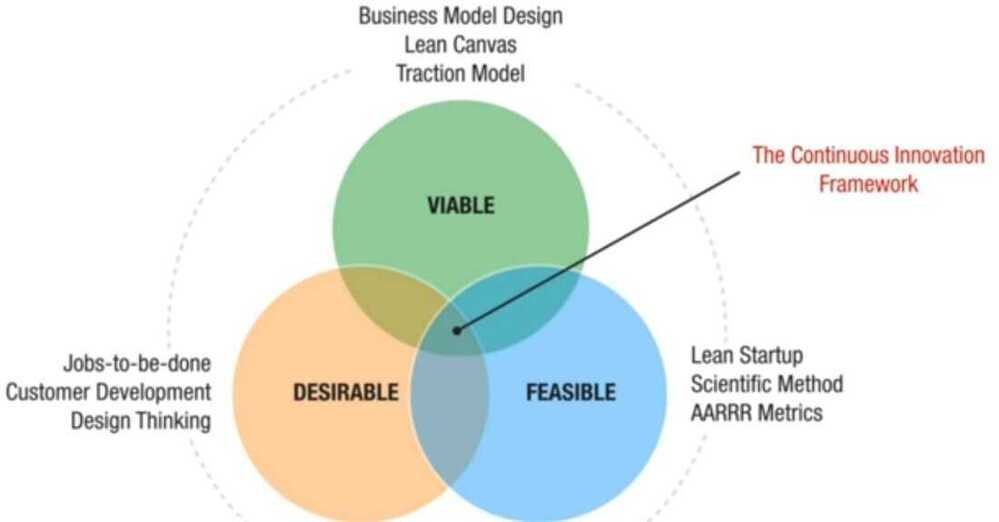

# Business Case Studies

https://www.youtube.com/c/AdityaSaini1505/videos

[Business Case Studies](https://www.youtube.com/playlist?list=PLGwmAEmjn4fmL_kCTOR-N4fXOlXvLa8dG)

[Modern MBA - YouTube](https://www.youtube.com/@ModernMBA)

[The Great Monopolies of India and the World](https://www.youtube.com/playlist?list=PLGwmAEmjn4fn0gqEfKYVVtdd_rsV_QKSJ)

- Asian Paints
- Nestle Maggi
    - Identify clearly the market to which you want to penetrate to
    - If you try to sell to everyone, you'll end up selling to no one
    - Identify the pain and interest of your audience. Address that particularly
    - **Good brands sell products. Great/Legendary brands sell emotions.**
- Indigo Airlines
    - Sales and leaseback model
    - Customers love living king size but doesn't like paying king size
    - India is a very price sensitive market
    - Point to point model
    - Hub and spoke model
        - Lesser plane is needed
        - Planes are more occupied
        - Maintenance is easy
        - Easier to expand
- Amazon / Nykaa
    - **Amazon - The Everything Company**
    - Marketplace model
    - Inventory model (Bulk order, keep the inventory, sell)
    - [Jeff Bezos at MIT Amazon - Earth's Most Customer-Centric Company](https://www.youtube.com/watch?v=J2xGBlT0cqY)
        - Customer centricity
        - Word of mouth
        - Technology driven
        - Personalization
        - Inventory optimization

- Malboro man - Create a cult
- Cred - burn, habituation

[How I Made 60,00,00,00,000 only in 2 Years 🔥 | CRED case study | Cred Business Model 🔥](https://youtu.be/mwbMM4o6VtE)
Delta 4 theory

Bragworthy preposition

- Zerodha - tolerance (customer retention),

In india we make far more decisions with myths and emotions rather than knowledge and strategy

- Gillette - give them the razors and make them come back again and again for the blades
    - Razorblade pricing model
- Chic - sachet philosophy, create a smaller version of larger product and give it for free too
- Cococola - tangible value, perceived value
- Nike - Olympic sponsorship, find loopholes

Good is imperative, greatness is a choice

- Amway - sales pitch, give free try outs

    1. Never be pain in the ass
    2. What does customer care about it
    3. Customer validation
    4. Accurate product
- Collective ownership (lizzat papad / Starbucks)

Mission and vision statement are very important

Epitome of greatness

- MTR - obstacle or opportunity
- Ikea

[IKEA Business Case Study: How to Earn 40 Billion$ Every Year by Selling Furniture? (IKEA Effect)](https://youtu.be/LNmhEp0kj5Q)

The "IKEA Effect": When Labor Leads to Love

It is due to the IKEA effect that an individual perceives the value of self-made products (even though they might be amateurs) equivalent to that of products made by experts. When someone does labor to complete a task, they tend to love and value it more.

This can be understood by an example:

When instant cake mixes were introduced in the 1950's as part of a broader trend to simplify the life of the American housewife by minimizing manual labor, housewives were initially resistant. These mixes made cooking too easy, making their labor and skill seem undervalued. They completed the task simply but did not value it because it involved almost zero labor.

To counter this, manufacturers changed the recipe and instead added one more step, now to complete the cake adding an egg in the mix was a mandatory step. This small change of introducing labor appeared to be a crucial move that lead to the sales of the cake mixes.

So if you want the magic of the IKEA effect to work you need 3 things

- The task should not be too easy
- The task needs to have labor
- The task has to be completed successfully
- Johnnie Walker

[How did Johnnie Walker keep walking for more than 200 years? : Marketing Case Study](https://youtu.be/wAHSJgIx5wA)

- Single Vision/Brand Image/Marketing - Keep Walking
- Perception of the brand is the reflection of its customer's personality

- Airbnb

[How Airbnb used Recession to become a 131 Billion Dollar Company?](https://youtu.be/YvA5RFhmLNA)

- Collaborative consumption
- Sharing economy

- Oyo
    - Affordable room bookings
    - OYO standard
        - 3 Click booking
        - Spotless linens
        - Free Wifi
        - AC
        - Early checkin
    - Value life cycle
    - Standardization
    - Key Stakeholders
        - Hotel owners
        - Staff
        - Customers
    - Playbooks
    - Old - Aggregator business model
    - Franchise business model - 22% commission
    - Power of motion study and self esteem
        - productive motion
        - incidental motion
        - unproductive motion
        - Remove t-shirt (unproductive motion), setup the ladder (incidental motion, since if ladder already there, then you don't have to setup ladder), and put box in 1st floor (productive motion)
        - Eliminate unproductive motion
        - Minimize incidental motion
        - Increase productive motion
    - OYO toolkit in customer checkin (shampoo, toothpaste, etc)
        - Free marketing
        - Save labor
        - discount in next bookings (Customer delight)
    - Business lessons
        - Become a SME (Subject Matter Expert)
        - If you don't understand you customers well enough, then your employees will never understand them

- Walmart / Dmart / Retail

[What made Walmart the most powerful business Empire worth $559 Billion ? : Business case study](https://youtu.be/BxDmbGFABJw)

[How Dmart's BUSINESS STRATEGY made Radhakishan Damani the Retail King of India?: Business Case study](https://www.youtube.com/watch?v=B5txS_lC1yY)

https://drive.google.com/file/d/1mu_J8AzEfaee5CHOs6Ks_0LwsCtdKRFi/view

[Why is Mukesh Ambani's Reliance Partnering with 7-Eleven Store chain? : Business strategy case study](https://www.youtube.com/watch?v=3KkHTHZckEY)

[IKEA :How to grow sales by 200% using Pricing STRATEGIES?: Business Case Study](https://www.youtube.com/watch?v=glHQPkrcf8A)

1. Power of discounting (Deep Discouting)
2. Loss leader principle
3. Culture / Team management
    - Safety
    - Collaboration
    - Shared Ownership
    - Liberty to experiment

4. Product Assortment Strategy
5. Store ownership model
6. Seller market vs buyer market

    Seller market - Demand > Supply

    Buyer market - Supply > Demand

7. Dead inventory
8. Tanpin Kanri System
9. Decoy effect
10. Slotting fee / listing fee / advertisement fee

- Zara - [Decoding ZARA's Billion Dollar Business STRATEGY : Fashion Business Case Study](https://youtu.be/ON-vFJbq1Vc)
    - Instrument of status
    - Critical parameters for instrument of status
        - Shakalala boom boom pencil
        - iPhone
        - For women it's clothes
    - Fast fashion supply chain
    - Just in time production+ just in time consumption (when order comes, start manufacturing)

Otherwise just in case strategy (keep inventory)

- FOMO
- Everyone learns to see, but no one learns to observe

- [How to run an Airline business profitably for 47 years & counting: Southwest Airlines CaseStudy](https://youtu.be/ebxaYgw8Nfw)
    - Everybody suffers a little so that some has not to suffer a lot
    - We managed in good times so we will be protected in bad times
- [How this BUSINESS STRATEGY made Azim Premji a BILLIONAIRE? : Wipro Case Study](https://youtu.be/PMj4uZvpSvE)
    - Global delivery model
- Burger king marketing strategy
    - Conflict breed attention
- [How Peyush Bansal's STRATEGY turned Lenskart into a 2.5 Billion Dollar Company? :Business Case Study](https://youtu.be/v-DAP6oU0dk)
    - Endless aisle strategy (online + offline)
- [How Aman Gupta's MARKETING STRATEGY turned Boat into a 1500CR Company : Business case study](https://www.youtube.com/watch?v=31UVvKEYO6k)

Tangible vs perceived value

- [Google's $1 TRILLION Business STRATEGY that made it Successful: Business Case Study](https://www.youtube.com/watch?v=-IjjEp8V7dI)
    - Paid search
    - Cost per click pricing model (vs Impression cost)
    - Keyword auction
    - Quality score
    - The Vickery auction model
    - Culture of innovation
        - The 20% Rule - Side projects
    - Never be discouraged by existing players
    - Culture of learning and failing, ideation beyond work doesn't stop
- [How did Toyota beat FORD & GM using its GENIUS Supply Chain Model?](https://www.youtube.com/watch?v=0wVAPXswE6E&t=3s)
    - Efficiency - Lean manufacturing system
    - Just in time manufacturing
    - Forecasting of demand led to excessive inventory, which leads to waste
        - Excessive resources allocation
        - Overproduction
        - Excessive inventory
        - Wasted capital
    - Elimate - demand forecasting, zero inventory
    - Suppliers also followed the JIT
    - Adversity is the breeding ground of innovation
    - Never copy paste the solutions
    - Strategies
        - Kanban system
        - Kaizen model
        - Jidoka method

Jidoka direct translation in English is automation. Today, Jidoka is referred to as autonomation, which is automation with human intelligence.Jidoka also refers to stopping a manual line or process when something goes wrong. Ohno viewed the production process used by mass producers in the West to be rampant with muda -- a Japanese term for waste that encompasses all elements of production that only increase cost without adding value. For instance, excess people, inventory, and equipment are all types of muda that may exist in a factory. In order to prevent mistakes from multiplying,

Ohno placed a cord above every work station in the production facility and encouraged workers to stop the entire assembly line immediately if they discovered a problem. Once the assembly line was stopped the problem would be addressed. Ohno implemented this method with the intention of making workers more conscious of quality through Jidoka.

Jidoka places responsibility down to the assembly workers to ensure that they are mindful of the quality of each part produced.

- Henry Ford: "If I had asked people what they wanted, they would have said faster horses." Customers can easily describe a problem they're having - in this case, wanting to get somewhere faster - but not the best solution.
- https://drive.google.com/file/d/15pU5j7nTfe17iiLCh55eoGJzgph83Id8/view

- [How Cadbury Destroyed Its Competitors 🔥 | Cadbury GENIUS Marketing Strategy | Business Case Study](https://youtu.be/xKEtVu_k9jQ)
    - Authoritative marketing
    - Stories sell

[How Airtel is Beating Jio? : Business Strategy case study](https://www.youtube.com/watch?v=yhpVAki47RI)

- Retainer
- Ecosystem products
- Loss leader pricing strategy

### Food

[How Starbucks' Legendary Leader brought the company out of a Crisis?: STARBUCKS Casestudy (Howard S)](https://youtu.be/vvzpciKoU5g)

- Not in coffee business serving people but People businesses serving coffee
- Purpose of the brand
- Extraordinary company exhibit true values

- Insurance
    - Shared value model
- Retail (real state) - location location location

- Dollar Shave Club - [How to KILL a MONOPOLY? : The fall of Gillette (Business STRATEGY Case Study)](https://www.youtube.com/watch?v=SGIKsejp7-0)

- **Shared value / Collective impact**

Collective impact is based on the idea that social problems arise from and persist because of a complex combination of actions and omissions by players in all sectors - and therefore can be solved only by the coordinated efforts of those players, from businesses to government agencies, charitable organizations, and members of affected populations. What's needed is nothing less than changing how the system functions. Collective-impact efforts have made significant progress on issues as diverse as education, homelessness, juvenile justice, substance abuse, childhood obesity, job creation, and [pollution.](http://www.collectiveimpactforum.org/featured-case-studies)

1. a common agenda, which helps align the players' efforts and defines their commitment
2. a shared measurement system
3. mutually reinforcing activities
4. constant communication, which builds trust and ensures mutual objectives
5. dedicated "backbone" support, delivered by a separate, independently funded staff, which builds public will, advances policy, and mobilizes resources.

https://hbr.org/2016/10/the-ecosystem-of-shared-value

- Ideas
    - Everybody in the world can see but very few has the ability to observe
    - Mandatory + Undersirable Experience = Scope of innovation
        - The design of everyday things
    - Minding the gap (Customer perspective)

## Auction Theory

1. The Independent Private Value (IPV) Model
2. Vickrey (Second-Price) Auction / **sealed-bid second-price auction**(**SBSPA**)

    A Vickrey auction is a sealed-bid auction where bidders submit bids without knowing the bids of other people. However, as opposed to other sealed-bid auctions, the price paid is the second-highest bid price and not the winning bid price. The Vickrey auction was named after William Vickrey, a Canadian who won the 1996 Nobel Prize in Economics for his research on [asymmetric information](https://corporatefinanceinstitute.com/resources/knowledge/finance/asymmetric-information/) in economics.

    https://corporatefinanceinstitute.com/resources/knowledge/other/vickrey-auction

    https://en.wikipedia.org/wiki/Vickrey_auction

3. Sealed Bid (First-Price) Auction

    1. The "First Order Conditions" Approach
    2. The "Envelope Theorem" Approach

4. Revenue Equivalence

https://web.stanford.edu/~jdlevin/Econ%20286/Auctions.pdf

https://drive.google.com/file/d/13jkSTqNUtDqF7QU1nlEQv4LSv2eZTx-9/view

Chapter 9: Auctions - From the book Networks, Crowds, and Markets: Reasoning about a Highly Connected World. By David Easley and Jon Kleinberg. Cambridge University Press, 2010.

### [How to Sell Anything in India? Cycle Pure Agarbatti Detailed Business Case Study](https://www.youtube.com/watch?v=HC5-z8kNC4c)

Marketing tactic used, light the agarbatti in-front of store and left for 2 days in a row, and after that gave 2 agarbattis for home, and then after that only sat for sales.

### [Zerodha vs Upstox :How Zerodha’s Genius strategy KILLS its competition?](https://www.youtube.com/watch?v=K9tH57J2cYs)

- Something's can't be build by just throwing money at it, and a super high functioning software is one of them.
- Monitor your CAC
- Freebies never attract high quality customers
- Product superiority is the single most important thing that you can achieve to become a market leader in the industry
- If you build a great product, marketing becomes secondary . And product is the true benchmark of greatness

## Scaling a Business

[The Keiretsu Jutsu - Part 1: An Introduction](https://daily.stoa.com/newsletter/the-keiretsu-jutsu-part-1-an-introduction)

- Zaibatsu system

[The Keiretsu Jutsu - Part 2: Trust Capital and Transaction Costs](https://daily.stoa.com/newsletter/the-keiretsu-jutsu-part-2-trust-capital-and-transaction-costs)

- Trust, ultimately, is the only true currency of the world

[How Paytm is secretly KILLING Phonepe and Bharatpe? : Detailed Business CaseStudy - YouTube](https://www.youtube.com/watch?v=7TcG9cPj2gA)

- Entry Product
- Retainers
- Upsell

## Links

- [Why Elon Musk is WRONG about TWITTER and FREE speech Business Case Study](https://www.youtube.com/watch?v=nPrVYCtJfgQ)
- [Hindenburg has Killed Adani Group?: Decoding Adani’s response to Hindenburg (Business case study)](https://www.youtube.com/watch?v=4WSAeT_XDaI)
- [How TATA’s GENIUS strategy is turning TATA Tech into a LEGEND? : Tata technologies case study - YouTube](https://www.youtube.com/watch?v=BlDYS_2X5wI&- ab_channel=ThinkSchool)
- [The Extravagant Business of Cruises - YouTube](https://www.youtube.com/watch?v=QqQtV7wHSV0)
- [The INSANE Story of Domino's Pizza - YouTube](https://www.youtube.com/watch?v=QJh1LkOM4KY)
- [How Domino's Became The World's Biggest Pizza Chain | Big Business | Insider - YouTube](https://www.youtube.com/watch?v=yEnDZcX3xc8)
- [How We Built a $150 Million Streaming Platform with $100,000 - YouTube](https://www.youtube.com/watch?v=Alqt6RCEWdM)
- [How Zudio TOOK OVER India’s 5,000 Crore Fashion Industry - YouTube](https://www.youtube.com/watch?v=eP8PCPF8YAI)
- [How A Single Company Revolutionized Law Enforcement - YouTube](https://www.youtube.com/watch?v=Jf-mU-hdHyE)
- [How EaseMyTrip CRACKED India’s $201 Billion Travel Industry | GrowthX Wireframe - YouTube](https://www.youtube.com/watch?v=j4StYNvbzEg)
- [Why did Starbucks REALLY become so popular? - YouTube](https://www.youtube.com/watch?v=3RKU9XBwZro)
- [This Indian Brand is KILLING Global Brands like Anything! - YouTube](https://www.youtube.com/watch?v=n60GZmfFde8)
- [How Stage CONQUERED India’s 300 Crore OTT Space | GrowthX Wireframe - YouTube](https://www.youtube.com/watch?v=NDrrBVsPLDA)
- [Western Union: Banking & Finance for the Poor - YouTube](https://www.youtube.com/watch?v=29nSycLw_5A)
- [How Delhivery DISRUPTED India’s 1800 Crore Logistics Market | GrowthX Wireframe - YouTube](https://www.youtube.com/watch?v=Sv9mqdnxNXw)
- [Launching 500 Cities in 9 Months: Behind Swiggy’s EPIC Growth Strategy | GrowthX Insider - YouTube](https://www.youtube.com/watch?v=0hS9w28fWBM)
- [The Banana King: The INSANE True Story - YouTube](https://www.youtube.com/watch?v=j6muUD2SUk8)
- [How Firstcry TRANSFORMED India’s 4000 Crore E-Commerce Industry | GrowthX Wireframe - YouTube](https://www.youtube.com/watch?v=O7gaqYNPlUY)
- [How Masters union is building a Harvard for India? : Business case study - YouTube](https://www.youtube.com/watch?v=yzDF_KX4Zjg)
- [How Frooti Made A 4200 Crore COMEBACK | GrowthX Wireframe - YouTube](https://www.youtube.com/watch?v=D1p8VibEguY)
- [How JAINS built the DIAMOND Industry of India? : Business Case Study - YouTube](https://www.youtube.com/watch?v=Vx4hyGpzVyI)
- [How I DOUBLED Neeman’s Business In 9 Months | GrowthX Insider - YouTube](https://www.youtube.com/watch?v=FBdlJRUMUR0)
- [Dream, determination, defeat - six lessons in analysing startup failure from a candid entrepreneur story](https://yourstory.com/2022/02/- entrepreneur-failure-lessons-prashant-desai)
- [This SECRET Brand is KILLING Nike and Adidas in India? | Business Case Study - YouTube](https://www.youtube.com/watch?v=qQPRWA9JNNQ)
- [The Invincible Business of Diners - YouTube](https://www.youtube.com/watch?v=3mLEZaqUdE0)
- [How EMIRATES is WINNING when Other AIRLINES are going BANKRUPT - YouTube](https://www.youtube.com/watch?v=cftToIr9sAo)
- [How Blissclub TOOK OVER India’s 500 Crore Athleisure Market | GrowthX Wireframe - YouTube](https://www.youtube.com/watch?v=NnWaAVNd370)
- [The Rise & Fall of Under Armour - YouTube](https://www.youtube.com/watch?v=HeWdxezd_CU)
- [Fundamental Analysis of Wonderla Holidays Limited - by RCG](https://www.budgetiger.in/p/case-study-wonderla-holidays-limited)
- [Why Is Fevicol Everywhere? | GrowthX Wireframe - YouTube](https://www.youtube.com/watch?v=RJJRfdGjt10)
- [ITC कैसे बानी 6,00,000 Crore की Company ? | ITC Case Study |Aditya Saini - YouTube](https://www.youtube.com/watch?v=iW5j6vXmAu0)
- [How Tata Zudio Became A Rs.4,000 Crore Brand ? | Zudio Case Study | Aditya Saini - YouTube](https://www.youtube.com/watch?v=8L2rwPGcYf0)
- [What Went Wrong With FrontRow ? - YouTube](https://www.youtube.com/watch?v=VH8WEXfEGXA)
- [What is so special about Sting Energy Drink ? - YouTube](https://www.youtube.com/watch?v=c0lIn8ImG44)
- [Is Biocon making a comeback?](https://finshots.in/markets/is-biocon-making-a-comeback/)
- [How Dollar Stores Quietly Consumed America - YouTube](https://www.youtube.com/watch?v=vQpUV--2Jao)
- [How He Went From A Sweet Shop To Rs.800 Crore ? - YouTube](https://www.youtube.com/watch?v=jCnSd8Gpcjk)
- [Six Flags & The Endangered Amusement Park - YouTube](https://www.youtube.com/watch?v=LvhX7Y8tNzQ)
- [Airtel will beat JIO? What no one is Telling you about the Jio vs Airtel vs Tata Telecom Wars! - YouTube](https://www.youtube.com/watch?v=XYOZ4RzrHW0)
- [The Untold TRUTH Of Nintendo - YouTube](https://www.youtube.com/watch?v=DoQnniM4MSg)
- [How LaPino'z DISRUPTED India’s 1,500 Crore Pizza Industry | GrowthX Wireframe - YouTube](https://www.youtube.com/watch?v=NM19ZCXaEIM)
- [How A Poor Boy Built A 2000Cr Dairy Company And Beat Giants: Business Case Study - YouTube](https://www.youtube.com/watch?v=-98fnc4VAo8)
- [How This Fitness Startup Built a 700 Crore Empire | GrowthX Wireframe - YouTube](https://www.youtube.com/watch?v=PfiFqdQ7tk8&ab_channel=GrowthX)
    - [Cult.fit](https://growthxclub.notion.site/Cult-Fit-3277cbdb88e648ae99b39934571b712d)
    - [Can Nirma make the jump from suds to pills?](https://finshots.in/markets/can-nirma-make-the-jump-from-suds-to-pills/)
- [Shocking Report On Top 187 Profitable Companies in India - YouTube](https://youtu.be/U2Zg1VCFxMo)

## End
