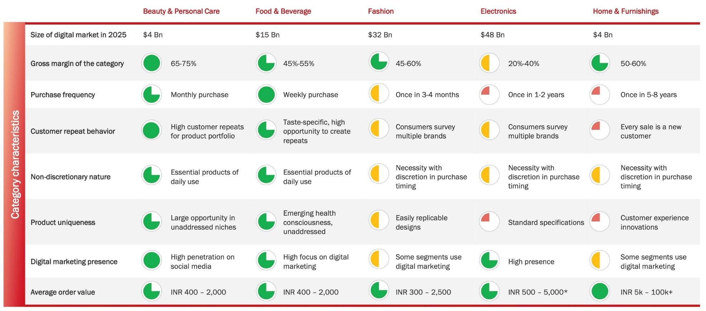
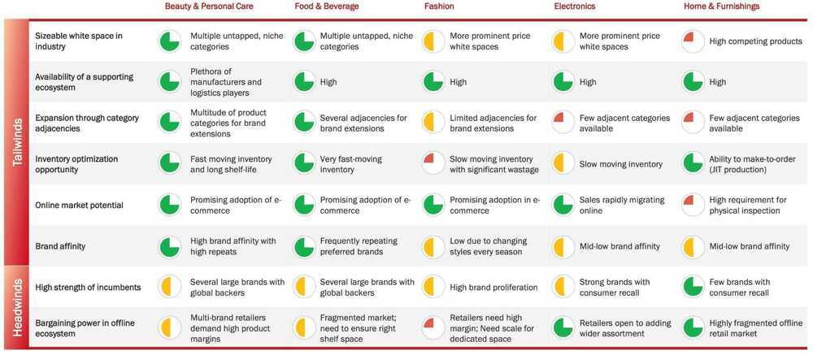

# Indian Market

[Indus Valley Annual Report 2024 - Blume Ventures](https://blume.vc/reports/indus-valley-annual-report-2024)

https://www.avendus.com/india/d2c-brands-report

- Indians spend over 80% of their disposable income on 4 specific categories (you will get this same data by reading credit card reports) → Real estate/ Education/ Travel/ Shopping & of course weddings.
- Travel category customers typically have high disposal incomes & are more value conscious and relatively less price conscious.

## Links

[Indian Industries Sectors](economics/finance-investing/industry-sectors.md)
