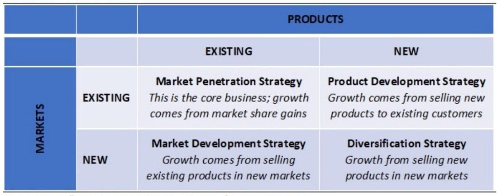

# Business

https://hbr.org

Financial times

Wall street journal

Product driven business vs Business driven business

## Business case studies / Market Research

Consumer psychology, Behavioral economics, Human centered design

QSR - Quick Service Restaurants

Marketplace model

Inventory model

Tangible value and perceived value

Ecommerce - https://drive.google.com/drive/folders/1tsdmHgdMJCPQP3Wy2zU86DQRGXkS00lX

Cut through the clutter and do it fast: An e-retail visitor spends fewer than 10 minutes per visit on a platform. Shoppers browse 10 product pages, on average, in electronics, and more than 15 in mobiles before adding any to their cart. Brands and sellers have limited time to tell their story and make an impression in the minds of the consumers. Images are key - 1 in 2 visitors browse image galleries, whereas only 1 in 22 read product descriptions

Influencers have a growing influence: Approximately 40% of online shoppers made at least one purchase through social media channels (e.g., Facebook, Instagram, WhatsApp) in 2020. Content creators and influencers will play an increasingly critical role in the future of commerce

Digital payments are gaining fast, but cash remains key: Use of digital payments and credit has accelerated significantly, although cash purchases continue to account for approximately 45% to 50% of the e-retail gross merchandise value (GMV), even during the pandemic. The use of credit is more pronounced in the electronics category, with three times more adoption of equated monthly instalment (EMI) or credit schemes vs. other categories

**Video commerce:** The video-watching user base expanded greatly during the pandemic and grew by 25% in India in the past year alone, increasing to 350--400 million users.

Hundreds of thousands of creators will help propel livestreaming and video-enabled commerce significantly in the coming years. Multiple livestreaming commerce start-ups have already emerged in India and are growing rapidly. In China, livestreaming commerce accounts for 9%--10% of overall GMV

## Product Types

- Candy - Games
- Vitamin - Alexa
- Pain Killer - Gmail
- Addictive pain killer - Onenote / maps

What if your competitor drops their price (great question to learn whole business)

Four key drivers of free cashflows in a business -- **revenue growth, profit margins, working capital efficiency, and asset turnover**

## Business Model Canvas

You put everything for a new business in one sheet and than go and implement it

A startup messed up at its foundation cannot be fixed -- Thiel's law

Every organisation after a certain time goes for a **talent refresh** where the organization needs to get mature.

Second order and Third order effects

Unknown unknown and known unknown

## Business models

- Freemium to Premium model

## 5 Whys

5 Whysis an iterative interrogative [technique](https://en.wikipedia.org/wiki/Skill) used to explore the [cause-and-effect](https://en.wikipedia.org/wiki/Causality) relationships underlying a particular problem.The primary goal of the technique is to determine the [root cause](https://en.wikipedia.org/wiki/Root_cause) of a [defect](https://en.wiktionary.org/wiki/defect) or problem by repeating the question "Why?". Each answer forms the basis of the next question. The "5" in the name derives from an anecdotal observation on the number of iterations needed to resolve the problem.

## Economic Moat

Conceptualized and named by [Warren Buffett](https://www.investopedia.com/articles/01/071801.asp), an economic moat is a distinct advantage a company has over its competitors which allows it to protect its market share and profitability. It is often an advantage that is difficult to mimic or duplicate (brand identity, patents) and thus creates an effective barrier against competition from other firms.

https://www.investopedia.com/terms/e/economicmoat.aspc

[Economic Moats | Which companies have competitive advantages? | ETMONEY](https://youtu.be/dDnKxU_irq4)

- INTANGIBLE ASSETS MOAT
- SWITCHING MOAT
    - Moving from service A to service B
    - Ex - Changing your bank account
- LOW COST PROVIDER MOAT
- TOLL MOAT
- NETWORK EFFECTS MOAT
- CULTURAL MOAT
- DIGITAL & DATA MOAT

https://acquirersmultiple.com/2022/01/bruce-greenwald-moats-are-not-that-hard-to-calculate

- So the first element in this is what's the minimum viable share somebody has to get to. For very big markets that's going to be low. For small niche markets in geography or in product space that's going to be large, and secondly what does customer captivity look like? And because the current technologies tend to be user oriented you have to learn how to use it so you have a lot of customer captivity.
- And in services it's face to face with high purchase frequency so again you've got a lot of customer connectivity but really what you're looking for is minimum viable scale divided by annual market share change in a contested environment."

## Ansoff Matrix

https://marcellus.in/blogs/a-sixty-year-old-tool-to-assess-capital-allocation-decisions

## Why Competitive Advantages Die

1. Being right is the enemy of staying right because it leads you to forget the way the world works
2. Maintaining financial success takes precedence over traits that were vital to building the initial idea
3. Mistaking a temporary trend for a competitive advantage
4. Scaling a product requires scaling HR, which is monstrously complex and usually unrelated to your original skill
5. The decline of paranoia that made you successful to begin with
6. Reputational momentum is vicious and unforgiving on the way down
7. Brands are hard to build and even harder to span across generations

Firstly, once a company becomes successful, its management has a tendency to put blinkers on and shut themselves off from new ideas:""Being right is the enemy of staying right because it leads you to forget the way the world works." -- Jason Zweig. Buddhism has a concept called beginner's mind, which is an active openness to trying new things and studying new ideas, unburdened by past preconceptions, like a beginner would. Knowing you have a competitive advantage is often the enemy of beginner's mind, because doing well reduces the incentive to explore other ideas, especially when those ideas conflict with your proven strategy. Which is dangerous. Being locked into a single view is fatal in an economy where reversion to the mean and competition constantly dismantles old strategies."

Secondly, as a company gets bigger, the HR challenges of managing and motivating thousands of people gets exponentially harder:"Scaling a product requires scaling HR, which is monstrously complex and usually unrelated to your original skill. Designing a device or discovering an investment strategy is a million miles separated from managing 500 or 1,000 people. Managing one-hundred thousand people is a different universe. Even when responsibilities are delegated, creating a culture that promotes trust, creativity, and growth is likely a totally different skill than was required to build your product in the first place."

And thirdly, as a company makes money, as its executives enjoy the good life, naturally they become complacent and tend to lose their edge:"The decline of paranoia that made you successful to begin with. I like the idea that systems are better than goals, because once you reach a goal you tend to stop doing the thing that made achieving the goal possible. "I'm going to work out every day" is better than "I'm going to lose 10 pounds" because once you lose 10 pounds you'll probably stop working out. Same thing happens when a successful business or career hits a big goal. Paranoia is a trait newcomers use to combat how deeply the odds are stacked against them. But it tends to die once a goal is hit. Few things sap the paranoiac drive to do better than stable cash flow and high profit margins. Michael Moritz of Sequoia was once asked why his firm had thrived for 40 years. "We've always been afraid of going out of business," was his answer."

https://www.collaborativefund.com/blog/why-competitive-advantages-die

## Loss Leader Pricing Model

Sell low cost - low margin product at a loss/less price

To bait/expose customers to high cost - high margin products

## SOP (Standard Operating Procedures)

1. Repeatability
2. Consistency
3. Not people dependent

## Internet in a minute

[What Happens in an Internet Minute? \[2024 Statistics\]](https://localiq.com/blog/what-happens-in-an-internet-minute/)

## Others

- https://marcellus.in/blogs/staying-on-the-top-of-everest-is-harder-than-getting-there
- https://marcellus.in/blogs/why-india-beats-china-hollow-on-consistent-compounding
- [Geopolitical Series](https://www.youtube.com/playlist?list=PLGwmAEmjn4fkd3IgCnFZSbocpTnka87Pn)
- https://www.freecodecamp.org/news/important-lessons-they-dont-teach-you-in-business-school
- [The Amazon Weekly Business Review (via Bezos's Shadow) - Commoncog](https://commoncog.com/the-amazon-weekly-business-review/)
	- [Commoncog](https://commoncog.com/)
	- [Start Here: Commoncog's Best Posts - Commoncog](https://commoncog.com/start-here/)
