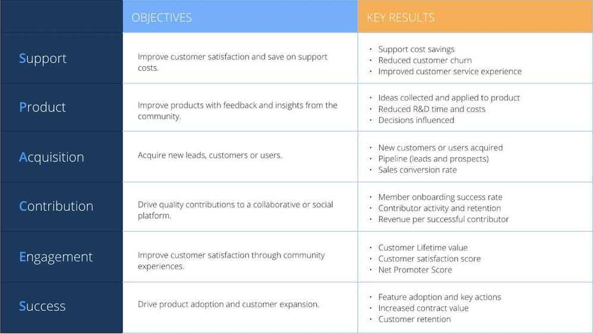

# Community Building

Companies like Atlassian, Glossier, Datadog, Twitch, dbt, Salesforce, Peloton, and many others have succeeded in large part due to the passionate community they built around their early products. A thriving community creates a sticky and evangelical user base, becomes a great source of ideas, and can even become a clever way to scale customer support (e.g. Airbnb):

### 1. Should you even be investing in community?

- Defining community
- Aligning community to business objectives
- Aligning community to your members' goals
- Who should own community?
- What to look for in a community hire

### 2. What does a community strategy look like?

- The three levels of community strategy
- Creating community-level goals
- Creating tactical-level goals

### 3. How do you build a meaningful community?

- Designing community programs
- Launching your online community
- Launching a community-led event program

## Defining Community

- Moderators: keep content clean and organized in the community
- Facilitators: start conversations in the community and host discussions
- Event organizers: start local chapters and self-organize local or virtual events
- Ambassadors: advocate on behalf of the brand
- Content contributors: write articles, create videos, or develop other forms of content
- Committee members: join a customer advisory board to guide product direction
- Power users: achieve status by being the most active members of a platform
- Mentors: dedicate time to supporting other customers one on one or in small groups

## Aligning community to business objectives

There are six objectives that a community can drive. To help businesses wrap their heads around the options, use the [SPACES model](https://cmxhub.com/the-spaces-model/):

1. **Support:** Create spaces for customers to answer questions and solve problems for each other. Example: [Autodesk support community](https://www.autodesk.com/community)

2. **Product:** Create spaces for customers to share product feedback and ideas with each other and with your team. Example: [Atlassian feedback section](https://community.atlassian.com/t5/Feedback-Announcements/ct-p/feedback-forum)

3. **Acquisition:** Build programs that help you grow your pipeline and customer base. Example: [Branch's Mobile Growth community](https://mobilegrowth.org/)

4. **Contribution:** Enable members to contribute content, services, or something else of value to a platform you create. Example: [Notion Template Gallery](https://www.notion.so/Notion-Community-04f306fbf59a413fae15f42e2a1ab029#8d82ce462ca742a8907941f2227a441f)

5. **Engagement:** Connect customers to each other around their common interests in order to increase customer retention. Example: [Culture Amp's Culture First](https://www.cultureamp.com/community)

6. **Success:** Enable customers to teach each other how to better use your product and be more successful in their careers. Example: [Salesforce's Trailblazer program](https://trailhead.salesforce.com/trailblazercommunity)

Each objective comes with a different set of metrics that you'll likely want to use to measure the business impact of the community:

## Aligning community to your members' goals

- Your customers are going to join your community because of benefits, not belonging
- How to conduct user research about a potential community:

    1. Start a spreadsheetof the people that you'll reach out to for an interview.
    2. Reach out to 10 of them to start, and ask for a 30-minute call.
    3. As you grow your community, make a habit of speaking with members regularly.

## Designing community programs

1. People: Who the program is focused on
2. Purpose: Why they need this program
3. Place: Where members will gather
4. Participation: What members will do
5. Policy: Guidelines and rules that will shape the experience
6. Promotion: How members will learn about the program
7. Performance: What success looks like

https://www.lennysnewsletter.com/p/building-community

## Community Building Tools

- **Giscus -** [A comment system powered by GitHub Discussions](https://giscus.app/)
- **Disqus -** https://disqus.com
- **Discourse -** https://www.discourse.org
- **Discord -** https://discord.com
- [docsly - Get actionable user feedback for your documentation.](https://www.docsly.dev/)
- https://uservoice.com
- https://www.instamojo.com/blog/community-building-platforms-build-your-business-organically
- Luma - https://lu.ma
- [Circle: The all-in-one community platform for creators and brands](https://circle.so/)
- [Maven: Expert-led. Peer-driven. Hello, live learning.](https://maven.com/)

Foster meaningful relationships with events, newsletters, and community analytics

## Links

[Web3 Startups: How to Build a Developer Community | Web3 Startups - YouTube](https://www.youtube.com/watch?v=OeRxIvr5EPM)

[What do I think about Community Notes?](https://vitalik.ca/general/2023/08/16/communitynotes.html)
