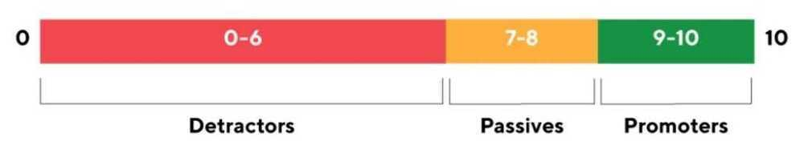
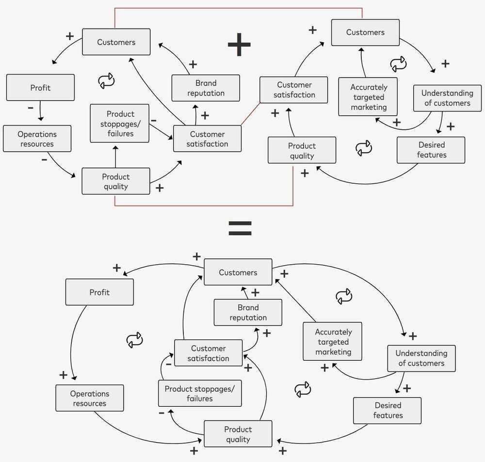

# Customer Engagement / CX Metrics

## How To Measure Customer Engagement

While there is no absolute formula to calculate customer engagement, and it is literally indicated by almost every marketing KPI, the following metrics combinedly can be the most useful in estimating the engagement levels for your business:

## Average Time On Site/Page

When it comes to on-site metrics to measure customer engagement, average time spent on site or page is probably one of the most obvious ones. If you manage to capture visitors' attention and interest, they are going to stick around for not just completing an intended task, but also for the sake of exploring what your website or app has to offer and thereby, uplifting your engagement rate.

## Open And Click-Through Rates

For communication channels such as emails, push notifications, Facebook Messenger, etc., open rate is the percentage of unique opens received, and click-through rate represents the percentage of recipients who clicked on any CTA in the message. Since these two metrics give you a direct measure of how well your audience is responding to your communication and whether or not they are interested or curious to learn about the updates/offerings you've shared, it is directly proportional to how engaged your customers are.

## Click Through Rate (CTR)

CTR, is a**digital marketingmetric** that measures the ratio of total impressions to clicks in search and display advertising, emailmarketing, and other online mediums.CTRcan indicate the effectiveness of ad copy, meta data (titles & descriptions), and email subject lines.

## Law of Shitty Clickthroughs

Over time, all marketing strategies result in shitty clickthrough rates.

There are a few drivers for the Law of Shitty Clickthroughs, and here's a summary of the top ones:

- Customers respond to novelty, which inevitably fades
    - Banner Blindness
- First-to-market never lasts
- More scale means less qualified customers

https://andrewchen.com/the-law-of-shitty-clickthroughs

## Social Media Interaction

Whether it is via replies, video views, likes, tweets, mentions, shares, comments, or tags, it's safe to assume that social media is the primary off-site channel your followers use to interact with you. They follow your social media pages and handles to stay updated with your latest offerings, reach out to you in case of a query or concern, be informed of the latest trends in the category, and so much more. Therefore, the interaction on all your social media handles is an important indicator of how well your audience is engaged with your business.

## Number Of Form Fills

If you own a website, you're almost definitely using forms at some or the other stage in your funnel to capture visitors' data. But, the number of form fills you receive depends on a variety of factors, including how engaged your visitors are with your business. After all, they will only willingly share their valuable data if they find merit in interacting with you and want to stay updated with your business' ongoings.

## Customer Referrals

By keeping your customers engaged, you are essentially making it easier for your business to convert more and more of them to evangelists, advocates, and loyalists. And since well-engaged and highly satisfied customers are more likely to recommend your products/services to their friends and family, customer referrals is a strong indicator of customer engagement for any online business. Moreover, engaged customers will be aware of referral bonus campaigns and offers as they closely follow your communication, so they are more likely to drive referral traffic for your business.

## Repeat Purchase/Renewal Rate

If your customers are actively engaged with your business on various platforms, you are most likely going to be the first name on their minds whenever they need to make a purchase. Better still, you might even be able to drive some impulse purchases by sharing the ongoing deals and offers with engaged customers. Therefore, a good percentage of repeat purchases is an indicator of a highly engaged customer base.

## Repeat Visit Frequency

Needless to say, well-engaged customers wouldn't mind spending their valuable time visiting your website or app every once in a while as they are likely to be looking forward to the new experiences you have to offer. Not just that, they might even be directed to your website/app from your social media posts, emails, or push notifications. Therefore, high visit frequencies of customers on your site/app signal an effective customer engagement strategy.

## Direct User Feedback (NPS/CSAT/PSAT Scores Or Online Reviews)

## CSAT - Customer SATisfaction score / PSAT - Product SATisfaction Score

Closely monitoring and analyzing customers' feedback helps you unlock incredible insights into what your customers appreciate, what they feel is missing, and the improvements they expect. These will tell you how well they are interacting with your business across all touchpoints and therefore serve as a direct indicator of customer engagement.

## NPS - Net Promotor Score

[Net Promoter Score (NPS)](https://www.hotjar.com/blog/customer-effort-score/) is a measure used to gauge customer loyalty, satisfaction, and enthusiasm with a company that's calculated by asking customers one question: "On a scale from 0 to 10, how likely are you to recommend this product/company to a friend or colleague?" Aggregate NPS scores help businesses improve upon service, customer support, delivery, etc. for increased customer loyalty.

## NPS = % of promoters (9s and 10s) - % of detractors (0s - 6s)

## CSAT vs NPS

The core difference between the two customer experience metrics is that they describe different elements of the customer experience.

CSAT measures customer satisfaction with regards to a product or service, whereas NPS is best used to measure the overall relationship the customer has with an organisation.

So, whereas CSAT usually describes how your customer feels about a recent purchase, NPS can track their feelings about you as a brand, over a longer term.

https://www.qualtrics.com/au/experience-management/customer/csat-vs-nps

## CES - Customer Effort Score

## CLV - Customer Lifetime Value

https://lumoa.me/blog/customer-experience-metrics-and-kpis

## DAU, WAU, MAU, the DAU/MAU Ratio

Daily, Weekly, and Monthly Active Users, that is the unique amount of users who are "active" within a given amount of time.

- How you define Active User
- By ignoring the absolute numbers and looking at the ratio (stickiness" which is a measure of how much users are engaging with the product.)

## Day 1, Day 7, Day 30, D60 User Retention

D1, D7 and D30 retentions are calculated as the percentage of users who are active at any time after 1 day, 7 days and 30 days of signing up or installing your app.

## Retention curves

The retention curve has two key features:

- it tends to drop off really fast at the start (more later on this)
- the curve then (hopefully) tends to flatten out over time. If instead of flattening it hits hit zero, its a strong signal you urgently need to improve user engagement.

## W1 (Week 1) User Retention

Week 1 Retention (W1)""has one of the biggest impacts on your retention over time"because improvements that you make in week 1 retention carry through the entire retention curve.

## Tripwire metrics

Typically users don't ask for help, and tend to drift away if they don't get value quickly. If you can spot those users and reach out, you may be able to engage them. To help spot users who aren't engaged, you can use Tripwire Metrics to identify users who aren't engaging well and use that data to quickly act to engage them during those vital first 7 days.

## Analytics / Site Facing Analytics

Click Tracking

- Click tracking & HTML best practices
- Setting up SSL for click tracking

Email Activity Feed

- Email activity feed
- Legacy email activity

Expert Insights

- Interpreting Expert Insights
- Subscribing to Expert Insights

Statistics

- Browser comparison statistics
- Browser stastistics
- Category comparison statistics
- Category statistics
- Device statistics
- Geographic statistics
- Global statistics
- Google analytics and sendgrid statistics
- Mailbox provider comparison
- Marketing campaigns statistics
- Statistics overview
- Subuser statistics
- Subuser statistics comparison

Tracking

- Spam reports

https://clarity.microsoft.com

Clarity is a free, easy-to-use tool that captures how real people actually use your site. Setup is easy and you'll start getting data in minutes.

EBR - Executive Business Review

