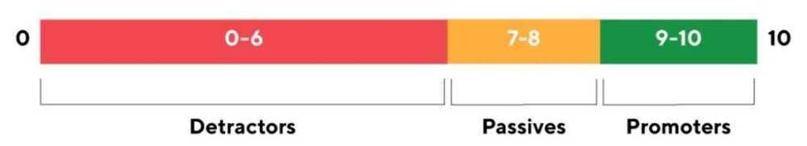
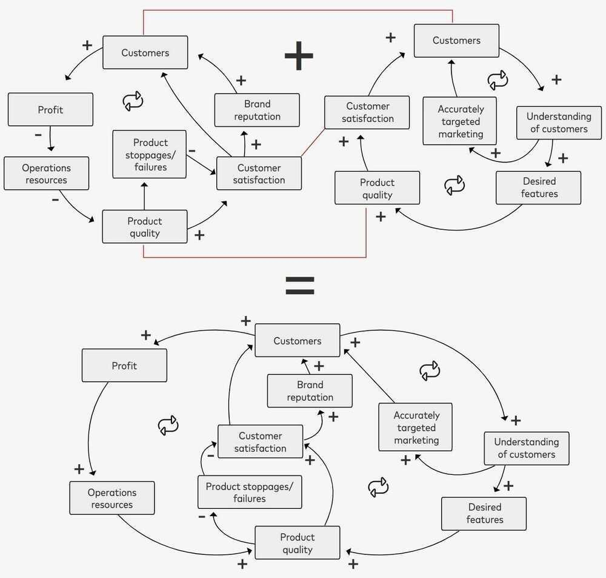
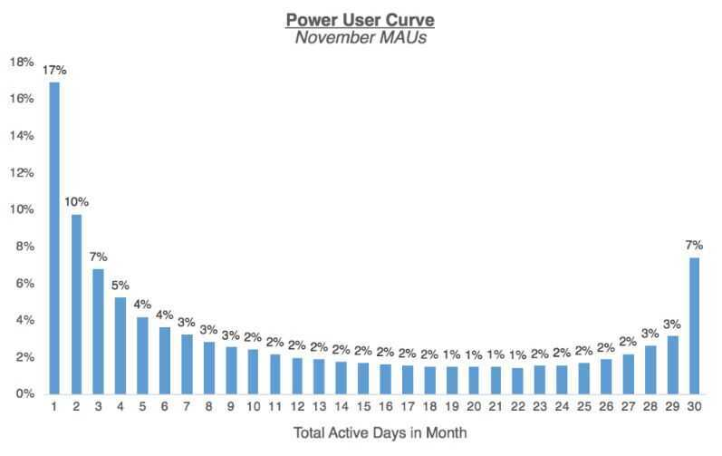
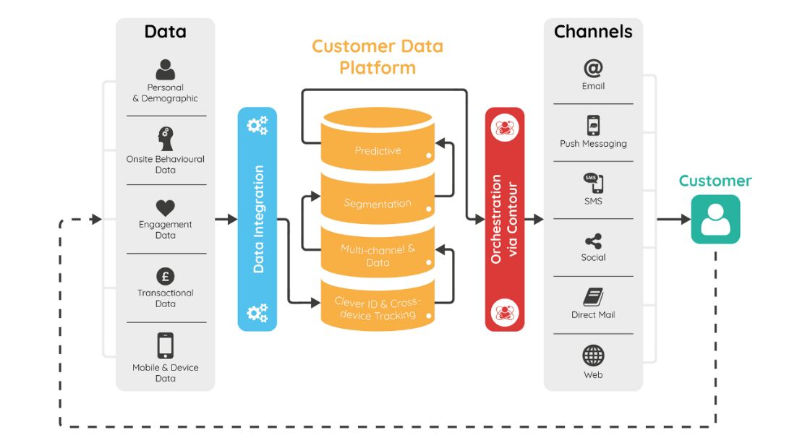

# Customer Engagement / CX

When it comes to payments and finances, customers are anxious and impatient when they encounter issues.

## CX (Customer Experience)

Customer experience (CX) is the cumulative impact of every touchpoint throughout the customer journey. CX managers first determine what a positive customer experience entails for their target clients, theorize and implement changes they believe will have the most impact, and use results to optimize each customer interaction.

## What is Customer Engagement?

Quite a buzzword among online businesses today, customer engagement is a measure of a brand's interaction with its customers across all touchpoints throughout their lifecycle. Consistently engaging customers on a variety of channels help brands build and strengthen a 'human-to-human' connection with them and add value beyond just transactional relationships.

If there's anything that hasn't changed from the good ol' brick-and-mortar times to this day and age of thriving online businesses, it's the firm belief in the mantra 'Customer is King'. And with iconic marketing campaigns such as 'Share a Coke' (Coca Cola) or the 'Big Sleepover' (Ikea), giant multinational corporations have taught us that customer engagement is a key pillar of any other business strategy for happy, returning, and loyal customers.

Customer engagement is no longer limited to sales, support, or services; instead, it's an ongoing practice of brands anticipating customers' needs and keeping in touch with them to foster lasting relationships, loyalty, and hence, business growth.

Often used interchangeably, customer engagement or visitor/user engagement involves actively interacting with your audience with messaging that interests, educates, or motivates them, and encourages two-way conversations with your business basis their stage in the buying journey.

With more and more businesses adopting the customer-centric approach while developing their marketing strategies, customer engagement inevitably holds center stage in order for them to build top-of-mind awareness and achieve the intended inbound growth.

## Benefits Of Customer Engagement

- Stronger And Healthier Customer Relationships With Improved Loyalty
- Improved Customer Retention And Reduced Churn
- Better Opportunities For Cross-Sell & Up-Sell
- Increase In Subscribers
- Shorter Purchase Cycles
- More Brand Evangelists
- Distinguishable Brand Identity
- Enhanced Customer Service

## How To Measure Customer Engagement

While there is no absolute formula to calculate customer engagement, and it is literally indicated by almost every marketing KPI, the following metrics combinedly can be the most useful in estimating the engagement levels for your business:

## Average Time On Site/Page

When it comes to on-site metrics to measure customer engagement, average time spent on site or page is probably one of the most obvious ones. If you manage to capture visitors' attention and interest, they are going to stick around for not just completing an intended task, but also for the sake of exploring what your website or app has to offer and thereby, uplifting your engagement rate.

## Open And Click-Through Rates

For communication channels such as emails, push notifications, Facebook Messenger, etc., open rate is the percentage of unique opens received, and click-through rate represents the percentage of recipients who clicked on any CTA in the message. Since these two metrics give you a direct measure of how well your audience is responding to your communication and whether or not they are interested or curious to learn about the updates/offerings you've shared, it is directly proportional to how engaged your customers are.

## Click Through Rate (CTR)

CTR, is a**digital marketingmetric** that measures the ratio of total impressions to clicks in search and display advertising, emailmarketing, and other online mediums.CTRcan indicate the effectiveness of ad copy, meta data (titles & descriptions), and email subject lines.

## Law of Shitty Clickthroughs

Over time, all marketing strategies result in shitty clickthrough rates.

There are a few drivers for the Law of Shitty Clickthroughs, and here's a summary of the top ones:

- Customers respond to novelty, which inevitably fades
    - Banner Blindness
- First-to-market never lasts
- More scale means less qualified customers

https://andrewchen.com/the-law-of-shitty-clickthroughs

## Social Media Interaction

Whether it is via replies, video views, likes, tweets, mentions, shares, comments, or tags, it's safe to assume that social media is the primary off-site channel your followers use to interact with you. They follow your social media pages and handles to stay updated with your latest offerings, reach out to you in case of a query or concern, be informed of the latest trends in the category, and so much more. Therefore, the interaction on all your social media handles is an important indicator of how well your audience is engaged with your business.

## Number Of Form Fills

If you own a website, you're almost definitely using forms at some or the other stage in your funnel to capture visitors' data. But, the number of form fills you receive depends on a variety of factors, including how engaged your visitors are with your business. After all, they will only willingly share their valuable data if they find merit in interacting with you and want to stay updated with your business' ongoings.

## Customer Referrals

By keeping your customers engaged, you are essentially making it easier for your business to convert more and more of them to evangelists, advocates, and loyalists. And since well-engaged and highly satisfied customers are more likely to recommend your products/services to their friends and family, customer referrals is a strong indicator of customer engagement for any online business. Moreover, engaged customers will be aware of referral bonus campaigns and offers as they closely follow your communication, so they are more likely to drive referral traffic for your business.

## Repeat Purchase/Renewal Rate

If your customers are actively engaged with your business on various platforms, you are most likely going to be the first name on their minds whenever they need to make a purchase. Better still, you might even be able to drive some impulse purchases by sharing the ongoing deals and offers with engaged customers. Therefore, a good percentage of repeat purchases is an indicator of a highly engaged customer base.

## Repeat Visit Frequency

Needless to say, well-engaged customers wouldn't mind spending their valuable time visiting your website or app every once in a while as they are likely to be looking forward to the new experiences you have to offer. Not just that, they might even be directed to your website/app from your social media posts, emails, or push notifications. Therefore, high visit frequencies of customers on your site/app signal an effective customer engagement strategy.

## Direct User Feedback (NPS/CSAT/PSAT Scores Or Online Reviews)

## CSAT - Customer SATisfaction score / PSAT - Product SATisfaction Score

Closely monitoring and analyzing customers' feedback helps you unlock incredible insights into what your customers appreciate, what they feel is missing, and the improvements they expect. These will tell you how well they are interacting with your business across all touchpoints and therefore serve as a direct indicator of customer engagement.

## NPS - Net Promotor Score

[Net Promoter Score (NPS)](https://www.hotjar.com/blog/customer-effort-score/) is a measure used to gauge customer loyalty, satisfaction, and enthusiasm with a company that's calculated by asking customers one question: "On a scale from 0 to 10, how likely are you to recommend this product/company to a friend or colleague?" Aggregate NPS scores help businesses improve upon service, customer support, delivery, etc. for increased customer loyalty.

## NPS = % of promoters (9s and 10s) - % of detractors (0s - 6s)

## CSAT vs NPS

The core difference between the two customer experience metrics is that they describe different elements of the customer experience.

CSAT measures customer satisfaction with regards to a product or service, whereas NPS is best used to measure the overall relationship the customer has with an organisation.

So, whereas CSAT usually describes how your customer feels about a recent purchase, NPS can track their feelings about you as a brand, over a longer term.

https://www.qualtrics.com/au/experience-management/customer/csat-vs-nps

## CES - Customer Effort Score

## CLV - Customer Lifetime Value

https://lumoa.me/blog/customer-experience-metrics-and-kpis

## DAU, WAU, MAU, the DAU/MAU Ratio

Daily, Weekly, and Monthly Active Users, that is the unique amount of users who are "active" within a given amount of time.

- How you define Active User
- By ignoring the absolute numbers and looking at the ratio (stickiness" which is a measure of how much users are engaging with the product.)

## Day 1, Day 7, Day 30, D60 User Retention

D1, D7 and D30 retentions are calculated as the percentage of users who are active at any time after 1 day, 7 days and 30 days of signing up or installing your app.

## Retention curves

The retention curve has two key features:

- it tends to drop off really fast at the start (more later on this)
- the curve then (hopefully) tends to flatten out over time. If instead of flattening it hits hit zero, its a strong signal you urgently need to improve user engagement.

## W1 (Week 1) User Retention

Week 1 Retention (W1)""has one of the biggest impacts on your retention over time"because improvements that you make in week 1 retention carry through the entire retention curve.

## Tripwire metrics

Typically users don't ask for help, and tend to drift away if they don't get value quickly. If you can spot those users and reach out, you may be able to engage them. To help spot users who aren't engaged, you can use Tripwire Metrics to identify users who aren't engaging well and use that data to quickly act to engage them during those vital first 7 days.

## How To Draft A Winning Customer Engagement Strategy

- Define An Ideal Customer Journey On Your Website And App

This would be the primary step that would form the foundation of your customer engagement strategy, without which you'd be compromising on its robustness and efficacy. To be able to successfully drive and encourage engagement on your digital properties, you first need to define how a typical customer or prospect interacts with your business, and what their journey looks like.

This will include defining all **customer touchpoints** right from when someone comes in contact with your business till after they have become a customer, understanding how they navigate on your website or app and through the **conversion funnel** so you can identify the exact opportunities for optimization to drive more engagement.

- Track And Analyze Customer Behavior On Your Digital Properties And Across Channels
- Clearly Define Goals And The Corresponding KPIs
- Segment Your Customer Base To Target All Communication

While a universal approach to engage all customers might work in some scenarios, in most cases, you'll need to segment your customer base so you can deliver more relevant experiences. Therefore, before you begin working on a strategy, it's essential to clearly define your customer segments so you can align all your campaigns and communication as per customers' needs, behavior, and purchase/search history and grab their attention from the get-go.

Purchase behavior (new vs. returning vs. loyalist), geo-location, device type, time of maximum interaction, etc. are just some of the many factors you can use to slice and dice your lists and divide them into suitable buckets for relevant targeting.

- Create An Omnichannel, Definitive Roadmap To Improve Customer Engagement
    - Your primary, secondary (and so on) buyer personas and their behavioral attributes and interests
    - How you will engage these at various touchpoints throughout their purchase journey and beyond
    - How you will tie together interaction across multiple channels to deliver a flawless, delightful experience
    - The various opportunities you will be leveraging (such as product launches, topical events, retargeting, etc.) to encourage engagement
    - An actionable plan you can immediately set in motion

## How To Drive Customer Engagement? A Guide On Various Channels

## Owned Digital Properties (Website/ Mobile App)

To deliver delightful experiences and engage better, you could start by targeting some low-hanging fruits such as the following:

- Offer relevant, distinctive, and valuable content across your blog and other resources so your customers willingly spend time reading it and benefit from it
- Make sure your customer touchpoints are personalized as per customers' needs, device, location, and industry to ensure all your communication is contextual
- Incentivize customers across all touchpoints (offer relevant freebies, exclusive coupon codes, complimentary expert consultation, referral bonus, etc.) to lure them into sticking around on your digital properties

## Emails

- Newsletters
- Welcome/Signup Emails
- Thank You Emails
- Abandonment/Recovery Emails
- New Product/Service Launch Emails
- Feedback/Survey Emails
- Transactional Emails
- Year-in-review Emails

So, how do you make the most of this channel so as to guarantee maximum engagement? The important thing to note here is irrespective of the nature of email, there are a few best practices you can follow to ensure your efforts are in the right direction and your email engagement rates are always on the rise:

- Use powerful and persuasive subject lines to optimize for high open rates
- Ensure your emails are mobile-friendly as more than 50% of your emails are opened on mobile
- To make your email stand out in a congested inbox, offer value and utility -- keep the copy informative and interesting, share useful resources, make emails interactive, and avoid being too promotional
- Share customer success stories and social proof to build trust in your products/services and motivate customers
- Send out targeted emails basis interests and behavior to enhance its relevance and engage better

## Social Media

- Respond to mentions so you are always up to date with what your audience is talking about you and don't miss out any opportunity for interaction
- Capitalize topical content to stay ahead of all industry trends and events relevant to your audience and category
- Be consistent with your posts to stay on top of your audiences' minds
- Offer satisfactory responses to customer complaints in comments to assure your audience you are listening
- Post customer and employee stories to humanize your brand and connect better with your audience
- Make your posts interactive; roll out polls, quizzes, contests frequently to convey to your audience that their inputs matter

## Video

## SMS/Text Messaging

- Use historical data to make your SMSs more contextual and personal to ensure a high click-through / response rate
- Since visual elements tend to stand out and captivate better, make your SMSs visual by adding relevant emojis and images
- Use SMS to send helpful and timely reminders about events, abandoned purchases, etc.
- Keep your customers updated with information on their reward points and loyalty benefits so they don't lose out
- Instead of sharing links in your SMSs, give an option to respond to the message to perform certain quick actions such as confirming an order, canceling a subscription, etc.

## Mobile App Push Alerts

## Voice Assistants

## Actionable Ideas To Boost Customer Engagement

- Create A Consumer-Centric Content Marketing Strategy
- Gamify Your Digital Experiences
- Continuously Collect And Incorporate Customer Feedback
- Humanize Your Brand Communication
- Personalize Customer Experiences And Communication
- Create An Exclusive Engagement Strategy For Power Users

## Customer Engagement For B2C Vs. B2B

## What Are Customer Engagement Platforms And Why Are They Important?

A customer engagement platform is simply an automation tool that helps online businesses centralize, automate, track and analyze customer interaction across all touchpoints throughout the customer journey. By enabling them to seamlessly coordinate and execute their engagement campaigns, it empowers businesses to deliver better experiences to their customers, and in turn, drive growth while continually outdoing operational efficiency and reducing costs.

A customer engagement platform helps you closely monitor your customer journeys and figure out relevant opportunities for engagement. Since it comes equipped with analytics and best practices, you can rely on customer engagement platforms for insights on customer behavior to deduce patterns and accordingly deliver targeted, most relevant communication.

A customer engagement platform can help you automate the following:

- Building an efficient engagement workflow that allows collaboration and information sharing and helps fastrack business processes
- Facilitating omnichannel customer communication (across email, social media, live chat, etc.)
- Forming customer segments and delivering personalized experiences
- Maintaining consistency and quality across all customer communication
- Drilling down granular insights for various customer relationship to better shape customer-facing teams' communication
- Defining key metrics and measure the outcomes of your customer engagement campaigns

https://vwo.com/customer-engagement

https://acquire.io/blog/customer-engagement-strategies

https://www.searchenginejournal.com/content-marketing-kpis/user-engagement-metrics

## User Engagement

Be right about the **conversation** you have, the **audience** you target, the **place** and **time** you choose to interact

- Learn audience
- Identify segments
- Engage at right place & time
- Personalize
- Measure impact

## Analytics / Site Facing Analytics

Click Tracking

- Click tracking & HTML best practices
- Setting up SSL for click tracking

Email Activity Feed

- Email activity feed
- Legacy email activity

Expert Insights

- Interpreting Expert Insights
- Subscribing to Expert Insights

Statistics

- Browser comparison statistics
- Browser stastistics
- Category comparison statistics
- Category statistics
- Device statistics
- Geographic statistics
- Global statistics
- Google analytics and sendgrid statistics
- Mailbox provider comparison
- Marketing campaigns statistics
- Statistics overview
- Subuser statistics
- Subuser statistics comparison

Tracking

- Spam reports

https://clarity.microsoft.com

Clarity is a free, easy-to-use tool that captures how real people actually use your site. Setup is easy and you'll start getting data in minutes.

EBR - Executive Business Review

## Power Users

Power users drive some of the most successful companies - people who love their product, are highly engaged, and contribute a ton of value to the network. In ecommerce marketplaces it's power sellers, in ridesharing platforms it's power riders, and in social networks it's influencers.

https://andrewchen.com/power-user-curve

https://www.quicksprout.com/user-retention

https://www.appcues.com/blog/user-engagement-tools

https://blog.getsocial.im/user-acquisition-engagement-tools-for-your-mobile-app

https://userpilot.com/blog/user-engagement-tools-and-software

## Tools

https://www.moengage.com

https://www.kissmetrics.io

## Freshworks / Zoho

Omnichannel customer support Helpdesk, ITSM solution, Chat solutions, Bot functionalities, Sales CRM, Marketing automation

## Products

- Chat messaging software
- Customer support helpdesk
- ITSM solution
- Sales CRM
- Freddy Bots

## Tools for Customer Success (CSM - Customer Success Manager)

- Adoption Management
    - Pendo
    - Gainsight
    - Tango
- Co-Browsing
    - Upscope
    - Surfly
    - Acquire
- Calendar
    - Calendly
    - https://youcanbook.me
    - Acuity
    - Schedule One
- Surveys
    - Typeform
    - AskNicely
    - Delighted
- Metrics
    - ProfitWell
    - UserIQ
    - Customer Success Box

## Customer Relationship Management (CRM)

### What are the benefits of a CRM?

CRM improves customer experience retention, resulting in higher revenue. CRM will help you gain an understanding of your customers, improve communication and customer service, automate repetitive tasks, and improve analytical data and reporting.

### Why is CRM important in sales?

Because a CRM can allow you to cater to the needs of your customers in a better way by understanding their behavior and improving their experience on your platform.

### What does a CRM system do?

A CRM system is used to keep track of customer information and interactions. CRM can be used to improve and automate marketing, process orders, or act as a ticketing system for customer support.

### What is CRM API?

A CRM API lets you connect functionality with another system such as newsletter services or accounting software.

### What is CRM integration?

Connecting a CRM to a different software platform like accounting or newsletter tools is referred to as a CRM integration.

https://www.toptal.com/crm/crm-api-integration-guide

[What is CRM? | A guide to CRM software by Zoho CRM](https://www.youtube.com/watch?v=hnEQq7kNFWo)

## Customer Data Platform (CDP)

A Customer Data Platform (CDP) is a software that aggregates and organizes customer data across a variety of touchpoints and is used by other software, systems, and marketing efforts. CDPs collect and structure real-time data into individual, centralized customer profiles.

Acustomer data platform(CDP) is a type of packaged software which creates a persistent, unified customer database that is accessible to other systems. Data is pulled from multiple sources, cleaned and combined to create a single [customer profile](https://en.wikipedia.org/wiki/Customer_profile). This structured data is then made available to other marketing systems.According to Gartner, customer data platforms have evolved from a variety of mature markets, "including [multichannel campaign](https://en.wikipedia.org/wiki/Multichannel_campaign) management, tag management and data integration"

Example - Apache Unomi

https://blog.hubspot.com/service/customer-data-platform-guide

https://en.wikipedia.org/wiki/Customer_data_platform

https://www.rudderstack.com

## CRM vs CDP

The difference between a CRM and a CDP comes down to this: CRMs help manage customer relationships, while CDPs help manage customer data.

https://segment.com/blog/CRM-vs-CDP

## ERP

[CRM vs ERP - What's the Difference?](https://www.youtube.com/watch?v=YmRz8j66m7I)

- [sap](cloud/others/sap.md)
- [GitHub - frappe/erpnext: Free and Open Source Enterprise Resource Planning (ERP)](https://github.com/frappe/erpnext)
    - [ERPNext: Free and Open Source Cloud ERP Software](https://erpnext.com/)
- Microsoft Dynamics 365
- Odoo
- Workday
- WFX - [Apparel ERP Software for Apparel & Fashion Industry | WFX](https://www.worldfashionexchange.com/apparel-erp-software.html)

[Top 10 ERP Systems for 2024](https://www.linkedin.com/pulse/top-10-erp-systems-2024-eric-kimberling/)

## Others

[Canny: Customer Feedback Management Tool](https://canny.io/) - _Canny_ helps you collect and organize feature requests to better understand customer needs and prioritize your roadmap.
