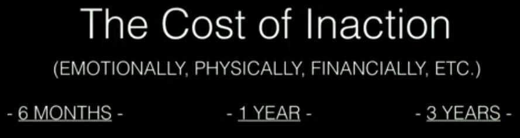

# Decision Making

Ensure that decisions are made at the level where the best information is available

You only need to know the direction, not the destination.

The direction is enough to make the next choice.

What's one decision you can make today that will save you from making ten more decisions in the future? Make the choice that eliminates other choices.

The goal isn't to make the 'perfect' decision about money every time, but to do the best we can and move forward. Most of the time, that's enough".

No HIPPOs (Highest Paid Person's Opinion)

Let’s dream big. Plan diligently. Execute relentlessly.

**Sleep on it** - Always sleep on your decisions for a night atleast before taking decisions. Don't be emotional and immature.

## The ABCDs of categorizing decisions

- **Ad hoc decisions** - Infrequent, low-stakes
- **Big-bet decisions** - Infrequent and high-risk - from major acquisitions to game-changing capital investments
- **Cross-cutting decisions** - Frequent and high-risk - think pricing, sales, and operations planning processes or new-product launches
- **Delegated decisions** - Frequent and low-risk - routine elements of day-to-day management, typically in areas such as hiring, marketing, and purchasing

## To make better decisions

- Make your decisions in the morning
- Eat first: Keep your physical desires taken care of before big decisions
- Cut down your choices, right down to a tiny shortlist and you'll have an easier time
- Open the windows: Keeping the CO2 levels low is really important
- Use a foreign language: Explain the situation to yourself and replying with your decision in a foreign language and see how differently you process that information

## Get better at making decisions

- Be aware of the cognitive biases that might influence your thinking, and then use debiasing techniques to reduce those biases (imagining you're you're giving advice to a friend, for example)
- You can rely on your intuition when it's appropriate to do so in quick decision making, but make sure to limit the amount of information you take in, embrace the concept of good enough, and identify the cost of delaying
- For hard decisions, when you're struggling to choose, you can focus on the concrete facts, eliminate weak options, look at secondary factors, and visualize the future outcomes of choosing different options

## The WRAP technique for decision making

- Widen your options: challenge yourself to consider alternatives
- Reality-test your assumptions:run small experiments so you can know rather than predict which decision will work best for you
- Attain distance before deciding with thetry the 10/10/10 approach: How would you feel about this decision 10 minutes from now, 10 months from now, and 10 years from now?
- Prepare to be wrong: things could always go wrong. Prepare for it in advance

## Avoid making bad snap decisions

- Successful decision-making relies on a balance between deliberate and intuitive thinking
- Opt for less information; stick to only what is essential. We may feel more confident when doing a lot of research, but this could lead to indecision and analysis paralysis

## Good decisions

To make good decisions, we generally need to do the following

- **Identify the decision:** recognizing the need to make a decision, and identifying what that decision involves
- **Set our goals:** establishing what we want to achieve with the decision and how important each goal is to us
- **Gather data:** collecting the necessary information to make a decision
- **Identify options:** researching the options that are available to us
- **Assess the options:** identifying the pros and cons of the available options
- **Select the preferred option:** Rating options based on their pros and cons, and choosing the one that's best for us

## The Four Villains of Decision Making

- **Narrow framing:** The tendency to define our choices in binary terms. We ask, "should I, or shouldn't I?" instead of "What are the ways I could...?"
- **Confirmation bias:** People tend to select the information that supports their preexisting attitudes, beliefs, and actions
- **Short-term emotion:** When we've got a difficult decision to make, our feelings occupy our minds. And this doesn't add any new information that could benefit us
- **Overconfidence:** People often think they know more than they actually do about how the future will unfold

## Defeating Decision-Making Villains

- Counter narrow framing by widening your options. Expand your set of choices
- Confirmation bias leads you to gather self-serving information. Analyze and test your assumptions to overcome the bias
- Short-term emotion will tempt you to make the wrong choice. So distance yourself before deciding
- Prepare to be wrong. Don't be overconfident about how the future will unfold

## Common decision making pitfalls

- **Analysis paralysis -** This is very common. At some point you get stuck in the process and you can't make a decision. You go over the process over and over again. This is a big risk. You can NEVER have 100% of the information you need. It also helps that your decisions are not about the outcomes. Don't let your fear of making the "right" decision paralyze you. There's no right or wrong outcome. Just outcomes. Deal with it later
- **Extinction by instinct -** The opposite of the above. It's the belief that instincts are a useful tool in decision making. This leads to rash decisions
- **Information overload -** This is when you ask too many people for their opinion or insights. Stick to trustworthy sources and keep them at a minimum. More information is not better. Reliable information is

## Why people struggle with decision making

- The main reason why decision-making is hard is that every decision makes us go through a process that is most times difficult and complex, and having difficulties with any part of it can hinder the whole process
- The emotional difficulty that we face when we need to pick only one of multiple possible options means that we have to forego several alternatives that we may find appealing. This is associated with the concept of FOMO (the fear of missing out)
- The decision-making process can be very demanding, from a cognitive and an emotional perspective. Also, the act of making a decision is tiring in itself, since it depletes the cognitive resources
- Being tired and sleep-deprived can make it more difficult for us to process information, and more likely for us to suffer from various cognitive biases that get in the way of making good decisions

### Vocab

- FOMO - Fear Of Missing Out
- JOMO - Joy Of Missing Out

## Some people are naturally more indecisive than others

There are a few personality traits that are found in indecisive individuals

- **Neuroticism:** the tendency to be prone to negative emotions and psychological stress is strongly correlated with indecisiveness, as is perfectionism
- Indecisiveness is associated with the tendency to interpret ambiguous situations as threatening, and to engage in worst-case reasoning
- Indecisiveness is also related to procrastination, and particularly with a type of procrastination called decisional procrastination - unnecessarily delaying when it comes to making decisions

## Types of indecisiveness

- **Exploratory indecisiveness:** a long and drawn-out struggle to make decisions, even after all the options have been explored thoroughly
- **Impetuous indecisiveness:** quickly making decisions but constantly also changing one's mind about them

## Book - Thinking in Bets: Making Smarter Decisions When You Don't Have All the Facts

- Why might my belief not be true?
- What other evidence might be out there bearing on my belief?
- Are there similar areas I can look toward to gauge whether similar beliefs to mine are true?
- What sources of information could I have missed or minimized on the way to reaching my belief?
- What are the reasons someone else could have a different belief, what's their support, and why might they be right instead of me?
- What other perspectives are there as to why things turned out the way they did?

## Making Decisions

We need to look at it from several different perspectives.

Edward De Bono developed a tool called the 6 Thinking Hats to help you look at a problem from 6 different perspectives.

### THE WHITE HAT IS THE HAT OF LOGIC

- When you wear the white hat, ask yourself: what is the information available? What are the facts? How can I look at this objectively?
- To remember the white hat as the logical one, imagine a scientist in a white coat.

### THE RED HAT IS THE HAT OF EMOTION

- When you wear the red hat, ask yourself: how do I feel? What emotions come up? What is my intuition telling me?
- To remember the red hat as the emotional one, imagine a fire.

### THE BLACK HAT IS THE CRITIC

- When you wear the black hat, ask yourself: what could go wrong? Why won't this work? Why do I need to be cautious?
- To remember the black hat as the critic, imagine the robes of a judge.

### THE YELLOW HAT IS THE HAT OF OPTIMISM

- When you wear the yellow hat, ask yourself: what could go right? What are the benefits? What is the upside?
- To remember the yellow hat as the optimist, imagine the sun.

### THE GREEN HAT IS THE HAT OF CREATIVITY

- When you wear the green hat, ask yourself: how can I be creative? What are the possibilities? Is there a different alternative I'm not considering?
- To remember the green hat as the creative one, imagine green grass.

### THE BLUE HAT IS THE MANAGER

- When you wear the blue hat, listen to the other hats, think about the big picture, and make your final decision.
- To remember the blue hat as the manager, think about the sky.

https://jimkwik.com/kwik-brain-042

## Using Decision Trees

- Understand the different outcomes that could happen (both positive and negative)
- Calculate the expected return or loss of each outcome
- Attach a probability to each outcome
- Understanding the magnitude of the return or loss
- Multiply the probability by the magnitude (probability of winning *value of win) - (probability of losing* cost of the loss)
- Add up and subtract all of the expected returns and losses
- To get started you don't need to know the exact probabilities. Just following the process will give you unique insights you wouldn't have had otherwise.

https://deepstash.com/article/2581/7-things-that-self-made-billionaires-do-differently

[DACI](https://click.e.atlassian.com/?qs=607064f1d0c41ff4b86df4cb78fc54b5a68b3dfdbdf2f07f8609ed35d035333eb903a1e047d2ebe2668cb2968910f114afe01a9999daa0cf1ab3939d1867e790)(Driver, Approver, Contributor, Informed) framework. It outlines who's responsible for what and when, and helps eliminate the confusion that can sometimes come along with group decision making.

- Driver:in charge pushing the team to the best possible outcome
- Approver:has the final say on which path the team should take
- Contributors:provide background info, data, and expertise
- Informed:not expected to contribute, but need to be aware

Having definedandproperly documented roles and responsibilities at the start of a decision will leave you feeling more confident coming out on the other side.

https://www.atlassian.com/blog/inside-atlassian/make-team-decisions-without-killing-momentum

https://www.atlassian.com/team-playbook/plays/daci

## Fear Settings

"Many a false step was made by standing still." - Fortune Cookie

"Named must your fear be before banish it you can." - Yoda

"Action may not always bring happiness, but there is no happiness without action." - Benjamin Disraeli, former British Prime Minister

We suffer more often in imagination than in reality -- Seneca

Premeditatio malorum - the premeditation of the evils and troubles that might lie ahead

I am an old man and have known a great many troubles, but most of them never happened. -- Mark Twain

It ain't what you don't know that gets you into trouble. It's what you know for sure that just ain't so. -- Mark Twain

If you are nervous about making the jump or simply putting it off out of fear of the unknown, here is your antidote. Write down your answers, and keep in mind that thinking a lot will not prove as fruitfulor as prolific as simply brain vomiting on the page. Write and do not edit - aim for volume. Spend a few minutes on each answer.

1. **Define your nightmare, the absolute worst that could happen if you did what you are considering. What doubt, fears, and "what-ifs" pop up as you consider the big changes you can - or need - to make?** Envision them in painstaking detail. Would it be the end of your life? What would be the permanent impact, if any, on a scale of 1--10? Are these things really permanent? How likely do you think it is that they would actually happen?

2. **What steps could you take to repair the damage or get things back on the upswing, even if temporarily?** Chances are, it's easier than you imagine. How could you get things back under control?

3. **What are the outcomes or benefits, both temporary and permanent, of more probable scenarios?** Now that you've defined the nightmare, what are the more probable or definite positive outcomes, whether internal (confidence, self-esteem, etc.) or external? What would the impact of these more likely outcomes be on a scale of 1--10? How likely is it that you could produce at least a moderately good outcome? Have less intelligent people done this before and pulled it off?

4. **If you were fired from your job today, what would you do to get things under financial control?** Imagine this scenario and run through questions 1--3 above. If you quit your job to test other options, how could you later get back on the same career track if you absolutely had to?

5. **What are you putting off out of fear?** Usually, what we most fear doing is what we most need to do. That phone call, that conversation, whatever the action might be - it is fear of unknown outcomes that prevents us from doing what we need to do. Define the worst case, accept it, and do it. I'll repeat something you might consider tattooing on your forehead: What we fear doing most is usually what we most need to do. As I have heard said, a person's success in life can usually be measured by the number of uncomfortable conversations he or she is willing to have. Resolve to do one thing every day that you fear. I got into this habit by attempting to contact celebrities and famous business people for advice.

6. **What is it costing you - financially, emotionally, and physically - to postpone action?** Don't only evaluate the potential downside of action. It is equally important to measure the atrocious cost of inaction. If you don't pursue those things that excite you, where will you be in one year, five years, and ten years? How will you feel having allowed circumstance to impose itself upon you and having allowed ten more years of your finite life to pass doing what you know will not fulfill you? If you telescope out 10 years and know with 100% certainty that it is a path of disappointment and regret, and if we define risk as "the likelihood of an irreversible negative outcome," inaction is the greatest risk of all.

7. **What are you waiting for?** If you cannot answer this without resorting to the previously rejected concept of good timing, the answer is simple: You're afraid, just like the rest of the world. Measure the cost of inaction, realize the unlikelihood and repairability of most missteps, and develop the most important habit of those who excel and enjoy doing so: action.

https://tim.blog/2017/05/15/fear-setting

[Why you should define your fears instead of your goals | Tim Ferriss](https://www.youtube.com/watch?v=5J6jAC6XxAI)

## Regret Minimisation Framework

It all starts with a question: **In X years, will I regret not doing this?**

The idea is to project yourself into the future and look back on your decision from that perspective. For Bezos, he thought of when he would be 80 and if he would regret not trying to start this company. Yes or no. His answer was quite clear.

https://alyjuma.medium.com/the-regret-minimization-framework-how-jeff-bezos-made-decisions-4d5a86deaf24

## Time

You should design your life in accordance with how time influences your decision making.

There are five types of time:

1. **Micro Time** (sub-second)
2. **Engagement Time** (Seconds)
3. **Business Time** (Minutes to Hours)
4. **Strategy Time** (Days to Weeks)
5. **Big-Thinking Time** (Months to Years)

[Seconds to Strategy: How Your Relationship with Time Shapes Your Career](https://auren.substack.com/p/seconds-to-strategy-how-your-relationship)

## Links

[15 DECISION MAKING TECHNIQUES to CHANGE 2023 for YOU! | Ankur Warikoo Hindi - YouTube](https://www.youtube.com/watch?v=jZXknO8lqN0)
