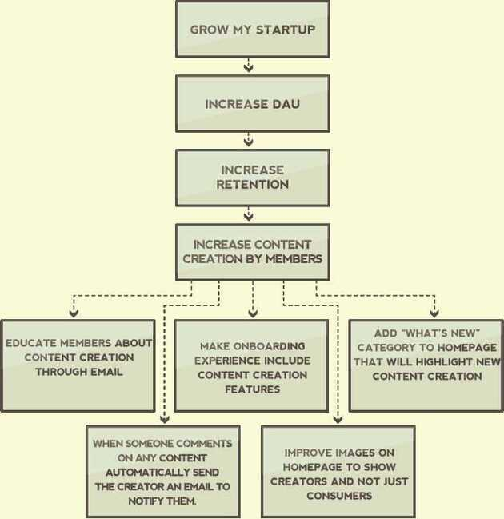

# Growth Hacking

A growth hacker is not a replacement for a marketer. A growth hacker is not better than marketer. A growth hacker is just different than a marketer. To use the most succinct definition from Sean's post,"A growth hacker is a person whose true north is growth."

Every decision that a growth hacker makes is informed by growth. Every strategy, every tactic, and every initiative, is attempted in the hopes of growing. Growth is the sun that a growth hacker revolves around. Of course, traditional marketers care about growth too, but not to the same extent. Remember, the power of a growth hacker is in their obsessive focus on a singular goal. By ignoring almost everything, they can achieve the one task that matters most early on.

This absolute focus on growth has given rise to a number of methods, tools, and best practices, that simply didn't exist in the traditional marketing repertoire, and as time passes the chasm between the two discipline deepens.

Introduce a little anarchy, Upset the established order, And everything becomes chaos. I'm an agent of chaos. And you know the thing about chaos? It's fair. -- Joker

- [**https://www.quicksprout.com/growth-hacking/**](https://www.quicksprout.com/growth-hacking/)
- https://www.simplilearn.com/master-growth-hacking-in-30-days-article
- https://neilpatel.com/blog/the-6-best-growth-hacks
- https://neilpatel.com/blog/growth-hacking-framework
- https://neilpatel.com/training/growth-hacking-unlocked/untold-laws-of-growth
- https://www.quicksprout.com/viral-hacking
- https://www.quicksprout.com/user-activation

https://www.youtube.com/watch?v=raIUQP71SBU&ab_channel=GaganBiyani

- Emotionally detached
- No ego
- No gut feeling
- Core product value

## Pull vs Push Strategy

A push strategy usually involves interrupting the content that is being consumed.

You aren't the tweet they want to read, but instead, you're the tweet ad that they read on their stream. You aren't the YouTube video they want to watch, but you are the pre-roll ad that they watch to get to the content they were after in the first place.

Pull is analogous to Hansel and Gretel. The sweets lure the children into the house on their own accord. Push is analogous to the Three Little Pigs. The wolf just huffs and puffs and breaks into their homes. You can pull them into your world, or you can push yourself into their world. That's the main difference between pull and push tactics for getting visitors.

- A push tactic usually involves interrupting the content that is being consumed.
- Push tactics usually cost money.
- Since money is involved with push tactics you must understand the lifetime value of your customers (LTV), so that you don't spend more money on a customer then you'll make from them.
- We covered 4 push tactics: purchase ads, promo swap, affiliates, and direct sales.

https://www.quicksprout.com/push-strategy

https://www.quicksprout.com/pull-strategy

## Conversion Rate Optimization (CRO)

https://neilpatel.com/training/cro-unlocked

- CRO Best Practices
- Crazy Egg
- Conversion Hacks
- Ecommerce Sales

## The Racecar Growth Framework

1. **The (Growth) Engine:** Self-sustaining growth loops that drive most of your growth (e.g. virality, performance marketing, content, sales)
2. **Turbo Boosts:** One-off events that accelerate growth temporarily but don't last (e.g. PR, events, Super Bowl ads)
3. **Lubricants:** Optimizations that make the growth engine run more efficiently (e.g. improved customer conversion, a stronger brand, higher customer retention)
4. **Fuel:** The input that your engine requires to run (e.g. capital, content, users)

## Growth Hiring

### Mistakes

1. Hiring a growth generalist without understanding what growth means for your company
2. Building a growth team before a data team
3. Prioritizing Head of Growth as your first growth hire
4. Hiring the wrong type of growth profile
5. Chasing after external talent
6. Putting growth in the wrong department

### A growth model is made up of two parts

1. **Growth levers**
2. **Growth motions**

Growth levers describe ways to impact your business's revenue growth by making changes to your customers' journey. Growth levers answer the following questions

1. Acquisition: How do you acquire customers?
2. Retention: How do you activate and engage your customers?
3. Monetization: How do you monetize your customers?

Every growth lever is leveraged through agrowth motion. A growth motion describes which team or tactic is accountable for a successful outcome in the growth lever. There are many fantastic, established growth motions to apply to each growth lever, such as product-led, sales/success-led, marketing-led, support-led, community-led, etc.

#### 1. Product-led

Product is accountable for the output of the growth lever by engaging customers in product actions.

- Acquisition example:Miro (collaborative whiteboard platform) customers need to collaborate in the product to receive value, which results in customers acquiring more new customers via invites to colleagues.
- Retention example:SurveyMonkey (online surveys platform) customers receive notifications that new responses have been collected on an open survey, triggering them to re-engage with the product to analyze results.
- Monetization example:Netlify (web workflow platform) customers discover a product feature wall for site password protection and convert via self-serve monetization flow to the paid plan to unlock functionality.

#### 2. Sales- and success-led

The sales team engages customers in the actions that will result in the growth lever output.

- Acquisition example:Sales team discovers potential decision makers through outbound efforts, convincing them to see a demo or start a trial.
- Retention example:Success team holds quarterly business reviews with the customer to communicate value delivered, to ensure that the customer continues to engage.
- Monetization example:Sales team nurtures the customer, resulting in contract signing.

#### 3. Marketing-led

Marketing engages customers in the actions that will result in the growth lever output.

- Acquisition example:Marketing team utilizes organic or paid methods across third-party platforms such as Google, Facebook, and Twitter to grab customer attention and convince them to give the product a try.
- Retention example:Marketing uses an email lifecycle to communicate the value of the product to the customer.
- Monetization example:Marketing team deploys messaging nurture, retargeting tactics to generate monetization interest from the customer.

### Growth leaders natural powers

1. Connect actions to outcomes
2. Be data-driven
3. Have a growth mindset
4. Respect for scientific method
5. Hunger for learning

https://www.lennysnewsletter.com/p/hiring-growth

https://andrewchen.com/how-to-build-a-growth-team

## The Cold Start Problem: How to Start and Scale Network Effects by Andrew Chen

- "atomic network" is the smallest network needed that can stand on its own
- Starting with a Niche Works
- Christensen's Disruption Theory. These small networks often grow in niches, slowly growing to take over the entire market.
- Disruptive technologies are dismissed as toys because when they are first launched they "undershoot" user needs. The first telephone could only carry voices a mile or two. The leading telco of the time, Western Union, passed on acquiring the phone because they didn't see how it could possibly be useful to businesses and railroads - their primary customers. What they failed to anticipate was how rapidly telephone technology and infrastructure would improve (technology adoption is usually non-linear due to so-called complementary network effects). The same was true of how mainframe companies viewed the PC (microcomputer), and how modern telecom companies viewed Skype.

## Churn

### What is GOOD and GREAT monthly churn

- **For B2C SaaS:** Between 3% and 5% monthly churn is GOOD, and less than 2% is GREAT
- **For B2B SMS + Mid-Market:** Between 2.5% and 5% is GOOD, and less than 1.5% is GREAT
- **For B2B Enterprise:** Between 1% and 2% is GOOD, and less than 0.5% is GREAT

### Definitions

- **B2C SaaS:** Subscription products sold to consumers; e.g. Duolingo, Spotify, Grammarly
- **B2B SMB + Mid-Market:** Subscription products sold primarily to companies with fewer than 1,000 employees, generally charging less than $1K per month for the average customer; e.g. Gusto, Intercom, Airtable, Asana
- **B2B Enterprise:** Roughly defined as subscription products sold primarily to companies with more than 1,000 employees, generally charging more than $5K per month for the average customer; e.g. Salesforce, Snowflake, Workday, ADP

### What is GOOD and GREAT monthly churn, by price point

Why would churn be highly correlated with price? Two reasons:

1. **Customer type:** The cheaper your product, the smaller the businesses you're likely selling to - and the smaller the businesses, the more likely they are to go out of business, change their minds, or switch to a competitor.

2. **Unit economics:** If it's costing you thousands of dollars to close a deal, you won't survive if too many of those customers churn. And so companies with a high price point don't last long if churn is too high.

https://www.lennysnewsletter.com/p/monthly-churn-benchmarks

## Marketing models

- Direct model - Directly sell products
- Indirect model - Involve customers by creating trends

## Product-Market Growth Matrix

|                       | Products - Present                                                                          | Products - New                                                                                 |
| --------------------- | ------------------------------------------------------------------------------------------- | ---------------------------------------------------------------------------------------------- |
| **Markets - Present** | [Market penetration](https://en.wikipedia.org/wiki/Market_penetration "Market penetration") | [Product development](https://en.wikipedia.org/wiki/Product_development "Product development") |
| **Markets - New**     | [Market development](https://en.wikipedia.org/wiki/Market_development "Market development") | [Diversification](https://en.wikipedia.org/wiki/Diversification_(marketing_strategy))          |

[Diversification (marketing strategy) - Wikipedia](https://en.wikipedia.org/wiki/Diversification_(marketing_strategy))

## HELS model

## Social+ companies

Products that serve a purpose but also meet our need for belonging to a community

But what exactly is a social+ company? To put it simply, it's a company for which social engagement is an inextricable component of the product. That is to say that if you removed the social element, the product would cease to make sense.

Social+Gaming --Social+ games like [Fortnite](https://www.fastcompany.com/90315238/the-best-new-social-network-may-surprise-you) have all but replaced social networks for many players. While the game is certainly fun to play, it's the social aspect -- including in-game events like concerts -- that entices more than [31.3 million](https://www.rockpapershotgun.com/the-epic-games-store-is-still-mostly-about-fortnite) people to play the game each day. If the gaming industry seems like an obvious example, it's only because it nailed social+ first

Social+Fitness --Fitness app [Strava](https://www.strava.com/) is more than an app to track your runs. As Strava CEO James Quarles told [Outside](https://www.outsideonline.com/2395489/strava-james-quarles), "Strava wants to be the dashboard for tracking your fitness, a calendar for inviting friends to work out, a feed for you to follow others' activities, a blog for your race reports and photos, and a message board to ask for recommendations on a new pair of trail-running shoes."

[Peloton](https://www.google.com/search?q=peloton&oq=peloton&aqs=chrome.0.69i59l3j0i271l3j69i60l2.1871j0j9&sourceid=chrome&ie=UTF-8#:~:text=Peloton%C2%AE%20%7C%20Workouts, onepeloton.com)'s stationary bikes and treadmills and digital subscription let users combine group fitness classes with home workouts. The motivation, friendly competition, and supportive relationships arising from the Peloton community are an integral part of its product.

Social+Commerce --Chinese marketplace [Pinduoduo](https://en.pinduoduo.com/) allows buyers to purchase heavily discounted goods when they rope in their friends

Social+Audio --[Clubhouse](https://www.joinclubhouse.com/) is the social answer to podcasts and audiobooks, allowing users to not only listen in on conversations but chime in or host their own. Its invite-only beta launch, coupled with appearances by some big names, has drummed up massive curiosity and hype.

Social+ is a rising wave that will eventually sweep through every industry, turning solitary activities into social experiences.What's really interesting is that finance, which we tend to think of as kind of boring -- and more importantly, deeply personal and private -- is no exception. Social finance is on the rise, and early evidence suggests that this vertical has tremendous growth potential (more on this below)

### The benefits of a social+ company

- Growth
- Retention
- Harness the creativity of your users
    - User-generated content (UGC)
- Insights-driven personalization
- Barriers to entry

### Creating a truly social+ finance product

When building a social+ product, the key thing to remember is that it's "social+commerce," or "social+finance" (or whatever the case may be), not"finance+ social."

Simply slapping a social gimmick onto your product as a marketing ploy won't do the trick. Social needs to be wired into its DNA. To achieve this, it's vital that your platform provides users with the tools for authentic peer-to-peer social engagement -- features like in-app publishing, following capabilities, [activity feeds](https://sendbird.com/stream-comparison), forums, 1-to-1 and group chat, voice calling, video calling, leaderboards, and network-driven rewardsalongsidetransactional functionality.

https://sendbird.com/blog/payments-fintechs-social-features

## PLG (Product Led Growth)

### what is Product Led Growth?

Very simply put, product-led growth (PLG) is a go-to-market motion that relies on a product (and its excellent user experience) to drive a company’s growth and all its funnel stages. The app itself, rather than ad dollars or sales outreach, is the engine.

The heart of product led growth is the end user, who can get into the product right away, experience real value, and not have to jump through any hoops to kick the tires. This is why PLG needs great user experiences: it's about helping the everyday human try a product, love it, and share it.

Organic discovery, viral loops, and network effects play important roles. This makes PLG a relatively cost-effective growth strategy, not having to rely on hiring more sales reps and spending a bigger marketing budget. PLG might require more R&D money early on to create a great product, but then it can scale with fewer team resource costs.

That said, PLG can be used in tandem with sales and marketing motions. Companies relying on product led growth are selective about where and when to deploy their toolbox of go-to-market motions - combining these in different ways for different journeys, including:

- Start with a popular free product, then layer on a sales-assisted track for enterprise leads.
- Begin as a sales-led company, then add a freemium or free trial product track a few years in.
- Use product to drive all net new revenue; only use sales and customer success teams to drive expansion revenue.

[The Anatomy of PLG SaaS](https://clearbit.com/resources/reports/product-led-growth-companies)

## Links

[What to ask before accepting a growth role?](https://shorts.growthx.club/p/what-to-ask-before-accepting-a-growth)
