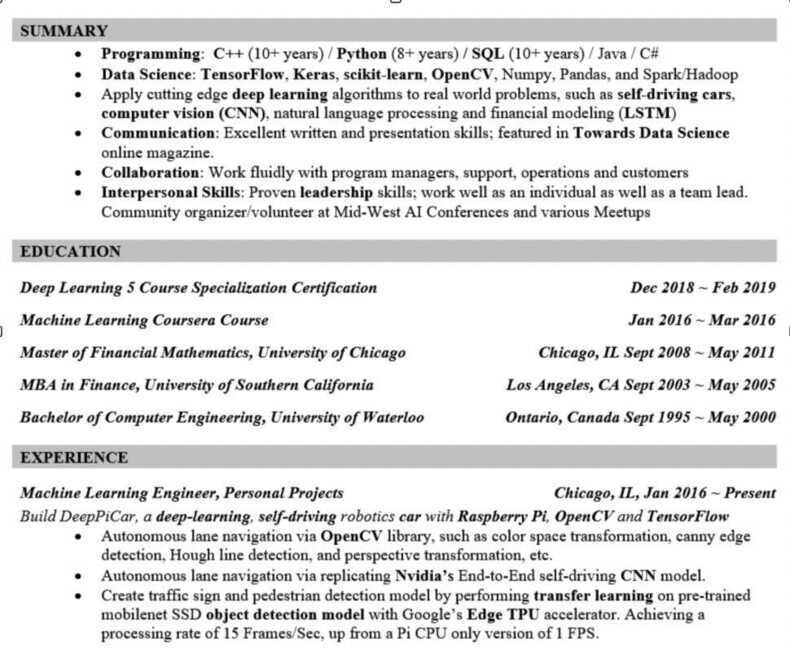

# Good Profiles

- <https://www.linkedin.com/in/hirenchandaria>
- <https://www.linkedin.com/in/maheshvc>
- <https://www.linkedin.com/in/raghuram-rajan>
- <http://www.pranavmistry.com/files/pranav_cv.pdf>
- <https://www.linkedin.com/in/jessicatai>
- Andreas Klinger - <https://klinger.io>
- [Jeroen Bouma | Financial Risk Analyst](https://www.jeroenbouma.com/)
- **Software Developer Good -** <https://drive.google.com/drive/folders/1zMuTUjsifK9QVvrwF56oE8EJcgw9YBhJ?usp=sharing>
- **Pradeep Parameswaran**

### About Saurabh Mukherjea

Saurabh Mukherjea is the Founder and Chief Investment Officer of Marcellus Investment Managers. Marcellus Investment Managers was incorporated in August 2018 and the firm's application to conduct Portfolio Management Services was approved by SEBI in October 2018 and provides portfolio management service. He is the former CEO of Ambit Capital.

Saurabh was educated at the London School of Economics where he earned a BSc in Economics (with First Class Honours) and MSc in Economics (with distinction in Macro & Microeconomics).

In London, Saurabh was the co-founder of Clear Capital and in 2007 he was rated by the Extel Survey as one of the top small-cap analysts in the UK. In India, Saurabh was rated as the leading equity strategist in 2015, 2016, and 2017 by the Asiamoney polls. Saurabh is a CFA charter holder and a SEBI registered investment advisor. In 2017, upon SEBI's invitation, he joined SEBI's Asset Management Advisory Committee. In 2019, Saurabh was part of the Expert Committee constituted by SEBI to update and upgrade the PMS regulations.

Saurabh has written four bestselling books -- Gurus of Chaos (2014), The Unusual Billionaires (2016), "Coffee Can Investing: The Low-Risk Route to Stupendous Wealth" (2018) and 'The Victory Project: Six Steps to Peak Potential' -- and he is a Fellow of the Royal Society of Arts.

### Product

I started my professional journey with the prestigious CITI group wherein I was working on the Digital Solutions vertical of the Foreign Exchange Markets division. Strategizing for the adoption of the final products, my curiosity to know the back-story of the products piqued. From building products from scratch to deploying catalysts of growth - I wanted to know the what and why of everything!

🔑 This inquisitive search led me to start my journey as an Associate Product Manager at a lending-fintech firm ([Stashfin](https://www.linkedin.com/company/stashfin/)) which was in its nascent stage and gave me an opportunity to become a part of their growth story. I learned how to solve problems at a macro and a micro-level. From operations, sales, and marketing to product journey and road mapping - I did everything. I loved how collaborative the job role was and how I had to wear so many hats to deliver a product feature. This was my first role where I was in a room which was age agnostic and it was just your idea that held any value.

🚀 I really wanted to work on deep user-oriented problems which had a direct impact on Business and Growth. I switched to a more comprehensive fintech firm ([MobiKwik](https://www.linkedin.com/company/mobikwik/)) which is a digital wallet company that also offers credit to users. User delight and pain points became my holy bible to drive business and growth. Unstructured days, unstructured problems, and chaos became the new normal. I got the opportunity to manage products with immense scale and it was surreal to see the impact of my actions. This is where I learned that PMing is not only about getting the answers to what I should build next? but also what should I not build?

Just like the problem statements being thrown at PMs, the skillset that you will develop cannot be easily defined. I feel that being a PM forces you to pull different threads in your talent pool - the analytical mindset to read data, the creative flair for the best user journey, the smoothest sales pitch to get stakeholder buy-in, and the patience to execute end-to-end. As a PM, I need to be the CEO of my product!

### Software

[linkedin.com/in/rajeshkthiagarajan/](https://www.linkedin.com/in/rajeshkthiagarajan/)

I am a global product, technology & business leader excited to help teams be purpose-driven and build game-changing products & services.

Currently, I work as a principal consultant at "Equal Experts" (EE). At EE, I am responsible for helping the clients of EE in their digital transformation journey. I mainly focus on business-strategy-oriented digital solutions and related product development.

Over the last 19+ years, I have handled various roles across product management, client relationship management, and service delivery for flagship brands, including - McKool Smith, Trilogy, Bank of America, Goldman Sachs, British Petroleum, AthenaHealth, Network International and IBS.

During this time, I leveraged my customer-first thinking from my product background and the ability to scope, and consult with clients to execute transformational projects.

My expertise is in building, running & growing high-impact teams that leverage technology.

I specialize in
• Building a culture that celebrates collaboration, innovation, learning, diversity & radical candour.
• Creating a vision for products that are inspiring and a strategy that is clear, relatable and executable.
• Drawing on a toolkit of agile, lean, and user-centred practices to set strategic bets, minimize risk & deliver outcomes.

In short:

1. 19+ years of progressive leadership experience across global brands & tech businesses in India, Emerging Markets, Uk and the US.
2. Hands-on, multi-functional (Product, Strategy, Technology, Design, Analytics, Operations) leader successfully building teams, businesses, and customer-centric products.
3. In-depth experience in developing and product managing B2B products from scratch and scaling to thousands of active users.
4. Proven ability to work with the process dynamics of both established large firms and fast-growing start-ups.
5. Adept in leading teams through rapid growth & change.

## Others

- Yiwen Gong - <gyw@google.com>
