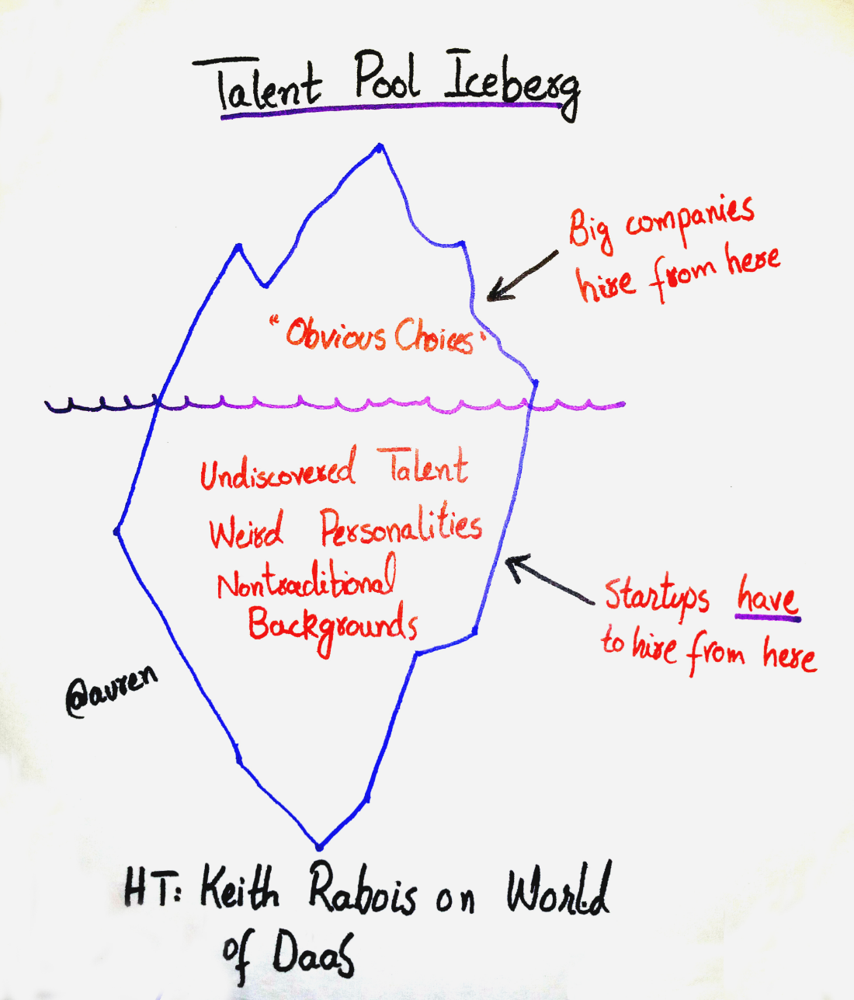

# Hiring Plan + HR / Recruiting

## Platform / Services / Vendor

- TopHire
- BigShyft
- Randstad
- NewEra
- Portal - Instahyre
- ~~Skytawassa~~
- https://x0pa.com/ai-recruiter
- AttainU (not good)
- Scaler (not good)
- Masai School (okaish)
- https://www.crio.do
- https://www.greenhouse.com
- https://careerkarma.com/locations/bangalore
- Antal International Network (mid to senior)
- https://www.lever.co lever.co
- Linkedin Post
- Colleges
  - IIITD
  - NIT Delhi
  - Thapar University
- Communities
  - Linkedin
  - Linkedin Python Developer Community
  - IIITD Alumni Portal
  - JSLovers (Frontend)
  - Android Developers (Android)
- DevOps / AWS
  - OpsTree
  - Xebia (Cloud engineering)
- Frontend
  - https://www.neuronimbus.com
  - https://www.ibrandox.com
  - https://acodez.in
- Product
  - MBA - IIM
- **Resource Augementation**
  - https://tvsnext.io
  - https://www.doodleblue.com
- **Assessment Platform**
  - SpeedExam
  - Rounds
    - MCQ test (20 question 30 mins)
    - Coding test (2 question 30 mins)
  - LinkedIn
  - https://www.hackerrank.com/products/developer-skills-platform/interview-free
- **Applicant tracking software/platforms** - https://www.greenhouse.com
  - freshteam from freshworks
  - http://www.careerist.in/contact-us.html
- IIITD Alma Connect
  - https://iiitdelhi.almaconnect.com/contributions/sneak_peek?frm=main_menu
- IIITD Facebook group
- MTech Group

https://auren.substack.com/p/moneyballing-for-talent

### Hiring

- Manpower is the gold maker of the organization
- If you hire the right person at the wrong job then soon you will run out of your job
- Over Hiring
- Lean forward kick backward
- Wrong salary structure
- ETR - Empathy, Training, Recognition
- Energy is the best predictor of talent
- Funny people are underated. Humour is important

### Quotes

I'm not the smartest fellow in the world, but I can sure pick smart colleagues -- Franklin D. Roosevelt
