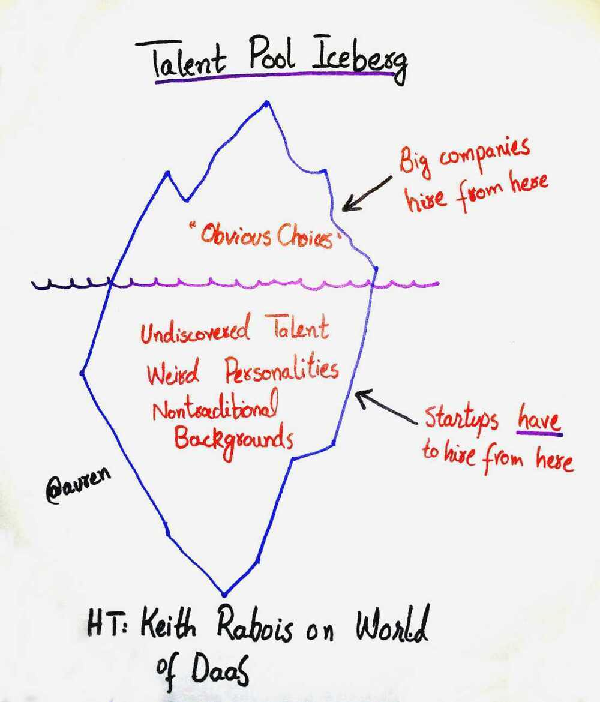

# Hiring Plan + HR / Recruiting

## Platform / Services / Vendor

- TopHire
- Optimhire
- BigShyft
- Randstad
- NewEra
- Portal - Instahyre
- ~~Skytawassa~~
- https://x0pa.com/ai-recruiter
- AttainU (not good)
- Scaler (not good)
- Masai School (okaish)
- https://www.crio.do
- https://www.greenhouse.com
- https://careerkarma.com/locations/bangalore
- Antal International Network (mid to senior)
- https://www.lever.co lever.co
- Linkedin Post
- Colleges
    - IIITD
    - NIT Delhi
    - Thapar University
- Communities
    - Linkedin
    - Linkedin Python Developer Community
    - IIITD Alumni Portal
    - JSLovers (Frontend)
    - Android Developers (Android)
- DevOps / AWS
    - OpsTree
    - Xebia (Cloud engineering)
- Frontend
    - https://www.neuronimbus.com
    - https://www.ibrandox.com
    - https://acodez.in
- Product
    - MBA - IIM
- IIITD Alma Connect
    - https://iiitdelhi.almaconnect.com/contributions/sneak_peek?frm=main_menu
- IIITD Facebook group
- MTech Group

## Resource Augmentation

- https://tvsnext.io
- https://www.doodleblue.com
- [Custom Software Development Services | IT Solutions | Benthon Labs](https://www.benthonlabs.com/)
- [Top IT Services and Digital Marketing Outsourcing Company](https://www.wildnettechnologies.com/)

## Assessment Platform

- SpeedExam
    - Speedexam open-source alternative
    - Fraud detection in speedexam
- Rounds
    - MCQ test (20 question 30 mins)
    - Coding test (2 question 30 mins)
- LinkedIn
- https://www.hackerrank.com/products/developer-skills-platform/interview-free

## Applicant tracking software/platforms

- https://www.greenhouse.com
- freshteam from freshworks
- http://www.careerist.in/contact-us.html

## 16 Signs of a Highly Intelligent Employee

1. They cheat on their job with a side hustle - Diversified income creates freedom and reduces dependence.
2. They treat everybody equally (including the cleaner) - Respect builds trust and earns loyalty from everyone.
3. They rebel against micromanagement & dictator leaders - Independence drives creativity and better decision-making.
4. They know when to say no to a meeting - Protecting time ensures focus on meaningful work.
5. They help others advance in their career - Success multiplies when you lift others up.
6. They don't respond to most emails - Prioritizing communication prevents wasting time on distractions.
7. They stay away from gossip and corporate politics - Drama-free zones allow for clarity and productivity.
8. They create passive income so if they get fired, it matters less - Financial independence gives you leverage and peace of mind.
9. They try entrepreneurship at least onc - Building something of your own expands skills and resilience.
10. They’re fine being the dumbest person in the room - Surrounding yourself with experts accelerates learning and growth.
11. They ruthlessly protect their time - Time is your most valuable asset - guard it wisely.
12. They focus on outcomes, not KPIs - Results matter more than arbitrary metrics.
13. They’re wildly open to new ideas - Flexibility sparks innovation and uncovers hidden opportunities.
14. They create stuff people want - Solving real problems creates lasting impact and value.
15. They learn without being told - Curiosity fuels self-driven growth and continuous improvement.
16. They’re humble - Staying grounded keeps you relatable and adaptable.

Greatness isn’t about playing it safe.

It’s about bold, intentional actions
that challenge the status quo.

## Others

Background verification tool - [verifydirectintl.com/index.aspx](https://verifydirectintl.com/)

https://auren.substack.com/p/moneyballing-for-talent

### Hiring

- Manpower is the gold maker of the organization
- If you hire the right person at the wrong job then soon you will run out of your job
- Over Hiring
- Lean forward kick backward
- Wrong salary structure
- ETR - Empathy, Training, Recognition
- Energy is the best predictor of talent
- Funny people are underated. Humour is important

### Quotes

I'm not the smartest fellow in the world, but I can sure pick smart colleagues -- Franklin D. Roosevelt
